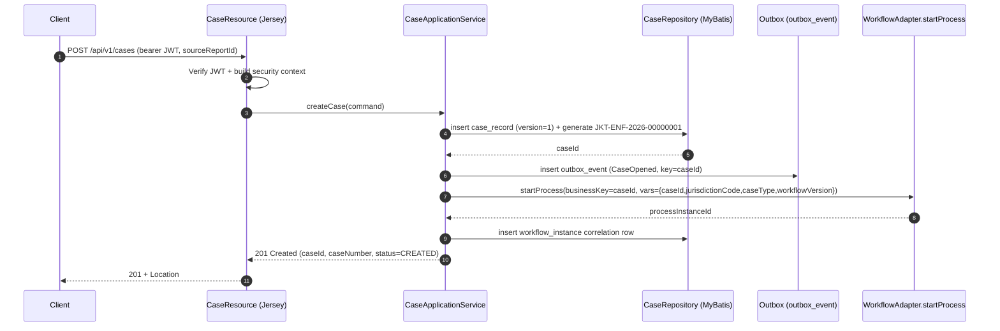
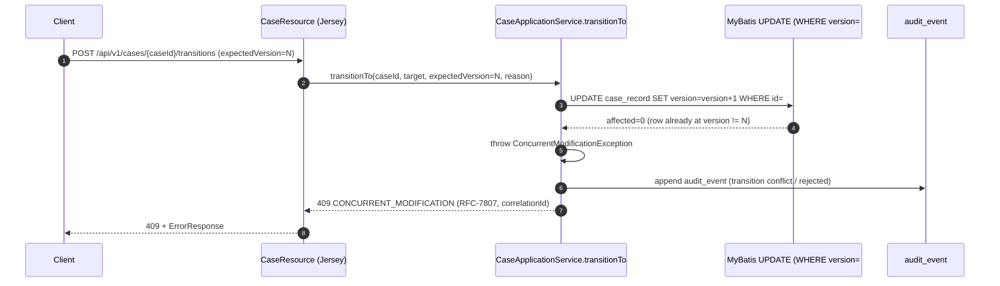

# Case Management API

This page documents the deeper behavior of the case, assignment, transition, and
audit endpoints of the Sentinel Enforcement Platform. It is grounded in the
[Endpoint Catalog](../api/endpoint-catalog.md), the
[Case Lifecycle](../business-domain/case-lifecycle.md) model, the
[Camunda Embedded Integration](../architecture/camunda-embedded-integration.md)
design, and the [Request Flows](../flows/request-flows.md) reference.

> **Stack context:** Java/Jakarta EE, Jersey REST, Keycloak-issued JWT, embedded
> Camunda 7.24.0 workflow, PostgreSQL 18.3 (Liquibase, 7 releases), MyBatis
> persistence, and **optimistic locking** (`version` column) on all mutable
> aggregates. The domain DB is the source of truth; Camunda is orchestration only
> (see ADR-002).

**Coverage tags:** `endpoint-catalog`, `request-flow`, `state-lifecycle`, `security`

**Related pages:**
- [Endpoint Catalog](../api/endpoint-catalog.md)
- [Case Lifecycle](../business-domain/case-lifecycle.md)
- [Camunda Embedded Integration](../architecture/camunda-embedded-integration.md)
- [Request Flows](../flows/request-flows.md)

---

## Orientation (newcomer)

If you are new to this API, the mental model is:

- A **case** (`CaseRecord`) is the long-lived investigation aggregate. It is
  created only from a *triaged* source report.
- Creating a case also **starts a Camunda process** (`regulatory-enforcement-case.bpmn`)
  keyed by `caseId`. The domain row is the source of truth; Camunda only
  orchestrates tasks. The two are linked through a `workflow_instance` correlation row.
- Cases move through a fixed **state machine** (`CaseStatus`) via a guarded
  `transitionCase` endpoint. Transitions are validated by `CaseTransitionPolicy`
  and protected by optimistic locking.
- Every meaningful mutation also writes an **append-only `audit_event`** row and a
  `case_status_history` row.
- **Concurrency** is handled by an integer `version` column: a concurrent edit
  that loses the race fails with **HTTP 409** rather than silently overwriting.

The endpoints in scope are:

| operationId | Method + Path | Purpose |
|---|---|---|
| `createCase` | `POST /api/v1/cases` | Open a case from a triaged report; start Camunda. |
| `listCases` | `GET /api/v1/cases` | Cursor-paged search/list. |
| `getCase` | `GET /api/v1/cases/{caseId}` | Read one case. |
| `assignCase` | `POST /api/v1/cases/{caseId}/assignments` | Assign unit/owner (supervisor). |
| `transitionCase` | `POST /api/v1/cases/{caseId}/transitions` | State transition with policy + OLC. |
| `getCaseAuditEvents` | `GET /api/v1/cases/{caseId}/audit-events` | Cursor-paged append-only audit. |

---

## Operation → Authorization → Guard → Error

The table below is the consolidated contract for the six case endpoints. All
endpoints are `bearer` (Keycloak JWT); an absent/invalid token yields **401**,
and a failed policy check yields **403** (see
[Authorization Model](../architecture/camunda-embedded-integration.md) note and
`AuthorizationDeniedExceptionMapper` / `UnauthenticatedExceptionMapper`).

| Operation (operationId) | Authorization (role/attribute required) | Guard(s) | Failure → Error code |
|---|---|---|---|
| `createCase` | `bearer`; actor must hold the case-create permission **and** the source report must be `TRIAGED`; `SYSTEM_ADMIN` short-circuits. Jurisdiction/classification/conflict/unit checks apply to the report and resulting case. | Source report prerequisite (triaged); business-case-number concurrency-safe generation; Camunda start idempotency/correlation. | Missing/invalid token → **401**; role/jurisdiction/classification/conflict/unit failure → **403**; untriaged or missing source report → **404/422**; Camunda start failure → **500/503**. |
| `listCases` | `bearer`; list filtering is **no looser** than item GET (same `RoleBasedAuthorizationService` rules). | Cursor/keyset pagination; safe dynamic SQL (`q`, `searchField`, `sortBy`); authorization filtering. | Unauthenticated → **401**; insufficient scope → **403**; malformed query (`sortBy`/`searchField` enum) → **400**; DB unreachable → **503**. |
| `getCase` | `bearer`; `SYSTEM_ADMIN` short-circuit; jurisdiction + classification + conflict-of-interest + assigned-unit scope + (where required) direct-assignment. | Existence; authorization context evaluation. | Unauthenticated → **401**; forbidden → **403**; missing case → **404**. |
| `assignCase` | `bearer`; **supervisor**-scoped permission to assign; same jurisdiction/classification/conflict/unit rules; direct-assignment semantics where required. | **Optimistic lock** (must supply expected `version`); **assignment uniqueness** (no conflicting active assignment for the same unit/owner scope). | Unauthenticated → **401**; not supervisor/forbidden → **403**; missing case → **404**; stale `version` → **409 CONCURRENT_MODIFICATION**; duplicate/uniqueness violation → **409/422**. |
| `transitionCase` | `bearer`; **state-owner** (or role-bearing actor with the per-transition permission) plus jurisdiction/classification/conflict/unit checks; `SYSTEM_ADMIN` short-circuit. | **Transition policy** (`CaseTransitionPolicy`: current state, target state, actor permission, business prerequisites, `version`, `reason`, `timestamp`); **optimistic lock**; lifecycle invariants (e.g. cannot enter `PENDING_DECISION` without approved investigation report; cannot `CLOSE` with active sanction obligation; closed only via approved reopen). | Unauthenticated → **401**; forbidden → **403**; missing case → **404**; illegal transition / unmet prerequisite → **422**; stale `version` → **409 CONCURRENT_MODIFICATION**. |
| `getCaseAuditEvents` | `bearer`; **auditor** (read-only) plus the same jurisdiction/classification/conflict/unit authorization as `getCase`; `SYSTEM_ADMIN` short-circuit. | Cursor/keyset pagination over append-only `audit_event`. | Unauthenticated → **401**; forbidden → **403**; missing case → **404**; malformed cursor → **400**. |

> **Note on roles:** Holding a role *alone* does not grant case access. The
> `RoleBasedAuthorizationService` applies, in order: `SYSTEM_ADMIN` short-circuit
> → required `Permission` → **jurisdiction** → **classification clearance** →
> **conflict-of-interest** → **assigned-unit scope** → **direct assignment**.
> See the [Authorization Model](../architecture/camunda-embedded-integration.md)
> and `authorization-model.md` evidence.

---

## Create Case (and Camunda start)

**Endpoint:** `POST /api/v1/cases` — operationId `createCase`.

### Prerequisites and behavior

- Requires a **triaged source report** (`triageReport` sets status to `TRIAGED`;
  an untriaged report is rejected). This is a hard business prerequisite, not a
  UI nicety.
- The business **case number** is generated by a **concurrency-safe PL/pgSQL
  function**, producing values such as `JKT-ENF-2026-00000001`
  (jurisdiction prefix `JKT`, fixed `ENF` qualifier, year, zero-padded sequence).
  The sequence allocation happens inside the DB transaction so two concurrent
  case creations cannot collide on the business key.
- On success the domain aggregate is inserted with **`version = 1`** (the initial
  optimistic-lock version for all mutable aggregates).
- A **domain `CaseOpened` outbox event** is inserted in the *same* transaction
  (`outbox_event`, release 0005) so downstream consumers (`case.lifecycle.v1`)
  are eventually consistent without compromising the business write.
- The **Camunda process** `regulatory-enforcement-case.bpmn` is started via
  `CamundaCaseWorkflowAdapter.startProcess(businessKey = caseId)`. Process
  variables carry **only correlation data**: `caseId`, `jurisdictionCode`,
  `caseType`, `workflowVersion`. No domain business state is pushed into Camunda
  — the domain DB remains the source of truth (ADR-002).
- A **correlation row** is written to `workflow_instance` (release 0003) linking
  the `caseId` business key to the Camunda process instance id.

> **Consistency caveat:** Domain update and the Camunda signal/start are **not**
> enclosed in a single distributed transaction. Mismatch between the domain and
> the workflow is detected and repaired by
> `WorkflowReconciliationApplicationService`
> ([runbook](../runbooks/domain-workflow-mismatch-reconciliation.md)). The
> current implementation still uses a compensation approach for workflow start
> rather than an outbox-backed start intent (see `unknown-workflow-start-compensation`).

### Request flow (sequence)



---

## List and Get Cases

### List — `GET /api/v1/cases` (`listCases`)

- **Cursor pagination (keyset):** follows the shared
  [List Query Pattern](../api/list-query-pattern.md). Provides `cursor`,
  `limit`, `q`, `searchField`, `sortBy`, and `sortDirection`.
- **Search params:**
  - `q` — free-text search term.
  - `searchField` — the field to apply `q` against (enum-constrained; malformed
    value → **400**).
  - `sortBy` — enum-constrained sort column; malformed value → **400**.
- **Authorization filtering is no looser than item GET:** the same
  `RoleBasedAuthorizationService` rules (jurisdiction, classification, conflict,
  unit, direct-assignment) are applied to the list query, so a caller never sees
  rows they could not `getCase`. This is enforced via safe dynamic SQL in MyBatis
  (no string concatenation of raw column names).
- Response is a cursor-paged envelope; the next page is fetched by passing the
  returned `cursor`.

### Get — `GET /api/v1/cases/{caseId}` (`getCase`)

- Returns the `CaseRecord` aggregate including current `status`, `version`,
  assignments, and status history references.
- Subject to the full authorization context evaluation described in the table
  above: missing case → **404**; forbidden by jurisdiction/classification/
  conflict/unit/direct-assignment → **403**.

---

## Assignment

**Endpoint:** `POST /api/v1/cases/{caseId}/assignments` — operationId `assignCase`.

- **Authorization:** the acting principal must hold the supervisor-scoped
  assignment permission (plus the standard jurisdiction/classification/conflict/
  unit checks). A non-supervisor attempt is rejected with **403**.
- **Optimistic lock:** the request must carry the expected `version` of the case
  aggregate. The write uses
  `UPDATE ... SET version=version+1 WHERE id=#{id} AND version=#{expectedVersion}`.
  If `affected = 0`, the case was mutated concurrently → **409
  CONCURRENT_MODIFICATION**.
- **Assignment uniqueness guard:** the system enforces that there is no
  conflicting active assignment for the same unit/owner scope. A violation is
  reported as **409** (conflict) or **422** (unprocessable) depending on whether
  it is a pure concurrency loss or a structural duplicate.
- **Audit:** every assignment write appends an `audit_event` row (append-only,
  release 0002) and also publishes a `case.assignment.v1` outbox event.
- Assignment is **one of the guards** evaluated for authorization on later
  operations: `requiresDirectAssignment(actor, permission)` short-circuits to
  true only when `actor.username() == authorizationContext.assigneeUserId()`.

---

## State Transition

**Endpoint:** `POST /api/v1/cases/{caseId}/transitions` — operationId `transitionCase`.

### CaseStatus state machine

`CaseStatus.java` defines the fixed lifecycle
([Case Lifecycle](../business-domain/case-lifecycle.md)):

```
CREATED → UNDER_TRIAGE → UNDER_INVESTIGATION → PENDING_REVIEW → PENDING_DECISION
       → DECIDED → UNDER_APPEAL → DECIDED → ENFORCEMENT_IN_PROGRESS → CLOSED
ANY → CANCELLED
```

Terminal states (`isTerminal()`): **`CLOSED`** and **`CANCELLED`**.

| State | Meaning / entry precondition |
|---|---|
| `CREATED` | Case opened from triaged report. |
| `UNDER_TRIAGE` | Being triaged within the case lifecycle. |
| `UNDER_INVESTIGATION` | Active investigation. |
| `PENDING_REVIEW` | Investigation output pending internal review. |
| `PENDING_DECISION` | **Requires approved investigation report** before entry. |
| `DECIDED` | A decision has been published. |
| `UNDER_APPEAL` | An appeal is open against the decision. |
| `ENFORCEMENT_IN_PROGRESS` | Sanction/enforcement being executed. |
| `CLOSED` | Terminal; no change except via approved reopen. |
| `CANCELLED` | Terminal; may be reached from any state. |

### Validation via `CaseTransitionPolicy`

The transition is gated by `CaseTransitionPolicy`, which checks, in order:

1. **Current state** — the case's persisted `status` must match the policy's
   expected `from` state.
2. **Target state** — the requested `to` state must be a legal successor.
3. **Actor permission** — the actor must hold the per-transition permission
   (state-owner role semantics) and pass the full authorization context
   (jurisdiction, classification, conflict, unit, direct-assignment).
4. **Business prerequisites** — e.g. cannot enter `PENDING_DECISION` unless the
   investigation report is approved; cannot `CLOSE` if an active sanction
   obligation exists; a `CLOSED` case cannot change except via an approved
   reopen; at most one active appeal per decision.
5. **Version** — the supplied expected `version` must match the persisted
   `version` (optimistic lock).
6. **Reason** — a non-empty transition `reason` is required for auditability.
7. **Timestamp** — the transition carries a client/derived timestamp recorded in
   `case_status_history`.

Transitions are further deepened by `CaseProgressionGuard`
(`NO_OP` default; `PhaseSevenCaseProgressionGuard` adds later-state
prerequisites for recommendation/review/decision/sanction/appeal). Some
enforcement-monitoring detail remains a documented gap
(`unknown-enforcement-monitoring`, `unknown-later-state-prerequisites`).

### Persistence

- The new state is written under optimistic locking (`version = version + 1`).
- A **`case_status_history`** row (release 0002) is appended recording
  `from`/`to`/actor/reason/timestamp.
- An **`audit_event`** row is appended, and a `case.lifecycle.v1` outbox event is
  written in the same transaction.

---

## Case Audit Events

**Endpoint:** `GET /api/v1/cases/{caseId}/audit-events` — operationId `getCaseAuditEvents`.

- **Authorization:** the **auditor** role (read-only) plus the same
  jurisdiction/classification/conflict/unit context as `getCase`. Auditors have
  no mutating authority over cases.
- **Append-only store:** `audit_event` (release 0002) is exempt from optimistic
  lock `version` churn — it is insert-only and never updated. This includes
  sensitive-access denials (e.g. `EvidenceDownloadDenied`).
- **Cursor pagination:** keyset-paged, consistent with the
  [List Query Pattern](../api/list-query-pattern.md). Malformed cursor → **400**.
- Audit events are produced by every mutating operation covered here
  (create, assign, transition) as well as evidence and decision side effects.
  The model (ADR-010) treats the audit log as the system of record for
  "who did what, when, and why."

---

## Concurrency and 409 Handling

Optimistic locking is the platform-wide concurrency strategy for all **mutable**
aggregates (every transactional table carries `id`, audit columns, and a
`version`; see `data-schema.md`, release 0001 conventions).

### The lock primitive

```sql
UPDATE <table>
   SET version = version + 1,
       updated_at = now(),
       updated_by = :actor
 WHERE id = #{id}
   AND version = #{expectedVersion};
```

- **`affected = 1`** → success; new `version` is returned to the client.
- **`affected = 0`** → the persisted `version` no longer equals
  `#{expectedVersion}`. Someone else committed a change first. The service raises
  `ConcurrentModificationException`, mapped to **HTTP 409
  CONCURRENT_MODIFICATION**.

There is **never a silent overwrite**: a stale write either fails the `WHERE`
clause (and returns 409) or — if the client omitted the version entirely — is
rejected earlier by validation. This is captured as ADR-008.

### transitionCase optimistic-lock failure path (sequence)



### Testing the contract

An integration test asserts the two-concurrent-update scenario:

1. Client A and Client B both read the case at `version = N`.
2. Client A commits a transition → row becomes `version = N + 1`.
3. Client B submits its transition carrying the stale `expectedVersion = N`.
4. The `UPDATE ... WHERE version = N` affects **0 rows** → **409**.

This guarantees callers must re-read (`getCase`) and retry with the current
`version`, preserving linearizable case state despite high concurrency.

---

## Reference summary

| Concern | Fact source |
|---|---|
| Endpoint contract (operationIds, paths, auth) | [Endpoint Catalog](../api/endpoint-catalog.md) (`endpoint-catalog.md`) |
| State machine + invariants | [Case Lifecycle](../business-domain/case-lifecycle.md) (`domain-lifecycle.md`) |
| Camunda start + correlation | [Camunda Embedded Integration](../architecture/camunda-embedded-integration.md) (`workflow-camunda.md`) |
| Authorization policy rules | `authorization-model.md` (see [Security section](#operation--authorization--guard--error)) |
| Schema / OLC / audit tables | `data-schema.md` (Liquibase releases 0001–0007) |
| Request flow + 409 mapping | [Request Flows](../flows/request-flows.md) (`flows.json` `rf-mutating-case`) |
| Optimistic locking ADR | ADR-008 (optimistic locking) |
| Audit log ADR | ADR-010 (audit log model) |
| Domain vs workflow state | ADR-002 (domain state vs workflow state) |
