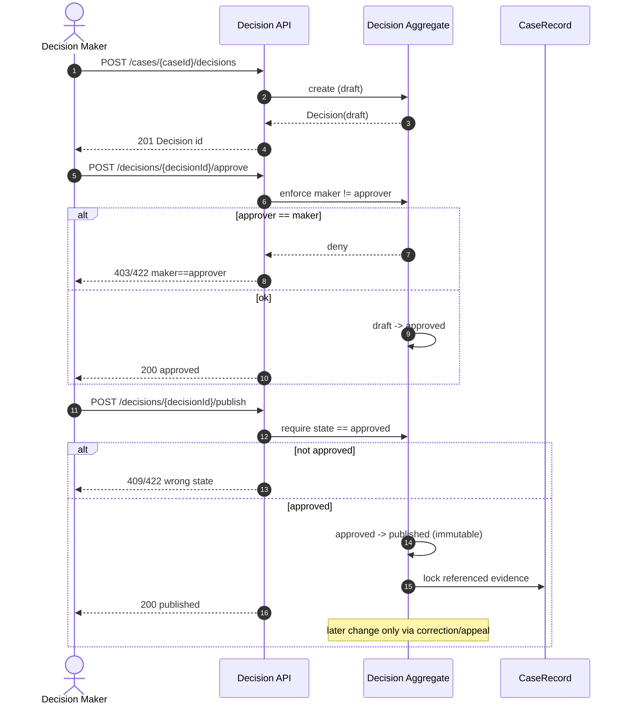
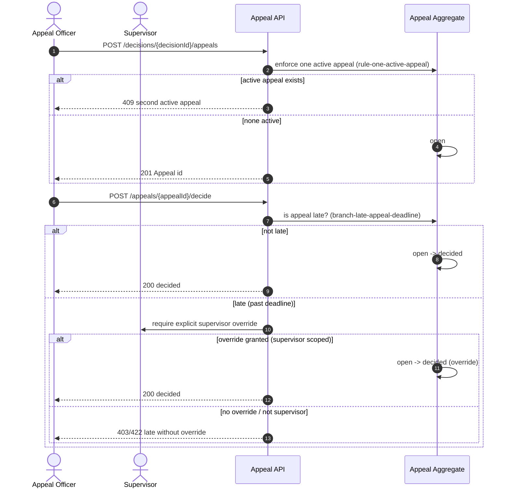

# Decision and Appeal API

**Purpose:** Deeper behavior for decision approval/publication and appeal endpoints.

This page documents the contract-first REST endpoints that drive the
[Decision](../api/decision-lifecycle.md) and [Appeal](../api/appeal-lifecycle.md)
lifecycles, with focus on the guardrails that make those transitions safe:
maker/checker separation, post-publish immutability, single-active-appeal
uniqueness, and the late-appeal supervisor override. It is the behavioral
counterpart to the [Endpoint Catalog](../api/endpoint-catalog.md) and the
[Business Rules](../../.docgen/model/business.json) model.

**Audience:** engineer, business-analyst.

**Coverage tags:** `endpoint-catalog`, `request-flow`, `state-lifecycle`, `business-rules`.

---

## Orientation (newcomer)

A decision is created as a **draft**, then **approved** (by someone other than
its maker), then **published**. Once published it is **immutable** — any later
change must go through a correction or an appeal, never a direct mutation.

An appeal is a separate aggregate: at most **one active appeal** may exist per
decision. Deciding a late appeal (one past its deadline) requires an explicit
**supervisor override**.

The five endpoints in scope:

| Operation | Method + Path | Effect |
|---|---|---|
| `createDecision` | `POST /api/v1/cases/{caseId}/decisions` | Draft decision |
| `approveDecision` | `POST /api/v1/decisions/{decisionId}/approve` | `draft → approved` (maker ≠ approver) |
| `publishDecision` | `POST /api/v1/decisions/{decisionId}/publish` | `approved → published` (immutable) |
| `createAppeal` | `POST /api/v1/decisions/{decisionId}/appeals` | One active appeal per decision |
| `decideAppeal` | `POST /api/v1/appeals/{appealId}/decide` | `open → decided` (supervisor override if late) |

All endpoints are `bearer`-authenticated and emit the RFC-7807-style
`ErrorResponse` envelope on failure (see [Endpoint Catalog](../api/endpoint-catalog.md)).

---

## Create Decision

**Endpoint:** `POST /api/v1/cases/{caseId}/decisions` — `operationId: createDecision`
(source: [endpoint-catalog](../api/endpoint-catalog.md) #14, `createDecision`, `bearer`).

Creates a **draft** `Decision` attached to a case. This is the entry state of the
Decision lifecycle `draft → approved → published → immutable`
(source: [domain-lifecycle](../evidence/domain-lifecycle.md) `lifecycle-decision`).

### Lifecycle context

The Decision lifecycle is a terminal state machine:

- `draft` — created by `createDecision`.
- `approved` — only via `approveDecision` (maker ≠ approver).
- `published` — only via `publishDecision`.
- `immutable` — once published; later change only via correction/appeal
  (`rule-published-decision-immutable`).

### Prerequisite gate

A decision can only meaningfully progress toward `PENDING_DECISION` on the case
when the **investigation report has been approved**. Per invariant
`inv-pending-decision-requires-report` / `rule-pending-decision-gate`:

> Cannot enter `PENDING_DECISION` unless the investigation report has been approved.

`createDecision` itself produces a draft and does not require the case already be
in `PENDING_DECISION`, but the surrounding case progression is blocked by this
gate until the investigation report is approved
(`decision-approve-investigation-report-gates`).

> **Caveat:** evidence notes that later-state prerequisites are lighter than the
> master target (`unknown-later-state-prerequisites`); `PhaseSevenCaseProgressionGuard`
> deepens these but gaps remain. Treat the investigation-report gate as the
> documented hard invariant, not necessarily a fully enforced endpoint check.

---

## Approve Decision

**Endpoint:** `POST /api/v1/decisions/{decisionId}/approve` — `operationId: approveDecision`
(source: [endpoint-catalog](../api/endpoint-catalog.md) #15, `bearer`).

Transitions a decision `draft → approved`. This is the **only** allowed transition
into `approved` (source: `lifecycle-decision`).

### Maker ≠ Approver enforcement

This endpoint enforces the maker-checker separation:

- `rule-maker-checker-recommendation` / `inv-maker-checker-separation` (general maker-checker).
- `decision-decision-approval-maker-not-approver`: *Decision approval enforces that
  the maker (decision creator) is not the approver.*
- The Decision Maker actor is explicitly "subject to maker!=approver separation"
  (source: `actor-decision-maker`).

If the caller is the same principal who created the decision, the request is denied.

### Error behavior

| Violation | Status | Notes |
|---|---|---|
| Approver is the decision maker (same principal) | `403` or `422` | maker ≠ approver enforced (denial) |
| Decision not in `draft` (already approved/published) | `409` / `422` | only `draft → approved` allowed |
| Decision not found / not authorized | `404` / `403` | bearer + authz policy |

---

## Publish Decision

**Endpoint:** `POST /api/v1/decisions/{decisionId}/publish` — `operationId: publishDecision`
(source: [endpoint-catalog](../api/endpoint-catalog.md) #16, `bearer`).

Transitions `approved → published`. After this point the decision is **immutable**.

### Immutability invariant

`rule-published-decision-immutable` / `inv-published-decision-immutable`:

> A published Decision is immutable; later change only via correction or appeal.

This is reinforced at the model level: `lifecycle-decision` marks `published → immutable`
as terminal, and `concept-decision` states "immutable after publish; later change
via correction/appeal." Any attempt to **re-publish** or **mutate** the decision
after publication is rejected.

### Error behavior

| Violation | Status | Notes |
|---|---|---|
| Decision not in `approved` (e.g., still `draft`) | `409` / `422` | only `approved → published` |
| Decision already `published` (re-publish) | `409` / `422` | immutable; reject |
| Attempt to mutate published content | `409` / `422` | must use correction/appeal |
| Decision not found / not authorized | `404` / `403` | bearer + authz policy |

### Related invariant

Evidence referenced by a published decision **cannot be deleted**
(`rule-evidence-published-decision-protected` / `inv-evidence-referenced-protected`).
Publishing therefore also locks referenced evidence versions.

---

## Create Appeal

**Endpoint:** `POST /api/v1/decisions/{decisionId}/appeals` — `operationId: createAppeal`
(source: [endpoint-catalog](../api/endpoint-catalog.md) #17, `bearer`).

Creates an `Appeal` against a decision. Appeals follow the lifecycle
`open → decided` (source: `lifecycle-appeal`).

### One active appeal per decision

`rule-one-active-appeal` / `inv-one-active-appeal`:

> At most one active appeal may exist per decision.

If a decision already has an **active** (non-decided) appeal, a second create is
rejected with `409`. This is enforced at the domain-policy / DB-uniqueness level.

### Error behavior

| Violation | Status | Notes |
|---|---|---|
| Another active appeal already exists for the decision | `409` | one active appeal (reject) |
| Decision not found / not authorized | `404` / `403` | bearer + authz policy |
| Appeal submitted against unsupported decision state | `422` | per decision lifecycle |

### Lifecycle branch

`lifecycle-appeal` records a blocking branch:
`open → (blocked if one active appeal already exists per decision)`.

---

## Decide Appeal (Override Rule)

**Endpoint:** `POST /api/v1/appeals/{appealId}/decide` — `operationId: decideAppeal`
(source: [endpoint-catalog](../api/endpoint-catalog.md) #18, `bearer`).

Transitions an appeal `open → decided`.

### Late-appeal supervisor override

`rule-late-appeal-supervisor` / `branch-late-appeal-deadline`:

> A late appeal requires explicit supervisor override (deadline override rule).
> If appeal is late, requires explicit supervisor override before it can be decided.

`decision-appeal-deadline-override`: *Appeal decision may be taken with a deadline
override when a late appeal is explicitly permitted by a supervisor.*

The **Supervisor** actor is scoped to grant the late-appeal deadline override
(source: `actor-supervisor`, "can grant late-appeal deadline override"). Without
the override, a late decide is rejected.

### Error behavior

| Violation | Status | Notes |
|---|---|---|
| Late appeal (past deadline) without supervisor override | `403` / `422` | override required |
| Caller lacks supervisor scope for override | `403` | role alone insufficient (`rule-role-insufficient-for-access`) |
| Appeal already `decided` (not `open`) | `409` / `422` | only `open → decided` |
| Appeal not found / not authorized | `404` / `403` | bearer + authz policy |

> **Caveat:** `rule-role-insufficient-for-access` (`inv-role-insufficient`) — holding
> a role alone does not grant case access; jurisdiction / classification / conflict /
> unit / direct-assignment checks also apply. A supervisor claim is necessary but not
> sufficient for the override on a given resource.

---

## Operation → Guard → Error Table

Combined view across all five endpoints, grounded in the endpoint catalog and
business rules model.

| Operation | Endpoint | Guard / Rule | On Violation |
|---|---|---|---|
| `createDecision` | `POST /api/v1/cases/{caseId}/decisions` | Case progression gate: investigation report approved before `PENDING_DECISION` (`rule-pending-decision-gate`) | `422` / `404` if case invalid or unauthorized (`403`) |
| `approveDecision` | `POST /api/v1/decisions/{decisionId}/approve` | Maker ≠ approver (`decision-decision-approval-maker-not-approver`); only `draft → approved` | `403`/`422` maker==approver; `409`/`422` wrong state |
| `publishDecision` | `POST /api/v1/decisions/{decisionId}/publish` | `approved → published`; immutability after publish (`rule-published-decision-immutable`) | `409`/`422` re-publish or mutate; `409`/`422` wrong state |
| `createAppeal` | `POST /api/v1/decisions/{decisionId}/appeals` | One active appeal per decision (`rule-one-active-appeal`) | `409` second active appeal |
| `decideAppeal` | `POST /api/v1/appeals/{appealId}/decide` | Late appeal needs supervisor override (`rule-late-appeal-supervisor`, `branch-late-appeal-deadline`); only `open → decided` | `403`/`422` late w/o override; `403` lack supervisor scope; `409`/`422` wrong state |

---

## Diagrams

### Decision approve/publish sequence

### Appeal decide with late-deadline branch

---

## Related pages

- [Endpoint Catalog](../api/endpoint-catalog.md) — full OpenAPI 3.0.3 contract.
- [Decision Lifecycle](../api/decision-lifecycle.md) — `draft → approved → published → immutable`.
- [Appeal Lifecycle](../api/appeal-lifecycle.md) — `open → decided`, one active per decision.
- [Business Rules](../../.docgen/model/business.json) — source of `rule-*` and `branch-*` IDs cited above.

---

## Evidence basis

- `.docgen/evidence/endpoint-catalog.md` — endpoint rows #14–#18.
- `.docgen/evidence/domain-lifecycle.md` — `lifecycle-decision`, `lifecycle-appeal`, invariants.
- `.docgen/model/catalogs.json` — endpoint catalog (`createDecision`, `approveDecision`, `publishDecision`, `createAppeal`, `decideAppeal`).
- `.docgen/model/business.json` — business rules, decisions, branch conditions, lifecycles.
