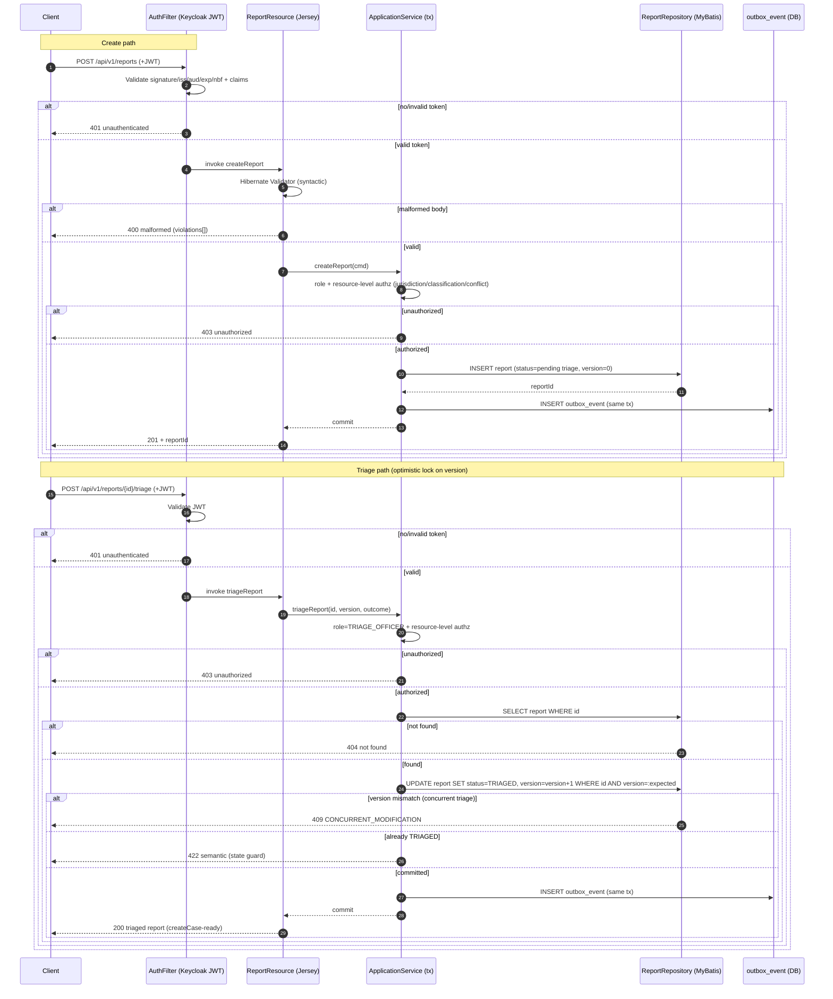

# Intake and Reports API

Deep-behavior reference for the **Report → Triage** entry gate of the Sentinel
Enforcement Platform. This page covers the three report operations —
`createReport`, `getReport`, `triageReport` — that precede case creation
(`createCase`).

> Coverage tags: `endpoint-catalog`, `request-flow`, `security`

**Orientation (newcomer).** A *Report* is the intake aggregate. An intake
officer submits one; it sits **pending triage** until a triage officer marks it
`TRIAGED`. Only a triaged report can become the source of a `CaseRecord`
(`createCase`). Reads and mutations are gated by a Keycloak JWT plus
role-based and resource-level authorization.

**Maintainer model.** The request path is: `AuthFilter` (JWT validate) →
`ReportResource` (Jersey) → application service (transaction) → `ReportRepository`
(MyBatis) → `outbox_event` insert → commit → HTTP response. Triage is
concurrency-controlled by an optimistic lock on the report `version` column.

**Expert detail.** All facts below are grounded in
`.docgen/evidence/endpoint-catalog.md`, `.docgen/evidence/domain-lifecycle.md`,
`.docgen/evidence/authorization-model.md`, and the model files
`.docgen/model/catalogs.json` / `.docgen/model/business.json`. The canonical
contract is `docs/api/openapi.yaml` (operationId = `createReport`, `getReport`,
`triageReport`).

---

## Create Report

`POST /api/v1/reports` — `operationId: createReport` (`cap-intake`,
sentinel-application).

Creates a new report in a **pending-triage** state. Returns `201 Created` with
the new `reportId` in the body.

### Request body

| Field | Type | Constraints (Hibernate Validator) | Notes |
|---|---|---|---|
| `title` | string | `@NotBlank`, length bounded | Short human-readable subject. |
| `description` | string | `@NotBlank`, length bounded | Free-text intake narrative. |
| `reporterChannel` | enum/string | `@NotNull` | Channel the report arrived through (e.g. web, email, partner). |
| `jurisdictionCode` | string | `@NotBlank` (domain value, e.g. `jkt`/`bdg`) | Drives resource-level authorization on later reads. |
| `classification` | enum/string | `@NotNull` | Clearance-tagged classification carried on the report. |
| `priority` | enum/string | `@NotNull` | Intake priority (e.g. LOW/MEDIUM/HIGH). |

### Behavior

- **Syntactic validation** happens up front via Hibernate Validator
  annotations on the request DTO. A violation yields `400 malformed` with a
  `violations` array in the RFC-7807 envelope.
- **Authorization** requires the caller to hold the intake-officer role mapped
  to the create-report permission; resource-level checks (jurisdiction /
  classification / conflict / assignment) apply per the authorization policy.
- On success the application service writes the `Report` row and an
  `outbox_event` row in the **same** DB transaction (per `ADR-004`
  transactional-outbox), then returns `201` with `reportId`. The report is
  **not** yet triaged, so it cannot yet be used as a case source.

> A pending-triage report is the only valid starting point for the lifecycle;
> the triage step (below) is what unlocks `createCase`.

---

## Get Report

`GET /api/v1/reports/{reportId}` — `operationId: getReport`.

Returns `200 OK` with the report DTO (id, title, description, reporter channel,
jurisdiction code, classification, priority, `status`, `version`).

### Behavior

- **`404 not found`** when no report exists for `reportId`.
- **Authorization (resource-level):** the caller must be an intake officer or
  triage officer **and** pass resource-level checks — jurisdiction match,
  classification clearance, conflict-of-interest exclusion, and (where
  applicable) direct assignment / assigned-unit scope. A token without the
  needed role → `403 unauthorized`; no token → `401 unauthenticated`.
- The returned `version` is the optimistic-lock value used by `triageReport`.
- List visibility for reports follows the same authorization rules as item GET;
  filtering is no looser than per-item read.

---

## Triage Report

`POST /api/v1/reports/{reportId}/triage` — `operationId: triageReport`
(`cap-triage`, sentinel-application).

Moves the report to `TRIAGED` and records the triage outcome. This is the
**prerequisite guard** for case creation: `createCase` rejects an untriaged
source report (semantic `422`).

### Branch / guard (documented)

```mermaid
flowchart TD
    A[POST /reports/{id}/triage] --> B{Report exists?}
    B -- no --> N[404 not found]
    B -- yes --> C{Role: TRIAGE_OFFICER?}
    C -- no --> F[403 unauthorized]
    C -- yes --> D{version matches? optimistic lock}
    D -- no --> L[409 CONCURRENT_MODIFICATION]
    D -- yes --> E{Already TRIAGED?}
    E -- yes --> S[422 semantic: already triaged / state conflict]
    E -- no --> G[Mark TRIAGED + outcome]
    G --> H[Insert outbox_event]
    G --> I[200 OK; report ready for createCase]
    I --> J[createCase may now use report as source]
    E -- already triaged path documented as 422 --> S
```

### Concurrency control

Triage is protected by an **optimistic lock on the report `version` column**
(`ADR-008` optimistic-locking). Two concurrent triage requests load the same
`version`; the first commit advances the row version, and the second fails the
`WHERE version = :expected` clause, surfacing **`409 CONCURRENT_MODIFICATION`**
(state conflict) rather than silently overwriting.

### Prerequisite for case creation

Per the domain lifecycle and `createCase` semantics
(`cap-triage` → `uc-create-case`): **a report must be `TRIAGED` before a case
can be created from it.** The `createCase` application service enforces this as
a semantic guard — an untriaged source report is a `422 semantic` rejection,
not a 404. This page documents the report-side half of that guard; the
case-side half is covered in [API: Case Management](./api-case-management.md).

---

## Validation and Error Mapping

Errors are returned as an RFC-7807-style `ErrorResponse` with fields
`type`, `title`, `status`, `code`, `detail`, `instance`, `correlationId`, and
`violations` (the last only for validation failures). Mappers live in
`sentinel-api/.../error/*ExceptionMapper.java`.

### Error class taxonomy

| Class | Source | Example | Mapped status |
|---|---|---|---|
| **Syntactic** | Hibernate Validator annotations on request DTO | `@NotBlank` title missing, `@NotNull` classification | `400 malformed` |
| **Semantic** | Domain guard / lifecycle invariant | triage before case; already-triaged report | `422 semantic` |
| **Auth (unauthenticated)** | `AuthFilter` / `KeycloakTokenVerifier` | no bearer token | `401 unauthenticated` |
| **Auth (unauthorized)** | `RoleBasedAuthorizationService` | role missing / jurisdiction / classification / conflict / unit / assignment | `403 unauthorized` |
| **State conflict** | Optimistic lock (`version` mismatch) | concurrent triage | `409 state conflict` |
| **Not found** | Repository miss | unknown `reportId` | `404 not found` |
| **DB constraint** | MyBatis / PostgreSQL constraint | unique / FK violation | `409` / `422` (mapped) |

### Operation → request/response → error mapping

| Operation | Request | Success response | `400` malformed | `401` unauthenticated | `403` unauthorized | `404` not found | `409` state conflict | `422` semantic |
|---|---|---|---|---|---|---|---|---|
| `createReport` | `POST /api/v1/reports` + body (title, description, reporterChannel, jurisdictionCode, classification, priority) | `201` + `reportId` (pending triage) | Hibernate Validator violation (blank/required field); `violations[]` populated | No/invalid JWT at `AuthFilter` | Token present but caller lacks intake-officer role / resource-level check fails (jurisdiction/classification/conflict) | — | DB unique/FK constraint (e.g. duplicate natural key) mapped by mapper | — |
| `getReport` | `GET /api/v1/reports/{reportId}` | `200` + report DTO (incl. `version`) | — | No/invalid JWT | Role not intake/triage officer, or resource-level check fails (jurisdiction/classification/conflict/assignment/unit) | Unknown `reportId` | — | — |
| `triageReport` | `POST /api/v1/reports/{reportId}/triage` | `200` + triaged report (outcome set) | — | No/invalid JWT | Role not `TRIAGE_OFFICER`, or resource-level check fails | Unknown `reportId` | `409 CONCURRENT_MODIFICATION` — `version` optimistic-lock mismatch | Report already `TRIAGED` (state guard) |

### RFC-7807 envelope shape

```json
{
  "type": "https://sentinel.example/problems/concurrent-modification",
  "title": "Report was modified concurrently",
  "status": 409,
  "code": "CONCURRENT_MODIFICATION",
  "detail": "Report version 3 no longer matches expected version 2; retry triage.",
  "instance": "/api/v1/reports/8f1c/triage",
  "correlationId": "b1c2d3e4-...",
  "violations": []
}
```

`correlationId` is the request correlation id used for log/observability
traceability; `code` is the stable machine-readable problem code, distinct from
HTTP `status`.

---

## Authorization Requirements

Enforced by `RoleBasedAuthorizationService` against `Permission.java` (25
permissions). Policy order (`authorization-model`, FACT):

1. `SYSTEM_ADMIN` short-circuits **all** checks.
2. Actor must hold a role mapped to the required `Permission`, else **403**.
3. **Jurisdiction** — if context `jurisdictionCode` is set and the actor lacks
   it ⇒ denied.
4. **Classification clearance** — if `caseClassification` (report classification)
   is set and the actor lacks clearance ⇒ denied.
5. **Conflict-of-interest** — if `resourceOwnerId` is set and the actor
   `isConflictedWith` the owner ⇒ denied.
6. **Assigned-unit scope** — `enforceAssignedUnitScope` for unit-restricted
   resources (JWT claim `assigned_units`).
7. **Direct assignment** — `requiresDirectAssignment(actor, permission)` requires
   `actor.username() == assigneeUserId()`.

### Report-operation role matrix

| Operation | Required capability / role | Resource-level checks | No token | Token, wrong role / resource |
|---|---|---|---|---|
| `createReport` | intake officer (`CASE_INTAKE_OFFICER`) | jurisdiction on `jurisdictionCode`; classification clearance on `classification` | `401` (UnauthenticatedExceptionMapper) | `403` (AuthorizationDeniedExceptionMapper) |
| `getReport` | intake officer **or** triage officer | jurisdiction / classification / conflict / assignment / unit | `401` | `403` |
| `triageReport` | triage officer (`TRIAGE_OFFICER`) | jurisdiction / classification / conflict / assignment / unit | `401` | `403` |

### JWT claims (Keycloak, realm `sentinel`)

`KeycloakTokenVerifier` validates signature, issuer, audience, expiry, and
not-before, and asserts required claims (no unsigned decode). The local actor
JWT carries:

- `jurisdictions` — jurisdiction scope (e.g. `jkt`, `bdg`)
- `assigned_units` — assigned-unit scope
- `case_classifications` — clearance tags
- `conflicted_actor_ids` — conflict-of-interest exclusion list

> **Rule (FACT):** holding a role alone does **not** grant access —
> jurisdiction / classification / conflict / unit / direct-assignment checks
> also apply (`rule-role-insufficient-for-access`, `inv-role-insufficient`).
> Denied access returns `401` (no token) or `403` (role / jurisdiction / unit /
> classification / conflict / assignment), mapped by
> `AuthorizationDeniedExceptionMapper` + `UnauthenticatedExceptionMapper`.

---

## Request / Triage Sequence (Mermaid)



> The diagram shows the get path implicitly: `GET /{id}` flows through the same
> `AuthFilter` → `ReportResource` → `ApplicationService` → `ReportRepository`
> chain, returns `200` with the report DTO, and returns `404` on a repository
> miss.

---

## Related Pages

- [Endpoint Catalog](./endpoint-catalog.md) — exhaustive 27-operationId reference.
- [API: Case Management](./api-case-management.md) — `createCase` consumes a triaged report (case-side guard).
- [Business Overview](../business-domain/business-overview.md) — aggregates, lifecycle, and invariants.
- [Branch Conditions](../business-logic/branch-conditions.md) — jurisdiction / classification / conflict / unit / assignment branch logic.

## Evidence and Model References

- Evidence: `.docgen/evidence/endpoint-catalog.md`, `.docgen/evidence/domain-lifecycle.md`, `.docgen/evidence/authorization-model.md`
- Models: `.docgen/model/catalogs.json`, `.docgen/model/business.json`
- Source of truth: `docs/api/openapi.yaml` (operationIds `createReport`, `getReport`, `triageReport`)
- ADRs: `ADR-004` (transactional outbox), `ADR-008` (optimistic locking), `ADR-003` (MyBatis over ORM), `ADR-006` (Keycloak local auth)
