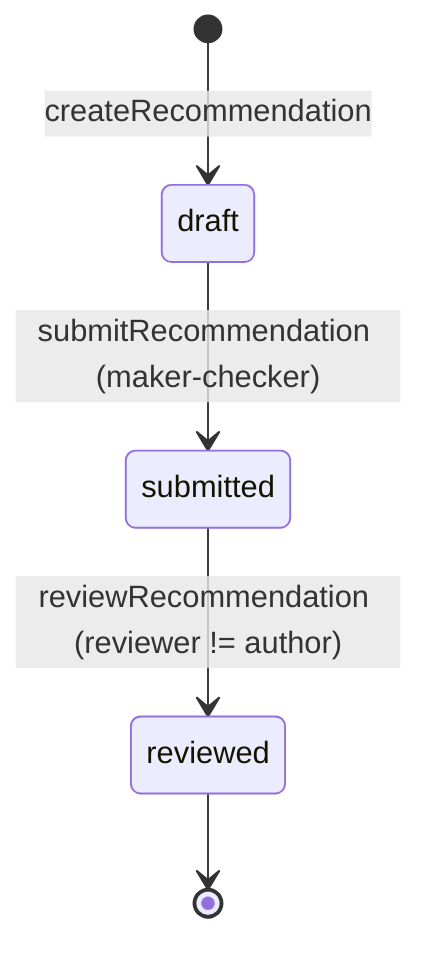
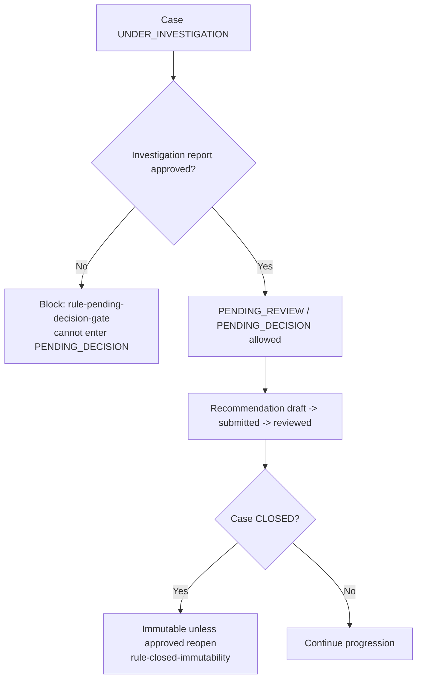
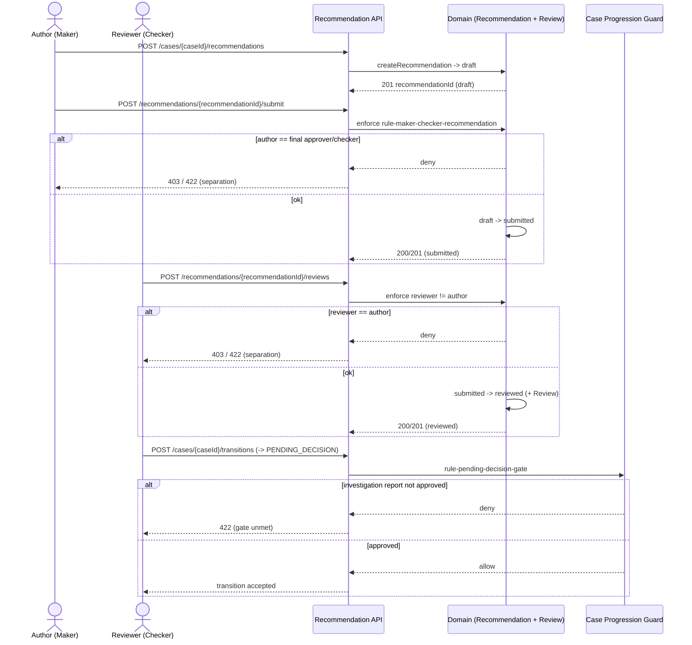

# Recommendation and Review API

Deeper behavior for the recommendation submit/review endpoints in the Sentinel
enforcement API. This page documents how a recommendation is created, submitted
under maker-checker separation, reviewed by a distinct actor, and how its state
participates in case-level lifecycle gating.

All three endpoints are contract-first (`docs/api/openapi.yaml`, OpenAPI 3.0.3),
bearer-authenticated, and emit the RFC-7807 `ErrorResponse` envelope via the
`sentinel-api/.../error/*ExceptionMapper.java` mappers (status mapping
400/401/403/404/409/412/422/429/500/503).

## Audience orientation

| Reader | What you need from this page |
|---|---|
| Engineer | Endpoint paths, operationIds, the maker-checker enforcement rule, the operation→guard→error table, and the submit/review sequence. |
| Business analyst | The draft→submitted→reviewed lifecycle, the separation-of-duties rule, and how recommendations gate the case progression (cannot reach `PENDING_DECISION` without an approved investigation report). |

## Recommendation lifecycle (at a glance)

The `Recommendation` aggregate (`+Review`) progresses through three states.
Source of truth: `domain-lifecycle.md` and the `lifecycle-recommendation` model.

**Terminal state:** `reviewed`. Once reviewed, a recommendation is not reopened
by these endpoints; later change to the case follows the decision/appeal path.

---

## Create Recommendation

**Endpoint:** `POST /api/v1/cases/{caseId}/recommendations`
**operationId:** `createRecommendation` (`bearer`)
**Catalog row:** #11 in the endpoint catalog.

Creates a **draft** recommendation attached to the case. The recommendation
enters the `draft` state and is editable only by its author until submission.

| Attribute | Value |
|---|---|
| Method / Path | `POST /api/v1/cases/{caseId}/recommendations` |
| Auth | bearer (role alone insufficient — jurisdiction/classification/conflict/unit/direct-assignment checks apply per `rule-role-insufficient-for-access`) |
| Input | case id (path), recommendation body (recommendation content) |
| Effect | `Recommendation` created in `draft`; author recorded |
| Initial state | `draft` |
| Success | 201 with recommendation id (OpenAPI contract) |

Lifecycle transition: `[*] → draft` (see `lifecycle-recommendation`).

> Note: the recommendation is scoped to the case and inherits the case's
> authorization context (e.g., `caseClassification`, `assigned_units`,
> `jurisdictionCode`). A draft is not yet subject to maker-checker; that
> separation is enforced at submit time.

---

## Submit (Maker-Checker)

**Endpoint:** `POST /api/v1/recommendations/{recommendationId}/submit`
**operationId:** `submitRecommendation` (`bearer`)
**Catalog row:** #12 in the endpoint catalog. Note: action keyed by
`recommendationId`, not `caseId`.

Marks the recommendation `submitted`. This is the maker-checker control point.

**Rule enforced — `rule-maker-checker-recommendation` (FACT):**
> The recommendation author must not be the final approver.

In the recommendation lifecycle the "submit" action is performed by the maker
(author). The distinct reviewer actors (`actor-reviewer`, e.g. `reviewer-jkt`)
provide the checking function through the `reviewRecommendation` endpoint. If the
same actor attempts both maker and checker roles, the separation is denied.

Lifecycle transition: `draft → submitted` (see `lifecycle-recommendation`).

| Condition | Behavior |
|---|---|
| Recommendation in `draft` | Transition to `submitted`; 200/201 per contract. |
| Author attempts to act as final approver / checker (same actor) | Denied: 403 (authorization) or 422 (business-rule violation) as appropriate. |
| Recommendation already `submitted` / `reviewed` | Rejected (state conflict); 409 or 422 depending on guard. |
| Recommendation not found | 404. |

> Enforcement detail: maker-checker is part of the domain invariant
> `inv-maker-checker-separation` ("recommendation author != final approver").
> The review endpoint (below) is where the distinct reviewer actor satisfies the
> "checker" side.

---

## Review

**Endpoint:** `POST /api/v1/recommendations/{recommendationId}/reviews`
**operationId:** `reviewRecommendation` (`bearer`)
**Catalog row:** #13 in the endpoint catalog.

The reviewer actor creates a `Review` of a submitted recommendation; the
recommendation moves to `reviewed`.

**Reviewer distinctness:** the reviewing actor (`actor-reviewer`) must be
distinct from the recommendation author. This is the "checker" half of
maker-checker for recommendations and is consistent with
`inv-maker-checker-separation`.

Lifecycle transition: `submitted → reviewed` (see `lifecycle-recommendation`).

| Condition | Behavior |
|---|---|
| Recommendation in `submitted`, reviewer != author | Review created; recommendation → `reviewed`; 201/200 per contract. |
| Reviewer == author | Denied: 403/422 (separation enforced). |
| Recommendation in `draft` (not submitted) | Rejected: 422 (precondition — only submitted recommendations are reviewable). |
| Recommendation already `reviewed` | Rejected (state conflict): 409 or 422. |
| Recommendation not found | 404. |

---

## Lifecycle Gating

Recommendations do not exist in isolation; their state participates in case
progression gating. The case status enum
(`CaseStatus.java`) is
`CREATED, UNDER_TRIAGE, UNDER_INVESTIGATION, PENDING_REVIEW, PENDING_DECISION,
DECIDED, UNDER_APPEAL, ENFORCEMENT_IN_PROGRESS, CLOSED, CANCELLED`, with
`isTerminal()` ⇒ `CLOSED` or `CANCELLED`.

### Gates that apply around the recommendation flow

| Rule | Statement | Enforcement |
|---|---|---|
| `rule-pending-decision-gate` | Cannot enter `PENDING_DECISION` unless the investigation report has been approved. | Domain policy (`inv-pending-decision-requires-report`); transition guard in `transitionCase`. |
| Recommendation state gating | Recommendation state participates in later-state prerequisites (recommendation/review/decision/sanction/appeal). | `CaseProgressionGuard` functional interface (`NO_OP` default) deepened by `PhaseSevenCaseProgressionGuard`. |
| `rule-closed-immutability` | A `CLOSED` case cannot change state except via an approved reopen. | Domain policy (`inv-closed-immutability`); `CaseProgressionGuard` / `PhaseSevenCaseProgressionGuard`. |

### Progression guard mechanics

- `CaseProgressionGuard` is a functional interface with a `NO_OP` default.
- `PhaseSevenCaseProgressionGuard` deepens later-state prerequisites — including
  recommendation/review/decision/sanction/appeal prerequisites in case
  progression. (Documented gaps remain for enforcement-monitoring detail —
  see `unknown-later-state-prerequisites`.)

---

## Operation → Guard → Error table

| Operation | Guard / Rule | Failure → Error (HTTP) |
|---|---|---|
| `POST /api/v1/cases/{caseId}/recommendations` (createRecommendation) | Case exists & actor authorized (jurisdiction/classification/conflict/unit) — `rule-role-insufficient-for-access` | Case not found → 404; unauthorized → 401/403; authz scope fail → 403 |
| `POST /api/v1/recommendations/{recommendationId}/submit` (submitRecommendation) | State == `draft`; maker-checker `rule-maker-checker-recommendation` | Not `draft` → 409/422; author == final approver/checker → 403/422; not found → 404 |
| `POST /api/v1/recommendations/{recommendationId}/reviews` (reviewRecommendation) | State == `submitted`; reviewer distinct from author (`inv-maker-checker-separation`) | Not `submitted` → 422; reviewer == author → 403/422; already `reviewed` → 409/422; not found → 404 |
| Case `transitionCase` into `PENDING_DECISION` | `rule-pending-decision-gate` (investigation report approved) | Gate unmet → 422 (transition policy) |
| Any mutation on `CLOSED` case | `rule-closed-immutability` (approved reopen required) | No approved reopen → 409/422 |

---

## Submit / Review sequence (Mermaid)

---

## Related pages

- [Endpoint Catalog](./endpoint-catalog.md) — full REST catalog (#11–#13 here).
- [Recommendation Lifecycle](./recommendation-lifecycle.md) — draft→submitted→reviewed detail.
- [Business Rules](./business-rules.md) — `rule-maker-checker-recommendation`, `rule-pending-decision-gate`, `rule-closed-immutability`.
- [Decision Lifecycle](./decision-lifecycle.md) — decision maker-checker and immutable publish path.

## Coverage tags

`endpoint-catalog` · `request-flow` · `business-rules`
