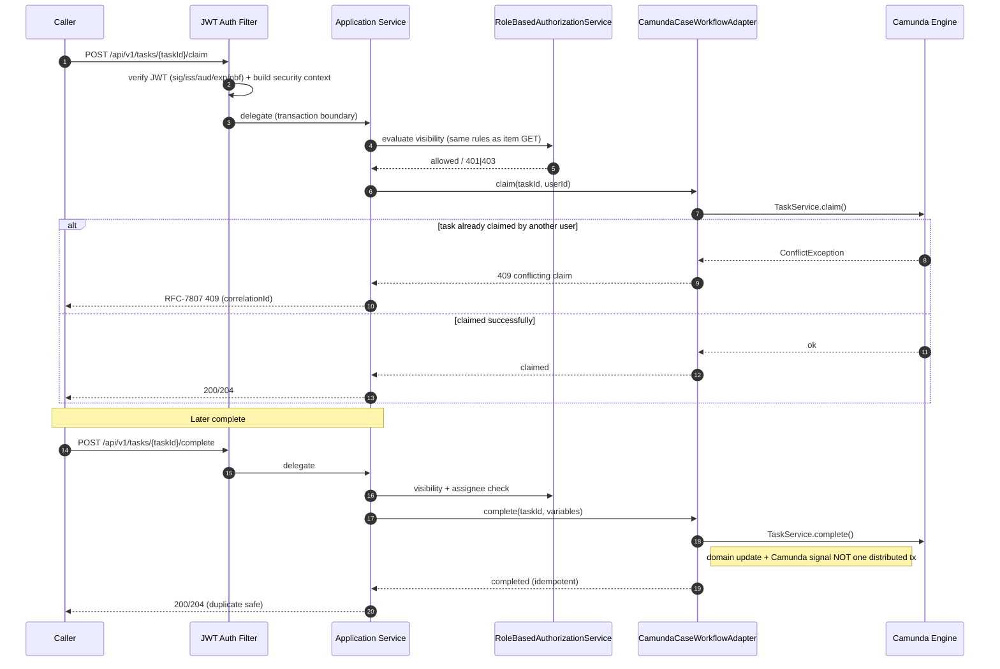

# Workflow Tasks and Reconciliation API

Deeper behavior for the task claim/complete and workflow reconciliation endpoints. These endpoints
sit on the embedded **Camunda 7.24.0** engine (`sentinel-workflow` module) and expose a thin,
authorization-scoped surface over `CamundaCaseWorkflowAdapter` and
`WorkflowReconciliationApplicationService`.

- **Audience:** engineer, operator
- **Source of truth:** `docs/api/openapi.yaml` (contract-first, OpenAPI 3.0.3)
- **Related pages:** [Endpoint Catalog](./api-endpoint-catalog.md) ·
  [Camunda Workflow](./api-camunda-workflow.md) ·
  [Branch Conditions](./api-branch-conditions.md) ·
  [Operations Runbooks](../runbooks/README.md)

## Orientation (newcomer)

| Endpoint | Method | operationId | Purpose |
|---|---|---|---|
| `GET /api/v1/tasks` | GET | `listTasks` | Cursor-paged Camunda user tasks visible to the caller. |
| `POST /api/v1/tasks/{taskId}/claim` | POST | `claimTask` | Take ownership of a task; **409** if already claimed. |
| `POST /api/v1/tasks/{taskId}/complete` | POST | `completeTask` | Complete a task; **idempotent** (duplicate safe). |
| `GET /api/v1/workflow-reconciliation` | GET | `listWorkflowReconciliationIssues` | Supervisor-scoped list of domain/workflow mismatches. |
| `POST /api/v1/workflow-reconciliation/{caseId}/actions` | POST | `reconcileWorkflowCase` | Auto-repair or terminate a mismatched case. |

Tasks are not a separate domain aggregate: they are Camunda user tasks correlated to a domain
`CaseRecord` through the `workflow_instance` table (business key = `caseId`). Task visibility and
reconciliation access are **authorization-scoped**, not purely role-gated.

## Request flow (engineer working model)

All four read/mutating endpoints share the `cf-http-to-handler` control flow
(`endpoint-catalog`, `authorization-model`):

1. **JWT auth filter** verifies signature/issuer/audience/expiry/nbf and required claims.
2. **Security context** is populated with claims: `jurisdictions`, `assigned_units`,
   `case_classifications`, `conflicted_actor_ids`.
3. **Jersey resource** delegates to the application service (transaction boundary).
4. **Authorization policy** (`RoleBasedAuthorizationService`) is evaluated; denial maps to
   `401`/`403` via exception mappers.

> **Role is not enough.** Per `rule-role-insufficient-for-access` / `inv-role-insufficient`,
> holding a role alone does not grant task visibility. Jurisdiction, classification, conflict,
> unit, and direct-assignment checks all apply — task visibility **reuses the same authorization
> rules as item GET** (e.g. `getCase`).

## Operation → Authz Scope → Error table

| Operation | operationId | Authz scope / gating | Expected success | Key errors (RFC-7807) |
|---|---|---|---|---|
| List tasks | `listTasks` | `bearer`; task visibility = item GET rules (jurisdiction/classification/conflict/unit/direct-assign). Filtering **no looser** than item GET. | `200` cursor-paged list | `401` bad/expired JWT · `403` no visibility · `422` invalid cursor/sortBy · `429` rate limit · `500`/`503` engine unreachable |
| Claim task | `claimTask` | `bearer`; same visibility rules as item GET. | `200`/`204` claimed by caller | `401` · `403` no visibility · `404` task gone · **`409` conflicting claim** (`rf-task-claim`) · `412`/`422` stale · `500` |
| Complete task | `completeTask` | `bearer`; same visibility rules; must be assignee/eligible per task. | `200`/`204`; **idempotent** duplicate returns same outcome | `401` · `403` · `404` · `409` (already-completed race) · `422` invalid variables · `500` |
| Reconciliation list | `listWorkflowReconciliationIssues` | `bearer`; **supervisor-scoped** (`actor-supervisor`); auditor read-only (`actor-auditor`). | `200` supervisor-scoped mismatch list | `401` · `403` not supervisor · `422` bad query · `500` |
| Reconciliation action | `reconcileWorkflowCase` | `bearer`; **supervisor-scoped**; `repair` | `200` action applied | `401` · `403` not supervisor · `404` caseId unknown · `409` concurrent reconciliation · `422` unknown action / invalid state · `500` |

Error envelope is RFC-7807-style `ErrorResponse`
(`type/title/status/code/detail/instance/correlationId/violations`); mappers live in
`sentinel-api/.../error/*ExceptionMapper.java`. Status codes in scope:
`400/401/403/404/409/412/422/429/500/503`.

## List Tasks

`GET /api/v1/tasks` → `listTasks` (operationId #23 in the endpoint catalog).

- **Paging:** cursor + `limit` + `q` + `sortBy` per the shared `list-query-pattern`
  (`docs/api/list-query-pattern.md`). All list endpoints use cursor + `limit` + `q` +
  `searchField`/`searchValue` + enum `sortBy`/`sortDirection` with safe dynamic SQL.
- **Engine:** Camunda 7.24.0 embedded (`SingleProcessEngineProvider`); `CamundaCaseWorkflowAdapter`
  performs task query via the public Camunda API. No runtime SQL against `ACT_*` tables is
  permitted (enforced per `.agents/instruction.md`).
- **Scope:** authorization filtering must be **no looser than item GET** (`rf-list-cases`). A caller
  sees only tasks whose correlated case passes the same jurisdiction/classification/conflict/unit/
  direct-assignment checks.
- **Correlation:** each task resolves to a domain `CaseRecord` through `workflow_instance`
  (business key `caseId`). See [Camunda Workflow](./api-camunda-workflow.md).

## Claim Task

`POST /api/v1/tasks/{taskId}/claim` → `claimTask` (operationId #24), 409 on conflicting claim
(`rf-task-claim`).

- **Flow:** auth + authorization (task visibility uses **same rules as item GET**) →
  Camunda task query/claim via public API → on conflicting claim returns **409**.
- The 409 is the canonical optimistic contention signal for task ownership, analogous to the
  `0 rows -> 409 CONCURRENT_MODIFICATION` optimistic-lock path elsewhere (`df-optimistic-lock`).

### Task claim / complete sequence (with 409)



## Complete Task (Idempotent)

`POST /api/v1/tasks/{taskId}/complete` → `completeTask` (operationId #25), idempotent completion.

- **Idempotency:** task completion is **idempotent** — a duplicate completion is safe and returns
  the same outcome. This mirrors the broader system's idempotency posture (outbox/inbox dedup).
- **Consistency caveat (operator-critical):** the domain update and the Camunda signal are
  **NOT** performed inside one distributed transaction. A partial failure can leave the domain and
  the workflow instance out of step. The **reconciliation job** (`cf-workflow-reconciliation-job`,
  job-reconciliation) is the safety net that detects and repairs such mismatches.

> **Do not** treat a `200` from `completeTask` as proof that the correlated workflow instance
> advanced. If the Camunda signal failed after the domain write, a reconciliation issue will be
> surfaced for the case (see [Reconciliation Listing](#reconciliation-listing)). Runbook:
> `docs/runbooks/domain-workflow-mismatch-reconciliation.md`.

## Reconciliation Listing

`GET /api/v1/workflow-reconciliation` → `listWorkflowReconciliationIssues` (operationId #26),
supervisor-scoped mismatch listing.

- **Detection:** `WorkflowReconciliationApplicationService` compares the domain `CaseRecord` state
  with the correlated Camunda process instance and lists mismatches (e.g. domain CLOSED but process
  still active, or process advanced but domain stuck).
- **Scope:** **supervisor-scoped** (`actor-supervisor`; default seeded `supervisor-jkt`,
  `supervisor-jkt` +unit-2). The `actor-auditor` is **read-only** on this listing (no mutating
  action authority).
- **Trigger:** listing is powered by `cf-workflow-reconciliation-job` / `job-reconciliation`
  (on-demand / reconciliation scan). It is not a continuously streaming feed.

## Reconciliation Actions

`POST /api/v1/workflow-reconciliation/{caseId}/actions` → `reconcileWorkflowCase` (operationId #27),
auto-repair or terminate (`decision-reconciliation-repair-terminate`).

- **Actions:** `repair` (auto-repair the mismatch, e.g. advance/sync the workflow instance to match
  the domain) or `terminate` (terminate the orphaned/divergent Camunda process instance).
- **Scope:** supervisor-scoped; auditor cannot invoke. Invalid action or invalid target state →
  `422`; concurrent reconciliation attempt → `409`.
- **Flow:** `cf-workflow-reconciliation-job` → `WorkflowReconciliationApplicationService` detects
  mismatch → `GET /api/v1/workflow-reconciliation` lists issues → `POST .../actions` repairs or
  terminates the case.

### Reconciliation repair / terminate flow

```mermaid
flowchart TD
    A[WorkflowReconciliationApplicationService scan] --> B{Domain vs Camunda mismatch?}
    B -- No --> Z[No issue; no action]
    B -- Yes --> C[GET /api/v1/workflow-reconciliation lists issue]
    C --> D{Actor is supervisor?}
    D -- No auditor/other --> E[403 forbidden]
    D -- Yes --> F[POST /api/v1/workflow-reconciliation/{caseId}/actions]
    F --> G{action = repair?}
    G -- Yes --> H[Auto-repair: sync workflow instance to domain state]
    G -- No terminate --> I[Terminate divergent Camunda process instance]
    H --> J{Repair success?}
    I --> J
    J -- Yes --> K[200 action applied; mismatch cleared]
    J -- No --> L[409 concurrent / 422 invalid state / 500]
    L --> M[Runbook: domain-workflow-mismatch-reconciliation.md]
```

## Coverage & evidence map

| Contract item | Evidence |
|---|---|
| Embedded Camunda 7.24.0, adapter task query/claim/complete | `workflow-camunda.md` (Adapters) |
| `cf-http-to-handler` JWT/security/authorization flow | `flows.json` `cf-http-to-handler`; `endpoint-catalog.md` |
| Claim 409 on conflicting claim (`rf-task-claim`) | `flows.json` `rf-task-claim`; `endpoint-catalog.md` #24 |
| Idempotent completion; domain + signal not one distributed tx | `workflow-camunda.md` (Idempotency/consistency); `business.json` `cap-workflow-task-handling` |
| Supervisor-scoped listing; auditor read-only | `business.json` actors `actor-supervisor`, `actor-auditor`; `endpoint-catalog.md` #26 |
| Repair/terminate decision | `business.json` `decision-reconciliation-repair-terminate`; `flows.json` `cf-workflow-reconciliation-job` |
| Cursor paging + list-query-pattern | `endpoint-catalog.md`; `catalogs.json` `listTasks` |

**Tags:** `endpoint-catalog`, `request-flow`, `control-flow`
