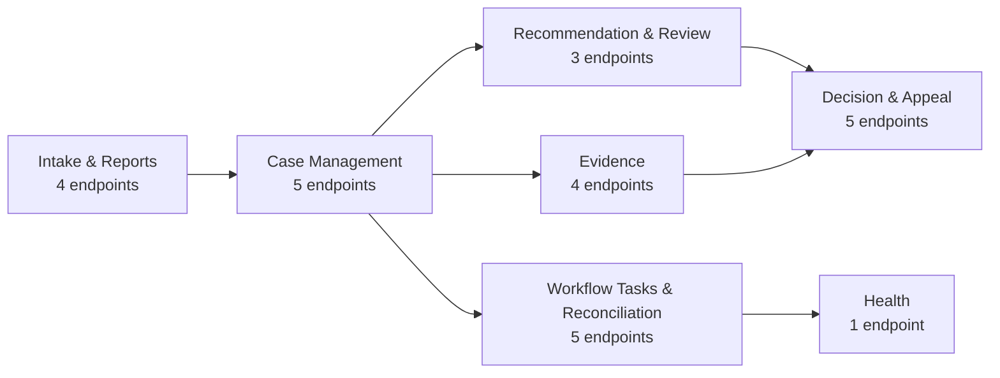

# Endpoint Catalog

Canonical, exhaustive reference for every REST endpoint exposed by the Sentinel
Enforcement Platform API (`docs/api/openapi.yaml`, OpenAPI 3.0.3, contract-first).
This page is the single source of truth for the **27 verified operationIds**.

> Coverage tags: `endpoint-catalog`, `request-flow`, `security`

## Catalog Summary

| Attribute | Value |
|---|---|
| Total endpoints | **27** |
| API base path | `/api/v1` (+ anonymous `/health`) |
| OpenAPI version | 3.0.3 (contract-first) |
| Auth strategy | **Keycloak JWT bearer** + **role-based** permission + **resource-level authorization** |
| Anonymous endpoint | `GET /health` only |
| Auth on all others | `bearerAuth` (Keycloak realm `sentinel` JWT) |

**Authentication (JWT / Keycloak).** Every non-health call requires a Keycloak
bearer token issued by realm `sentinel`. `KeycloakTokenVerifier` validates
signature, issuer, audience, expiry, and not-before, and asserts required claims
(no unsigned decoding). The local actor JWT carries claims:

- `jurisdictions` — jurisdiction scope (e.g. `jkt`, `bdg`)
- `assigned_units` — assigned-unit scope
- `case_classifications` — clearance tags for classified cases
- `conflicted_actor_ids` — conflict-of-interest exclusion list

**Authorization (role-based + resource-level).** Enforced by
`RoleBasedAuthorizationService` with this policy order (`Permission.java`, 25
permissions):

1. `SYSTEM_ADMIN` short-circuits all checks.
2. Actor must hold a role mapped to the required `Permission`, else **403**.
3. **Jurisdiction** — if context `jurisdictionCode` set and actor lacks it ⇒ denied.
4. **Classification clearance** — if `caseClassification` set and actor lacks clearance ⇒ denied.
5. **Conflict-of-interest** — if `resourceOwnerId` set and actor `isConflictedWith` owner ⇒ denied.
6. **Assigned-unit scope** — `enforceAssignedUnitScope` for unit-restricted resources.
7. **Direct assignment** — `requiresDirectAssignment(actor, permission)` requires `actor.username() == assigneeUserId()`.

> **Rule (FACT):** Holding a role alone does **not** grant case access —
> jurisdiction / classification / conflict / unit / direct-assignment checks
> also apply (`rule-role-insufficient-for-access`). List visibility uses the
> same rules as item GET — list filtering is no looser than item read.

**Error envelope.** RFC-7807-style `ErrorResponse`
(`type/title/status/code/detail/instance/correlationId/violations`). Status
mapping: `400 / 401 / 403 / 404 / 409 / 412 / 422 / 429 / 500 / 503`. Mappers
live in `sentinel-api/.../error/*ExceptionMapper.java`.

**List query convention.** All list endpoints follow
[`list-query-pattern`](./list-query-pattern.md): cursor + limit + `q` +
`searchField`/`searchValue` + enum `sortBy`/`sortDirection` with safe dynamic
SQL.

### Endpoint Count by Capability Area

| Section | Endpoints |
|---|---|
| Intake and Reports | 4 |
| Case Management | 5 |
| Recommendation and Review | 3 |
| Decision and Appeal | 5 |
| Evidence | 4 |
| Workflow Tasks and Reconciliation | 5 |
| Health | 1 |
| **Total** | **27** |

### Capability Flow (Mermaid)

Legend: `Health` is a standalone anonymous probe; it is shown last for grouping
only and is not a downstream dependency of workflow tasks.

---

## Intake and Reports

Report intake and triage — the entry gate to case creation. Owning capability:
`cap-intake` / `cap-triage` (`sentinel-application`). A report must be triaged
(`TRIAGED`) before it can be used as a case source.

| Endpoint | Method | Path | Auth | Description |
|---|---|---|---|---|
| `createReport` | POST | `/api/v1/reports` | JWT (Keycloak bearer); role: intake officer | 201 on authorized intake officer; creates a pending-triage report. |
| `getReport` | GET | `/api/v1/reports/{reportId}` | JWT (Keycloak bearer); role-based | Read a single report by id. |
| `triageReport` | POST | `/api/v1/reports/{reportId}/triage` | JWT (Keycloak bearer); role: triage officer | Move report to `TRIAGED` (optimistic lock). Prerequisite for case creation. |
| `createCase` | POST | `/api/v1/cases` | JWT (Keycloak bearer); role-based | Requires a triaged source report; creates `CaseRecord` and starts the Camunda `regulatory-enforcement-case` process (business key = `caseId`). |

> **Note:** `createCase` is grouped under Intake/Reports here because it consumes
> a triaged report as its source, but it also appears in Case Management as the
> case-creation entry point. The canonical operationId is `createCase`.

---

## Case Management

Case lifecycle, assignment, state transition, and audit history. Owning
capability: `cap-case-management` / `cap-assignment` (`sentinel-application`).

| Endpoint | Method | Path | Auth | Description |
|---|---|---|---|---|
| `createCase` | POST | `/api/v1/cases` | JWT (Keycloak bearer); role-based | Requires a triaged source report; creates `CaseRecord` and starts Camunda process. *(See Intake and Reports.)* |
| `listCases` | GET | `/api/v1/cases` | JWT (Keycloak bearer); role-based (list filter = item GET rules) | Cursor + `q` + `searchField` + `sortBy` paged case listing. |
| `getCase` | GET | `/api/v1/cases/{caseId}` | JWT (Keycloak bearer); resource-level (jurisdiction/unit/classification/conflict/assignment) | Read a case by id. |
| `assignCase` | POST | `/api/v1/cases/{caseId}/assignments` | JWT (Keycloak bearer); role: supervisor | Assignment with optimistic lock + audit; supports assigned-unit scope enforcement. |
| `transitionCase` | POST | `/api/v1/cases/{caseId}/transitions` | JWT (Keycloak bearer); role: state owner | Apply state-transition policy + optimistic locking concurrency control (OLC). |
| `getCaseAuditEvents` | GET | `/api/v1/cases/{caseId}/audit-events` | JWT (Keycloak bearer); role: auditor / assigned | Cursor-paged append-only audit events for a case. |

**CaseStatus lifecycle** (`concept-casestatus`): `CREATED → UNDER_TRIAGE →
UNDER_INVESTIGATION → PENDING_REVIEW → PENDING_DECISION → DECIDED →
UNDER_APPEAL → DECIDED → ENFORCEMENT_IN_PROGRESS → CLOSED`. Terminal =
`CLOSED` / `CANCELLED`.

Key invariants enforced on transitions:
- Cannot enter `PENDING_DECISION` unless the investigation report is approved (`rule-pending-decision-gate`).
- A `CLOSED` case cannot change state except via an approved reopen (`rule-closed-immutability`).
- Cannot `CLOSE` if an active sanction obligation exists (`rule-no-close-with-active-sanction`).

---

## Recommendation and Review

Draft, submit (maker-checker), and review recommendations. Owning capability:
`cap-recommendation-review` (`sentinel-application`). Recommendation lifecycle:
`draft → submitted → reviewed`.

| Endpoint | Method | Path | Auth | Description |
|---|---|---|---|---|
| `createRecommendation` | POST | `/api/v1/cases/{caseId}/recommendations` | JWT (Keycloak bearer); role: investigator | Create a draft recommendation for the case. |
| `submitRecommendation` | POST | `/api/v1/recommendations/{recommendationId}/submit` | JWT (Keycloak bearer); role: investigator | Submit recommendation (maker-checker separation enforced). |
| `reviewRecommendation` | POST | `/api/v1/recommendations/{recommendationId}/reviews` | JWT (Keycloak bearer); role: reviewer | Create a review of a submitted recommendation; moves it to `reviewed`. |

> **Maker-checker (FACT):** the recommendation author must not be the final
> approver (`rule-maker-checker-recommendation`).

---

## Decision and Appeal

Decision creation, approval (maker ≠ approver), publication (immutable), and
appeal creation/decision. Owning capability: `cap-decision-approval-publication`
/ `cap-appeal` (`sentinel-application`). Decision lifecycle: `draft → approved →
published → immutable`. Appeal lifecycle: `open → decided` (one active appeal
per decision).

| Endpoint | Method | Path | Auth | Description |
|---|---|---|---|---|
| `createDecision` | POST | `/api/v1/cases/{caseId}/decisions` | JWT (Keycloak bearer); role: decision_maker | Create a draft decision for the case. |
| `approveDecision` | POST | `/api/v1/decisions/{decisionId}/approve` | JWT (Keycloak bearer); role: decision_maker (maker-checker) | Approve decision; maker (`decision creator`) ≠ approver enforced. |
| `publishDecision` | POST | `/api/v1/decisions/{decisionId}/publish` | JWT (Keycloak bearer); role: decision_maker | Publish decision; immutable thereafter (later change only via correction/appeal). |
| `createAppeal` | POST | `/api/v1/decisions/{decisionId}/appeals` | JWT (Keycloak bearer); role: appeal_officer | Create an appeal; at most one active appeal per decision. |
| `decideAppeal` | POST | `/api/v1/appeals/{appealId}/decisions` | JWT (Keycloak bearer); role: appeal_officer | Decide an appeal; late appeal requires supervisor deadline override. |

> **Path grounding note:** the OpenAPI source defines `decideAppeal` at
> `/api/v1/appeals/{appealId}/decisions`. The structured evidence table lists a
> `/api/v1/appeals/{appealId}/decide` variant; the OpenAPI contract is
> authoritative, so that path is used here.

Key rules:
- `approveDecision`: maker ≠ approver (`decision-decision-approval-maker-not-approver`).
- `publishDecision`: published decision is immutable (`rule-published-decision-immutable`).
- `createAppeal`: at most one active appeal per decision (`rule-one-active-appeal`).
- `decideAppeal`: late appeal requires explicit supervisor override (`rule-late-appeal-supervisor`).

---

## Evidence

Evidence upload sessions (presigned MinIO PUT), finalize to immutable
`EvidenceVersion` (SHA-256), and download sessions (presigned GET, audited).
Owning capability: `cap-evidence-lifecycle` (`sentinel-application` /
`sentinel-storage`). Evidence lifecycle: `pending (upload session) → immutable
EvidenceVersion (after finalize)`.

| Endpoint | Method | Path | Auth | Description |
|---|---|---|---|---|
| `createEvidenceUploadSession` | POST | `/api/v1/cases/{caseId}/evidence/upload-sessions` | JWT (Keycloak bearer); role: investigator | Validate permission, create pending metadata; return presigned PUT URL (TTL PT15M) to MinIO bucket `sentinel-evidence`. |
| `getEvidence` | GET | `/api/v1/evidence/{evidenceId}` | JWT (Keycloak bearer); assigned / investigator | Get active evidence version + metadata. |
| `finalizeEvidenceVersion` | POST | `/api/v1/evidence/{evidenceId}/versions/finalize` | JWT (Keycloak bearer); role: investigator | Verify object existence / size / type / SHA-256; activate immutable `EvidenceVersion`. Mismatch or missing object ⇒ rejected. |
| `createEvidenceDownloadSession` | POST | `/api/v1/evidence/{evidenceId}/download-sessions` | JWT (Keycloak bearer); assigned / investigator / auditor | Enforce authorization; return presigned GET URL (TTL PT10M); audit denied access (`EvidenceDownloadDenied`). |

Key rules:
- Every `EvidenceVersion` has an immutable SHA-256 checksum (`rule-evidence-sha256-immutable`).
- Finalize with checksum mismatch or missing object is rejected (`rule-checksum-mismatch-reject`).
- Evidence referenced by a published decision cannot be deleted (`rule-evidence-published-decision-protected`).
- Sensitive download emits an audit event, including denied access (`rule-sensitive-download-audit`).

---

## Workflow Tasks and Reconciliation

Camunda user-task handling (list / claim / complete) and workflow
reconciliation (detect + repair/terminate domain↔workflow mismatches). Owning
capability: `cap-workflow-task-handling` / `cap-reconciliation`
(`sentinel-workflow`).

| Endpoint | Method | Path | Auth | Description |
|---|---|---|---|---|
| `listTasks` | GET | `/api/v1/tasks` | JWT (Keycloak bearer); assigned role | Cursor-paged workflow tasks (same authorization rules as case item GET). |
| `claimTask` | POST | `/api/v1/tasks/{taskId}/claim` | JWT (Keycloak bearer); assigned role | Claim a task; **409** on conflicting claim. |
| `completeTask` | POST | `/api/v1/tasks/{taskId}/complete` | JWT (Keycloak bearer); assignee | Complete a task; idempotent completion. |
| `listWorkflowReconciliationIssues` | GET | `/api/v1/workflow-reconciliation` | JWT (Keycloak bearer); role: supervisor (scoped) | List supervisor-scoped domain/workflow reconciliation mismatches. |
| `reconcileWorkflowCase` | POST | `/api/v1/workflow-reconciliation/{caseId}/actions` | JWT (Keycloak bearer); role: supervisor | Auto-repair or terminate a mismatched case. |

> Reconciliation is surfaced by the **Workflow Reconciliation Job**
> (`WorkflowReconciliationApplicationService`), which scans for domain/workflow
> mismatches; `GET /api/v1/workflow-reconciliation` lists them and
> `POST .../actions` repairs/terminates.

---

## Health

| Endpoint | Method | Path | Auth | Description |
|---|---|---|---|---|
| `getHealth` | GET | `/health` | **anonymous** (public) | Liveness/readiness probe; reports service up and DB reachable. |

> `GET /health` is the only endpoint without `bearerAuth`. It returns 200 only
> when the application and its PostgreSQL dependency are reachable. Used by the
> `docker-compose` healthcheck (`curl -fsS http://127.0.0.1:8080/health`).

---

## Related Pages

- [API: Intake & Reports](./api-intake-reports.md)
- [API: Case Management](./api-case-management.md)
- [API: Evidence](./api-evidence.md)
- [API: Recommendation & Review](./api-recommendation-review.md)
- [API: Decision & Appeal](./api-decision-appeal.md)
- [API: Workflow Tasks](./api-workflow-tasks.md)
- [Request Flows](./request-flows.md)
- [List Query Pattern](./list-query-pattern.md)
- [OpenAPI Contract](../api/openapi.yaml)

---

### Evidence and Model References

- Evidence: `.docgen/evidence/endpoint-catalog.md`, `.docgen/evidence/authorization-model.md`
- Models: `.docgen/model/catalogs.json`, `.docgen/model/business.json`
- Source of truth: `docs/api/openapi.yaml` (operationIds verified against contract)
