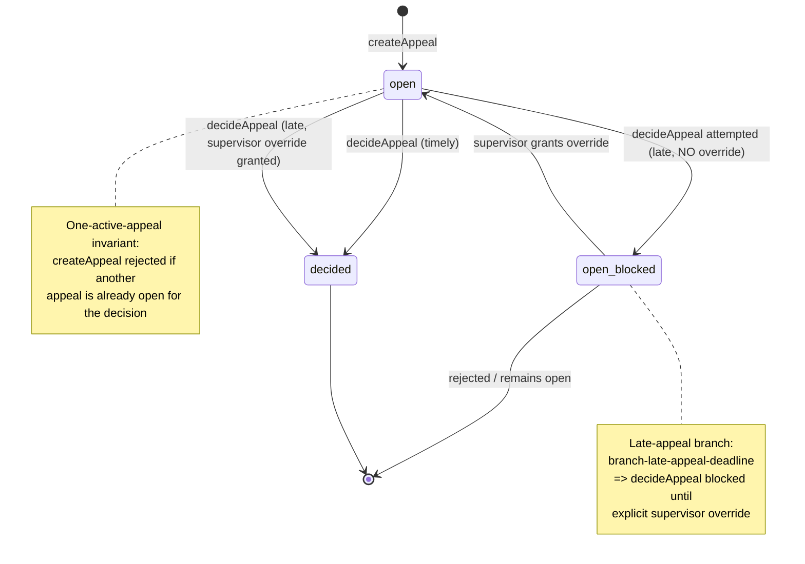
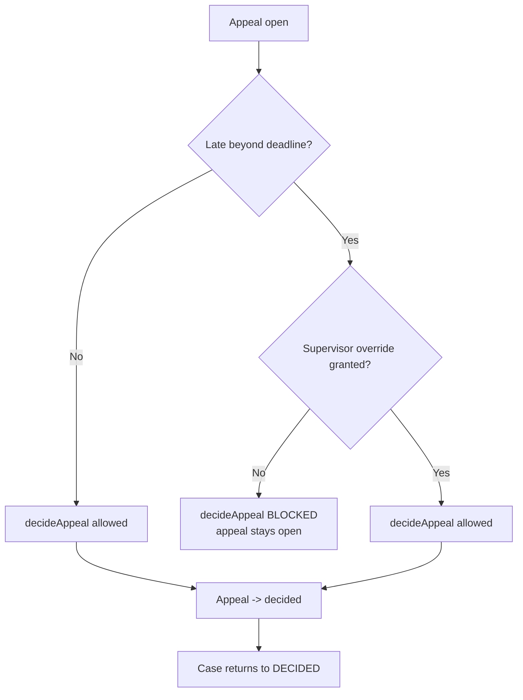

# Appeal Lifecycle

**Category:** business-domain
**Audience:** engineer, business-analyst
**Coverage tags:** `state-lifecycle`, `business-rules`, `branch-conditions`

> This page documents the `Appeal` / `AppealDecision` lifecycle: the two appeal states (`open` → `decided`), the **one-active-appeal-per-decision** invariant, the **late-appeal deadline** with its explicit supervisor-override gate, and how an appeal interacts with the `DECIDED` case/decision state. Grounded in `.docgen/evidence/domain-lifecycle.md` and `endpoint-catalog.md` and the `business.json` / `flows.json` models. The enclosing case machine is in [Case Lifecycle](./case-lifecycle.md); the decision it challenges is in [Decision Lifecycle](./decision-lifecycle.md).

---

## At a Glance (for newcomers)

An appeal is the mechanism by which a published decision is challenged. The lifecycle is deliberately simple:

- An appeal is created against a decision and starts `open`.
- At most **one** appeal may be `open` for a given decision at any time.
- If the appeal is **late** (filed after the deadline), it can only be **decided** after a supervisor grants an explicit deadline override.
- Deciding the appeal moves it to `decided`, and the enclosing case returns from `UNDER_APPEAL` to `DECIDED`.

Two API operations drive everything: `POST /api/v1/decisions/{decisionId}/appeals` (`createAppeal`) and `POST /api/v1/appeals/{appealId}/decide` (`decideAppeal`).

---

## Appeal States

The `Appeal` aggregate (FACT, `business.json` `lifecycle-appeal` / `concept-appeal`) has exactly two states. `AppealDecision` is the outcome recorded when the appeal leaves `open`.

| State | Meaning |
|---|---|
| `open` | Appeal created via `createAppeal`; awaiting decision. This is the **active** state counted by the one-active-appeal invariant. |
| `decided` | Terminal. The appeal has been decided via `decideAppeal`; an `AppealDecision` outcome exists. |

> Terminal state = `decided`. There is no separate "withdrawn" or "cancelled" appeal state in the modeled lifecycle; a late appeal that is never overridden simply remains `open` and cannot be decided (see below). An appeal that is in flight is what keeps a case in `UNDER_APPEAL`.

---

## Appeal State Machine

**Branch semantics (FACT, `business.json` `branch-late-appeal-deadline`):** if the appeal is late (beyond the deadline), it requires an explicit supervisor override *before* it can be decided. The `open_blocked` state is the "awaiting supervisor override" condition — it is the same persisted `open` appeal, but `decideAppeal` will be refused until the override is recorded.

---

## One-Active-Appeal Invariant

**Rule (FACT):** At most one active appeal may exist per decision (`rule-one-active-appeal`, invariant `inv-one-active-appeal`).

- **Scope:** per `decision`, not per case. A decision may have many appeals over its lifetime, but only **one** may be `open` concurrently.
- **Enforcement:** domain policy / DB uniqueness (`inv-one-active-appeal`). `createAppeal` (`POST /api/v1/decisions/{decisionId}/appeals`) is the gate.
- **Behavior when violated:** a second `createAppeal` for a decision that already has an `open` appeal is rejected — the appeal stays `open` and the new creation fails (a 409-style conflict is the natural mapping). The existing appeal must reach `decided` before a new one can be opened.
- **Why it matters:** the `CaseStatus` transition `DECIDED → UNDER_APPEAL` (case-lifecycle transition guard `inv-one-active-appeal`) depends on this count. More than one active appeal would make the case's `UNDER_APPEAL` posture ambiguous and would break the 1:1 appeal↔`UNDER_APPEAL` correspondence.

> This invariant is independent of lateness. A late appeal and a timely appeal are both subject to it; you cannot open a "backup" late appeal while one is already `open`.

---

## Late Appeal and Supervisor Override

**Rule (FACT):** A late appeal requires explicit supervisor override (deadline override rule) (`rule-late-appeal-supervisor`, `decision-appeal-deadline-override`).

The late-deadline branch is `branch-late-appeal-deadline` (FACT): *"If appeal is late, requires explicit supervisor override before it can be decided."*

### The gate — what is overridden and when

| Aspect | Timely appeal | Late appeal |
|---|---|---|
| Filed | Within deadline | Beyond deadline |
| `createAppeal` allowed? | Yes (subject to one-active-appeal) | Yes — creation is **not** blocked by lateness |
| `decideAppeal` allowed? | Yes | **No, until explicit supervisor override is recorded** |
| Who grants override | — | Supervisor (`actor-supervisor`; supervisor-jkt / supervisor unit-2) |
| Decision rendered | Directly via `decideAppeal` | Only after override present |

**Critical nuance:** lateness does **not** block *creating* the appeal — it blocks *deciding* it. A late appeal can be created and will sit `open` (and counts against the one-active-appeal invariant), but `decideAppeal` (`POST /api/v1/appeals/{appealId}/decide`) is refused until a supervisor has granted the deadline override. The override is the precondition for the `decideAppeal` transition on the late path, not for `createAppeal`.

### Late-appeal decision flow

This mirrors the appeal subprocess (`flows.json` `bf-appeal-subprocess`): "late appeal requires supervisor override; appeal decided → case returns to DECIDED (or correction path)."

---

## Interaction with DECIDED State

An appeal exists *because* a decision was published and the case reached `DECIDED`. Its lifecycle is tightly coupled to the case and decision machines.

### Case-level transitions (FACT, `lifecycle-case`)

| Transition | Trigger | Guard |
|---|---|---|
| `DECIDED → UNDER_APPEAL` | appeal submitted | ≤ 1 active appeal per decision (`inv-one-active-appeal`) |
| `UNDER_APPEAL → DECIDED` | appeal decided | `decideAppeal` |

- When an appeal is created against a published decision, the enclosing `CaseRecord` moves `DECIDED → UNDER_APPEAL`.
- When the appeal is decided (`decideAppeal`, including the late+override path), the case moves `UNDER_APPEAL → DECIDED`.
- If the appeal surfaces grounds for amendment rather than mere up/downholding, the case may instead follow the **correction** path (a new `Decision`/`DecisionVersion`), per [Decision Lifecycle](./decision-lifecycle.md).

### Decision immutability is preserved

The published `Decision` remains **immutable** after appeal (`rule-published-decision-immutable`). An appeal never edits the original decision in place; it produces an `AppealDecision` outcome (and, if applicable, a correction decision). This is the same immutability contract that applies to corrections — the original published snapshot is preserved for audit (`inv-published-decision-immutable`).

### Why `DECIDED` is re-entrant via appeal

A case can move `DECIDED → UNDER_APPEAL → DECIDED` repeatedly across the lifespan of different (sequential, never concurrent) appeals, because the one-active-appeal invariant guarantees only one appeal is `open` at a time. `DECIDED` is therefore not strictly "final" until the appeal window is closed and no active appeal can be opened — a business-analyst should read `DECIDED` as "current decision stands *pending any active appeal*," not "irreversibly closed."

### Interaction with `CLOSED` / `CANCELLED`

- `ENFORCEMENT_IN_PROGRESS → CLOSED` still requires **no active sanction obligation** (`inv-no-close-active-sanction`); an `open` appeal does not by itself block `CLOSE` per the modeled rules, but a case in `UNDER_APPEAL` is not in `ENFORCEMENT_IN_PROGRESS`, so this is moot while an appeal is active.
- Any state may go to `CANCELLED` (terminal). The modeled appeal lifecycle has no explicit "cancel appeal" transition; an `open` appeal that is abandoned remains `open` and continues to count against the one-active-appeal invariant until decided.

---

## Appeal Transition → Rule Table

| Transition | Condition / branch | Rule / invariant | Endpoint |
|---|---|---|---|
| `[*] → open` | appeal created | `inv-one-active-appeal` (reject if another open for decision) | `createAppeal` (17) |
| `open → decided` (timely) | within deadline | `branch-late-appeal-deadline` = No | `decideAppeal` (18) |
| `open → decided` (late) | beyond deadline **and** supervisor override granted | `rule-late-appeal-supervisor`, `branch-late-appeal-deadline` = Yes+override | `decideAppeal` (18) |
| `open → open_blocked` (late, no override) | beyond deadline, no override | `rule-late-appeal-supervisor` (decision blocked) | `decideAppeal` (18) refused |
| `open_blocked → open` | supervisor grants override | `decision-appeal-deadline-override` | supervisor action |
| `decided → [*]` | terminal | `lifecycle-appeal` terminal = `decided` | — |
| `DECIDED → UNDER_APPEAL` (case) | appeal submitted | `inv-one-active-appeal` | `createAppeal` (17) |
| `UNDER_APPEAL → DECIDED` (case) | appeal decided | `decideAppeal` | `decideAppeal` (18) |

> Endpoint numbers reference `endpoint-catalog.md` (17 = `createAppeal`, 18 = `decideAppeal`). `actor-appeal-officer` (appeal-jkt) creates/decides; `actor-supervisor` (supervisor-jkt) grants the late-appeal override.

---

## Deep Reference: Evidence-Backed Facts

- **Aggregate presence (FACT):** `Appeal` (+ `AppealDecision`) is a first-class aggregate (`domain-lifecycle.md`, package layout).
- **Invariant enforcement (FACT):** `inv-one-active-appeal` → "domain policy / DB uniqueness"; `inv-published-decision-immutable` → "domain policy"; `rule-late-appeal-supervisor` → evidence `domain-lifecycle.md` + `endpoint-catalog.md`.
- **Branch conditions (FACT):**
  - `branch-appeal-submitted`: gateway to enter `UNDER_APPEAL` when an appeal exists for a decision.
  - `branch-late-appeal-deadline`: late appeal beyond deadline ⇒ requires explicit supervisor override before it can be decided.
- **Flows (FACT, `flows.json`):**
  - `bf-appeal-subprocess`: DECIDED → create appeal (one active per decision) → appeal open → decide → late appeal requires supervisor override → appeal decided → case returns to DECIDED (or correction path).
  - `ef-appeal-lifecycle` (`appeal.lifecycle.v1`): outbox event, key = `aggregateId`, inbox idempotency `UNIQUE(consumer_name, event_id)` ⇒ at most one side effect per consumer per event.
- **Maker-checker context:** appeals are decided by `actor-appeal-officer`; the decision-approval maker≠approver separation is a *different* invariant (`decision-decision-approval-maker-not-approver`) and does not apply to `decideAppeal` itself, but the domain-wide separation-of-duties principle is consistent.

---

## Caveats and Known Gaps

- **Lateness definition not specified in evidence.** The *deadline* value and how "late" is computed are not present in the cited evidence; only the gate (override-required-before-decide) is a FACT. Treat the deadline value as configurable/unknown.
- **Override mechanics not specified.** The exact endpoint/field by which a supervisor records the override is not detailed in `endpoint-catalog.md`; only that the supervisor actor (`actor-supervisor`) can grant it (`decision-appeal-deadline-override`).
- **No appeal "withdraw/cancel" transition** is modeled; an `open` appeal that is never decided persists and blocks new appeals under the one-active-appeal invariant.
- **Enforcement-monitoring gap (FACT, `PROJECT_STATUS.md`):** later-state prerequisites are lighter than master target; `PhaseSevenCaseProgressionGuard` deepens appeal prerequisites but documented gaps remain.

---

## Cross-links

- [Case Lifecycle](./case-lifecycle.md) — `DECIDED ↔ UNDER_APPEAL` transitions and the one-active-appeal guard.
- [Decision Lifecycle](./decision-lifecycle.md) — published-decision immutability and the correction-vs-appeal distinction.
- [Business Rules](../business-rules.md) — full business-rule catalog (`rule-one-active-appeal`, `rule-late-appeal-supervisor`).
- [Branch Conditions](../branch-conditions.md) — gateway catalog including `branch-appeal-submitted` and `branch-late-appeal-deadline`.
