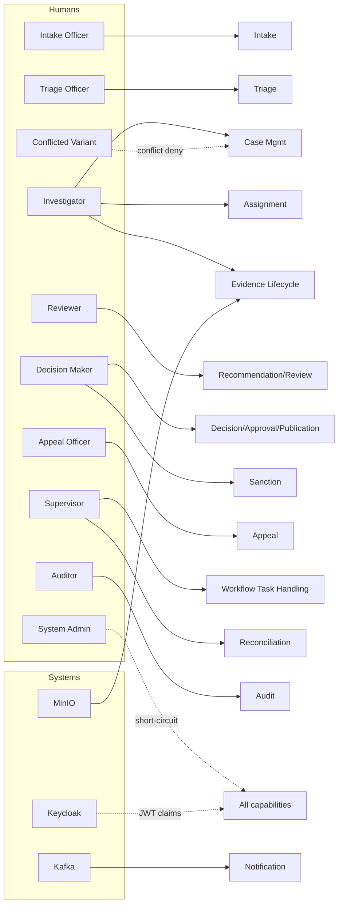
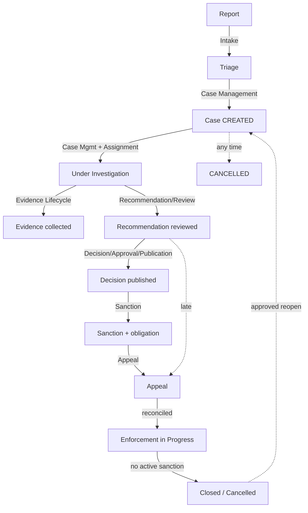

# Business Overview

**Category:** business-domain
**Audience:** engineer, product, business-analyst, architect
**Coverage tags:** `business-domain`, `business-rules`

> This page introduces the Sentinel Enforcement Platform's enforcement domain: the problem space, the human and system actors (including the Kafka, MinIO, and Keycloak integrations), the 13 platform capabilities from intake through notification, and a primer on the domain glossary. It maps each capability to the owning module so product and engineering readers can locate the implementation.

---

## Problem Space

The Sentinel Enforcement Platform is a regulatory enforcement case-management system. Agencies receive **reports** of potential violations, triage them, open **cases**, investigate, recommend and decide actions, impose **sanctions**, handle **appeals**, enforce outcomes, and notify interested parties. The platform must guarantee:

- **Integrity** — evidence objects carry immutable SHA-256 digests; published decisions are immutable.
- **Separation of duties** — maker/checker on recommendations and decisions; sanction changer cannot also approve.
- **Authorization depth** — role alone never grants case access; jurisdiction, classification, conflict-of-interest, assigned-unit, and direct-assignment checks all apply.
- **Auditability** — append-only audit events; at most one side effect per consumed message.

The platform is a Java/Jakarta EE **modular monolith** (10 Maven modules, explicit bounded contexts; not microservices). External dependencies: PostgreSQL 18.3, Camunda 7.24 (embedded), Kafka (KRaft), Redis, MinIO, Keycloak. State of truth lives in the domain; Camunda is orchestration only (ADR-002).

---

## Actors and Roles

The model enumerates 13 actor entries: 10 human roles (including a conflicted-variant test role) and 3 external systems.

### Actor table with default seeded users

| Actor ID | Name | Type | Default seeded users | Primary capability gate |
|---|---|---|---|---|
| `actor-intake-officer` | Intake Officer | human-role | `intake-jkt`, `intake-bdg` | `createReport` |
| `actor-triage-officer` | Triage Officer | human-role | `triage-jkt`, `triage-bdg` | `triageReport` |
| `actor-investigator` | Investigator | human-role | `investigator-jkt` | investigation + approved investigation report (gates `PENDING_DECISION`) |
| `actor-reviewer` | Reviewer | human-role | `reviewer-jkt` | `reviewRecommendation` |
| `actor-decision-maker` | Decision Maker | human-role | `decision-jkt` | `createDecision` / `approveDecision` / `publishDecision` (maker ≠ approver) |
| `actor-appeal-officer` | Appeal Officer | human-role | `appeal-jkt` | `createAppeal` / `decideAppeal` (deadline override) |
| `actor-supervisor` | Supervisor | human-role | `supervisor-jkt` (+ `supervisor-jkt-unit-2`) | workflow-reconciliation + late-appeal override |
| `actor-auditor` | Auditor | human-role | `auditor-jkt` | read-only audit/case history (no mutation) |
| `actor-system-admin` | System Admin | human-role | `system-admin` | `SYSTEM_ADMIN` short-circuits all checks |
| `actor-conflicted-variant` | Conflicted Actor Variant | human-role | `+conflicted` variants | verifies conflict-of-interest denial |
| `actor-kafka` | Kafka (Message Broker) | external-system | n/a | receives outbox events, delivers `notification.result.v1`, retry/DLQ routing |
| `actor-minio` | MinIO (Object Storage) | external-system | n/a | evidence object store behind presigned URLs |
| `actor-keycloak` | Keycloak (Identity Provider) | external-system | n/a | issues JWTs (realm `sentinel`); supplies claims `jurisdictions`, `assigned_units`, `case_classifications`, `conflicted_actor_ids` |

> All dummy local-only accounts share password `sentinel`. The Keycloak issuer is `http://localhost:{KEYCLOAK_PORT}/realms/sentinel`; the app verifies signature/issuer/audience/expiry/not-before/required claims via JWKS (no unsigned decode).

### Actor → capability matrix (flowchart)

---

## Capabilities Overview

The platform exposes **13 capabilities**. Eleven are owned by `sentinel-application`, one (`cap-workflow-task-handling` + `cap-reconciliation`) by `sentinel-workflow`, `cap-audit` by `sentinel-persistence`, and `cap-notification` by `sentinel-messaging`. (Capability ownership is a model attribute; see the table below — several cross module boundaries.)

1. **Intake / Report** — create/read reports; gate to triage.
2. **Triage** — move a report to `TRIAGED` (optimistic lock); prerequisite for case creation.
3. **Case Management** — create/list/read cases (starts Camunda), transition per policy with optimistic locking.
4. **Assignment** — assign units/individuals (optimistic lock + audit); supports assigned-unit scope.
5. **Evidence Lifecycle** — upload sessions, immutable SHA-256 versions, download sessions with audit; protects referenced-by-published-decision evidence.
6. **Recommendation / Review** — create, submit (maker-checker), review.
7. **Decision / Approval / Publication** — create, approve (maker ≠ approver), publish (immutable thereafter).
8. **Sanction** — define sanctions/obligations; active obligation blocks `CLOSE`; changer ≠ approver.
9. **Appeal** — create/decide appeals (one active per decision; late appeal needs supervisor override).
10. **Workflow Task Handling** — list/claim/complete Camunda tasks (cursor paging, 409 on conflict, idempotent complete).
11. **Reconciliation** — detect/repair/terminate domain-workflow mismatches (supervisor-scoped).
12. **Audit** — append-only `audit_event`; expose case audit (cursor paged); audit sensitive download denials.
13. **Notification** — emit `notification.command.v1` outbox; consume `notification.result.v1` (≤ 1 side effect/consumer).

### Capability pipeline from intake to closure (flowchart)

---

## Domain Glossary Primer

A short primer; the authoritative definitions live in [Glossary](../glossary.md) and [Conceptual Model](./conceptual-model.md).

| Term | One-line meaning |
|---|---|
| **Report** | Intake aggregate; must be triaged before a case can be created from it. |
| **CaseRecord** | Core enforcement case with status, assignments, status history, audit. |
| **CaseStatus** | The 10-state enum; terminal = `CLOSED`/`CANCELLED`. |
| **EvidenceVersion** | Immutable evidence version with SHA-256. |
| **Recommendation** | Proposed action; draft → submitted → reviewed (maker-checker). |
| **Decision / DecisionVersion** | draft → approved → published; immutable after publish. |
| **Sanction / SanctionObligation** | Obligation that blocks `CLOSE` while active. |
| **Appeal / AppealDecision** | At most one active per decision; late needs supervisor override. |
| **OutboxEvent / InboxEvent** | Transactional outbox / idempotency dedup (`UNIQUE(consumer_name, event_id)`). |
| **WorkflowInstance** | Correlation row linking `caseId` to a Camunda process instance. |
| **BusinessKey** | `caseId` used as Camunda business key. |
| **JurisdictionCode** | e.g. `jkt`/`bdg`; gating access and evidence object key path. |
| **CaseClassification** | Clearance-tagged classification gating access. |
| **AssignedUnit** | Unit-scope assignment enforced via `enforceAssignedUnitScope`. |

---

## How Capabilities Map to Modules

### Capability → owning module table

| Capability ID | Capability | Owning module | Notes |
|---|---|---|---|
| `cap-intake` | Intake / Report | `sentinel-application` | `createReport`, `getReport` |
| `cap-triage` | Triage | `sentinel-application` | `triageReport` (optimistic lock) |
| `cap-case-management` | Case Management | `sentinel-application` | `createCase` starts Camunda |
| `cap-assignment` | Assignment | `sentinel-application` | assigned-unit scope |
| `cap-evidence-lifecycle` | Evidence Lifecycle | `sentinel-application` | delegates to `sentinel-storage` (MinIO) |
| `cap-recommendation-review` | Recommendation / Review | `sentinel-application` | maker-checker |
| `cap-decision-approval-publication` | Decision / Approval / Publication | `sentinel-application` | immutable after publish |
| `cap-sanction` | Sanction | `sentinel-application` | active obligation blocks `CLOSE` |
| `cap-appeal` | Appeal | `sentinel-application` | deadline override via supervisor |
| `cap-workflow-task-handling` | Workflow Task Handling | `sentinel-workflow` | Camunda user tasks |
| `cap-reconciliation` | Reconciliation | `sentinel-workflow` | supervisor-scoped |
| `cap-audit` | Audit | `sentinel-persistence` | `audit_event` table (release 0002) |
| `cap-notification` | Notification | `sentinel-messaging` | outbox + inbox, 8 topics |

> Module layering invariant (FACT): `domain ← application ← api`; domain has no infrastructure deps. `sentinel-application` depends (port-adapter) on persistence, messaging, storage, workflow, security. See [Conceptual Model](./conceptual-model.md) for entity detail and [Security / Authorization](../security/security-authorization.md) for the access policy.

---

## Cross-links

- [Conceptual Model](./conceptual-model.md) — core domain entities and relationships.
- [Case Lifecycle and State Machine](./case-lifecycle.md) — the 10-state `CaseStatus` machine.
- [Security / Authorization](../security/security-authorization.md) — role + jurisdiction + classification + conflict + unit + direct-assignment policy.
- [Glossary](../glossary.md) — authoritative term definitions.
