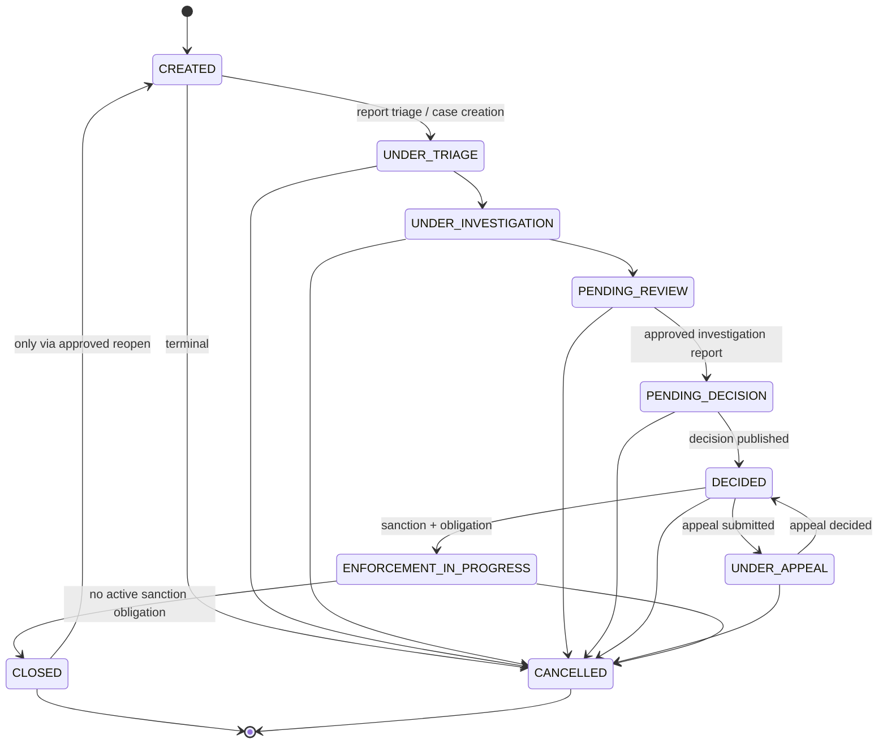

# Case Lifecycle and State Machine

**Category:** business-domain
**Audience:** engineer, architect, business-analyst
**Coverage tags:** `state-lifecycle`, `business-rules`, `business-domain`

> This page documents the `CaseRecord` state machine: the 10 `CaseStatus` values, the allowed transitions, the transition guards/prerequisites, the key invariants, and the progression-guard implementations. Grounded in `.docgen/evidence/domain-lifecycle.md`, `data-schema.md`, `endpoint-catalog.md` and the `business.json` / `system.json` / `flows.json` models. The decision-level machine is in [Decision Lifecycle](./decision-lifecycle.md).

---

## State Enumeration

`CaseStatus` (FACT, `CaseStatus.java`):

| State | Meaning |
|---|---|
| `CREATED` | Case opened from a triaged report; Camunda process started. |
| `UNDER_TRIAGE` | Being triaged. |
| `UNDER_INVESTIGATION` | Active investigation; evidence collected. |
| `PENDING_REVIEW` | Investigation complete; pending recommendation review. |
| `PENDING_DECISION` | Recommendation reviewed; awaiting decision. **Requires approved investigation report.** |
| `DECIDED` | Decision published. |
| `UNDER_APPEAL` | An appeal is active for the decision. |
| `ENFORCEMENT_IN_PROGRESS` | Sanction being enforced. |
| `CLOSED` | Terminal. Cannot change except via approved reopen. |
| `CANCELLED` | Terminal. Any state may cancel. |

`isTerminal()` ⇒ `CLOSED` or `CANCELLED`.

---

## Allowed Transitions

---

## Transition Guards and Prerequisites

`transitionCase` (`POST /api/v1/cases/{caseId}/transitions`) applies the state-transition policy **plus** optimistic locking (`version` guard → 409). Guards may be supplied by `CaseProgressionGuard`; `PhaseSevenCaseProgressionGuard` deepens later-state prerequisites (recommendation/review/decision/sanction/appeal).

### Transition -> precondition -> guard table

| From → To | Precondition | Guard / enforcement |
|---|---|---|
| → `UNDER_TRIAGE` | Source report triaged | `CaseProgressionGuard` (state policy) |
| `UNDER_TRIAGE` → `UNDER_INVESTIGATION` | — | state policy |
| `UNDER_INVESTIGATION` → `PENDING_REVIEW` | investigation report exists | `PhaseSevenCaseProgressionGuard` |
| `PENDING_REVIEW` → `PENDING_DECISION` | **approved investigation report** | transition guard (inv-pending-decision-requires-report) |
| `PENDING_DECISION` → `DECIDED` | decision published | state policy |
| `DECIDED` → `UNDER_APPEAL` | appeal submitted (≤ 1 active per decision) | inv-one-active-appeal |
| `UNDER_APPEAL` → `DECIDED` | appeal decided | `decideAppeal` |
| `DECIDED` → `ENFORCEMENT_IN_PROGRESS` | sanction + obligation defined | `PhaseSevenCaseProgressionGuard` |
| `ENFORCEMENT_IN_PROGRESS` → `CLOSED` | **no active sanction obligation** | inv-no-close-active-sanction |
| `CLOSED` → `CREATED` | **approved reopen** only | inv-closed-immutability |
| any → `CANCELLED` | — (terminal) | state policy |

---

## Key Invariants

- **Closed immutability** — a `CLOSED` case cannot change state except via an approved reopen (`rule-closed-immutability`).
- **Pending-decision gate** — cannot enter `PENDING_DECISION` unless the investigation report has been approved (`rule-pending-decision-gate`).
- **No close with active sanction** — cannot `CLOSE` while an active `SanctionObligation` exists (`rule-no-close-with-active-sanction`).
- **Maker-checker separation** — recommendation author ≠ final approver; sanction changer ≠ approver of same change (`rule-maker-checker-recommendation`, `rule-sanction-changer-not-approver`).
- **Evidence integrity** — evidence referenced by a published decision cannot be deleted; every `EvidenceVersion` has immutable SHA-256; sensitive download emits audit (incl. denied) (`rule-evidence-published-decision-protected`, `rule-evidence-sha256-immutable`, `rule-sensitive-download-audit`).
- **Published decision immutability** — later change only via correction/appeal (`rule-published-decision-immutable`).
- **One active appeal** — at most one active appeal per decision; late appeal needs supervisor override (`rule-one-active-appeal`, `rule-late-appeal-supervisor`).
- **One side effect per event** — `UNIQUE(consumer_name, event_id)` idempotency (`rule-one-side-effect-per-event`).
- **Role insufficient for access** — jurisdiction/classification/conflict/unit/direct-assignment checks apply (`rule-role-insufficient-for-access`).

> Known gaps (FACT, `PROJECT_STATUS.md`): enforcement-monitoring detail is incomplete; later-state prerequisites are lighter than master target; Redis usage is UNKNOWN in evidence.

---

## Progression Guard Implementations

- **`CaseProgressionGuard`** — functional interface with a `NO_OP` default. Early pipeline states use the no-op guard; later states depend on a configured guard.
- **`PhaseSevenCaseProgressionGuard`** — deepens later-state prerequisites covering recommendation, review, decision, sanction, and appeal (e.g., the `PENDING_REVIEW → PENDING_DECISION` approved-investigation-report gate, and the active-sanction block on `CLOSE`).

> Implementation note: documented gaps remain for enforcement-monitoring detail; `PhaseSevenCaseProgressionGuard` deepens prerequisites but not all master-target checks are present.

---

## Status History and Audit

Every status transition is appended to `case_status_history` (release 0002) and exposed cursor-paged via `GET /api/v1/cases/{caseId}/audit-events` (`getCaseAuditEvents`). `audit_event` is append-only and exempt from optimistic-lock version churn. All status-changing requests run under the `transitionCase` transaction with the `version` guard; a stale `version` yields 409 `CONCURRENT_MODIFICATION` and no history row is written for the rejected transition.

---

## Cross-links

- [Business Rules](../business-rules.md) — catalog of all enforced rules.
- [Decision Lifecycle](./decision-lifecycle.md) — decision/decision-version immutability.
- [Appeal Lifecycle](../appeal-lifecycle.md) — appeal subprocess and deadline override.
- [Sanction Model](../sanction-model.md) — obligation blocking `CLOSE`.
- [Conceptual Model](./conceptual-model.md) — `CaseRecord` aggregate and related entities.
