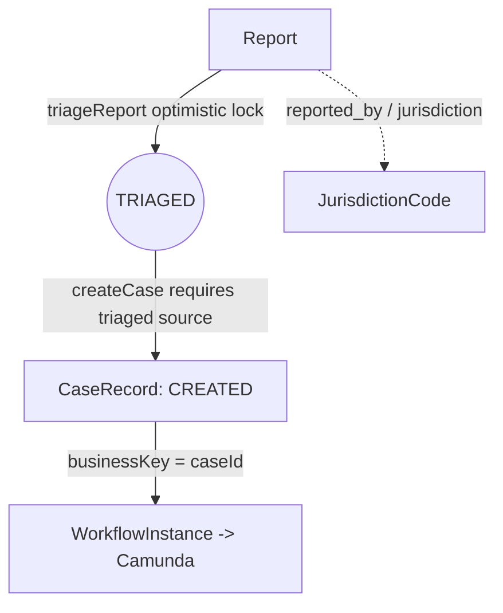
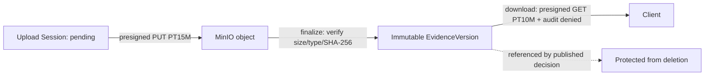

# Conceptual Model

**Category:** business-domain
**Audience:** engineer, architect, business-analyst
**Coverage tags:** `business-domain`, `data-model`

> This page explains the core domain entities of the Sentinel Enforcement Platform and how they relate. It is grounded in `.docgen/evidence/domain-lifecycle.md`, `data-schema.md`, `authorization-model.md`, `evidence-storage.md` and the `business.json` / `system.json` models. The state machines themselves are documented in [Case Lifecycle](./case-lifecycle.md) and [Decision Lifecycle](./decision-lifecycle.md).

---

## Core Aggregates

The domain is organized around the following aggregates (FACT, package layout):

| Aggregate | Key members | Origin evidence |
|---|---|---|
| **Report** | id, title, description, `jurisdiction_code`, `reporter_name`, status, version | `domain-lifecycle`, `data-schema` |
| **CaseRecord** | `CaseStatus`, `CaseAssignment`, `CaseStatusHistoryEntry`, `AuditEvent` | `domain-lifecycle`, `data-schema` |
| **Evidence** | `EvidenceVersion`, `EvidenceUploadSession` | `domain-lifecycle`, `evidence-storage` |
| **Recommendation** | `Review` | `domain-lifecycle`, `data-schema` |
| **Decision** | `DecisionVersion` | `domain-lifecycle`, `data-schema` |
| **Sanction** | `SanctionObligation` | `domain-lifecycle`, `data-schema` |
| **Appeal** | `AppealDecision` | `domain-lifecycle`, `data-schema` |

Supporting messaging/correlation aggregates: `OutboxEvent`, `InboxEvent`, `WorkflowInstance`, `AuditEvent`.

---

## Value Objects and Identifiers

- **Identifiers** — every transactional table uses a **UUID PK**, plus `created_at/created_by/updated_at/updated_by/version` and `TIMESTAMPTZ` columns (FACT, foundation changelog). `version` powers optimistic locking.
- **BusinessKey** — `caseId` is used as the Camunda business key to start and correlate `regulatory-enforcement-case.bpmn`.
- **JurisdictionCode** — value such as `jkt`/`bdg`; carried on reports/cases and as a JWT claim; gates access and forms the MinIO object-key path `/{jurisdiction}/{caseId}/{evidenceId}/{version}/{generatedFileName}`.
- **CaseClassification** — clearance-tagged classification on cases; actor must hold clearance.
- **AssignedUnit** — unit-scope assignment; `enforceAssignedUnitScope` applied to unit-restricted resources; carried as JWT claim `assigned_units`.
- **SHA-256 Checksum** — client-supplied immutable integrity digest for evidence objects, verified at finalize.

---

## Relationship Between Report and Case

A **Report** is the intake aggregate. It must be **triaged** (`triageReport` → `TRIAGED`, optimistic lock) before a case can be created. `createCase` requires a triaged source report and starts the Camunda process.

> Invariant: case creation is blocked unless the source report is triaged. Triage and case creation both carry `version` for optimistic concurrency (0 rows on `UPDATE ... SET version=version+1 WHERE id AND version=expected` → 409 `CONCURRENT_MODIFICATION`).

---

## Evidence and Integrity

Evidence flows through `sentinel-storage` (`MinioEvidenceStorageAdapter`) against bucket `sentinel-evidence`. Integrity rules (FACT):

1. `POST .../evidence/upload-sessions` validates permission, creates pending metadata, returns presigned **PUT** URL (TTL `EVIDENCE_UPLOAD_URL_TTL`, default PT15M).
2. Client uploads directly to MinIO.
3. `POST .../versions/finalize` verifies object existence, size, media type, and SHA-256 (client-supplied) → activates immutable `EvidenceVersion`.
4. Checksum mismatch / missing object → 409 (`EvidenceConflictExceptionMapper`, `EvidenceObjectMissingExceptionMapper`).
5. `POST .../download-sessions` returns presigned **GET** URL (TTL `EVIDENCE_DOWNLOAD_URL_TTL`, default PT10M) and audits denied access (`EvidenceDownloadDenied`).
6. **Evidence referenced by a published decision cannot be deleted.**

> Storage unavailable → 503 (`EvidenceStorageUnavailableExceptionMapper`). Filename/media type are never trusted from client; path traversal is prevented. Every `EvidenceVersion` has an immutable SHA-256 (DB constraint / domain value object).

---

## Workflow Correlation Concepts

- **WorkflowInstance** — correlation table (release 0003) linking `caseId` (business key) to the embedded Camunda process instance.
- **Camunda** — embedded 7.24.0, `databaseSchemaUpdate=false`, migrated via `CamundaSchemaMigrator` (ADR-002). Deployments: `regulatory-enforcement-case.bpmn`, `decision-appeal-review.bpmn`.
- **Escalation** — `InvestigationEscalationDelegate` boundary timer `WORKFLOW_INVESTIGATION_ESCALATION_DURATION` (default PT30M).

> Consistency note: domain update and Camunda signal are **not** in one distributed transaction; `WorkflowReconciliationApplicationService` detects and repairs/terminates mismatches (supervisor-scoped).

---

## Authorization-Related Concepts

Grounded in `authorization-model.md` and `system.json` (`sentinel-security`). `RoleBasedAuthorizationService` (`SYSTEM_ADMIN` short-circuits) applies, in order:

1. Role → required `Permission` (25 permissions) else 403.
2. **Jurisdiction** — if context `jurisdictionCode` set and actor lacks it → denied.
3. **Classification clearance** — if `caseClassification` set and actor lacks clearance → denied.
4. **Conflict-of-interest** — if `resourceOwnerId` set and actor `isConflictedWith` owner → denied.
5. **Assigned-unit scope** — `enforceAssignedUnitScope` for unit-restricted resources.
6. **Direct assignment** — `requiresDirectAssignment` requires `actor.username() == assigneeUserId()`.

JWT claims (Keycloak, verified via JWKS): `jurisdictions`, `assigned_units`, `case_classifications`, `conflicted_actor_ids`. Denied access → 401 (no token) / 403. List filtering (`GET /api/v1/cases`, task visibility) is no looser than item GET.

---

## Concept Catalog

### Concept -> description -> evidence table

| Concept | Description | Evidence |
|---|---|---|
| Report | Intake aggregate: id/title/description/jurisdiction_code/reporter_name/status/version; must be triaged before case source. | `domain-lifecycle`, `data-schema`, `endpoint-catalog` |
| CaseRecord | Core case aggregate: status, assignments, status history, audit; lifecycle CREATED..CLOSED/CANCELLED. | `domain-lifecycle`, `data-schema` |
| CaseStatus | Enum: CREATED, UNDER_TRIAGE, UNDER_INVESTIGATION, PENDING_REVIEW, PENDING_DECISION, DECIDED, UNDER_APPEAL, ENFORCEMENT_IN_PROGRESS, CLOSED, CANCELLED; terminal = CLOSED/CANCELLED. | `domain-lifecycle`, `system.json` |
| EvidenceVersion | Immutable evidence version with SHA-256; produced only after finalize. | `domain-lifecycle`, `evidence-storage`, `data-schema` |
| SHA-256 Checksum | Client-supplied immutable integrity digest; verified at finalize; mismatch/missing → conflict. | `domain-lifecycle`, `evidence-storage` |
| Recommendation | Proposed action; draft→submitted→reviewed; maker-checker separation. | `domain-lifecycle`, `data-schema`, `endpoint-catalog` |
| Review | Review of a submitted recommendation; by reviewer actor. | `domain-lifecycle`, `data-schema`, `endpoint-catalog` |
| Decision / DecisionVersion | draft→approved→published; immutable after publish; change via correction/appeal. | `domain-lifecycle`, `data-schema`, `endpoint-catalog` |
| Sanction / SanctionObligation | Active obligation blocks CLOSE; changer ≠ approver. | `domain-lifecycle`, `data-schema` |
| Appeal / AppealDecision | One active per decision; late appeal needs supervisor override. | `domain-lifecycle`, `data-schema`, `endpoint-catalog` |
| OutboxEvent | Outbox row in same tx as business change; key=aggregateId; leased via SKIP LOCKED; PUBLISHED after Kafka deliver. | `messaging-topics`, `data-schema`, `adr-landscape` |
| InboxEvent | Idempotency record `UNIQUE(consumer_name, event_id)`; ≤ 1 side effect/consumer. | `messaging-topics`, `data-schema`, `adr-landscape` |
| WorkflowInstance | Correlation row linking `caseId` to Camunda process instance. | `workflow-camunda`, `data-schema` |
| AuditEvent | Append-only audit record (exempt from version churn); includes sensitive download denials. | `domain-lifecycle`, `data-schema`, `adr-landscape` |
| Business Key | `caseId` as Camunda business key. | `workflow-camunda` |
| Jurisdiction Code | `jkt`/`bdg`; gates access and evidence key path. | `data-schema`, `authorization-model`, `evidence-storage` |
| Case Classification | Clearance-tagged classification; actor must hold clearance. | `authorization-model`, `data-schema` |
| Assigned Unit | Unit-scope assignment; `enforceAssignedUnitScope`; JWT claim `assigned_units`. | `authorization-model`, `data-schema` |

---

## Cross-links

- [Business Overview](./business-overview.md) — actors, capabilities, glossary primer.
- [Case Lifecycle and State Machine](./case-lifecycle.md) — full `CaseStatus` state machine.
- [Data Model Overview](../architecture/data-model-overview.md) — schema and Liquibase releases.
- [Evidence Lifecycle](../architecture/evidence-lifecycle.md) — MinIO storage detail and runbook.
