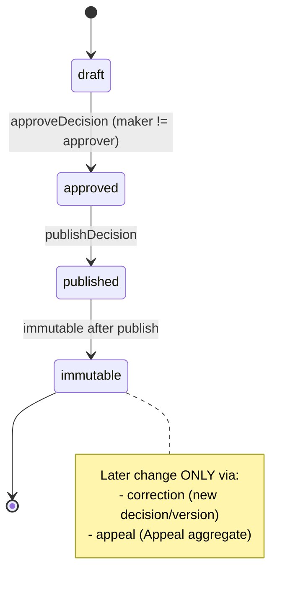

# Decision Lifecycle

**Category:** business-domain
**Audience:** engineer, business-analyst
**Coverage tags:** `state-lifecycle`, `business-rules`

> This page documents the `Decision` / `DecisionVersion` lifecycle: the draft → approved → published states, the gating on approval and publication, immutability after publication, the maker-checker separation on approval, and the distinction between **correction** and **appeal** for changing a published decision. Grounded in `.docgen/evidence/domain-lifecycle.md` and `endpoint-catalog.md` and the `business.json` model. The enclosing case machine is in [Case Lifecycle](./case-lifecycle.md).

---

## Decision States

| State | Meaning |
|---|---|
| `draft` | Created via `createDecision`; content editable by the maker. |
| `approved` | Approved via `approveDecision`; maker ≠ approver enforced. |
| `published` | Published via `publishDecision`; becomes **immutable**. |
| `immutable` | Terminal state after publication; no direct mutation. Later change only via correction or appeal. |

`DecisionVersion` carries the versioned content so each published decision is a stable, auditable snapshot.

---

## State Machine

---

## Transitions and Gating

- `draft → approved` — `POST /api/v1/decisions/{decisionId}/approve`. Gated by maker-checker: the **maker (decision creator) must not be the approver**.
- `approved → published` — `POST /api/v1/decisions/{decisionId}/publish`. After this, the decision is immutable.
- The case cannot reach `DECIDED` until a decision is published (see [Case Lifecycle](./case-lifecycle.md), `PENDING_DECISION → DECIDED`).

---

## Immutability After Publication

A **published Decision is immutable** (`rule-published-decision-immutable`). After `publishDecision`:

- Content cannot be edited in place.
- Evidence referenced by the published decision **cannot be deleted** (`rule-evidence-published-decision-protected`).
- Any later change must be expressed as a **correction** (a new decision/version) or an **appeal** (the `Appeal` aggregate), not a direct mutation.

This immutability is enforced as a domain policy; `DecisionVersion` preserves the published snapshot for audit.

---

## Maker-Checker on Approval

The approval step enforces separation of duties: the decision **maker** (creator) must not be the **approver** (`rule-maker-checker-recommendation` analog for decisions; `decision-decision-approval-maker-not-approver`). The `approveDecision` endpoint maps denial to a 4xx/403-style rejection when maker == approver. This is distinct from the recommendation maker-checker but follows the same separation principle used across the domain.

---

## Correction vs Appeal

| Aspect | Correction | Appeal |
|---|---|---|
| Trigger | Internal need to amend a published decision | External party challenges the decision |
| Mechanism | New decision / `DecisionVersion` superseding prior | `Appeal` aggregate (one active per decision) → `AppealDecision` |
| Gate | Internal workflow; still immutable-after-publish on the new version | `createAppeal` then `decideAppeal`; **late appeal needs supervisor override** (`rule-late-appeal-supervisor`) |
| Case impact | May move case to a new `DECIDED`/enforcement posture | Enters `UNDER_APPEAL`; on decision returns to `DECIDED` (or correction path) |
| Constraint | At most one active appeal per decision still applies (`rule-one-active-appeal`) | One active appeal per decision only |

> Both paths preserve immutability: the original published decision is never edited; the correction/appeal produces a new authoritative outcome.

---

## Decision Transition -> Rule Table

| Transition | Rule / guard |
|---|---|
| `draft → approved` | Maker (creator) ≠ approver (`decision-decision-approval-maker-not-approver`) |
| `approved → published` | Publication makes decision immutable (`rule-published-decision-immutable`) |
| `published → immutable` | No in-place mutation; change only via correction/appeal |
| Any change to published content | Forbidden directly; correction or appeal required |
| Associated evidence delete | Blocked if referenced by published decision (`rule-evidence-published-decision-protected`) |

---

## Cross-links

- [Case Lifecycle](./case-lifecycle.md) — `PENDING_DECISION → DECIDED` gated by published decision.
- [Appeal Lifecycle](../appeal-lifecycle.md) — appeal subprocess, deadline override.
- [Recommendation Lifecycle](../recommendation-lifecycle.md) — related maker-checker on recommendations.
- [Business Rules](../business-rules.md) — full business-rule catalog.
