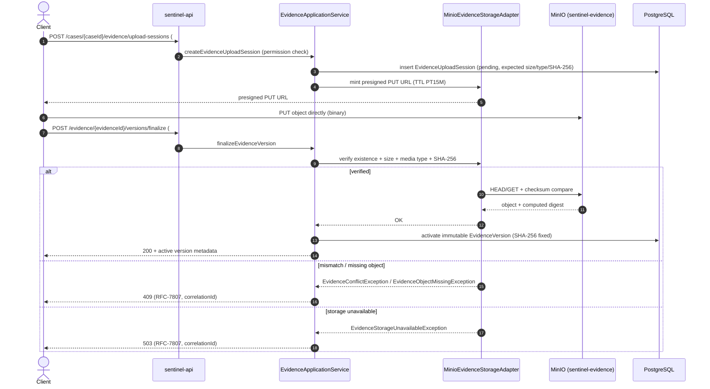

# Evidence Lifecycle

**Category:** business-domain
**Audience:** engineer, architect
**Coverage tags:** `state-lifecycle`, `business-rules`, `data-model`

> This page documents the `Evidence` lifecycle: how a **pending upload session** becomes an **immutable `EvidenceVersion`** after finalize (size/type/SHA-256 verification), the immutability and integrity guarantees of each version, the protection rule that evidence referenced by a **published decision** cannot be deleted, and how sensitive download authorization produces audit events including **denied access**. Grounded in `.docgen/evidence/evidence-storage.md`, `domain-lifecycle.md`, `data-schema.md`, `endpoint-catalog.md` and the `business.json` / `flows.json` models. The wider case machine and the decision that drives protection is in [Decision Lifecycle](./decision-lifecycle.md); the MinIO implementation detail is in the [MinIO Evidence Storage Runbook](../runbooks/minio-evidence-storage.md).

---

## Evidence States

The `Evidence` aggregate (FACT, `lifecycle-evidence` in `business.json`) has exactly two lifecycle positions: a mutable-intent **pending** stage and a terminal **immutable** stage.

| State | Meaning |
|---|---|
| `pending` (upload session metadata) | A `EvidenceUploadSession` record exists with client-supplied expected size/media type/SHA-256, but no verified object/version. The MinIO object may or may not be present yet. |
| `immutable EvidenceVersion` (after finalize) | Finalize verified object existence, size, media type, and SHA-256 → an immutable `EvidenceVersion` is activated. No further mutation of that version is permitted. **Terminal state.** |

Terminal invariants:

- `immutable EvidenceVersion` is the only terminal state of the `lifecycle-evidence` model; there is no "deleted" state — deletion is refused rather than modeled as a state (see [Published-Decision Protection](#published-decision-protection)).
- Every `EvidenceVersion` carries an **immutable SHA-256** (`rule-evidence-sha256-immutable`, `inv-evidence-sha256-immutable`). The digest is a domain value object / DB constraint, not a mutable field.

The `Evidence` aggregate is composed of `EvidenceVersion` and `EvidenceUploadSession` members (`domain-lifecycle` package layout). `getEvidence` (`GET /api/v1/evidence/{evidenceId}`, endpoint #20) returns the active metadata plus the latest version.

---

## State Machine

```mermaid
stateDiagram-v2
    [*] --> pending : createEvidenceUploadSession (#19)
    note right of pending
        Pending upload-session metadata.
        Client-supplied expected size,
        media type, SHA-256.
        Presigned PUT URL (TTL PT15M).
    end note
    pending --> immutable_EvidenceVersion : finalizeEvidenceVersion (#21)
verify size/type/SHA-256
    note right of immutable_EvidenceVersion
        Immutable EvidenceVersion.
        SHA-256 fixed (DB constraint / VO).
        Terminal state.
        Referenced-by-published-decision
        => deletion blocked.
    end note
    pending --> [*] : session discarded / fresh retry
    immutable_EvidenceVersion --> [*]
    immutable_EvidenceVersion --> immutable_EvidenceVersion : new version via new upload session
```

> A "new version" is produced by opening a fresh upload session for the same `evidenceId`, not by mutating the prior `EvidenceVersion`. Each version is independently immutable.

---

## Upload Session and Finalize

The upload/finalize flow is a two-step, client-presigned pattern implemented by `MinioEvidenceStorageAdapter` (`sentinel-storage`) against bucket `sentinel-evidence` (default; env `MINIO_EVIDENCE_BUCKET`). This is `uc-evidence-upload-session` + `uc-finalize-evidence` + `rf-evidence-finalize` in the models.

**Step-by-step (FACT, `evidence-storage.md` upload flow + `endpoint-catalog.md`):**

1. `POST /api/v1/cases/{caseId}/evidence/upload-sessions` (#19) — validates permission, creates **pending** metadata, returns a presigned **PUT** URL. TTL `EVIDENCE_UPLOAD_URL_TTL` (default **PT15M**).
2. Client uploads the object **directly to MinIO** using the presigned PUT URL. The application is not in the data path.
3. `POST /api/v1/evidence/{evidenceId}/versions/finalize` (#21) — `EvidenceApplicationService` (via storage adapter) **verifies object existence, size, media type, and SHA-256 checksum** (the client-supplied value captured at session creation). On success it activates an immutable `EvidenceVersion`.
4. `GET /api/v1/evidence/{evidenceId}` (#20) — returns active metadata + latest version.
5. Download is a separate concern — see [Download Authorization and Audit](#download-authorization-and-audit).

**Reject paths (FACT, `rule-checksum-mismatch-reject`, `inv-checksum-mismatch-reject`):**
- **Checksum mismatch** or **missing object** → 409 conflict, mapped by `EvidenceConflictExceptionMapper` / `EvidenceObjectMissingExceptionMapper`.
- **Storage unavailable** → 503, mapped by `EvidenceStorageUnavailableExceptionMapper`.
- The runbook also documents rejection of **expired session**, **stale upload session**, and **wrong `Content-Type`** at finalize.

**Trust boundaries (FACT):** filename and media type are **never trusted from the client**; path traversal is prevented. The MinIO object-key pattern is `/{jurisdiction}/{caseId}/{evidenceId}/{version}/{generatedFileName}` — `jurisdiction` derives from the case/JWT claim (`concept-jurisdiction-code`), not from client input.



> Concurrency note: evidence metadata tables carry `version` and follow the optimistic-locking write path (`UPDATE ... SET version=version+1 WHERE id=#{id} AND version=#{expectedVersion}`; 0 rows → 409 `CONCURRENT_MODIFICATION`, `data-schema.md`). Finalize is a single business transaction that activates the version and writes the `evidence.lifecycle.v1` outbox event in the same DB tx.

---

## SHA-256 Integrity

The SHA-256 is a **client-supplied, immutable integrity digest** (`concept-sha256`, `rule-evidence-sha256-immutable`):

- Captured at **upload-session creation** as the expected checksum.
- **Verified at finalize** against the object MinIO actually stored. Mismatch → 409 reject (`rule-checksum-mismatch-reject`, `inv-checksum-mismatch-reject`).
- Once an `EvidenceVersion` is activated, its SHA-256 is **fixed** (DB constraint / domain value object, `inv-evidence-sha256-immutable`). It cannot be edited or re-pointed.
- Used downstream as the canonical integrity reference for audit and for the protection rule below.

**Why client-supplied + server-verified:** the client computes the digest over the exact bytes it intends to store and submits it with the session; the server independently recomputes the digest from the stored object at finalize. The two must match for the version to become immutable, so tampering or transport corruption is detected rather than trusted.

| Property | Value (FACT) |
|---|---|
| Digest algorithm | SHA-256 |
| Supplied at | `createEvidenceUploadSession` (upload-session metadata) |
| Verified at | `finalizeEvidenceVersion` against stored object |
| On mismatch | 409 conflict (`EvidenceConflictExceptionMapper` / `EvidenceObjectMissingExceptionMapper`) |
| Mutability after finalize | Immutable (DB constraint / value object) |
| Object key | `/{jurisdiction}/{caseId}/{evidenceId}/{version}/{generatedFileName}` |

---

## Published-Decision Protection

**Business rule (FACT):** *Evidence referenced by a published decision cannot be deleted.* (`rule-evidence-published-decision-protected`, `inv-evidence-referenced-protected`).

Enforcement is at the **domain-policy** layer (`domain-lifecycle.md` invariants; `EvidenceApplicationService`). The trigger is the decision lifecycle: a `Decision` becomes **immutable** after `publishDecision` (`rule-published-decision-immutable`), and any evidence it references is then pinned against deletion.

- This is consistent with the decision immutability model: a published decision is never edited in place, and the evidence it relies on must remain retrievable and intact for the published record to be auditable.
- The lifecycle state machine deliberately has **no deletion transition** — a referenced, immutable `EvidenceVersion` is retained. Deletion is *refused* rather than modeled as a state.
- Scope is **referenced-by-published-decision**. Evidence not referenced by any published decision is not subject to this block; the evidence deletion/retention policy outside that scope is not specified in current evidence (see [Unknowns](#unknowns-and-gaps)).

| Situation | Can the EvidenceVersion be deleted? |
|---|---|
| Referenced by a **published** decision | **No** — blocked by domain policy (`rule-evidence-published-decision-protected`). |
| Referenced only by a draft/approved (not yet published) decision | Not protected by this rule (publication is the immutability trigger). |
| Not referenced by any decision | Outside this rule's scope; deletion behavior unspecified in evidence. |
| Immutable version, no decision reference | No "deleted" state exists; see note above. |

> See [Decision Lifecycle](./decision-lifecycle.md) for the `draft → approved → published → immutable` machine and the maker-checker gate that precedes publication.

---

## Download Authorization and Audit

Sensitive evidence download is **authorization-gated and audited** (FACT, `rule-sensitive-download-audit`, `inv-...` analog; `cap-audit`; `uc-download-session`).

**Flow (`evidence-storage.md` step 6 + `endpoint-catalog.md` #22):**
1. `POST /api/v1/evidence/{evidenceId}/download-sessions` (#22) — enforces authorization, then returns a presigned **GET** URL. TTL `EVIDENCE_DOWNLOAD_URL_TTL` (default **PT10M**).
2. The client downloads directly from MinIO using the presigned GET URL.
3. **Audit is emitted regardless of outcome**: an `AuditEvent` is written, including **denied access** as `EvidenceDownloadDenied`.

**Authorization context (FACT, `authorization-model` summarized in `conceptual-model.md`):** `RoleBasedAuthorizationService` (`SYSTEM_ADMIN` short-circuits) evaluates, in order: role → required `Permission`; then **jurisdiction** (`jurisdictionCode` claim), **classification clearance** (`caseClassification`), **conflict-of-interest** (`isConflictedWith`), **assigned-unit scope** (`enforceAssignedUnitScope`), and **direct assignment**. A denied request returns `403` (or `401` when no token) and writes `EvidenceDownloadDenied`. Note `rule-role-insufficient-for-access`: **holding a role alone does not grant access** — the additional checks must pass.

**Audit model (FACT):**
- `audit_event` is **append-only** and **exempt from optimistic-lock version churn** (`data-schema.md`; ADR-010). Denied sensitive downloads are recorded as `EvidenceDownloadDenied`.
- The `evidence.lifecycle.v1` outbox event (`eventFlows` `ef-evidence-lifecycle`) is emitted for lifecycle changes and is delivered with `UNIQUE(consumer_name, event_id)` idempotency (`rule-one-side-effect-per-event`).
- Storage unavailable during download-session creation → 503 (`EvidenceStorageUnavailableExceptionMapper`).

| Download action | Outcome | Audit / response |
|---|---|---|
| Authorized | Presigned GET URL (TTL PT10M) returned | Audit event (granted) |
| Unauthorized (no/wrong role, jurisdiction, clearance, conflict, unit, assignment) | Denied | **`EvidenceDownloadDenied` audit event** + `403`/`401` |
| Storage unavailable | Denied | `503` (`EvidenceStorageUnavailableExceptionMapper`) |

> See the [Observability and Audit](../cross-cutting/observability.md) page for the append-only `audit_event` model (ADR-010) and structured logging/MDC (correlationId, actorId, caseId, evidenceId), and the [MinIO Evidence Storage Runbook](../runbooks/minio-evidence-storage.md) for failure triage.

---

## Evidence State → Enforcement Table

Synthesis of the `lifecycle-evidence` model, the storage adapter, and the enforced invariants.

| Evidence state | Allowed transitions | Integrity guarantee | Deletion | Audit / events |
|---|---|---|---|---|
| `pending` (upload session) | → `immutable EvidenceVersion` (finalize) · → discarded/fresh retry | Expected SHA-256/size/type stored as metadata only; **not yet verified** | Session not yet a version; no immutable artifact to protect | Upload-session creation; no download until finalized |
| `immutable EvidenceVersion` | → new version via *new* upload session (no in-place mutation) | **Verified** SHA-256 fixed (DB constraint / VO); server-recomputed at finalize | **Blocked if referenced by a published decision** (`rule-evidence-published-decision-protected`); otherwise no "deleted" state | `evidence.lifecycle.v1` outbox on finalize; `EvidenceDownloadDenied` on denied download |

---

## Data Model Reference

From `data-schema.md` (Liquibase release **0004-evidence.yaml**): the `evidence`, `evidence_version`, and `evidence_upload_session` tables. Every transactional table carries `id` (UUID PK), `created_at/created_by/updated_at/updated_by/version`, `TIMESTAMPTZ`. `evidence_version` holds the immutable SHA-256; `evidence_upload_session` holds the pending expected size/media type/checksum. `audit_event` (release 0002) is the append-only sink for download denials.

Persistence ownership for the evidence flow (`flows.json` `df-evidence-presign`): `sentinel-storage` (`MinioEvidenceStorageAdapter`) + `sentinel-application`, persisting to `evidence`/`evidence_version`/`evidence_upload_session` (release 0004) and the MinIO bucket `sentinel-evidence`.

---

## Unknowns and Gaps

From `business.json` `unknowns` and `domain-lifecycle.md`:
- **Enforcement-monitoring detail is incomplete** (`unknown-enforcement-monitoring`): the precise monitoring/alerting around evidence protection is not fully specified in current evidence.
- **Later-state prerequisites lighter than target** (`unknown-later-state-prerequisites`): `PhaseSevenCaseProgressionGuard` deepens later-state prerequisites but gaps remain.
- **Evidence deletion outside the published-decision scope** is not defined in evidence: the protection rule is specifically keyed to *referenced-by-published-decision*; retention/disposal of unreferenced evidence is unspecified.

---

## Cross-links

- [MinIO Evidence Storage Runbook](../runbooks/minio-evidence-storage.md) — upload/finalize/download failure triage, TTLs, conflict symptoms.
- [Conceptual Model](./conceptual-model.md) — Evidence aggregate, SHA-256 VO, authorization concepts.
- [Business Rules and Invariants](../business-logic/business-rules.md) — full rule/invariant catalog (`rule-evidence-published-decision-protected`, `rule-evidence-sha256-immutable`, `rule-sensitive-download-audit`, `rule-checksum-mismatch-reject`).
- [Observability and Audit](../cross-cutting/observability.md) — append-only `audit_event` (ADR-010), MDC/correlationId, `EvidenceDownloadDenied` logging.
- [Decision Lifecycle](./decision-lifecycle.md) — the published-decision immutability that drives the deletion-protection rule.
