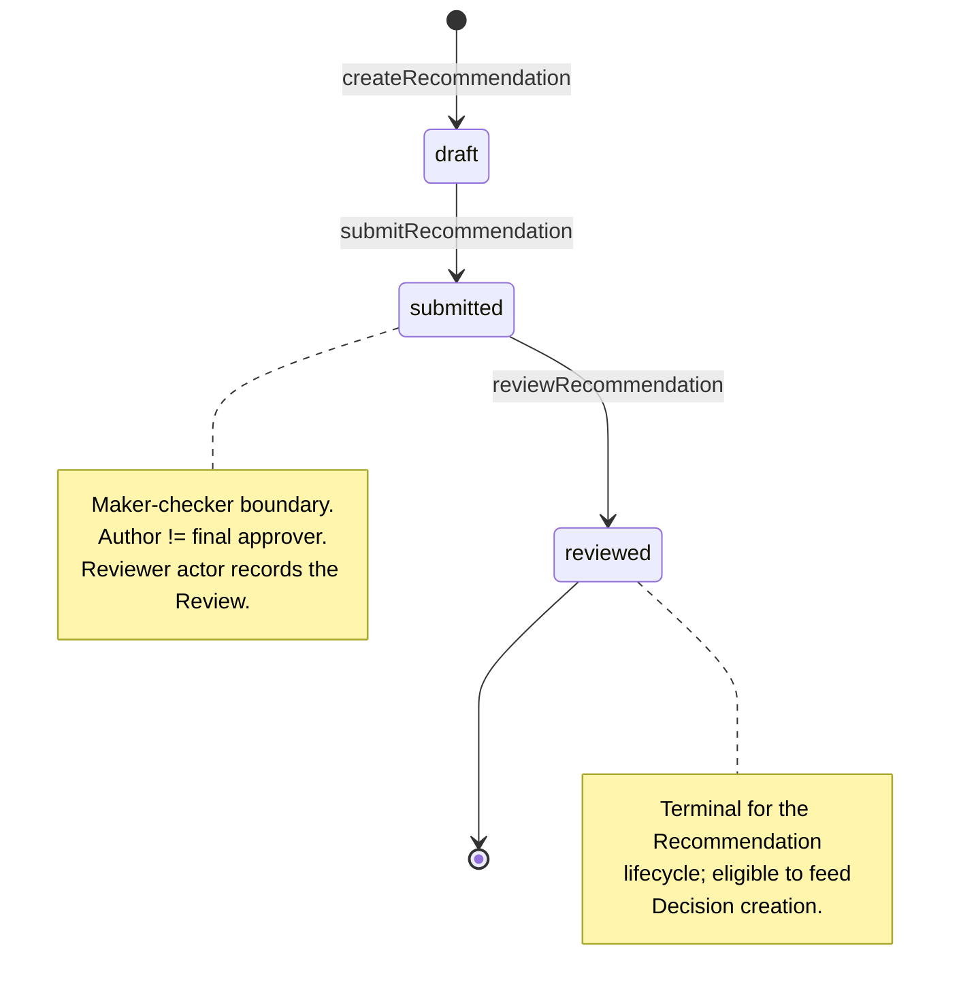
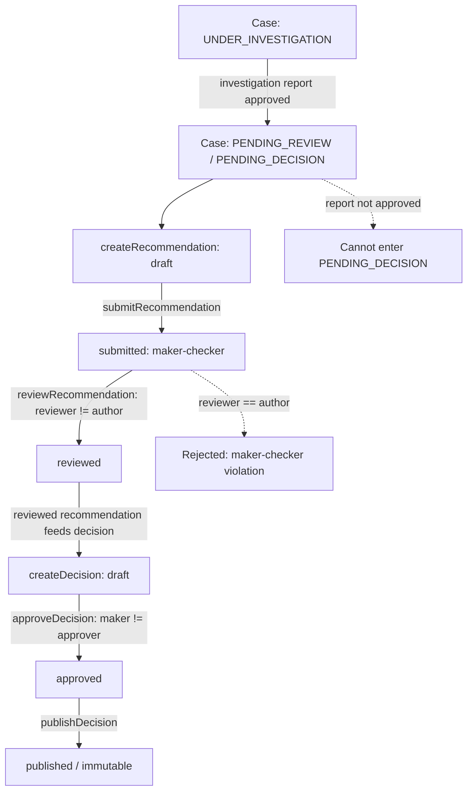

# Recommendation and Review Lifecycle

**Coverage tags:** `state-lifecycle`, `business-rules`
**Audience:** engineer, business-analyst
**Related pages:** [Case Lifecycle](./case-lifecycle.md) · [Decision Lifecycle](./decision-lifecycle.md) · [Business Rules](./business-rules.md) (planned) · [Branch Conditions](./branch-conditions.md) (planned)

---

## TL;DR (Newcomer Orientation)

A **Recommendation** is a proposed enforcement action attached to a `CaseRecord`. It moves through three states:

```
draft  ──submit──▶  submitted  ──review──▶  reviewed
```

- **draft** — authored by an Investigator (maker).
- **submitted** — a maker-checker boundary is crossed; the submission must be checked by someone *other* than the author.
- **reviewed** — a Reviewer has recorded a `Review`; the recommendation is now eligible to feed a `Decision`.

> **Invariant (maker-checker):** The recommendation **author must not be the final approver** of the same recommendation. The system enforces `author != approver` at submission/review time (see [Submit and Maker-Checker](#submit-and-maker-checker)).

The recommendation is the *input* to the [Decision Lifecycle](./decision-lifecycle.md); a reviewed recommendation is the prerequisite for creating a `Decision` on the case.

---

## Recommendation States

The Recommendation aggregate (`Recommendation` + `Review`) is introduced in Liquibase release **0006-phase7-decision-appeal.yaml** alongside `decision`, `sanction`, `appeal`, and `appeal_decision` (per `data-schema.md`).

| State | Meaning | Entry trigger | Terminal? |
|---|---|---|---|
| `draft` | Authoring in progress; not yet submitted for checking. | `POST /api/v1/cases/{caseId}/recommendations` (createRecommendation) | No |
| `submitted` | Submitted for maker-checker review; pending a non-author reviewer. | `POST /api/v1/recommendations/{recommendationId}/submit` (submitRecommendation) | No |
| `reviewed` | A `Review` has been recorded; eligible to drive a `Decision`. | `POST /api/v1/recommendations/{recommendationId}/reviews` (reviewRecommendation) | **Yes (per-lifecycle)** |

Notes for maintainers:

- The lifecycle model in `business.json` (`lifecycle-recommendation`) declares `reviewed` the terminal state of the Recommendation's own lifecycle. This does **not** mean the case is closed — it means the recommendation has completed its internal progression and is now an input to [Decision creation](#relationship-to-decision).
- Every transactional table (including `recommendation` and `review`) carries `id / created_at / created_by / updated_at / updated_by / version`, with UUID PKs and TIMESTAMPTZ (foundation changelog convention). `created_by` is the field that anchors the maker-checker invariant — it records the author.
- Optimistic locking applies: `UPDATE ... SET version=version+1 WHERE id=#{id} AND version=#{expectedVersion}`; a 0-row result maps to **409 CONCURRENT_MODIFICATION**.

### Recommendation state machine



---

## Submit and Maker-Checker

### The maker-checker invariant

`business.json` rule `rule-maker-checker-recommendation` (FACT, evidence `domain-lifecycle`):

> **Maker-checker: the recommendation author must not be the final approver.**

This is mirrored as invariant `inv-maker-checker-separation`:

> `Recommendation author != final approver; sanction changer != approver of same change.`

Enforcement: **domain policy** (`CaseProgressionGuard` / `PhaseSevenCaseProgressionGuard`). The `PhaseSevenCaseProgressionGuard` deepens later-state prerequisites for recommendation/review/decision/sanction/appeal (per `domain-lifecycle.md`); documented gaps remain for enforcement-monitoring detail (`PROJECT_STATUS.md` → `unknown-enforcement-monitoring`, `unknown-later-state-prerequisites`).

### How it is applied at the endpoints

| Endpoint | operationId | Role involved | Maker-checker effect |
|---|---|---|---|
| `POST /api/v1/cases/{caseId}/recommendations` | createRecommendation | Investigator (author / maker) | Creates `draft`; `created_by` = author. |
| `POST /api/v1/recommendations/{recommendationId}/submit` | submitRecommendation | Author (maker) | Moves `draft → submitted`. The **submitter** is the maker. |
| `POST /api/v1/recommendations/{recommendationId}/reviews` | reviewRecommendation | Reviewer (reviewer-jkt) | Records a `Review`; moves `submitted → reviewed`. The **reviewer** is the final approver and must differ from the author. |

> The `author` (`created_by`) is fixed at `createRecommendation`. The `reviewer` who performs `reviewRecommendation` is the effective final approver. If `reviewer == author`, the maker-checker invariant is violated and the review must be rejected by domain policy.

### Actor model (from `business.json`)

| Actor | Default seeded user | Capability |
|---|---|---|
| Investigator | `investigator-jkt` | Handles investigation, evidence, and gates `PENDING_DECISION`; creates recommendations (maker). |
| Reviewer | `reviewer-jkt` | Reviews recommendations (`reviewRecommendation`). |

> **Segregation of duties:** the maker (Investigator author) and the final approver (Reviewer) are distinct roles with distinct seeded users. A single actor must not occupy both positions for the same recommendation.

### Authorization caveat

Per invariant `inv-role-insufficient` (`rule-role-insufficient-for-access`): **holding a role alone does not grant case access.** The Reviewer must also pass jurisdiction / classification / conflict-of-interest / assigned-unit / direct-assignment checks (see Branch Conditions below and [Branch Conditions](./branch-conditions.md) planned page). A `SYSTEM_ADMIN` short-circuits all authorization checks — this is the only actor that can bypass, and it should never be used as a routine maker/checker identity.

---

## Review Gating

A recommendation cannot reach `reviewed` without passing the gating rules below. These rules are **business rules** (FACT) preserved from evidence; see also [Business Rules](./business-rules.md) (planned).

### Recommendation transition → rule table

| # | Transition | Endpoint | Rule / guard | Failure behavior |
|---|---|---|---|---|
| T1 | `draft → submitted` | submitRecommendation | Maker-checker boundary opened: submitter recorded as maker (`created_by`). Recommendation must currently be `draft`. | Invalid current state → 422; optimistic-lock conflict → 409. |
| T2 | `submitted → reviewed` | reviewRecommendation | **Maker-checker invariant:** reviewer (`created_by` of Review) **!=** recommendation author (`created_by` of Recommendation). Reviewer must hold access (jurisdiction/classification/conflict/unit). | `reviewer == author` → rejected by domain policy; authorization failure → 403 (audit-denied where sensitive). |
| T3 | `reviewed` (terminal) | — | No further `recommendation` transitions; recommendation is now input to Decision creation. | Any further recommendation transition → invalid. |

### Branch conditions that gate review (from `business.json`)

These are the authorization / workflow gateways that must evaluate favorably before a `Review` can be recorded:

| Branch id | Condition | Effect on review |
|---|---|---|
| `branch-jurisdiction-match` | Actor `jurisdictionCode` matches resource `jurisdictionCode`? | Mismatch → authorization denied (403). |
| `branch-classification-clearance` | Actor holds clearance for `caseClassification`? | Missing clearance → authorization denied (403). |
| `branch-conflict-of-interest` | Actor `isConflictedWith(resourceOwnerId)`? | Conflicted → authorization denied (403). |
| `branch-assigned-unit-scope` | `enforceAssignedUnitScope` for unit-restricted resource? | Out-of-unit → authorization denied (403). |

> See [Branch Conditions](./branch-conditions.md) (planned) for the full gateway catalog including `branch-evidence-sufficient` and `branch-violation-proven`, which influence whether the case is ready to proceed to recommendation at all (workflow level). At the **recommendation** level, the binding gate is the maker-checker invariant (T2) plus the four authorization branches above.

### Reviewer vs. investigation-report gate

The recommendation lifecycle is downstream of the case progression. The case cannot enter `PENDING_DECISION` unless the **investigation report is approved** (rule `rule-pending-decision-gate`, `inv-pending-decision-requires-report`). The recommendation/Review is the recommended-action input that the Decision Maker consumes once the case is in `PENDING_DECISION`. A `reviewed` recommendation is therefore the business prerequisite for `POST /api/v1/cases/{caseId}/decisions` (createDecision) — see next section.

---

## Relationship to Decision

A **reviewed** recommendation is the gateway input to the [Decision Lifecycle](./decision-lifecycle.md). The flow:



### How a recommendation flows into Decision creation

1. **Case prerequisite:** The `CaseRecord` must have an approved investigation report before it can reach `PENDING_DECISION` (`rule-pending-decision-gate`). This is the upstream gate enforced by `CaseProgressionGuard`.
2. **Recommendation prerequisite:** At least one recommendation must be in `reviewed` state. The reviewed `Review` records the reviewer (final approver) who is distinct from the author.
3. **Decision creation:** `POST /api/v1/cases/{caseId}/decisions` (createDecision) opens a `Decision` in `draft`. The Decision references the reviewed recommendation's content as the proposed action.
4. **Decision maker-checker:** The Decision then follows its own maker-checker: `draft → approved` via `approveDecision` enforces `maker != approver` (`decision-decision-approval-maker-not-approver`), then `approved → published` via `publishDecision` (immutable thereafter; change only via correction/appeal — `rule-published-decision-immutable`).

> **Separation of duties is layered:** recommendation author ≠ reviewer, *and* decision maker ≠ decision approver. The two maker-checker boundaries are independent. The same person may not be both the recommendation author and its reviewer, nor the decision maker and its approver — but the recommendation reviewer and the decision maker/approver are separate roles (Reviewer `reviewer-jkt` vs. Decision Maker `decision-jkt`).

### Why reviewed (not submitted) is the Decision input

A `submitted` recommendation has not cleared maker-checker. Only `reviewed` (where T2 succeeded) is a validated, independently-checked proposal. Creating a `Decision` from a `submitted` recommendation would bypass the second pair of eyes and contradict the maker-checker invariant. The system therefore treats `reviewed` as the minimum bar for feeding `createDecision`.

---

## Reference: Evidence-Backed Rules Index

| Rule id | Statement | Classification | Evidence |
|---|---|---|---|
| `rule-maker-checker-recommendation` | Recommendation author must not be the final approver. | FACT | domain-lifecycle |
| `inv-maker-checker-separation` | `Recommendation author != final approver; sanction changer != approver of same change.` | FACT | domain-lifecycle |
| `rule-pending-decision-gate` | Cannot enter `PENDING_DECISION` unless investigation report approved. | FACT | domain-lifecycle |
| `rule-role-insufficient-for-access` | Role alone does not grant case access. | FACT | domain-lifecycle, authorization-model |
| `rule-published-decision-immutable` | Published Decision immutable; change only via correction/appeal. | FACT | domain-lifecycle |

### Open/unresolved items (from evidence `unknowns`)

- `unknown-enforcement-monitoring` — enforcement-monitoring detail incomplete.
- `unknown-later-state-prerequisites` — `PhaseSevenCaseProgressionGuard` deepens later-state prerequisites but gaps remain; treat maker-checker enforcement as domain-policy-level and verify against the guard implementation.

---

## Endpoint Quick Reference

| # | Method | Path | operationId | Notes |
|---|---|---|---|---|
| 11 | POST | `/api/v1/cases/{caseId}/recommendations` | createRecommendation | Creates `draft`; sets author. |
| 12 | POST | `/api/v1/recommendations/{recommendationId}/submit` | submitRecommendation | maker-checker boundary; `draft → submitted`. |
| 13 | POST | `/api/v1/recommendations/{recommendationId}/reviews` | reviewRecommendation | `submitted → reviewed`; reviewer != author. |
| 14 | POST | `/api/v1/cases/{caseId}/decisions` | createDecision | Consumes reviewed recommendation. |

*Source: `endpoint-catalog.md` (OpenAPI 3.0.3, contract-first). All endpoints are `bearer`-authenticated.*
