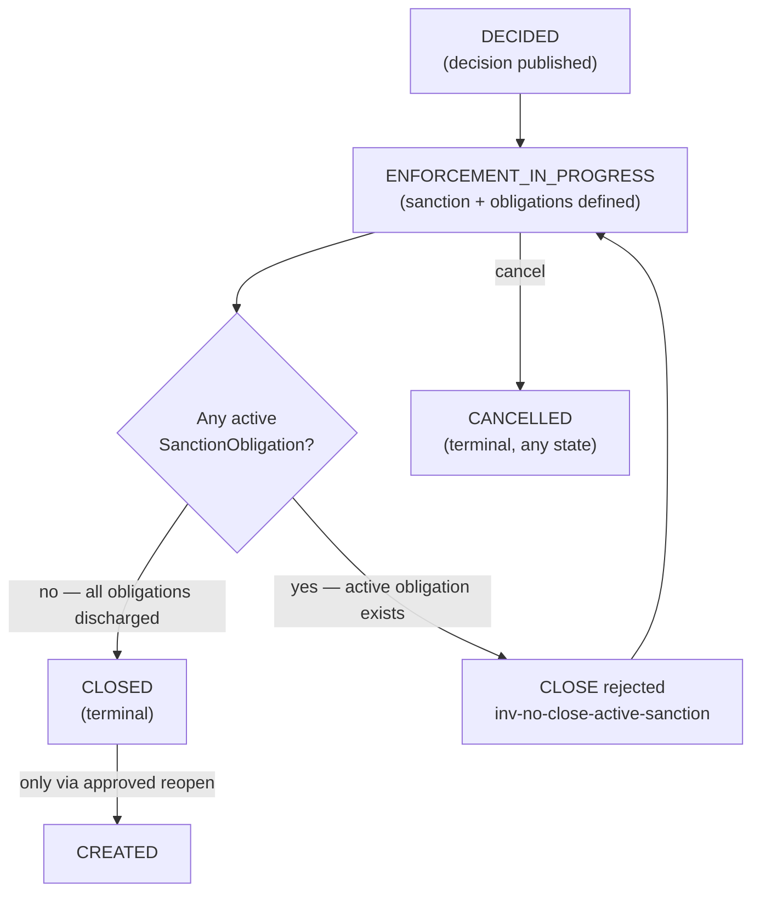
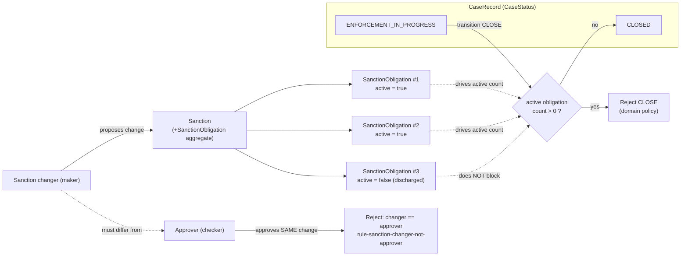

# Sanction and Obligation Model

**Category:** business-domain
**Audience:** engineer, business-analyst
**Coverage tags:** `business-rules`, `state-lifecycle`

> This page documents the **Sanction / SanctionObligation** model: how a sanction is defined with its obligations, the invariant that an **active sanction obligation blocks `CLOSE`**, and the maker-checker-style separation where the **sanction changer must not be the approver of the same change**. Grounded in `.docgen/evidence/domain-lifecycle.md` and `data-schema.md` and the `business.json` model. The enclosing case machine is in [Case Lifecycle](./case-lifecycle.md); the published-decision rules are in [Decision Lifecycle](./decision-lifecycle.md).

---

## Orientation (newcomer)

A **sanction** is the enforcement action imposed on a case after a decision is published. It is decomposed into one or more **obligations** — concrete things the sanctioned party must do (or refrain from doing). Each obligation has an *active* status for as long as it remains unfulfilled.

The two business rules that matter most for engineers:

1. **You cannot close a case while any of its sanction obligations are still active.** The case sits in `ENFORCEMENT_IN_PROGRESS` until the obligations are discharged.
2. **The person who changes a sanction (the maker) cannot also approve that same change (the checker).** This is the same separation-of-duties principle applied to recommendations and decisions.

Everything else on this page is detail for maintainers and auditors.

---

## Sanction and Obligation Concepts

### Aggregate placement (FACT)

Per `.docgen/evidence/domain-lifecycle.md`, the **Sanction** aggregate carries the **SanctionObligation** child entity:

> Aggregates present (FACT, package layout): ... Decision (+DecisionVersion), **Sanction (+SanctionObligation)**, Appeal (+AppealDecision).

This is mirrored in `data-schema.md` release **0006** (`0006-phase7-decision-appeal.yaml`), which introduces `sanction` and `sanction_obligation` tables alongside `decision` / `appeal`.

### Capability (FACT, `business.json` → `cap-sanction`)

| Field | Value |
|---|---|
| `id` | `cap-sanction` |
| `name` | Sanction |
| `description` | Define sanctions and obligations; **sanction changer must not be approver of same change; active obligation blocks CLOSE.** |
| `owningModule` | `sentinel-application` |
| `evidenceRefs` | `domain-lifecycle`, `data-schema` |

### Concept (FACT, `business.json` → `concept-sanction`)

> **Sanction / SanctionObligation** — Sanction with obligations; active obligation blocks case `CLOSE`; changer must not approve same change.

### Working model for engineers

- A **`Sanction`** is the parent enforcement record for a case (typically created/realized in the `ENFORCEMENT_IN_PROGRESS` band of the case lifecycle).
- A **`SanctionObligation`** is a child row representing a single obligation attached to that sanction.
- Each obligation carries an **active** flag / status. While at least one obligation is *active*, the parent case is **not closable**.
- Every transactional table (incl. `sanction`, `sanction_obligation`) follows the foundation conventions: `id` (UUID PK), `created_at`, `created_by`, `updated_at`, `updated_by`, `version` (`.docgen/evidence/data-schema.md`). Optimistic locking applies via `UPDATE ... SET version=version+1 WHERE id=#{id} AND version=#{expectedVersion}`; a 0-row result maps to `409 CONCURRENT_MODIFICATION`.

> **Inference note:** The evidence describes the *model and invariants* (`sanction` + `sanction_obligation` tables, active-obligation linkage, changer≠approver) but does **not** expose endpoint paths or column-level status enums for `sanction_obligation` in the provided artifacts. Treat obligation "active" status as a domain state evidenced by the invariant `inv-no-close-active-sanction`, not as a documented column name. Enforcement-monitoring detail is an explicit known gap (`unknown-enforcement-monitoring` in `business.json`).

---

## Active Obligation Blocks Closure

### The invariant (FACT)

Two artifacts state this identically:

- **Business rule** (`business.json` → `rule-no-close-with-active-sanction`): *"Cannot CLOSE a case if an active sanction obligation exists."*
- **Invariant** (`business.json` → `inv-no-close-active-sanction`): *"Cannot CLOSE if active sanction obligation exists."* — enforcement: **domain policy / DB relationship**.
- **Lifecycle transition** (`lifecycle-case`): `ENFORCEMENT_IN_PROGRESS -> CLOSED (no active sanction obligation)`.

In the case state machine, the only path into `CLOSED` runs through `ENFORCEMENT_IN_PROGRESS`, and that edge is explicitly gated on the absence of active obligations:

| From → To | Precondition | Guard / enforcement |
|---|---|---|
| `DECIDED → ENFORCEMENT_IN_PROGRESS` | sanction + obligation defined | `PhaseSevenCaseProgressionGuard` |
| `ENFORCEMENT_IN_PROGRESS → CLOSED` | **no active sanction obligation** | `inv-no-close-active-sanction` |

### Enforcement points (FACT, `domain-lifecycle.md`)

- `CaseProgressionGuard` functional interface with `NO_OP` default.
- `PhaseSevenCaseProgressionGuard` **deepens later-state prerequisites** (recommendation/review/decision/sanction/appeal) and is the guard that enforces the active-sanction block on `CLOSE`.

> **Known gap (FACT):** `domain-lifecycle.md` notes "documented gaps remain for enforcement-monitoring detail" and that later-state prerequisites are lighter than the master target. The obligation-fulfillment signal that flips an obligation from *active* to *discharged* is **not** fully specified in evidence — see [Relationship to Case Closure](#relationship-to-case-closure).

---

## Changer vs Approver Separation

### The invariant (FACT)

- **Business rule** (`business.json` → `rule-sanction-changer-not-approver`): *"Sanction changer must not be the approver of the same change."*
- **Invariant** (`business.json` → `inv-maker-checker-separation`): *"Recommendation author != final approver; **sanction changer != approver of same change**."* — enforcement: **domain policy**.

This is the same separation-of-duties pattern (maker-checker) applied at three points in the system:

| Domain action | Maker | Checker | Rule id |
|---|---|---|---|
| Recommendation submit | recommendation author | final approver (reviewer) | `rule-maker-checker-recommendation` |
| Decision approval | decision creator | decision approver | `decision-decision-approval-maker-not-approver` |
| **Sanction change** | **sanction changer** | **approver of same change** | **`rule-sanction-changer-not-approver`** |

A sanction *change* (create/modify the sanction or its obligations) is performed by one actor; the *approval* of that same change must be performed by a **different** actor. If the changer attempts to also approve, the domain policy rejects it (consistently mapped to a 4xx/403-style refusal, mirroring `approveDecision` behavior described in [Decision Lifecycle](./decision-lifecycle.md)).

> **Inference note:** The evidence does not enumerate the exact endpoint(s) for "sanction change" / "sanction approve." The `cap-sanction` description and the invariant are the authoritative statements; implementers should expect a maker/checker split analogous to `submitRecommendation` (maker) + `reviewRecommendation` (checker) and `createDecision` (maker) + `approveDecision` (checker).

---

## Relationship to Case Closure

### Where sanctions sit in the case lifecycle (FACT)

The `CaseStatus` enum (FACT, `CaseStatus.java`) is:

`CREATED, UNDER_TRIAGE, UNDER_INVESTIGATION, PENDING_REVIEW, PENDING_DECISION, DECIDED, UNDER_APPEAL, ENFORCEMENT_IN_PROGRESS, CLOSED, CANCELLED`

`isTerminal()` ⇒ `CLOSED` or `CANCELLED`.

Sanctions/obligations are realized in the **`ENFORCEMENT_IN_PROGRESS`** band. A published decision (`DECIDED`) is the prerequisite; enforcement (sanction + obligation) moves the case into `ENFORCEMENT_IN_PROGRESS`; and **the case cannot reach `CLOSED` until no active obligation remains.**

### Closure gate flowchart (Mermaid)

### Sanction/obligation relationship and closure gate (Mermaid)

### Interaction with closed-case immutability

- A `CLOSED` case **cannot change** except via approved reopen (`rule-closed-immutability`, `inv-closed-immutability`). Therefore the active-obligation block is the *last* gate before the terminal `CLOSED` state is reached; once closed, the only escape is an approved reopen (`CLOSED → CREATED`, `decision-reopen-requires-approved-reopen`).
- `CANCELLED` is reachable from `ENFORCEMENT_IN_PROGRESS` (and any other non-terminal state) and is terminal, so cancellation bypasses the obligation-discharge requirement — but it does **not** discharge obligations; it terminates the case record.

### Optimistic-locking interaction

Sanction and obligation rows are versioned. A concurrent modification (stale `version`) yields `409 CONCURRENT_MODIFICATION`, so an obligation discharge and a closure attempt racing on the same aggregate are serialized by the `version` guard, not left to last-writer-wins.

---

## Sanction Invariant → Enforcement Table

| Invariant / rule id | Statement | Enforcement | Evidence |
|---|---|---|---|
| `rule-no-close-with-active-sanction` / `inv-no-close-active-sanction` | Cannot `CLOSE` if an active sanction obligation exists | Domain policy / DB relationship; `PhaseSevenCaseProgressionGuard` on `ENFORCEMENT_IN_PROGRESS → CLOSED` | `domain-lifecycle.md`, `business.json`, `lifecycle-case` |
| `rule-sanction-changer-not-approver` / `inv-maker-checker-separation` | Sanction changer must not be approver of the same change | Domain policy (maker ≠ checker) | `domain-lifecycle.md`, `business.json` |
| `rule-closed-immutability` / `inv-closed-immutability` | `CLOSED` case cannot change except via approved reopen | Domain policy (`CaseProgressionGuard`) | `domain-lifecycle.md`, `business.json` |
| `rule-pending-decision-gate` / `inv-pending-decision-requires-report` | Cannot enter `PENDING_DECISION` unless investigation report approved (precursor to `DECIDED` → enforcement) | Transition guard | `domain-lifecycle.md`, `business.json` |
| `rule-published-decision-immutable` / `inv-published-decision-immutable` | Published Decision immutable; change only via correction/appeal (basis for `DECIDED` enforcement posture) | Domain policy | `domain-lifecycle.md`, `business.json` |
| `rule-one-active-appeal` / `inv-one-active-appeal` | One active appeal per decision (affects `DECIDED ↔ UNDER_APPEAL` around enforcement) | Domain policy / DB uniqueness | `domain-lifecycle.md`, `business.json` |
| `inv-checksum-mismatch-reject` | Evidence finalize with checksum mismatch / missing object rejected (evidence backing enforcement is protected) | Storage adapter guard | `evidence-storage`, `domain-lifecycle.md` |

---

## Sanction Invariant → Enforcement Summary (quick reference)

| Invariant | Blocks | Enforced by |
|---|---|---|
| Active obligation exists | `CLOSE` (case stays `ENFORCEMENT_IN_PROGRESS`) | `PhaseSevenCaseProgressionGuard` / DB relationship |
| Changer == approver of same change | Sanction change approval | Domain policy |
| Case already `CLOSED` | Any state change | `CaseProgressionGuard` (needs approved reopen) |

---

## Caveats and Known Gaps (FACT)

- **Enforcement-monitoring detail incomplete** (`unknown-enforcement-monitoring`): how an obligation transitions from *active* to *discharged* (and who records it) is not fully specified in evidence. The closure gate depends on this signal but the signal's source is a documented gap.
- **Later-state prerequisites lighter than target** (`unknown-later-state-prerequisites`): `PhaseSevenCaseProgressionGuard` deepens prerequisites but not all master-target checks are present.
- **No documented endpoint for sanction change/approve**: `business.json` and `domain-lifecycle.md` define the invariant and capability but do not list the sanction mutation/approval endpoints; model the maker/checker split by analogy with recommendation and decision.

---

## Cross-links

- [Case Lifecycle](./case-lifecycle.md) — full `CaseStatus` state machine; `ENFORCEMENT_IN_PROGRESS → CLOSED` gate.
- [Business Rules](../business-rules.md) — full catalog of enforced business rules (incl. `rule-no-close-with-active-sanction`, `rule-sanction-changer-not-approver`).
- [Decision Lifecycle](./decision-lifecycle.md) — `DECIDED` prerequisite, decision immutability, maker-checker on approval.
- [Appeal Lifecycle](../appeal-lifecycle.md) — appeal subprocess that can re-open `DECIDED` around enforcement.
