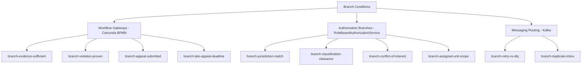
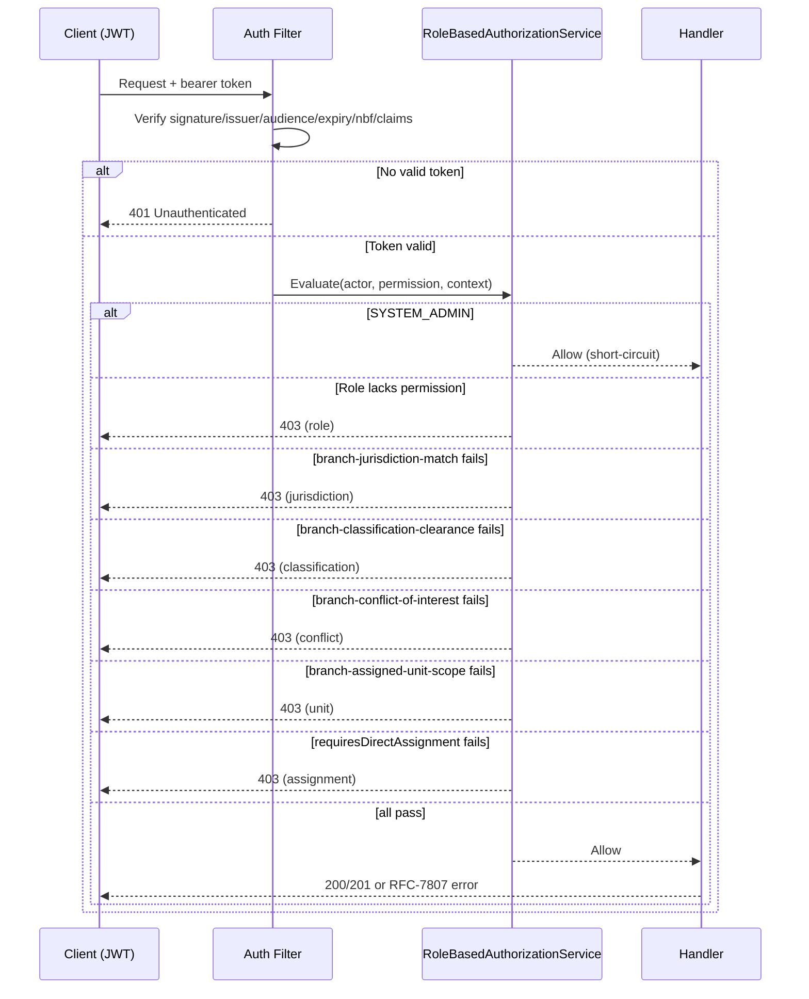

# Branch Conditions and Gateways

**Category:** business-logic
**Audience:** engineer, architect
**Coverage tags:** branch-conditions, business-rules
**Evidence:** [workflow-camunda](../../.docgen/evidence/workflow-camunda.md), [authorization-model](../../.docgen/evidence/authorization-model.md), [messaging-topics](../../.docgen/evidence/messaging-topics.md), [domain-lifecycle](../../.docgen/evidence/domain-lifecycle.md)
**Models:** [business.json](../../.docgen/model/business.json), [flows.json](../../.docgen/model/flows.json)

---

## Orientation (newcomer)

This page catalogs the **decision and routing conditions** that branch behavior in Sentinel. A "branch condition" is a yes/no test that changes which path an operation, workflow, or message takes. Branches appear in three places:

1. **Workflow gateways** (embedded Camunda BPMN) — e.g., is evidence sufficient?
2. **Authorization policy** (`RoleBasedAuthorizationService`) — e.g., does jurisdiction match?
3. **Messaging routing** (Kafka retry/DLQ, inbox dedup) — e.g., under retry threshold?

Each branch below is evidence-backed. The [Branch id -> condition -> deny/allow outcome table](#branch-condition-outcome-table) is the quick reference.

## Working model (maintainer)

- **10 branch conditions** are cataloged: 4 workflow gateways, 4 authorization branches, 2 messaging routing branches.
- Authorization branches do not "allow/deny a feature" — they deny access (→ 403) when the condition fails; all are subsumed under `rule-role-insufficient-for-access`.
- Messaging branches are pure routing: retry vs DLQ, and duplicate-inbox dedup. They never block a business write.
- Precedence: authorization steps run in fixed order (see [Condition Precedence and Conflicts](#condition-precedence-and-conflicts)); `SYSTEM_ADMIN` short-circuits the entire authorization chain before any branch is evaluated.

## Workflow Gateway Conditions

These are Camunda gateways in `regulatory-enforcement-case.bpmn` and `decision-appeal-review.bpmn` (FACT).

| Branch id | Condition | Behavior when true | Evidence |
|---|---|---|---|
| `branch-evidence-sufficient` | Is evidence sufficient? | Proceed to investigation completion / recommendation | workflow-camunda, domain-lifecycle |
| `branch-violation-proven` | Is a violation proven? | Influences decision/recommendation path | workflow-camunda, domain-lifecycle |
| `branch-appeal-submitted` | Is an appeal submitted? | Enter `UNDER_APPEAL` when an appeal exists for a decision | workflow-camunda, endpoint-catalog |
| `branch-late-appeal-deadline` | Late appeal beyond deadline? | Requires explicit supervisor override before it can be decided | domain-lifecycle, endpoint-catalog |

Camunda consistency note: task completion is idempotent; the domain update and Camunda signal are **not** in one distributed transaction — the reconciliation job covers mismatches.

## Authorization Branch Conditions

These are evaluated by `RoleBasedAuthorizationService`. Each maps to a denial when the condition fails (subject to `SYSTEM_ADMIN` short-circuit and the role→permission prerequisite).

| Branch id | Condition | Deny when | Evidence |
|---|---|---|---|
| `branch-jurisdiction-match` | Actor `jurisdictionCode` matches resource `jurisdictionCode`? | Context `jurisdictionCode` set and actor lacks it | authorization-model |
| `branch-classification-clearance` | Actor holds clearance for `caseClassification`? | `caseClassification` set and actor lacks clearance | authorization-model |
| `branch-conflict-of-interest` | Actor `isConflictedWith(resourceOwnerId)`? | `resourceOwnerId` set and actor conflicted with owner | authorization-model |
| `branch-assigned-unit-scope` | `enforceAssignedUnitScope` for unit-restricted resource? | Unit-restricted resource and actor `assigned_units` claim lacks the unit | authorization-model |

JWT claims (FACT, KeycloakTokenVerifier): `jurisdictions`, `assigned_units`, `case_classifications`, `conflicted_actor_ids`. Verification checks signature, issuer, audience, expiry, not-before, required claims (no unsigned decode).

## Messaging Routing Conditions

| Branch id | Condition | Outcome | Evidence |
|---|---|---|---|
| `branch-retry-vs-dlq` | Retry count < `NOTIFICATION_MAX_RETRIES` (3)? | Yes → `.retry` topic; No → `.dlq` topic | messaging-topics |
| `branch-duplicate-inbox` | `UNIQUE(consumer_name, event_id)` already present? | Duplicate delivery → at most one notification side effect (idempotency dedup) | messaging-topics |

Transactional outbox: business change + `outbox_event` insert in same DB tx; key = `aggregateId`. `KafkaOutboxPublisher` leases pending rows with `FOR UPDATE SKIP LOCKED`, publishes, marks `PUBLISHED`.

## Condition Precedence and Conflicts

**Authorization chain order (FACT):**

1. `SYSTEM_ADMIN` short-circuit — all subsequent checks skipped.
2. Role → required `Permission` map — else `403`.
3. Jurisdiction (`branch-jurisdiction-match`).
4. Classification clearance (`branch-classification-clearance`).
5. Conflict-of-interest (`branch-conflict-of-interest`).
6. Assigned-unit scope (`branch-assigned-unit-scope`).
7. Direct assignment (`requiresDirectAssignment` → `actor.username() == authorizationContext.assigneeUserId()`).

**Conflicts and interactions:**
- Authorization branches are **additive denials** — any single failure denies; there is no "earlier branch passes so later failure is ignored."
- `rule-role-insufficient-for-access` is the umbrella: even a role holding the right permission is denied if any of branches 3–6 fail.
- Workflow gateways (branches 1–4 in the workflow section) are independent of authorization; an actor authorized to see a case may still hit a `branch-evidence-sufficient` = false gateway that routes the process differently.
- Messaging branches never interact with authorization branches — they operate post-commit on emitted events.

## Branch condition taxonomy by source

## Authorization decision branch sequence

## Branch condition outcome table

| Branch id | Source | Condition | Deny / Allow outcome |
|---|---|---|---|
| `branch-evidence-sufficient` | Workflow | Is evidence sufficient? | Allow → proceed; Deny → route away from recommendation |
| `branch-violation-proven` | Workflow | Is a violation proven? | Allow → decision/recommendation path; Deny → alternate path |
| `branch-appeal-submitted` | Workflow | Is an appeal submitted? | Allow → enter `UNDER_APPEAL`; Deny → remain `DECIDED` |
| `branch-late-appeal-deadline` | Workflow | Late appeal beyond deadline? | Deny (block decide) unless supervisor override → Allow |
| `branch-jurisdiction-match` | Authorization | Jurisdiction matches? | Fail → **Deny 403**; Pass → continue chain |
| `branch-classification-clearance` | Authorization | Clearance held? | Fail → **Deny 403**; Pass → continue chain |
| `branch-conflict-of-interest` | Authorization | Not conflicted with owner? | Fail → **Deny 403**; Pass → continue chain |
| `branch-assigned-unit-scope` | Authorization | Within assigned unit? | Fail → **Deny 403**; Pass → continue chain |
| `branch-retry-vs-dlq` | Messaging | Retry count < 3? | Yes → route to `.retry`; No → route to `.dlq` |
| `branch-duplicate-inbox` | Messaging | `UNIQUE(consumer_name, event_id)` hit? | Yes → dedup (no side effect); No → process once |

## Related pages

- [Business Rules and Invariants](business-rules.md)
- [Security and Authorization](../architecture/security-authorization.md) — *linked by manifest `security-authorization`; verify canonical path*
- [Camunda Workflow](../architecture/camunda-workflow.md) — *linked by manifest `camunda-workflow`; verify canonical path*
- [Outbox Reliability](../architecture/outbox-reliability.md) — *linked by manifest `outbox-reliability`; verify canonical path*
