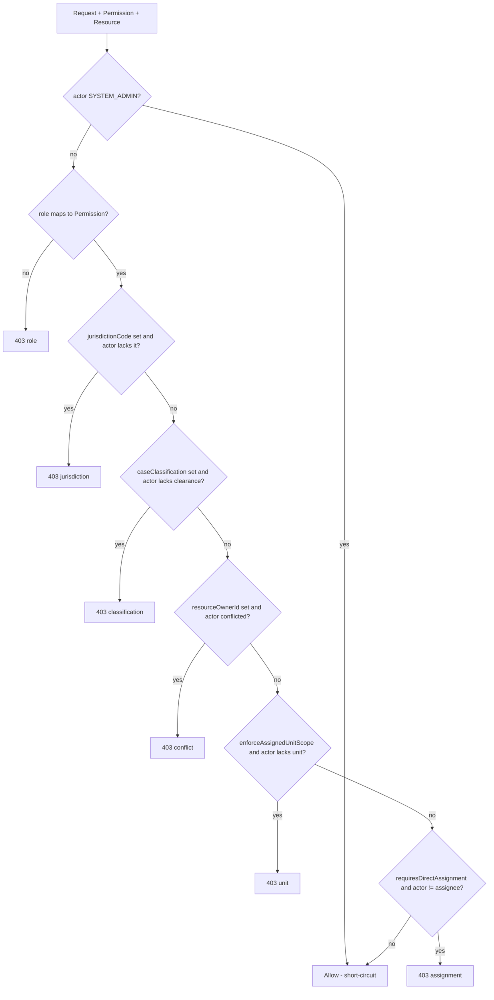

# Decisions and Authorization Contexts

**Category:** business-logic
**Audience:** engineer, architect
**Coverage tags:** business-rules, branch-conditions, security
**Evidence:** [authorization-model](../../.docgen/evidence/authorization-model.md), [domain-lifecycle](../../.docgen/evidence/domain-lifecycle.md), [endpoint-catalog](../../.docgen/evidence/endpoint-catalog.md)
**Models:** [business.json](../../.docgen/model/business.json)

---

## Orientation (newcomer)

This page explains two things:

1. **Domain decisions** — the key judgment points in the enforcement lifecycle (approval gates, separation, deadline overrides, reopen, reconciliation).
2. **The AuthorizationContext shape** — the structured set of fields the authorization engine inspects to decide whether an actor may perform an action on a case/resource.

A decision is a business judgment the platform records or enforces. The `AuthorizationContext` is the *input* to the permission engine — it carries the case's identity, jurisdiction, classification, ownership, and assignment so the engine can apply the [branch conditions](branch-conditions.md) (jurisdiction, clearance, conflict, unit, direct-assignment).

## Working model (maintainer)

- **5 key decisions** are cataloged (all `FACT`, from `business.json.decisions`).
- The `AuthorizationContext` carries 8 fields. Of these, `jurisdictionCode`, `caseClassification`, `resourceOwnerId` (via `resourceOwner`), `assignedUnitId`, and `assigneeId` drive the conditional denials.
- Authorization uses **JWT claims** (live-lookup derived) for `jurisdictions`, `assigned_units`, `case_classifications`, `conflicted_actor_ids` — see [Claim-Based vs Live Lookup Trade-off](#claim-based-vs-live-lookup-trade-off).
- `SYSTEM_ADMIN` short-circuits the entire evaluation before any field is consulted.

## Domain Decisions

| Decision id | Description | Evidence |
|---|---|---|
| `decision-approve-investigation-report-gates` | Approval of the investigation report is the gateway enabling transition into `PENDING_DECISION`. | domain-lifecycle, endpoint-catalog |
| `decision-decision-approval-maker-not-approver` | Decision approval enforces that the maker (decision creator) is not the approver. | domain-lifecycle, endpoint-catalog |
| `decision-appeal-deadline-override` | Appeal decision may be taken with a deadline override when a late appeal is explicitly permitted by a supervisor. | endpoint-catalog, domain-lifecycle |
| `decision-reopen-requires-approved-reopen` | Reopening a `CLOSED` case requires an approved reopen action before any state change is permitted. | domain-lifecycle |
| `decision-reconciliation-repair-terminate` | Reconciliation may auto-repair or terminate a domain/workflow mismatch (repair/terminate actions on a case). | endpoint-catalog, workflow-camunda |

These decisions map onto the business rules `rule-pending-decision-gate`, `rule-maker-checker-recommendation` / `rule-sanction-changer-not-approver`, `rule-late-appeal-supervisor`, `rule-closed-immutability`, and the reconciliation capability `cap-reconciliation`.

## Authorization Context Shape

The `AuthorizationContext` is built per request from the resource and the actor's security context. Fields (FACT, authorization-model):

| Field | Type / Source | Role in evaluation |
|---|---|---|
| `caseId` | Resource identity | Scopes the context to a single case aggregate. |
| `jurisdictionCode` | Resource (report/case) | Drives `branch-jurisdiction-match`; if set and actor lacks it → deny. |
| `assignedUnitId` | Resource assignment | Drives `branch-assigned-unit-scope` for unit-restricted resources. |
| `assigneeId` | Resource assignment | Drives `requiresDirectAssignment` (actor must equal assignee). |
| `caseClassification` | Resource | Drives `branch-classification-clearance`; if set and actor lacks clearance → deny. |
| `caseStatus` | Resource | Used for state-aware policy (e.g., terminal-state mutability). |
| `resourceOwner` | Resource ownership | Supplies `resourceOwnerId` for `branch-conflict-of-interest`. |
| `createdBy` | Resource provenance | Provenance/audit context; supports ownership-aware rules. |

Actor-side claims compared against the context (`KeycloakTokenVerifier`, README authorization model): `jurisdictions`, `assigned_units`, `case_classifications`, `conflicted_actor_ids`.

## Context-to-Permission Evaluation

The permission engine maps a `(Permission, AuthorizationContext)` pair to allow/deny via `RoleBasedAuthorizationService`. Steps:

1. `SYSTEM_ADMIN` → allow (short-circuit).
2. Role → required `Permission` map; else `403`.
3. `jurisdictionCode` set & actor lacks it → `403`.
4. `caseClassification` set & actor lacks clearance → `403`.
5. `resourceOwner` set & actor `isConflictedWith` owner → `403`.
6. `enforceAssignedUnitScope` & actor `assigned_units` lacks `assignedUnitId` → `403`.
7. `requiresDirectAssignment(actor, permission)` & `actor.username() != assigneeUserId()` → `403`.

List endpoints (`GET /api/v1/cases`, task visibility) apply the **same** rules; filtering is no looser than item GET.

## Authorization context evaluation flow

## Claim-Based vs Live Lookup Trade-off

| Dimension | Claim-based (current) | Live lookup |
|---|---|---|
| Source | JWT claims: `jurisdictions`, `assigned_units`, `case_classifications`, `conflicted_actor_ids` | Re-query IdP / DB at request time |
| Latency | Low (decoded from verified token) | Higher (network/DB round trip) |
| Freshness | Stale until token refresh / re-issue | Always current |
| Verification | Signature/issuer/audience/expiry/nbf/required-claims checked; no unsigned decode | N/A |
| Risk | Revoked scope persists until token expiry | None from staleness |

The platform chooses **claim-based** evaluation: the token is cryptographically verified (Keycloak JWKS, exact-match issuer) and the claims are trusted for the token's validity window. This trades freshness for latency and is consistent with the modular-monolith's per-request authorization model. No live lookup path is evidenced in the current model.

## Related pages

- [Business Rules and Invariants](business-rules.md)
- [Branch Conditions and Gateways](branch-conditions.md)
- [Security and Authorization](../architecture/security-authorization.md) — *linked by manifest `security-authorization`; verify canonical path*
