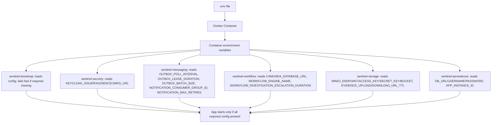

# Configuration & Developer Wiring

**Page ID:** configuration
**Coverage tags:** configuration, security, operations
**Audience:** engineer, architect, operator
**Module:** `sentinel-bootstrap` (assembly / config loading), consumed by all modules.

Sentinel is configured entirely through environment variables. There is no Spring Cloud Config or external config server — `.env` is fed into Docker Compose, which injects container env, and each module reads the subset it needs at startup. Missing **required** config fails the app fast at bootstrap.

FACT basis: `deployment-topology.md`, `build-reactor.md`, `.env.example`, `Makefile`, `system.json`, `catalogs.json`.

---

## 1. Required Environment Variables

All keys below are read from the process environment. `.env.example` ships dummy, non-production credentials and must **not** be committed with real secrets.

| Config key | Purpose | Default (from `.env.example` / Makefile) |
|---|---|---|
| `HTTP_PORT` | Port the Jersey app listens on. | `8080` |
| `DB_URL` | JDBC URL to PostgreSQL. | `jdbc:postgresql://localhost:5432/sentinel` |
| `DB_USERNAME` | PostgreSQL user. | `sentinel` |
| `DB_PASSWORD` | PostgreSQL password. **Secret.** | `sentinel` (dummy) |
| `KAFKA_BOOTSTRAP_SERVERS` | Kafka bootstrap (KRaft single node). | `localhost:29092` |
| `REDIS_HOST` | *(referenced in prompt)* Cache/runtime host. | *No evidence in deployment-topology/env; presence UNKNOWN (see `business.json` `unknown-redis-usage`).* |
| `REDIS_PORT` | *(referenced in prompt)* Cache/runtime port. | *No evidence in deployment-topology/env; presence UNKNOWN.* |
| `MINIO_ENDPOINT` | MinIO base URL. | `http://localhost:9000` |
| `MINIO_ACCESS_KEY` | MinIO access key. **Secret.** | `sentinel` (dummy) |
| `MINIO_SECRET_KEY` | MinIO secret key. **Secret.** | `sentinel-secret` (dummy) |
| `MINIO_BUCKET` | Evidence bucket name (`sentinel-evidence` in compose). | `sentinel-evidence` |
| `KEYCLOAK_ISSUER` | OIDC issuer (`http://localhost:{KEYCLOAK_PORT}/realms/sentinel`). | `http://localhost:8081/realms/sentinel` |
| `KEYCLOAK_AUDIENCE` | Expected JWT `aud`. | `sentinel-api` |
| `KEYCLOAK_JWKS_URL` | JWKS cert endpoint for verification. | `http://localhost:8081/realms/sentinel/protocol/openid-connect/certs` |
| `CAMUNDA_DATABASE_URL` | Camunda schema database URL (separate migration via `CamundaSchemaMigrator`). | *DB_URL per deployment-topology / data-schema.* |
| `APP_INSTANCE_ID` | Outbox lease owner id (SKIP LOCKED publisher). | `sentinel-local` |
| `OUTBOX_POLL_INTERVAL` | Outbox poll period. | `PT2S` |
| `OUTBOX_LEASE_DURATION` | Outbox row lease duration. | `PT30S` |
| `OUTBOX_BATCH_SIZE` | Outbox rows per poll batch. | `20` |
| `NOTIFICATION_CONSUMER_GROUP_ID` | Kafka consumer group for `notification.result.v1`. | `sentinel-notification-consumer` |
| `NOTIFICATION_MAX_RETRIES` | Notification retry threshold before DLQ. | `3` |
| `EVIDENCE_UPLOAD_URL_TTL` | Presigned PUT URL TTL (ISO-8601). | `PT15M` |
| `EVIDENCE_DOWNLOAD_URL_TTL` | Presigned GET URL TTL (ISO-8601). | `PT10M` |
| `WORKFLOW_ENGINE_NAME` | Embedded Camunda engine name. | `sentinel-workflow-engine` |
| `WORKFLOW_INVESTIGATION_ESCALATION_DURATION` | Investigation escalation boundary timer. | `PT30M` |

> ADDITIONAL KEYS present in `.env.example` but outside the required-set above: `POSTGRES_PORT` (5432), `POSTGRES_DB` (sentinel), `POSTGRES_USER` (sentinel), `POSTGRES_PASSWORD` (sentinel), `KAFKA_PORT` (29092), `MINIO_PORT` (9000), `MINIO_CONSOLE_PORT` (9001), `KEYCLOAK_PORT` (8081). These drive compose port mapping and DB seeding, not the app bootstrap directly.

---

## 2. .env.example and Secrets

- `.env.example` contains **dummy, non-production credentials** clearly flagged for local-only use. Real secrets must never be committed.
- Secrets in the required set: `DB_PASSWORD`, `MINIO_SECRET_KEY`, `MINIO_ACCESS_KEY` (treated as secret), and any token material. These are injected by Compose from the local `.env` (git-ignored).
- The Keycloak issuer uses `localhost` consistently with the app container. The app container's `KEYCLOAK_JWKS_URL` points to `host.docker.internal` so the Docker app can fetch the **host** Keycloak certs (exact-match issuer verification requires consistent `localhost`; see README troubleshooting in `deployment-topology.md`).
- MinIO bucket `sentinel-evidence` is created idempotently by the `minio-init` (`mc`) bootstrap container; `seed` re-runs the same init.

---

## 3. Makefile and Dockerfile Wiring

### Build & toolchain

- Maven **3.9+**, multi-module reactor, `groupId=com.sentinel.enforcement`, `version=0.1.0-SNAPSHOT`, **Java 21** (`maven.compiler.release=21`), **10 modules**.
- 10 modules: `sentinel-domain`, `sentinel-application`, `sentinel-api`, `sentinel-persistence`, `sentinel-messaging`, `sentinel-storage`, `sentinel-workflow`, `sentinel-security`, `sentinel-bootstrap`, `sentinel-integration-tests`.
- `make format` → `mvn -q spotless:apply` (Google Java Format), enforced in definition of done.

### Docker wiring

- Multi-stage Docker build; the app container runs as a **non-root** user.
- `make docker-build` → `docker compose build app`; `make up` (compose) starts `postgres`, `kafka`, `minio`, `minio-init`, `keycloak`, then `app`.
- `make migrate` installs the bootstrap module, runs `DatabaseMigrationMain` (app schema + Camunda schema via `CamundaSchemaMigrator`, `databaseSchemaUpdate=false`), then brings the app up.

---

## 4. Fail-Fast Behavior

- The application **fails at startup** if required configuration is missing (verified via bootstrap config loading, `deployment-topology.md`).
- This is intentional: a partially-configured instance must not serve traffic with a null DB URL, Kafka bootstrap, or Keycloak issuer.
- `CAMUNDA_DATABASE_URL` is required for the Camunda schema migration; `make migrate` will not complete without it.
- Because bootstrap reads config eagerly, a misconfigured `KEYCLOAK_JWKS_URL` or `DB_URL` surfaces immediately as a startup failure rather than a first-request 5xx.

---

## 5. Tunable Runtime Parameters

These parameters change runtime behavior without code changes and are safe to override per environment.

| Parameter | Default | Tuning guidance |
|---|---|---|
| `OUTBOX_POLL_INTERVAL` | `PT2S` | Lower = tighter event delivery latency; higher = less poll overhead. |
| `OUTBOX_LEASE_DURATION` | `PT30S` | Must exceed worst-case publish time; too low risks double-publish under slow Kafka. |
| `OUTBOX_BATCH_SIZE` | `20` | Rows leased per poll; balance throughput vs memory. |
| `NOTIFICATION_MAX_RETRIES` | `3` | Retry count before routing to `.dlq` (see `business.json` `branch-retry-vs-dlq`). |
| `EVIDENCE_UPLOAD_URL_TTL` | `PT15M` | Presigned PUT lifetime; shorter = safer, tighter upload window. |
| `EVIDENCE_DOWNLOAD_URL_TTL` | `PT10M` | Presigned GET lifetime; shorter = safer for sensitive evidence. |
| `WORKFLOW_INVESTIGATION_ESCALATION_DURATION` | `PT30M` | Investigation escalation boundary timer; tune per SLA. |
| `APP_INSTANCE_ID` | `sentinel-local` | Unique per instance in multi-node; drives outbox lease ownership. |
| `NOTIFICATION_CONSUMER_GROUP_ID` | `sentinel-notification-consumer` | Change to reset/partition notification consumption. |

> `REDIS_HOST` / `REDIS_PORT` are listed in the prompt's required set but have **no evidence** in `deployment-topology.md`, `.env.example`, or the Makefile. `business.json` marks Redis presence as UNKNOWN. Treat them as not-yet-wired; do not assume a cache dependency exists.

---

## Related pages

- [Local Development](../operations/local-development.md) — the `make` workflow that consumes this config.
- [Deployment Topology](../architecture/deployment-topology.md) — compose services and ports.
- [Module Bootstrap](./module-bootstrap.md) — how `sentinel-bootstrap` loads and validates config.
- [Keycloak Authentication](./keycloak-authentication.md) — issuer/audience/JWKS wiring.

> Cross-link targets above are the canonical page locations implied by the related-page list. Adjust the relative path if a target page is renamed.
