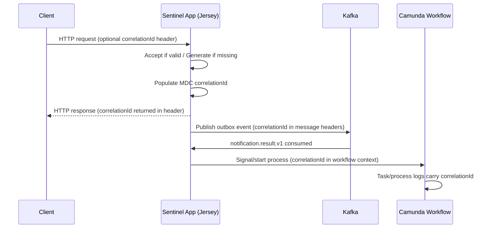

# Observability: Logging, Correlation, Health & Audit

**Page ID:** observability
**Coverage tags:** operations, security, data-model
**Audience:** engineer, architect, operator
**Modules:** `sentinel-api` (filters/MDC), `sentinel-application` (audit append), all modules (structured JSON logging).

Sentinel emits structured JSON logs with an MDC-populated correlation context, propagates a correlation id across HTTP → Kafka → workflow, and writes an append-only `audit_event` model (ADR-010) that is separate from application logs. A public `/health` endpoint reports liveness and DB reachability.

FACT basis: `adr-landscape.md`, `domain-lifecycle.md`, `data-schema.md`, `endpoint-catalog.md`, `system.json`, `catalogs.json`.

---

## 1. Structured Logging Fields

Logs are emitted as structured JSON (logback 1.5.16 / slf4j 2.0.16). The following MDC fields are populated where available on each log line:

| Field | Populated from / source |
|---|---|
| `timestamp` | Logging framework timestamp. |
| `level` | Log level (INFO/WARN/ERROR…). |
| `service` | Service/module name (`com.sentinel.enforcement.*`). |
| `logger` | Logger class/name. |
| `message` | Log message text. |
| `correlationId` | Accepted from request (if valid) or generated; returned in response header; propagated downstream. |
| `traceId` | Tracing id (when present). |
| `actorId` | Authenticated actor username from security context. |
| `caseId` | Business key of the case in scope (from path/context). |
| `processInstanceId` | Camunda process instance id (workflow scope). |
| `taskId` | Camunda user task id (workflow scope). |
| `eventId` | Domain event id (e.g., outbox/inbox `event_id`). |
| `topic` | Kafka topic name (messaging scope). |
| `partition` | Kafka partition (messaging scope). |
| `offset` | Kafka offset (messaging scope). |
| `errorCode` | Application error/exception code where applicable. |
| `durationMs` | Operation duration in milliseconds. |

---

## 2. Correlation ID Propagation

The correlation id lifecycle:

1. **Accept** — if the inbound request carries a valid correlation id, it is accepted as-is.
2. **Validate** — invalid/missing value is not trusted.
3. **Generate** — if none provided, the app generates one.
4. **Return** — the correlation id is returned in the **response header** (so callers can trace a request).
5. **Propagate to Kafka** — it is written to Kafka message **headers** when events are published.
6. **Propagate to workflow** — it is placed into the Camunda **workflow context** so task/process logs share the same id.

This gives one id end-to-end across HTTP, the outbox/Kafka boundary, and the embedded Camunda runtime.

---

## 3. Audit Event Model (ADR-010)

**ADR-010 — audit-log-model:** the `audit_event` table is **append-only** and kept **separate from application logs**. It is created in Liquibase **release 0002** (alongside `case_record`, `case_assignment`, `case_status_history`). Per `data-schema.md`, append-only tables such as `audit_event` are **exempt from optimistic-lock version churn** — no `version` column updates on insert.

Sensitive evidence download denials are recorded as `EvidenceDownloadDenied` audit rows (rule `rule-sensitive-download-audit`).

| Field | Description |
|---|---|
| `event_id` | Unique id of the audit event (also used for inbox idempotency key). |
| `event_type` | Type of action/event (e.g., assignment, transition, download session, `EvidenceDownloadDenied`). |
| `actor_type` | Type of actor (human role / system). |
| `actor_id` | Identifier of the actor performing the action. |
| `actor_roles` | Roles held by the actor at action time. |
| `action` | The action taken (verb, e.g., ASSIGN, TRANSITION, DOWNLOAD_DENIED). |
| `resource_type` | Type of resource affected (case, evidence, task…). |
| `resource_id` | Identifier of the resource. |
| `case_id` | Business key (caseId) of the related case, when applicable. |
| `timestamp` | Event time (TIMESTAMPTZ). |
| `correlation_id` | Correlation id propagated from the request (see §2). |
| `source_ip` | Source IP of the request. |
| `result` | Outcome (SUCCESS / DENIED / FAILURE…). |
| `reason` | Reason text (e.g., denial cause). |
| `before_summary` | Summary of state before the action (where relevant). |
| `after_summary` | Summary of state after the action (where relevant). |
| `metadata` | Free-form structured metadata. |

> ADR-002 context: the domain DB (`audit_event` included) is the **business state of truth**; Camunda holds orchestration position only. Audit rows are therefore domain records, not workflow state.

---

## 4. Health and Metrics

- `GET /health` (operationId `getHealth`) is **public** (no bearer required) and returns health plus **DB reachable** status (`endpoint-catalog.md` #1).
- The local bring-up `make smoke-test` simply calls this endpoint; compose **healthcheck curls `/health`** to gate app readiness.
- Structured logs provide the primary runtime signal; explicit metrics/dashboards remain an **outstanding** item (`business.json` `unknown-load-perf-review` / `gap-load-perf-review`).

---

## 5. What Not to Log

The following must never appear in application logs or audit `metadata` (security redaction):

- password
- access token
- refresh token
- secret (including `DB_PASSWORD`, `MINIO_SECRET_KEY`)
- presigned URL (upload/download MinIO URLs)
- full personal data
- evidence content (object bytes / payload)
- authorization header (raw `Authorization` bearer value)

> Presigned URLs are minted by `sentinel-storage` and returned to clients; they are TTL-bounded (`EVIDENCE_UPLOAD_URL_TTL=PT15M`, `EVIDENCE_DOWNLOAD_URL_TTL=PT10M`) and must not be persisted to logs or audit metadata.

---

## Related pages

- [Evidence Lifecycle](../business-domain/evidence-lifecycle.md) — presigned URL TTLs and download audit.
- [Traffic Flows](../flows/traffic-flows.md) — HTTP/Kafka/workflow boundaries where correlation propagates.
- [Module Bootstrap](./module-bootstrap.md) — health endpoint registration and config loading.
- [Operations Runbooks](../runbooks/operations-runbooks.md) — using logs/health for incident response.

> Cross-link targets above are the canonical page locations implied by the related-page list. Adjust the relative path if a target page is renamed.
