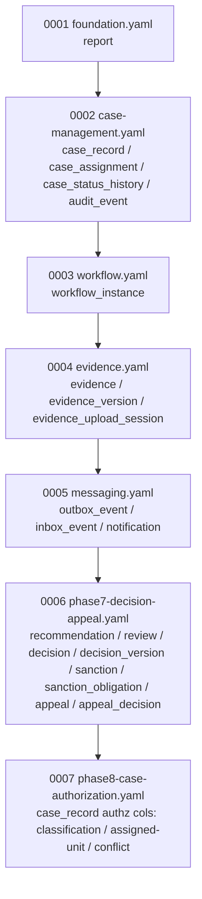

# Liquibase Migrations

**Category:** data
**Engine:** Liquibase 4.31.1
**Master changelog:** 7 releases (`db.changelog-master.yaml`)
**Authoritative store:** PostgreSQL 18.3-alpine, owned by `sentinel-persistence`
**Camunda schema:** migrated separately via `CamundaSchemaMigrator` with `databaseSchemaUpdate=false` (NOT part of the Liquibase master)

> All claims on this page are FACT-grounded in `.docgen/evidence/data-schema.md` and `.docgen/evidence/adr-landscape.md`, cross-referenced against `.docgen/model/system.json` and `.docgen/model/catalogs.json`.

---

## Changelog Structure

FACT structure:

- The master changelog (`db.changelog-master.yaml`) includes **7 releases**, each a discrete changeset file.
- Every transactional table carries `id` / `created_at` / `created_by` / `updated_at` / `updated_by` / `version` (convention enforced by the changelog).
- All timestamps are `TIMESTAMPTZ`; PKs are UUIDs.
- Unique constraints, FKs, check constraints, and partial indexes are declared per release.
- Append-only tables (`audit_event`) are exempt from version churn.
- Camunda `ACT_*` tables are **not** in this master; they are applied by `CamundaSchemaMigrator` with `databaseSchemaUpdate=false` (ADR-002: Camunda = orchestration position only).

---

## Release Inventory

| Release | Changelog file | Scope | Key tables | Evidence |
|---|---|---|---|---|
| 0001 | `foundation.yaml` | Foundation | `report` | `data-schema.md` |
| 0002 | `case-management.yaml` | Case management + audit | `case_record`, `case_assignment`, `case_status_history`, `audit_event` | `data-schema.md` |
| 0003 | `workflow.yaml` | Workflow correlation | `workflow_instance` | `data-schema.md` |
| 0004 | `evidence.yaml` | Evidence lifecycle | `evidence`, `evidence_version`, `evidence_upload_session` | `data-schema.md` |
| 0005 | `messaging.yaml` | Messaging reliability | `outbox_event`, `inbox_event`, `notification` | `data-schema.md`, `messaging-topics.md` |
| 0006 | `phase7-decision-appeal.yaml` | Decision / appeal | `recommendation`, `review`, `decision`, `decision_version`, `sanction`, `sanction_obligation`, `appeal`, `appeal_decision` | `data-schema.md`, `domain-lifecycle.md` |
| 0007 | `phase8-case-authorization.yaml` | Case authorization | classification / assigned-unit / conflict support columns on `case_record` | `data-schema.md`, `authorization-model.md` |

---

## Rollback and Discipline

FACT discipline and caveats:

- **Release order is cumulative and append-only.** New schema evolution adds a new release file; existing releases are not rewritten.
- **Optimistic locking discipline** is encoded by the `version` column on every mutable transactional table; the changelog guarantees its presence (see [persistence-patterns](../../data/persistence-patterns.md)).
- **Append-only `audit_event`** (release 0002) is exempt from version churn — by design, no UPDATE path.
- Phase 8 regression loop fixed a **malformed MyBatis dynamic-SQL branch in case listing** and **stale integration-test unit identifiers for the assigned-unit model** (release 0007); the schema itself for 0007 was already aligned.
- **Known gaps:** later-state prerequisites lighter than master target (`gap-later-state-prerequisites`); enforcement-monitoring detail incomplete (`gap-enforcement-monitoring`).

Rollback posture: the evidence does not assert automated Liquibase `rollback` changesets for these releases. Treat releases as forward-only in practice; coordinate any rollback with the outbox/inbox state and Camunda correlation rows.

---

## Running Migrations

FACT commands and ownership:

- Migrations are applied by `sentinel-bootstrap` (entry point, Liquibase/Camunda migration mains) and owned by `sentinel-persistence` at runtime.
- The integration suite verifies runtime schema lifecycle via `ApplicationRuntimeSchemaLifecycleIT` (Testcontainers PostgreSQL), confirming all 7 releases apply and tables are present. See [module-integration-tests](../modules/module-integration-tests.md).

| Step | Actor | Note |
|---|---|---|
| Build reactor | `mvn` (Makefile `make verify`) | Full reactor incl. persistence |
| Apply Liquibase | `sentinel-bootstrap` migration main | 7 releases, PostgreSQL 18.3-alpine |
| Apply Camunda schema | `CamundaSchemaMigrator` (`databaseSchemaUpdate=false`) | Separate from Liquibase master |
| Verify at runtime | `ApplicationRuntimeSchemaLifecycleIT` | Tables present post-migration |

---

## Lock Handling Note

FACT:

- Liquibase uses its standard `DATABASECHANGELOGLOCK` table to serialize migrations across instances.
- **Caveat:** if a previous migration process is killed mid-apply, the lock row can remain held, blocking subsequent runs. Clear the lock only after confirming no migration is in flight (inspect `DATABASECHANGELOGLOCK`; do not drop the changelog tables).
- This lock is independent of the **outbox `FOR UPDATE SKIP LOCKED` lease** (`APP_INSTANCE_ID`, duration `PT30S`, batch 20, poll `PT2S`) used at runtime — do not confuse the two. The outbox lease is a runtime reliability mechanism, not a migration lock. See [persistence-patterns](../../data/persistence-patterns.md) and [operations-runbooks](../../docs/runbooks/outbox-stuck.md).

---

## Related Pages

- [Data Model Overview](../../data/data-model-overview.md) — table ownership & source of truth
- [Persistence Patterns](../../data/persistence-patterns.md) — MyBatis, optimistic locking, outbox/inbox
- [Operations Runbooks](../../docs/runbooks/) — outbox-stuck, dead-letter-events, kafka-backlog
- [Deployment Topology](../../.docgen/evidence/deployment-topology.md) — container/version matrix
- [ADR Landscape](../../docs/adr/) — ADR-002 (state of truth), ADR-003 (MyBatis), ADR-010 (audit log)
