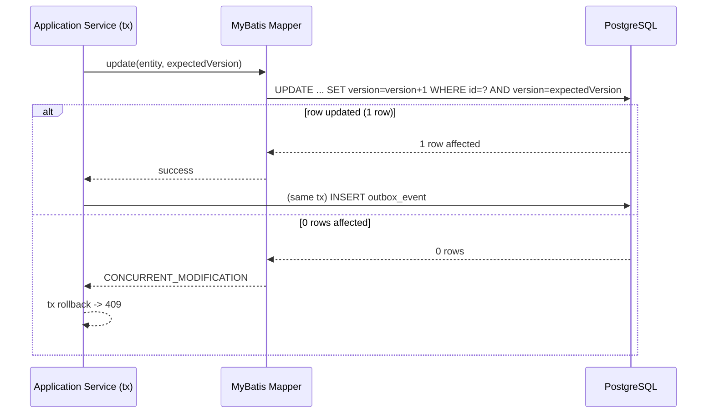

# Persistence Patterns

**Category:** data
**Module owner:** `sentinel-persistence` (infrastructure)
**Engine:** PostgreSQL 18.3-alpine; MyBatis mappers + Liquibase (7 releases); HikariCP pool
**ADRs:** ADR-003 (MyBatis over ORM), ADR-004 (transactional outbox), ADR-005 (inbox idempotency), ADR-008 (optimistic locking)

> All claims on this page are FACT-grounded in `.docgen/evidence/data-schema.md`, `.docgen/evidence/messaging-topics.md`, `.docgen/evidence/adr-landscape.md`, and `.docgen/evidence/module-catalog.md`, cross-referenced against `.docgen/model/system.json`, `.docgen/model/catalogs.json`, and `.docgen/model/flows.json`.

---

## MyBatis and HikariCP

FACT:

- `sentinel-persistence` provides **MyBatis mappers, repository adapters, Liquibase changelog, and type handlers** (per `module-catalog.md`).
- The domain does **not** depend on Jersey/MyBatis/Kafka/MinIO/Camunda/Keycloak; persistence is reached only via ports implemented by this adapter (dependency direction: `application -> persistence` is `port-adapter`).
- JDBC connection pooling uses **HikariCP** (internal service network to `postgres:5432`; `DB_URL/USER/PASSWORD` via env — see `deployment-topology`).
- Safe dynamic SQL is required for list queries. **Phase 8 regression loop fixed a malformed MyBatis dynamic-SQL branch in case listing** — list queries must use the parameterized `list-query-pattern`, never string concatenation (see `rf-list-cases`).

---

## Optimistic Locking

FACT mechanism (ADR-008):

- Every mutable transactional table carries a `version` column (set by the changelog).
- Write path: `UPDATE ... SET version=version+1 WHERE id=#{id} AND version=#{expectedVersion}`.
- **0 rows affected ⇒ `409 CONCURRENT_MODIFICATION`** (mapped to RFC-7807 `ErrorResponse`).
- Append-only `audit_event` is exempt from version churn.

This pattern is the persistence half of `df-optimistic-lock` and backs the transition/case/assignment concurrency tests (see [module-integration-tests](../modules/module-integration-tests.md)).

---

## Outbox and Inbox Tables

FACT (release 0005; ADR-004 transactional outbox, ADR-005 inbox idempotency):

- **Outbox:** business change + `outbox_event` insert happen in the **same DB transaction**; `key=aggregateId` for per-aggregate ordering. (`df-outbox-to-kafka`)
- **Publisher:** `KafkaOutboxPublisher` leases pending rows with `FOR UPDATE SKIP LOCKED` (lease owner `APP_INSTANCE_ID`, duration `PT30S`, batch 20, poll `OUTBOX_POLL_INTERVAL=PT2S`), publishes to Kafka, then marks `PUBLISHED`.
- **Kafka outage resilience:** outage does **not** roll back committed business writes; pending outbox rows remain retryable (verified by `MessagingReliabilityIT`; `inv-outbox-not-rolled-back`).
- **Inbox:** `KafkaNotificationConsumer` writes `inbox_event` with `UNIQUE(consumer_name, event_id)`; duplicate delivery ⇒ at most one notification side effect per consumer (`df-notification-result-inbox`; `inv-one-side-effect-per-event`).
- **Retry/DLQ:** failures route to `.retry`; repeated failures to `.dlq`; `NOTIFICATION_MAX_RETRIES` default 3; `NOTIFICATION_CONSUMER_GROUP_ID` via env.
- Runbooks: [outbox-stuck](../../docs/runbooks/outbox-stuck.md), [dead-letter-events](../../docs/runbooks/dead-letter-events.md), [kafka-backlog](../../docs/runbooks/kafka-backlog.md).

---

## Query and Performance Standards

FACT standards:

| Standard | Mechanism | Evidence |
|---|---|---|
| Cursor paging | `listCases` uses `cursor + limit + q + searchField + sortBy`; authorization filtering no looser than item GET | `endpoint-catalog`, `authorization-model` |
| Safe dynamic SQL | Parameterized `list-query-pattern` (malformed branch fixed in phase 8) | `module-catalog.md`, `testing-strategy.md` |
| Partial indexes | Status/assignment/visibility columns indexed for scoped queries | `data-schema.md` |
| Connection pool | HikariCP to `postgres:5432` (internal network) | `deployment-topology` |
| Outbox poll tuning | `OUTBOX_POLL_INTERVAL=PT2S`, batch 20, lease `PT30S` | `messaging-topics.md`, `deployment-topology` |

**Gap:** load/performance review + failure-injection + metrics/dashboards remain outstanding (`gap-load-perf-review`); no throughput/latency budgets yet asserted.

---

## Why MyBatis Over ORM (ADR-003)

FACT rationale (ADR-003):

- Explicit, reviewable SQL keeps the domain free of ORM-managed entity graphs and lazy-loading surprises; persistence is a port-adapter behind the application layer.
- Per-table mappers + type handlers give precise control over UUID PKs, `TIMESTAMPTZ`, optimistic-lock `version` writes, and partial indexes.
- Dynamic SQL is bounded to the parameterized `list-query-pattern`, avoiding injection and the phase-8 malformed-branch class of bug.
- Liquibase owns schema evolution (7 releases), keeping SQL and schema in lockstep under `sentinel-persistence`.

Trade-off caveat: MyBatis shifts more SQL authoring to the team vs. an ORM's automatic mapping; this is accepted deliberately for control and testability (unit + integration via Testcontainers).

---

## Pattern → Mechanism → Evidence

| Pattern | Mechanism | Evidence |
|---|---|---|
| MyBatis mappers / adapters | Mapper XML + repository adapters behind ports; HikariCP | `module-catalog.md`, `data-schema.md` |
| Liquibase schema | 7 releases, `version`/`TIMESTAMPTZ`/UUID conventions | `data-schema.md`, `system.json` |
| Optimistic locking | `UPDATE ... SET version=version+1 WHERE id AND version=expected`; 0 rows ⇒ 409 | `data-schema.md`, `adr-landscape` (ADR-008) |
| Transactional outbox | business change + `outbox_event` insert same tx; `key=aggregateId` | `messaging-topics.md`, `data-schema.md` (ADR-004) |
| Outbox publisher lease | `FOR UPDATE SKIP LOCKED`; `APP_INSTANCE_ID`; `PT30S`; batch 20; `PT2S` poll | `messaging-topics.md`, `deployment-topology` |
| Inbox idempotency | `UNIQUE(consumer_name, event_id)`; at most one side effect | `messaging-topics.md`, `data-schema.md` (ADR-005) |
| Retry / DLQ | `.retry` then `.dlq`; `NOTIFICATION_MAX_RETRIES=3`; `NOTIFICATION_CONSUMER_GROUP_ID` | `messaging-topics.md` |
| Audit append | `audit_event` insert, exempt from version churn | `data-schema.md`, `adr-landscape` (ADR-010) |
| Safe list query | parameterized `list-query-pattern` (phase-8 fix) | `module-catalog.md`, `testing-strategy.md` |

---

## Related Pages

- [Data Model Overview](../../data/data-model-overview.md) — table ownership & source of truth
- [Liquibase Migrations](../../data/liquibase-migrations.md) — 7-release changelog
- [Outbox Reliability](../messaging/outbox-reliability.md) — runtime outbox behavior
- [Inbox Idempotency](../messaging/inbox-idempotency.md) — dedup semantics
- [ADR Landscape](../../docs/adr/) — ADR-003/004/005/008/010
- [Module: Integration Tests](../modules/module-integration-tests.md) — `MessagingReliabilityIT` proof
