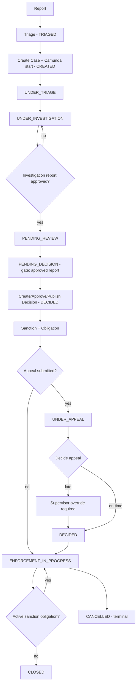
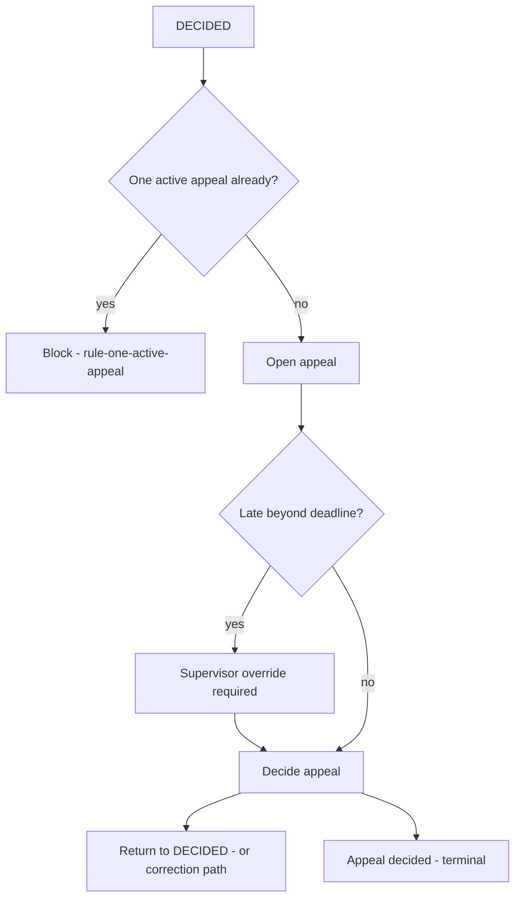
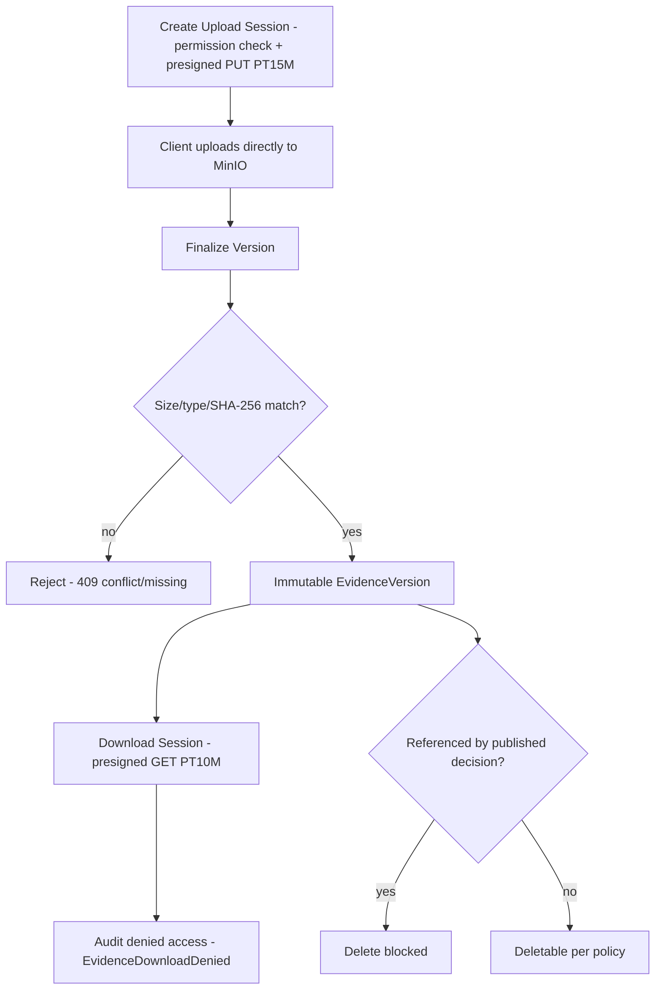

# Business Flows

**Category:** flows
**Audience:** engineer, business-analyst, product
**Coverage tags:** business-flow, state-lifecycle
**Evidence:** [domain-lifecycle](../../.docgen/evidence/domain-lifecycle.md), [endpoint-catalog](../../.docgen/evidence/endpoint-catalog.md), [workflow-camunda](../../.docgen/evidence/workflow-camunda.md), [evidence-storage](../../.docgen/evidence/evidence-storage.md)
**Models:** [flows.json](../../.docgen/model/flows.json), [business.json](../../.docgen/model/business.json)

---

## Orientation (newcomer)

This page describes the **business flows** of the Sentinel Enforcement Platform — the end-to-end enforcement case lifecycle, the appeal subprocess, and the evidence collection sub-flow. These are written as **business steps independent of implementation**: they describe what happens, not which module or table does it.

Three flows are cataloged:

1. **End-to-End Enforcement Case Lifecycle** — report → triage → case → investigation → decision → sanction → appeal → enforcement → close.
2. **Appeal Subprocess** — the branch that opens when a decision is appealed.
3. **Evidence Collection Sub-flow** — upload session → finalize → immutable version → download with audit.

Every flow is grounded in `flows.json.businessFlows` and the domain-lifecycle / endpoint-catalog evidence.

## Working model (maintainer)

- All state transitions trace to `CaseStatus` enum transitions in `domain-lifecycle` (FACT).
- The case lifecycle is **also** driven by the embedded Camunda `regulatory-enforcement-case.bpmn`; Camunda is orchestration position only (ADR-002), domain is source of truth.
- The appeal subprocess can loop the case back to `DECIDED`; late appeals require supervisor override (`rule-late-appeal-supervisor`).
- Evidence finalize failure modes: checksum mismatch / missing object → `409`; storage unavailable → `503`.

## End-to-End Enforcement Case Lifecycle

Business steps (FACT, `bf-case-lifecycle`):

1. Report submitted → triage (moves to `TRIAGED`).
2. Triage → create case (starts Camunda process by business key `caseId`; `CREATED`).
3. `CREATED → UNDER_TRIAGE → UNDER_INVESTIGATION`.
4. Investigation → approved investigation report → `PENDING_REVIEW`.
5. `PENDING_REVIEW → PENDING_DECISION` (requires approved investigation report — `rule-pending-decision-gate`).
6. Create / approve / publish decision (`DECIDED`; published decision immutable — `rule-published-decision-immutable`).
7. Sanction + obligation (active obligation blocks close — `rule-no-close-with-active-sanction`; changer ≠ approver — `rule-sanction-changer-not-approver`).
8. Appeal (`UNDER_APPEAL`) → decide (`DECIDED`) or apply deadline override.
9. Enforcement (`ENFORCEMENT_IN_PROGRESS`).
10. Close (`CLOSED`) or cancel (`CANCELLED`, terminal).

## Appeal Subprocess

Business steps (FACT, `bf-appeal-subprocess`):

1. `DECIDED →` create appeal (one active per decision — `rule-one-active-appeal`).
2. Appeal open → decide appeal.
3. Late appeal requires supervisor override (`rule-late-appeal-supervisor`, `decision-appeal-deadline-override`).
4. Appeal decided → case returns to `DECIDED` (or correction path).

## Evidence Collection Sub-flow

Business steps (FACT, `bf-evidence-collection`):

1. Create upload session (permission check; presigned PUT URL, TTL `PT15M`).
2. Client uploads object directly to MinIO.
3. Finalize version (verify size/type/SHA-256) → immutable `EvidenceVersion`.
4. Download session (presigned GET, TTL `PT10M`) with audit of denied access (`EvidenceDownloadDenied`).
5. Evidence referenced by published decision cannot be deleted (`rule-evidence-published-decision-protected`).

## Business Preconditions and Outcomes

| Use-case | Trigger | Evidence |
|---|---|---|
| Create Report | `intake-officer POST /api/v1/reports` | endpoint-catalog, domain-lifecycle |
| Triage Report | `triage-officer POST /api/v1/reports/{reportId}/triage` | endpoint-catalog, domain-lifecycle |
| Create Case (starts Camunda) | `POST /api/v1/cases` (requires triaged report) | endpoint-catalog, workflow-camunda |
| Assign Case | `POST /api/v1/cases/{caseId}/assignments` | endpoint-catalog, authorization-model |
| Transition Case | `POST /api/v1/cases/{caseId}/transitions` | endpoint-catalog, domain-lifecycle |
| Create Recommendation | `POST /api/v1/cases/{caseId}/recommendations` | endpoint-catalog, domain-lifecycle |
| Submit Recommendation (maker-checker) | `POST /api/v1/recommendations/{recommendationId}/submit` | endpoint-catalog, domain-lifecycle |
| Review Recommendation | `POST /api/v1/recommendations/{recommendationId}/reviews` | endpoint-catalog, domain-lifecycle |
| Create Decision | `POST /api/v1/cases/{caseId}/decisions` | endpoint-catalog, domain-lifecycle |
| Approve Decision (maker ≠ approver) | `POST /api/v1/decisions/{decisionId}/approve` | endpoint-catalog, domain-lifecycle |
| Publish Decision (immutable) | `POST /api/v1/decisions/{decisionId}/publish` | endpoint-catalog, domain-lifecycle |
| Create Appeal (one active) | `POST /api/v1/decisions/{decisionId}/appeals` | endpoint-catalog, domain-lifecycle |
| Decide Appeal (deadline override) | `POST /api/v1/appeals/{appealId}/decide` | endpoint-catalog, domain-lifecycle |
| Evidence Upload Session | `POST /api/v1/cases/{caseId}/evidence/upload-sessions` | endpoint-catalog, evidence-storage |
| Finalize Evidence Version | `POST /api/v1/evidence/{evidenceId}/versions/finalize` | endpoint-catalog, evidence-storage |
| Evidence Download Session | `POST /api/v1/evidence/{evidenceId}/download-sessions` | endpoint-catalog, evidence-storage, domain-lifecycle |
| Workflow Task List/Claim/Complete | `GET/POST /api/v1/tasks/*` | endpoint-catalog, workflow-camunda |
| Workflow Reconciliation | `GET/POST /api/v1/workflow-reconciliation*` | endpoint-catalog, workflow-camunda |

### Preconditions (key)

- Case creation requires a **triaged** source report.
- `PENDING_DECISION` requires an **approved investigation report**.
- Decision **publish** makes the decision immutable.
- Case **CLOSE** requires **no active sanction obligation**.
- **Reopen** of a `CLOSED` case requires an **approved reopen**.
- Late appeal requires **supervisor override**.
- Evidence **finalize** requires matching size/type/SHA-256.

### Outcomes (key)

- Terminal case states: `CLOSED`, `CANCELLED`.
- Published decision: immutable; later change only via correction/appeal.
- Evidence version: immutable after finalize.
- Appeal: at most one active per decision; decided is terminal.

## Related pages

- [Case Lifecycle](../business-domain/case-lifecycle.md)
- [Control Flows](../architecture/control-flows.md) — *linked by manifest `control-flows`; verify canonical path*
- [Event Flows](../architecture/event-flows.md) — *linked by manifest `event-flows`; verify canonical path*
- [Appeal Lifecycle](../business-domain/appeal-lifecycle.md)
- [Evidence Lifecycle](../business-domain/evidence-lifecycle.md)
