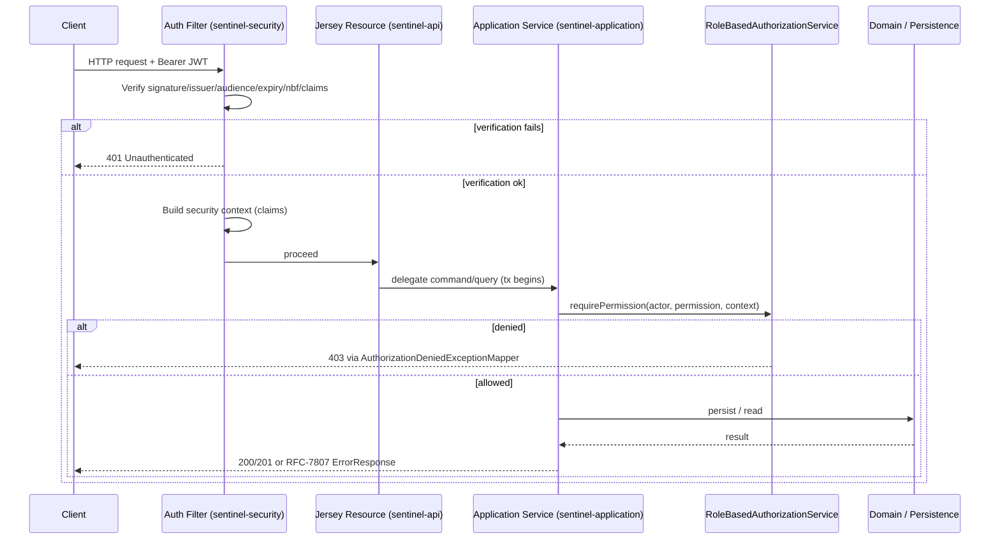
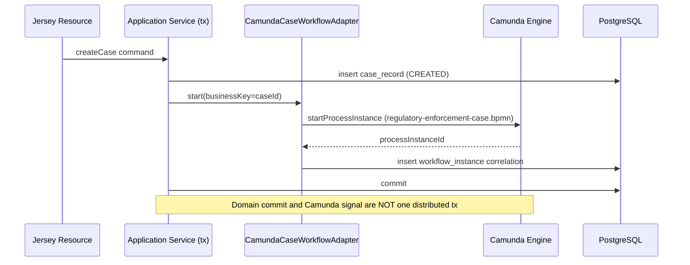
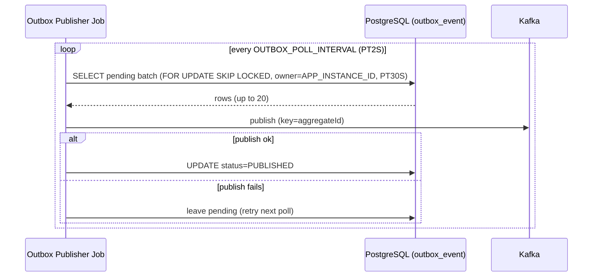

# Control Flows

Execution and control flows inside the Sentinel Enforcement Platform: how an HTTP request moves through the auth filter to a handler, how case creation starts the embedded Camunda process, how the workflow reconciliation job repairs mismatch, how the outbox polling publisher emits Kafka events, and how the investigation escalation boundary timer fires.

All claims are grounded in the evidence artifacts listed at the end of this page.

## HTTP Request to Handler

Every authenticated request enters the Jersey edge, is validated by the authentication filter, then delegates to an application service inside a transaction boundary. Unauthenticated or unauthorized requests are rejected before reaching domain logic.

| Step | Action | Layer | Evidence |
|---|---|---|---|
| 1 | JWT verified (signature, issuer, audience, expiry, not-before, required claims) | sentinel-security | authorization-model.md |
| 2 | Security context populated with claims: `jurisdictions`, `assigned_units`, `case_classifications`, `conflicted_actor_ids` | sentinel-security | authorization-model.md |
| 3 | Jersey resource delegates to application service (transaction boundary opens) | sentinel-api -> sentinel-application | endpoint-catalog.md |
| 4 | Authorization policy evaluated via `RoleBasedAuthorizationService` | sentinel-security | authorization-model.md |
| 5 | Denial -> `401` (no token) or `403` (role/jurisdiction/unit/classification/conflict/assignment) via mappers | sentinel-api | authorization-model.md |

The JWT is never accepted as an unsigned decode (no claim-only decode). The filter rejects any token that fails signature or required-claim verification before a security context is built.

## Case Creation Starts Camunda

`POST /api/v1/cases` requires a triaged source report and starts the embedded Camunda process. Per ADR-002, the domain database remains the business state of truth; Camunda tracks only orchestration position. The `workflow_instance` correlation row ties the two together.

| Step | Action | Layer | Evidence |
|---|---|---|---|
| 1 | `createCase` command validated and run inside a DB transaction | sentinel-application | endpoint-catalog.md |
| 2 | `CamundaCaseWorkflowAdapter.start(businessKey=caseId)` | sentinel-workflow | workflow-camunda.md |
| 3 | `workflow_instance` correlation row written (caseId, processInstanceId, def id/version, businessKey, status) | sentinel-persistence / sentinel-workflow | workflow-camunda.md |
| 4 | `regulatory-enforcement-case.bpmn` already auto-deployed on startup | sentinel-workflow | workflow-camunda.md |

The domain update and the Camunda signal are **not** in one distributed transaction. A committed domain write with a failed process start is covered by the reconciliation job (below).

## Workflow Reconciliation Job

`WorkflowReconciliationApplicationService` detects domain/workflow mismatch. Mismatches are exposed via `GET /api/v1/workflow-reconciliation` (supervisor-scoped) and repaired or terminated via `POST /api/v1/workflow-reconciliation/{caseId}/actions`.

| Step | Action | Layer | Evidence |
|---|---|---|---|
| 1 | Detect domain/workflow mismatch | sentinel-application / sentinel-workflow | workflow-camunda.md |
| 2 | `GET /api/v1/workflow-reconciliation` lists issues (supervisor scope) | sentinel-api | endpoint-catalog.md |
| 3 | `POST .../actions` auto-repairs or terminates case | sentinel-application | endpoint-catalog.md |

This job is the safety net for the "domain update succeeded but workflow signal failed" and "task completed but domain command failed" failure modes described in the master prompt.

## Outbox Polling Loop

The outbox publisher is a periodic job that leases pending `outbox_event` rows and publishes them to Kafka, marking them `PUBLISHED`. It is safe against duplicate publish and survives Kafka outages because pending rows remain retryable.

| Step | Action | Layer | Evidence |
|---|---|---|---|
| 1 | Poll pending rows every `OUTBOX_POLL_INTERVAL` (PT2S), batch `OUTBOX_BATCH_SIZE` (20) | sentinel-messaging | deployment-topology.md |
| 2 | Lease with `FOR UPDATE SKIP LOCKED` (owner `APP_INSTANCE_ID`, duration `OUTBOX_LEASE_DURATION` PT30S) | sentinel-persistence | messaging-topics.md |
| 3 | Publish to Kafka topic with key=`aggregateId` (per-aggregate ordering) | sentinel-messaging | messaging-topics.md |
| 4 | Mark row `PUBLISHED` | sentinel-persistence | messaging-topics.md |
| 5 | Duplicate publish prevented by lease ownership + SKIP LOCKED | sentinel-messaging | messaging-topics.md |

Kafka outage does **not** roll back committed business writes; pending outbox rows remain retryable (verified by `MessagingReliabilityIT`).

## Investigation Escalation Timer

`InvestigationEscalationDelegate` is attached as a Camunda boundary timer on the investigation task. When the timer fires, it escalates the investigation.

| Step | Action | Layer | Evidence |
|---|---|---|---|
| 1 | Boundary timer starts on investigation task | sentinel-workflow | workflow-camunda.md |
| 2 | Duration `WORKFLOW_INVESTIGATION_ESCALATION_DURATION` (default PT30M) | sentinel-workflow | deployment-topology.md |
| 3 | `InvestigationEscalationDelegate` escalates investigation on timeout | sentinel-workflow | workflow-camunda.md |

## Cross-References

- [Inbound Request Flows](request-flows.md) — per-endpoint request detail.
- [Traffic and Trust-Boundary Flows](traffic-flows.md) — network hops and trust boundaries.
- [Data Flows](data-flows.md) — how data moves across stores.
- [Camunda Workflow](../architecture/camunda-workflow.md) — orchestration detail (if present).
- [Outbox Reliability](../architecture/outbox-reliability.md) — publisher/inbox reliability.

## Evidence

- `.docgen/evidence/endpoint-catalog.md`
- `.docgen/evidence/authorization-model.md`
- `.docgen/evidence/workflow-camunda.md`
- `.docgen/evidence/messaging-topics.md`
- `.docgen/evidence/deployment-topology.md`
- `.docgen/model/flows.json`
- `.docgen/model/system.json`
