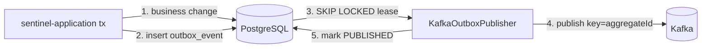
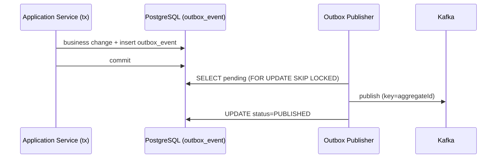

# Data Flows

How data moves and is transformed across persistence and stores in the Sentinel Enforcement Platform: report creation to DB, transactional outbox to Kafka, notification result to inbox, evidence presigned upload/finalize, the optimistic-locking write path, and the append-only audit and case-status-history writes.

All claims are grounded in the evidence artifacts listed at the end of this page.

## Report Create to DB

| Flow | Source | Sink | Transformation | Persistence | Evidence |
|---|---|---|---|---|---|
| Report Create to DB | sentinel-api | postgres (`report`) | DTO -> domain `Report` -> persistence (UUID, version, timestamps, `created_by`) | `report` table (release 0001) | endpoint-catalog.md, data-schema.md |

`createReport` maps the request DTO to a domain `Report`, persists it with the standard audit columns, and returns 201 on an authorized intake officer.

## Outbox to Kafka

| Flow | Source | Sink | Transformation | Persistence | Evidence |
|---|---|---|---|---|---|
| Transactional Outbox to Kafka | sentinel-application | kafka | Business change + `outbox_event` insert in same tx; key=`aggregateId` for per-aggregate ordering | `outbox_event` table (release 0005) | messaging-topics.md, data-schema.md, adr-landscape.md |

The outbox pattern (ADR-004) keeps domain mutation and event emission atomic. The polling publisher leases and publishes rows; Kafka outage leaves rows pending and retryable.

## Notification Result to Inbox

| Flow | Source | Sink | Transformation | Persistence | Evidence |
|---|---|---|---|---|---|
| Notification Result to Inbox | kafka (`notification.result.v1`) | sentinel-application (notification side effect) | `KafkaNotificationConsumer` writes `inbox_event` (`UNIQUE(consumer_name,event_id)`); `NotificationEventHandler` produces at most one side effect | `inbox_event` + `notification` tables (release 0005) | messaging-topics.md, data-schema.md |

Inbox idempotency (ADR-005) guarantees duplicate delivery produces at most one notification side effect.

## Evidence Presigned Upload/Finalize

| Flow | Source | Sink | Transformation | Persistence | Evidence |
|---|---|---|---|---|---|
| Evidence Presigned Upload/Finalize | sentinel-api | minio (object) + postgres (metadata) | Presigned PUT URL (TTL PT15M) -> client upload -> finalize verifies size/type/SHA-256 -> immutable `EvidenceVersion`; download presigned GET (TTL PT10M) + audit denied | `evidence`, `evidence_version`, `evidence_upload_session` (release 0004); MinIO bucket `sentinel-evidence` | evidence-storage.md, endpoint-catalog.md, data-schema.md |

Object key pattern: `/{jurisdiction}/{caseId}/{evidenceId}/{version}/{generatedFileName}`. Path traversal is prevented; filename/media type are not trusted from the client.

## Optimistic Locking Write Path

| Flow | Source | Sink | Transformation | Persistence | Evidence |
|---|---|---|---|---|---|
| Optimistic Locking Write Path | sentinel-application | postgres | `UPDATE ... SET version=version+1 WHERE id=#{id} AND version=#{expectedVersion}`; 0 rows -> 409 `CONCURRENT_MODIFICATION` | All mutable transactional tables carry a `version` column | data-schema.md, adr-landscape.md |

Optimistic locking (ADR-008) prevents silent overwrite. Two concurrent updates on the same aggregate yield one success and one 409.

## Audit and Status History Append

| Flow | Source | Sink | Transformation | Persistence | Evidence |
|---|---|---|---|---|---|
| Audit Event Append | sentinel-application | postgres (`audit_event`) | Append-only insert; exempt from version churn | `audit_event` table (release 0002) | data-schema.md, adr-landscape.md |
| Case Status History | sentinel-application | postgres (`case_status_history`) | Status transition appended to history; exposed via `getCaseAuditEvents` | `case_status_history` table (release 0002) | endpoint-catalog.md, data-schema.md |

Both are append-only and feed the audit/status history views without mutating prior rows.

## Data Flow Summary Table

| Data flow | Source | Sink | Transformation | Persistence |
|---|---|---|---|---|
| Report Create to DB | sentinel-api | postgres | DTO -> domain -> persistence | `report` |
| Outbox to Kafka | sentinel-application | kafka | same-tx outbox insert; key=aggregateId | `outbox_event` |
| Notification Result to Inbox | kafka | sentinel-application | inbox dedup; one side effect | `inbox_event`, `notification` |
| Evidence Presigned Upload/Finalize | sentinel-api | minio + postgres | verify size/type/SHA-256; immutable version | `evidence`, `evidence_version`, `evidence_upload_session` |
| Optimistic Locking Write Path | sentinel-application | postgres | version=version+1 WHERE version=expected | all mutable tables |
| Audit and Status History Append | sentinel-application | postgres | append-only insert | `audit_event`, `case_status_history` |

## Cross-References

- [Data Model Overview](../business-domain/data-model-overview.md) — schema catalog.
- [Persistence Patterns](../architecture/persistence-patterns.md) — MyBatis and Liquibase.
- [Outbox Reliability](../architecture/outbox-reliability.md) — publisher/inbox detail.
- [Event Flows](event-flows.md) — Kafka topic event flows.

## Evidence

- `.docgen/evidence/endpoint-catalog.md`
- `.docgen/evidence/data-schema.md`
- `.docgen/evidence/messaging-topics.md`
- `.docgen/evidence/evidence-storage.md`
- `.docgen/evidence/adr-landscape.md`
- `.docgen/model/flows.json`
- `.docgen/model/catalogs.json`
- `.docgen/model/system.json`
