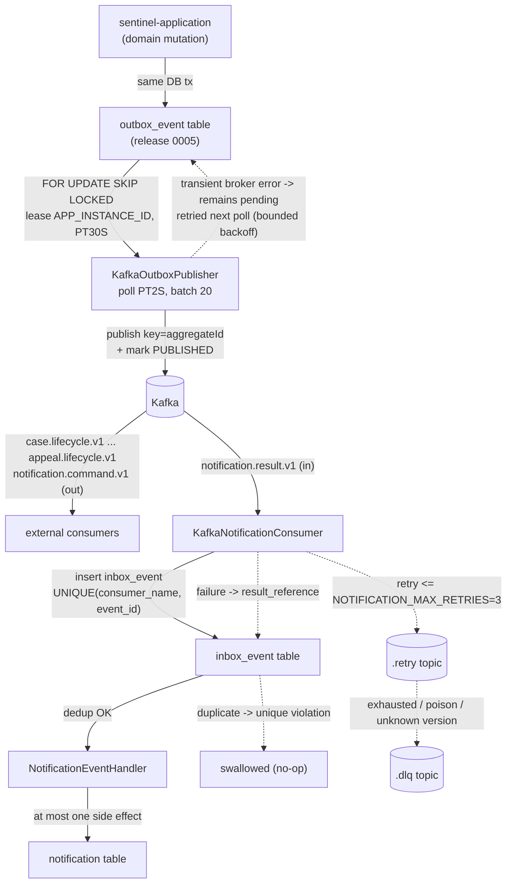

# Event and Message Flows

How the Sentinel Enforcement Platform emits and consumes Kafka events: the eight topics enumerated in `MessagingTopics.java`, the transactional outbox that guarantees emission, the inbox that guarantees idempotent consumption, and the retry/dead-letter routing for poison messages.

All claims on this page are grounded in [messaging-topics.md](../.docgen/evidence/messaging-topics.md), [data-schema.md](../.docgen/evidence/data-schema.md), [flows.json](../.docgen/model/flows.json), and [catalogs.json](../.docgen/model/catalogs.json). See also [Data Flows](data-flows.md), [ADR-004: Transactional Outbox](../adr/ADR-004-transactional-outbox.md), [ADR-005: Inbox Idempotency](../adr/ADR-005-inbox-idempotency.md), and the [Message Handler Catalog](#topic--direction--producer--consumer--key--idempotency) below.

**Coverage tags:** `event-flow`, `message-handler-catalog`, `data-flow`

## Topic → Direction → Producer → Consumer → Key → Idempotency

This is the exhaustive normalized catalog of all eight Kafka topics. `out` = produced by the platform via the outbox; `in` = consumed by the platform from an external producer.

| Topic | Direction | Producer | Consumer | Key | Idempotency |
|---|---|---|---|---|---|
| `case.lifecycle.v1` | out | application (outbox / `KafkaOutboxPublisher`) | external consumers | `caseId` | inbox `UNIQUE(consumer_name, event_id)` |
| `case.assignment.v1` | out | application (outbox / `KafkaOutboxPublisher`) | external consumers | `aggregateId` | inbox `UNIQUE(consumer_name, event_id)` |
| `evidence.lifecycle.v1` | out | application (outbox / `KafkaOutboxPublisher`) | external consumers | `aggregateId` | inbox `UNIQUE(consumer_name, event_id)` |
| `decision.lifecycle.v1` | out | application (outbox / `KafkaOutboxPublisher`) | external consumers | `aggregateId` | inbox `UNIQUE(consumer_name, event_id)` |
| `sanction.lifecycle.v1` | out | application (outbox / `KafkaOutboxPublisher`) | external consumers | `aggregateId` | inbox `UNIQUE(consumer_name, event_id)` |
| `appeal.lifecycle.v1` | out | application (outbox / `KafkaOutboxPublisher`) | external consumers | `aggregateId` | inbox `UNIQUE(consumer_name, event_id)` |
| `notification.command.v1` | out | application (outbox / `KafkaOutboxPublisher`) | notification processor | `aggregateId` | outbox dedup via `SKIP LOCKED` lease |
| `notification.result.v1` | in | notification processor | `KafkaNotificationConsumer` → `NotificationEventHandler` | `aggregateId` | `inbox_event UNIQUE(consumer_name, event_id)`; at most one side effect per event |

The full handler catalog (class names + semantics) lives in `catalogs.json → messageHandlers`. Platform-side producers all share `KafkaOutboxPublisher`; the single inbound consumer is `KafkaNotificationConsumer`, with `NotificationEventHandler` as the downstream processor. The `OutboxRepositoryMyBatisAdapter` and `InboxRepositoryMyBatisAdapter` persistence adapters own the `outbox_event` and `inbox_event` tables (release 0005).

## Outbound Lifecycle Events

Six outbound topics carry aggregate lifecycle events. Each is produced by the `sentinel-application` module within the same database transaction that mutates the domain, via an `outbox_event` insert (see [Outbox Reliability](#retry-and-dead-letter-routing) and [ADR-004](../adr/ADR-004-transactional-outbox.md)).

### Event envelope

Every outbound event shares a common envelope (`KafkaOutboxPublisher` serializes the row into a record keyed by the aggregate id):

| Field | Meaning |
|---|---|
| `eventId` | UUID, globally unique id of the event (used by consumer inbox dedup). |
| `eventType` | Concrete event name, e.g. `CaseOpened`, `EvidenceUploaded`. |
| `eventVersion` | Schema version of the event (topic is `…v1`). |
| `aggregateType` | Entity type, e.g. `CASE`, `EVIDENCE`, `DECISION`, `SANCTION`, `APPEAL`. |
| `aggregateId` | UUID of the affected aggregate; also the Kafka partition key. |
| `occurredAt` | TIMESTAMPTZ when the domain mutation committed. |
| `correlationId` | Traces the event back to the originating request/case. |
| `causationId` | Id of the event or command that caused this event. |
| `actor` | The authenticated principal (`created_by`) that performed the change. |
| `payload` | Type-specific body for the event type. |

### Per-topic detail

| Topic | Aggregate | Key | Concrete event types | Source boundary (endpoint / flow) |
|---|---|---|---|---|
| `case.lifecycle.v1` | Case | `caseId` | `CaseOpened`, `CaseTriaged`, `CaseUnderInvestigation`, `CasePendingReview`, `CasePendingDecision`, `CaseDecided`, `CaseUnderAppeal`, `CaseEnforcementInProgress`, `CaseClosed`, `CaseCancelled` | `createCase`, `transitionCase`, business flow `bf-case-lifecycle` |
| `case.assignment.v1` | Case assignment | `aggregateId` | `CaseAssigned`, `CaseReassigned`, `CaseUnassigned` | `assignCase` |
| `evidence.lifecycle.v1` | Evidence | `aggregateId` | `EvidenceUploaded`, `EvidenceVersionFinalized`, `EvidenceReferenced` | `createEvidenceUploadSession`, `finalizeEvidenceVersion`, flow `bf-evidence-collection` |
| `decision.lifecycle.v1` | Decision | `aggregateId` | `DecisionCreated`, `DecisionApproved`, `DecisionPublished` | `createDecision`, `approveDecision`, `publishDecision` |
| `sanction.lifecycle.v1` | Sanction | `aggregateId` | `SanctionIssued`, `SanctionObligationCreated`, `SanctionFulfilled` | decision publish → sanction + obligation step of `bf-case-lifecycle` |
| `appeal.lifecycle.v1` | Appeal | `aggregateId` | `AppealSubmitted`, `AppealDecided`, `AppealDeadlineOverridden` | `createAppeal`, `decideAppeal`, flow `bf-appeal-subprocess` |

**Lifecycle ordering key.** `case.lifecycle.v1` is keyed on `caseId` so all case state changes for a single case land on one partition and are delivered in commit order. The other five lifecycle topics are keyed on `aggregateId` (the specific aggregate row that changed), preserving per-aggregate ordering for that entity.

**Outbox pattern (atomic emission).** The domain mutation and the `outbox_event` insert happen in the *same* PostgreSQL transaction (MyBatis port, `OutboxRepositoryMyBatisAdapter`). They commit together or roll back together — there is no window where a state change is persisted but no event is queued. The `KafkaOutboxPublisher` then polls pending rows and publishes them asynchronously (see [Retry and Dead-Letter Routing](#retry-and-dead-letter-routing)).

> Note: `notification.command.v1` is also outbound but is documented separately below because it is a *command* (request to deliver a notification) rather than a domain *lifecycle* event, and because it feeds back into the platform via `notification.result.v1`.

## Notification Command and Result

The notification round-trip is the only inbound topic and the only place the platform acts as a Kafka *consumer*. It is built as a command/result pair.

### `notification.command.v1` (outbound)

| Aspect | Detail |
|---|---|
| Direction | out |
| Producer | `sentinel-application` (outbox) via `KafkaOutboxPublisher` |
| Consumer | notification processor (external; e.g. a mail/outbound dispatcher) |
| Key | `aggregateId` (typically the case or notification id) |
| Idempotency | outbox dedup via `SKIP LOCKED` lease — the publisher marks a row `PUBLISHED` and never re-publishes it (see [Ordering and Idempotency](#ordering-and-idempotency)) |
| Retry / DLQ | routed to `.retry` then `.dlq`; `NOTIFICATION_MAX_RETRIES` (default 3) |
| Envelope | same common envelope as lifecycle events; payload is a delivery instruction (channel, recipient, template, case reference) |

The command is emitted from within the business transaction that produced the triggering event (e.g. `DecisionPublished`), exactly like the lifecycle topics — so a notification request is never lost on commit.

### `notification.result.v1` (inbound)

| Aspect | Detail |
|---|---|
| Direction | in |
| Producer | notification processor (external) — emits the delivery outcome of a command |
| Consumer | `KafkaNotificationConsumer` → `NotificationEventHandler` |
| Key | `aggregateId` |
| Idempotency | `inbox_event` table with `UNIQUE(consumer_name, event_id)`; `KafkaNotificationConsumer` inserts the dedup row first, then `NotificationEventHandler` produces **at most one** notification side effect per event |
| Retry / DLQ | retry/DLQ controlled by `NOTIFICATION_MAX_RETRIES=3` and `NOTIFICATION_CONSUMER_GROUP_ID` |
| Side effect | the `notification` table (release 0005) records the delivery result (`result_reference` stored on failure) |

**Why two stages.** `KafkaNotificationConsumer` writes the `inbox_event` dedup row inside its consumer transaction; `NotificationEventHandler` then updates the `notification` projection. Because the `(consumer_name, event_id)` pair is unique, a redelivered result is a no-op at the dedup boundary and yields at most one projection update — exactly-once side effects despite at-least-once delivery. See [ADR-005: Inbox Idempotency](../adr/ADR-005-inbox-idempotency.md).

## Ordering and Idempotency

Kafka ordering is per-partition, so the platform keys every outbound record on the aggregate id:

- **Lifecycle topics** — `case.lifecycle.v1` uses `caseId`; `case.assignment.v1`, `evidence.lifecycle.v1`, `decision.lifecycle.v1`, `sanction.lifecycle.v1`, `appeal.lifecycle.v1` use `aggregateId`. All events for one aggregate hash to one partition and are delivered in the order they were committed.
- **Notification command/result** — `notification.command.v1` (out) and `notification.result.v1` (in) are keyed on `aggregateId` so a command and its result stay correlated per aggregate.

**Delivery semantics — at-least-once from the outbox.** The transactional outbox guarantees the event is emitted after the domain commit, but the publish step is not part of the original transaction. A crash between publish and `PUBLISHED` marking can cause a duplicate publish. The publisher is therefore idempotent:

- It leases pending rows with `FOR UPDATE SKIP LOCKED`, owned by `APP_INSTANCE_ID`, with a lease duration of `PT30S`.
- It publishes, then marks the row `PUBLISHED`. Already-published rows are never re-selected.
- `SKIP LOCKED` lets multiple app instances poll in parallel without contending on the same row.

**Consumption semantics — exactly-once side effects via the inbox.** Downstream consumers (and the platform's own `KafkaNotificationConsumer`) write to an `inbox_event` table with a `UNIQUE(consumer_name, event_id)` constraint. On redelivery the insert violates the unique constraint and is swallowed, so the handler logic runs once per event even though Kafka may deliver a duplicate. This converts the outbox's at-least-once guarantee into effectively exactly-once *side effects*.

> The outbox publisher poll runs on `OUTBOX_POLL_INTERVAL=PT2S`, batch size 20, lease `PT30S` (model `cf-outbox-publisher-loop`, job `job-outbox-publisher`). A Kafka outage never rolls back committed business writes — pending outbox rows simply remain retryable (verified by `MessagingReliabilityIT`). See [Data Flows](data-flows.md) for the outbox→Kafka and notification→inbox data flows.

## Retry and Dead-Letter Routing

Failure handling is split between the outbound publisher and the inbound consumer.

### Outbound publisher retry (bounded)

- `KafkaOutboxPublisher` re-attempts publishing of a leased, not-yet-`PUBLISHED` row on its next poll cycle.
- Leasing (`PT30S`, `SKIP LOCKED`, `APP_INSTANCE_ID` owner) bounds how long a row is held by one instance; if an instance dies, the lease expires and another instance picks the row up.
- Because marking `PUBLISHED` is the success signal, a transient broker error leaves the row pending and it is retried with bounded backoff via the poll loop. The system does not block the business transaction on broker availability.

### Consumer retry / DLQ (inbound and downstream)

- Inbound and notification-consumer failures are retried up to `NOTIFICATION_MAX_RETRIES` (default **3**), routed first to a `.retry` topic, then to a `.dlq` topic once retries are exhausted (model `ef-notification-result`, `ef-*` retry/dlq fields).
- On a consumer failure, the `inbox_event` row is logged with a `result_reference` capturing where the failure was recorded, so operators can correlate the DLQ message to the local failure record.
- Three classes of event reach the DLQ:
  1. **Poison events** — malformed/undecodeable payloads.
  2. **Unknown schema version** — `eventVersion` not supported by the consumer.
  3. **Retry-exceeded** — transient failures that exhausted `NOTIFICATION_MAX_RETRIES`.

### Event-flow topology with retry/DLQ branches

### Operator actions

| Symptom | Likely cause | Runbook / action |
|---|---|---|
| Outbox rows stuck `PENDING` | publisher not polling, or lease held by dead instance | [outbox-stuck.md](../runbooks/outbox-stuck.md) — check `APP_INSTANCE_ID` leases; verify poll loop health |
| Kafka backlog growing | consumers slow / broker lag | [kafka-backlog.md](../runbooks/kafka-backlog.md) — inspect lag, scale consumers, confirm `NOTIFICATION_CONSUMER_GROUP_ID` |
| Events in `.dlq` | poison event, unknown schema version, or retry-exceeded | [dead-letter-events.md](../runbooks/dead-letter-events.md) — inspect `result_reference`, replay or discard after triage |
| Notification never recorded | `notification.result.v1` not consumed / inbox dedup swallowed replay | [dead-letter-events.md](../runbooks/dead-letter-events.md) — confirm `inbox_event` already holds `(consumer_name, event_id)` before replaying |

## Related pages

- [Data Flows](data-flows.md) — outbox→Kafka and notification→inbox data transformations and ownership.
- [ADR-004: Transactional Outbox](../adr/ADR-004-transactional-outbox.md) — the atomic emission pattern.
- [ADR-005: Inbox Idempotency](../adr/ADR-005-inbox-idempotency.md) — the `UNIQUE(consumer_name, event_id)` exactly-once-side-effect guarantee.
- [Message Handler Catalog](catalogs.json) (`model → messageHandlers`) — full class-level catalog of `KafkaOutboxPublisher`, `KafkaNotificationConsumer`, `NotificationEventHandler`, and the `Outbox`/`Inbox` repository adapters.
- [Outbox Reliability](#retry-and-dead-letter-routing) and [Inbox Idempotency](#ordering-and-idempotency) — in-page anchors for the two core guarantees.
- Runbooks: [outbox-stuck](../runbooks/outbox-stuck.md), [dead-letter-events](../runbooks/dead-letter-events.md), [kafka-backlog](../runbooks/kafka-backlog.md).
