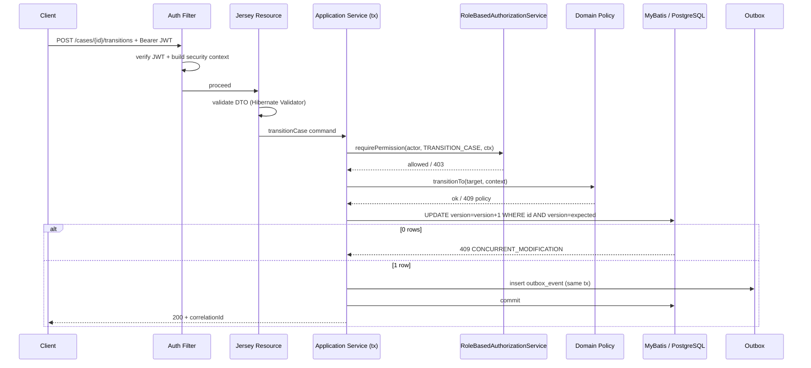
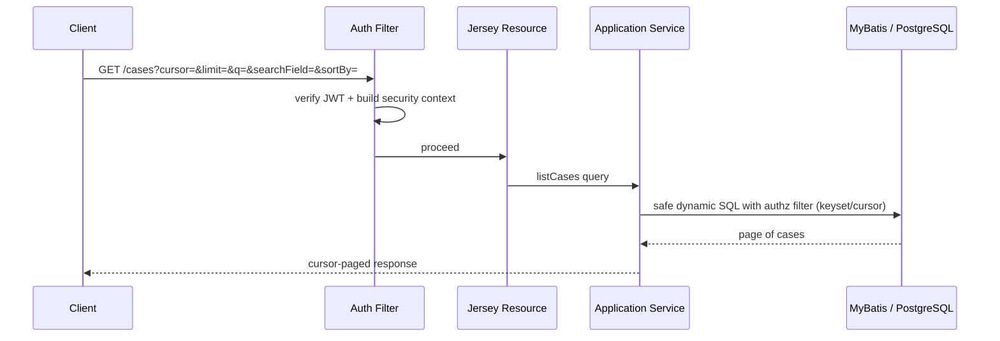
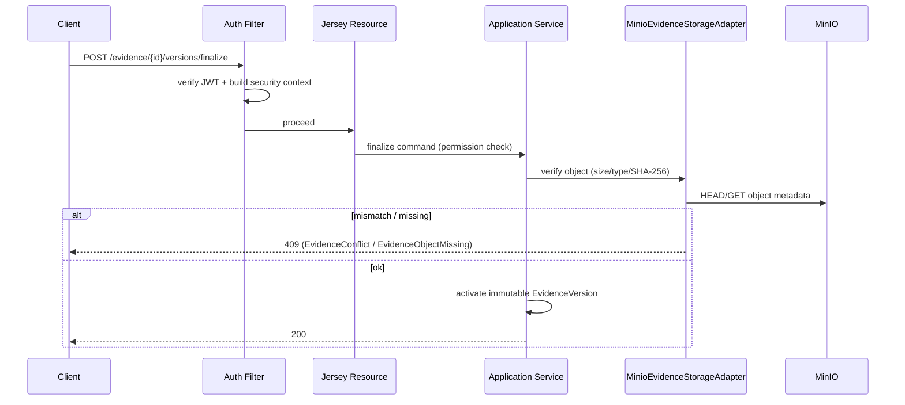

# Inbound Request Flows

Detailed inbound HTTP request handling for representative Sentinel endpoints. Each flow shows the auth filter, DTO validation, transaction boundary, authorization orchestration, state-transition policy, optimistic locking, outbox insert, and RFC-7807 error mapping.

All claims are grounded in the evidence artifacts listed at the end of this page.

## Mutating Case Request (transitionCase)

`POST /api/v1/cases/{caseId}/transitions` drives a case state change. It combines authorization orchestration, the case transition policy, optimistic locking, and an outbox insert in one transaction.

| Step | Action | Layer | Evidence |
|---|---|---|---|
| 1 | Client sends bearer JWT to `HTTP_PORT` | client -> sentinel-api | endpoint-catalog.md |
| 2 | Auth filter verifies JWT via Keycloak JWKS + builds security context (correlation id) | sentinel-security | authorization-model.md, deployment-topology.md |
| 3 | Jersey resource validates DTO (Hibernate Validator) | sentinel-api | endpoint-catalog.md |
| 4 | Application service opens transaction | sentinel-application | endpoint-catalog.md |
| 5 | Authorization orchestration: role + jurisdiction + classification + conflict + unit + direct-assignment | sentinel-security | authorization-model.md |
| 6 | State-transition policy + `CaseProgressionGuard` | sentinel-domain | endpoint-catalog.md |
| 7 | Optimistic locking `UPDATE ... SET version=version+1 WHERE id AND version=expected` (0 rows -> 409) | sentinel-persistence | data-schema.md |
| 8 | Persistence via MyBatis ports; `outbox_event` insert in same tx | sentinel-persistence / sentinel-messaging | messaging-topics.md |
| 9 | Response 200/201 or RFC-7807 `ErrorResponse` (correlationId) on 400/401/403/404/409/412/422/429/500/503 | sentinel-api | endpoint-catalog.md |

## List Cases (Cursor Query)

`GET /api/v1/cases` returns a cursor-paged list. Authorization filtering is never looser than item GET, so list visibility respects the same jurisdiction/unit/classification/conflict rules.

| Step | Action | Layer | Evidence |
|---|---|---|---|
| 1 | `GET` with cursor + limit + q + searchField + sortBy | client -> sentinel-api | endpoint-catalog.md |
| 2 | Auth filter + security context | sentinel-security | authorization-model.md |
| 3 | Authorization filtering no looser than item GET | sentinel-security | authorization-model.md |
| 4 | Safe dynamic SQL (list-query-pattern) via MyBatis | sentinel-persistence | endpoint-catalog.md |
| 5 | Cursor-paged response | sentinel-api | endpoint-catalog.md |

## Finalize Evidence Version

`POST /api/v1/evidence/{evidenceId}/versions/finalize` verifies the uploaded object before activating an immutable `EvidenceVersion`. This is the trust boundary for untrusted client-supplied size/type/checksum.

| Step | Action | Layer | Evidence |
|---|---|---|---|
| 1 | Auth + permission check | sentinel-security | endpoint-catalog.md |
| 2 | Storage adapter verifies object existence/size/media type/SHA-256 (client-supplied at session creation) | sentinel-storage | evidence-storage.md |
| 3 | Mismatch/missing -> `EvidenceConflictExceptionMapper` / `EvidenceObjectMissingExceptionMapper` (409) | sentinel-api | evidence-storage.md |
| 4 | Activate immutable `EvidenceVersion` | sentinel-application / sentinel-persistence | evidence-storage.md |
| 5 | Storage unavailable -> 503 `EvidenceStorageUnavailableExceptionMapper` | sentinel-api | evidence-storage.md |

## Claim Workflow Task

`POST /api/v1/tasks/{taskId}/claim` claims a Camunda user task. Task visibility uses the same authorization rules as case access. Completion is idempotent.

| Step | Action | Layer | Evidence |
|---|---|---|---|
| 1 | Auth + authorization (task visibility uses same rules) | sentinel-security | workflow-camunda.md |
| 2 | Camunda task query/claim via public API | sentinel-workflow | workflow-camunda.md |
| 3 | Conflicting claim -> 409 | sentinel-api | endpoint-catalog.md |
| 4 | Idempotent completion on `completeTask` | sentinel-workflow | workflow-camunda.md |

## Error Envelope Mapping

All errors use an RFC-7807-style `ErrorResponse` envelope: `type`, `title`, `status`, `code`, `detail`, `instance`, `correlationId`, `violations`. No stack traces are returned to the client.

| HTTP | Trigger | Mapper |
|---|---|---|
| 400 | Malformed request | generic exception mapper |
| 401 | No token / invalid signature | `UnauthenticatedExceptionMapper` |
| 403 | Role/jurisdiction/unit/classification/conflict/assignment denial | `AuthorizationDeniedExceptionMapper` |
| 404 | Resource not found | not-found mapper |
| 409 | State conflict or optimistic locking | conflict mapper (`CONCURRENT_MODIFICATION`) |
| 412 | Precondition failed | precondition mapper |
| 422 | Semantically invalid command | validation mapper |
| 429 | Rate limited | rate-limit mapper |
| 500 | Unexpected error | generic mapper |
| 503 | Dependency unavailable (e.g., MinIO) | `EvidenceStorageUnavailableExceptionMapper` |

Request -> authz check -> optimistic lock -> outbox table:

| Request | Authorization check | Optimistic lock | Outbox insert |
|---|---|---|---|
| transitionCase | role + jurisdiction + classification + conflict + unit + direct-assignment | `version=version+1 WHERE version=expected` | `case.lifecycle.v1` |
| assignCase | same policy + assignment scope | yes | `case.assignment.v1` |
| finalizeEvidenceVersion | evidence permission | evidence version | `evidence.lifecycle.v1` |
| publishDecision | `PUBLISH_DECISION` permission | decision version | `decision.lifecycle.v1` |

## Cross-References

- [Control Flows](control-flows.md) — execution flows and the outbox loop.
- [Endpoint Catalog](../api/endpoint-catalog.md) — full 27-endpoint table.
- [Security and Authorization](../business-domain/security-authorization.md) — permission model.
- [Case Management API](../api/case-management.md) — case endpoints.

## Evidence

- `.docgen/evidence/endpoint-catalog.md`
- `.docgen/evidence/authorization-model.md`
- `.docgen/evidence/data-schema.md`
- `.docgen/evidence/evidence-storage.md`
- `.docgen/evidence/workflow-camunda.md`
- `.docgen/model/flows.json`
- `.docgen/model/catalogs.json`
