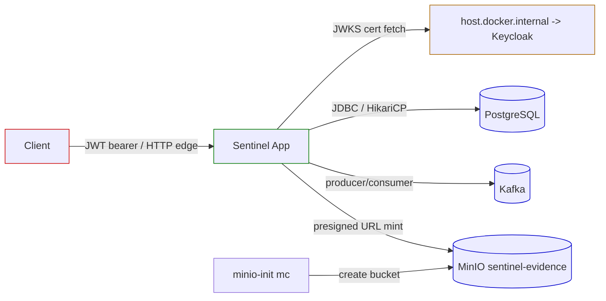

# Traffic and Trust-Boundary Flows

Network hops and trust boundaries between the Sentinel app and external systems. The app is the single trusted internal runtime; clients authenticate at the HTTP edge, and the app reaches PostgreSQL, Kafka, MinIO, and Keycloak over the internal service network.

All claims are grounded in the evidence artifacts listed at the end of this page.

## Client to App (HTTP Edge)

| Hop | Trust boundary | Evidence |
|---|---|---|
| client -> app (`HTTP_PORT`, Jersey) | JWT bearer token required at app edge; no unsigned decode | endpoint-catalog.md, authorization-model.md |

The app rejects any request without a verifiable JWT before building a security context. Signature, issuer, audience, expiry, not-before, and required claims are all checked.

## App to Keycloak (JWKS)

| Hop | Trust boundary | Evidence |
|---|---|---|
| app -> keycloak (`http://localhost:{KEYCLOAK_PORT}/realms/sentinel`) | Exact-match issuer verification; TLS/JWKS cert fetch | deployment-topology.md, authorization-model.md |
| app -> host.docker.internal (JWKS cert fetch from Docker app to host Keycloak) | Docker app fetches host Keycloak certs via `host.docker.internal` | deployment-topology.md |

Use a consistent `localhost` issuer because verification is exact-match (README troubleshooting).

## App to PostgreSQL

| Hop | Trust boundary | Evidence |
|---|---|---|
| app -> postgres:5432 | Internal service network; `DB_URL`/`DB_USERNAME`/`DB_PASSWORD` via env; HikariCP pool | deployment-topology.md, data-schema.md |

PostgreSQL is the authoritative store for all domain and messaging tables (7 Liquibase releases).

## App to Kafka

| Hop | Trust boundary | Evidence |
|---|---|---|
| app -> kafka:9092 | Internal broker (KRaft single node); bootstrap via `KAFKA_BOOTSTRAP_SERVERS` | deployment-topology.md, messaging-topics.md |

Kafka is the event backbone (8 topics). The outbox publisher targets Kafka; `notification.result.v1` is consumed from it.

## App to MinIO

| Hop | Trust boundary | Evidence |
|---|---|---|
| app -> minio:9000 | Internal object store; presigned URLs minted by app, client uploads/downloads directly | deployment-topology.md, evidence-storage.md |

The app never proxies object bytes; it mints short-lived presigned PUT/GET URLs and the client talks to MinIO directly.

## MinIO Init Bootstrap

| Hop | Trust boundary | Evidence |
|---|---|---|
| minio-init (mc) -> minio:9000 | Bootstrap container creates bucket `sentinel-evidence` idempotently via `create-bucket.sh` | deployment-topology.md, evidence-storage.md |

This runs once at startup to guarantee the bucket exists before the first upload session.

## Trust Boundary Summary

| External system | Trust posture |
|---|---|
| Client | Untrusted; must present valid JWT at edge |
| Keycloak | Trusted IdP; app fetches JWKS over host bridge |
| PostgreSQL | Trusted internal store; credential via env |
| Kafka | Trusted internal broker; bootstrap via env |
| MinIO | Trusted internal store; presigned URLs short-lived |
| minio-init | Bootstrap-only; idempotent bucket creation |

Unsigned-decode prohibition: the auth filter never accepts a JWT that is only base64-decoded. Signature verification against Keycloak JWKS is mandatory.

## Cross-References

- [Deployment Topology](../architecture/deployment-topology.md) — compose services and env.
- [Keycloak Authentication](../business-domain/keycloak-authentication.md) — JWT issuance and verification.
- [Security and Authorization](../business-domain/security-authorization.md) — permission model.
- [Data Flows](data-flows.md) — how data moves across stores.

## Evidence

- `.docgen/evidence/deployment-topology.md`
- `.docgen/evidence/authorization-model.md`
- `.docgen/evidence/evidence-storage.md`
- `.docgen/evidence/messaging-topics.md`
- `.docgen/model/flows.json`
- `.docgen/model/catalogs.json`
