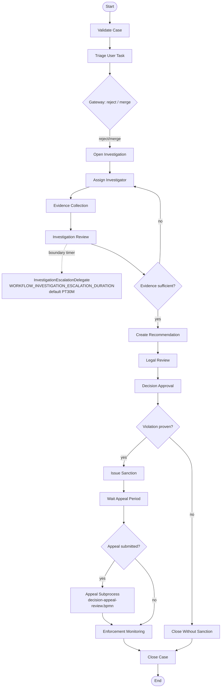
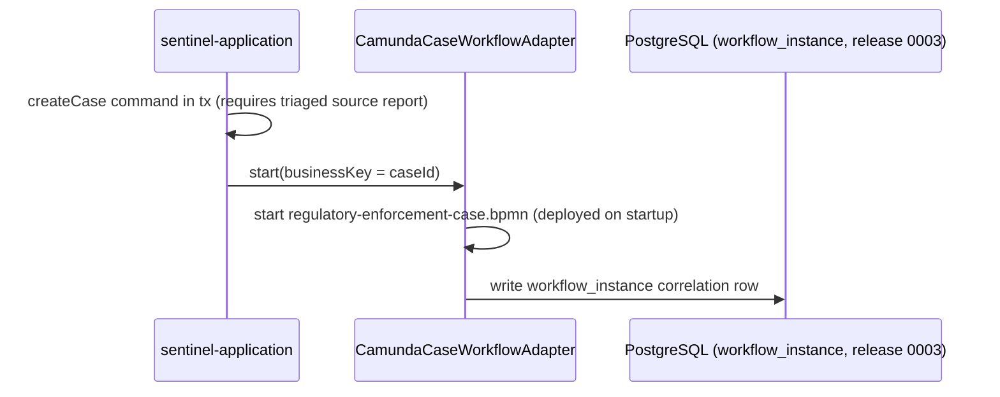
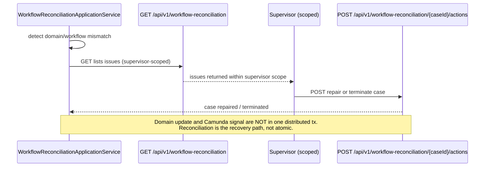

# Camunda Workflow Integration

Embedded Camunda 7.24.0 provides the process-orchestration layer for the Sentinel Enforcement Platform's case lifecycle. This page documents engine configuration (ADR-002), BPMN deployments, the Java adapters/delegates, the domain↔workflow consistency model, idempotent task completion, and a known gap around workflow-start compensation.

**Audience:** engineer, architect, operator.
**Coverage tags:** `integration`, `event-flow`, `control-flow`, `business-rules`.

> **ADR-002 in one line:** the domain database is the business state of truth; Camunda holds only an *orchestration position*. No runtime code writes directly to `ACT_*` tables.

---

## 1. Engine Configuration and ADR-002

### 1.1 Engine facts (FACT)

| Property | Value | Source |
|---|---|---|
| Engine | Camunda `7.24.0`, **embedded** | `workflow-camunda.md`, `system.json → workflows.camundaOrchestration` |
| Process engine instances | One `ProcessEngine` per app instance via `SingleProcessEngineProvider` | `workflow-camunda.md` |
| `databaseSchemaUpdate` | `false` | `workflow-camunda.md`, ADR-002 |
| Schema migration | `CamundaSchemaMigrator` runs **before** app start | `workflow-camunda.md` |
| Runtime `ACT_*` access | Forbidden — no direct SQL against `ACT_*` from runtime (enforced per `.agents/instruction.md`) | `workflow-camunda.md` |
| Owning module | `sentinel-workflow` (infrastructure, bounded context `enforcement-workflow`) | `system.json → components.sentinel-workflow` |
| Deployments | 2 (`regulatory-enforcement-case.bpmn`, `decision-appeal-review.bpmn`) | `system.json → workflows.camundaOrchestration` |

### 1.2 ADR-002 — state of truth vs. orchestration position

ADR-002 fixes the separation of concerns between the domain and the workflow engine:

- **Domain DB = business state of truth.** The `CaseRecord` aggregate (status, assignments, status history, audit events) is authoritative. All authoritative transitions go through the domain layer with optimistic locking (`UPDATE ... SET version=version+1 WHERE id AND version=expected`; 0 rows → `409`).
- **Camunda = orchestration position only.** The process instance is a *projection* of where the case is in its lifecycle. Camunda drives task availability and gateway routing, but it never redefines the legal state of a case.
- **Migration discipline.** Because `databaseSchemaUpdate=false`, the Camunda schema is versioned and migrated explicitly by `CamundaSchemaMigrator` before the application starts. The runtime never auto-mutates the schema, and the runtime never speaks SQL against `ACT_*`.
- **No dual-write in one distributed tx.** A domain update and the corresponding Camunda signal are intentionally *not* wrapped in a single distributed transaction. Mismatches are expected and are repaired by the reconciliation job (see §4). This is the central consistency trade-off of the integration.

**Architect takeaway:** treat any divergence between `CaseStatus` and the Camunda token position as recoverable, not fatal. The reconciliation service is the designed recovery path, not an afterthought.

---

## 2. BPMN Deployments

Both deployments are auto-deployed on startup by `sentinel-workflow`.

| Deployment | Purpose | Auto-deploy | Source |
|---|---|---|---|
| `regulatory-enforcement-case.bpmn` | Main case lifecycle: validate, triage task, investigation, evidence, review, decision, sanction, appeal, enforcement, close. | Yes — on startup | `workflow-camunda.md`, `system.json → workflows.camundaOrchestration.deployments` |
| `decision-appeal-review.bpmn` | Appeal / decision-review **subprocess** (called from the main process on appeal). | Yes — on startup | `workflow-camunda.md`, `system.json → workflows.camundaOrchestration.deployments` |

### 2.1 Camunda process topology

The main process is started with the domain `caseId` as the **business key** (see §3 and concept `concept-businesskey`). The `decision-appeal-review.bpmn` subprocess is entered only when an appeal is submitted during the appeal-wait window.

**Branch conditions (FACT, `business.json → branchConditions`):**

| Gateway | Condition | Effect on path |
|---|---|---|
| `RejectMerge` | reject / merge routing at triage | Routes the case out of intake into investigation setup or rejection merge. |
| `EvidenceSufficient` | "Is evidence sufficient?" | `no` loops back to `Assign Investigator`; `yes` proceeds to recommendation. |
| `ViolationProven` | "Is a violation proven?" | `no` → `Close Without Sanction`; `yes` → sanction + appeal window. |
| `AppealSubmitted` | "Is an appeal submitted?" | `yes` → appeal subprocess (`decision-appeal-review.bpmn`); `no` → enforcement monitoring. |

> **Caveat (FACT, `unknown-enforcement-monitoring`):** enforcement-monitoring detail is incomplete in current evidence. The `Enforcement Monitoring` node exists in the topology, but its internal tasks/states are not yet specified.

---

## 3. Adapters and Delegates

Three named components bridge the domain and the embedded engine. All live in `sentinel-workflow` and are invoked from `sentinel-application` through ports (`sentinel-application → sentinel-workflow` is a `port-adapter` dependency).

| Adapter / Delegate | Responsibility | Key facts | Source |
|---|---|---|---|
| `CamundaCaseWorkflowAdapter` | Starts the process **by business key `caseId`**; exposes task **query / claim / complete** via the public API; correlates the process instance to `workflow_instance`. | Business key = `caseId`; task claim returns `409` on conflict; completion is idempotent. | `workflow-camunda.md`, `endpoint-catalog.md`, `business.json → concept-workflowinstance` |
| `InvestigationEscalationDelegate` | Boundary-timer escalation on the investigation activity. | Timer duration = `WORKFLOW_INVESTIGATION_ESCALATION_DURATION`, **default `PT30M`**. | `workflow-camunda.md`, `flows.json → cf-escalation-boundary-timer` |
| `WorkflowReconciliationApplicationService` | Detects domain/workflow mismatch; exposes `GET /api/v1/workflow-reconciliation` + repair/terminate actions. | Lists issues **supervisor-scoped**; `POST /api/v1/workflow-reconciliation/{caseId}/actions` performs auto-repair or terminate. | `workflow-camunda.md`, `endpoint-catalog.md`, `flows.json → cf-workflow-reconciliation-job` |

### 3.1 Correlation model (FACT)

- **Business key = `caseId`.** The process instance is started with `caseId` as the Camunda business key (`concept-businesskey`). This is the stable join key between domain and engine.
- **`workflow_instance` correlation table** (Liquibase release **0003**) links the domain case business key to the embedded Camunda process instance (`concept-workflowinstance`). The adapter writes this correlation row when starting the process (`flows.json → cf-case-creation-starts-camunda`).

### 3.2 Start flow (FACT, `cf-case-creation-starts-camunda`)

> **See §6** — this start path currently relies on compensation rather than an outbox-backed start intent.

---

## 4. Domain/Workflow Consistency and Reconciliation

### 4.1 The consistency contract

Because the domain update and the Camunda signal are **not** in one distributed transaction (`system.json → workflows.camundaOrchestration.consistencyNote`), the two can drift. The design accepts this and repairs it:

- Authoritative state is always the domain `CaseStatus` lifecycle (`lifecycle-case`: CREATED → UNDER_TRIAGE → UNDER_INVESTIGATION → PENDING_REVIEW → PENDING_DECISION → DECIDED → UNDER_APPEAL → ENFORCEMENT_IN_PROGRESS → CLOSED/CANCELLED).
- The Camunda token position is a secondary projection used for task routing and gateway evaluation.
- A **reconciliation job** (`WorkflowReconciliationApplicationService`) detects mismatches and offers repair or terminate.

### 4.2 Reconciliation flow (FACT, `cf-workflow-reconciliation-job`)

### 4.3 Endpoints (FACT, `endpoint-catalog.md`)

| # | Method | Path | operationId | Notes |
|---|---|---|---|---|
| 26 | GET | `/api/v1/workflow-reconciliation` | `listWorkflowReconciliationIssues` | Supervisor-scoped mismatch listing. |
| 27 | POST | `/api/v1/workflow-reconciliation/{caseId}/actions` | `reconcileWorkflowCase` | Auto-repair / terminate. |

**Repair vs. terminate (decision `decision-reconciliation-repair-terminate`):** reconciliation may either auto-repair a domain/workflow mismatch or terminate the case, on a per-case basis via the actions endpoint.

**Operator runbooks:**
- `docs/runbooks/domain-workflow-mismatch-reconciliation.md`
- `docs/runbooks/camunda-embedded-schema-migration.md`

---

## 5. Idempotent Task Completion

Task completion through the public API is **idempotent** — a duplicate completion is safe and produces no second side effect (`workflow-camunda.md`, `business.json → cap-workflow-task-handling`).

| Endpoint | operationId | Behavior | Source |
|---|---|---|---|
| `GET /api/v1/tasks` | `listTasks` | Cursor-paged workflow tasks. | `endpoint-catalog.md` |
| `POST /api/v1/tasks/{taskId}/claim` | `claimTask` | `409` on conflicting claim. | `endpoint-catalog.md` |
| `POST /api/v1/tasks/{taskId}/complete` | `completeTask` | **Idempotent completion.** | `endpoint-catalog.md`, `workflow-camunda.md` |

**Why idempotency matters here:** because completion is disconnected from the domain transaction boundary, a retried or double-delivered completion request must not double-apply. The adapter guarantees duplicate completion is a no-op. This is the same idempotency philosophy as the messaging layer (`inbox_event UNIQUE(consumer_name, event_id)`, `rule-one-side-effect-per-event`).

**Integration-test coverage (FACT, `testing-strategy.md`):** `WorkflowTaskApiIT` covers task cursor/search/sort and **duplicate completion**; `WorkflowReconciliationApiIT` covers reconciliation.

---

## 6. Known Gap: Workflow-Start Compensation

**Classification:** FACT (`testing-strategy.md` known limitations; `system.json → unknowns.gap-workflow-start-outbox`; `business.json → unknown-workflow-start-compensation`).

**Description:** Workflow-start still uses **compensation** rather than an **outbox-backed start intent**.

- Contrast with the messaging layer, where business changes and `outbox_event` rows are written in the *same* DB transaction (`df-outbox-to-kafka`, release 0005), giving Kafka-outage survival (`rule-outbox-survives-kafka-outage`).
- The case-creation → Camunda-start path (`cf-case-creation-starts-camunda`) does **not** yet use that outbox-backed intent model. If the process start fails after the domain case is created, recovery depends on compensation logic rather than a retried, idempotent start intent.
- This is the same class of dual-write risk acknowledged in §1.2 (domain update and Camunda signal are not in one distributed tx).

**Implication for operators:** a case may exist in the domain with a missing or partially-started Camunda instance. The reconciliation job (§4) is the safety net that surfaces and repairs such mismatches; do not assume `createCase` and process start are atomic.

**Tracking:** documented as an open limitation; load/perf review, failure-injection, and metrics/dashboards also remain outstanding (`unknown-load-perf-review`).

---

## Related pages

- [Module: Workflow](../modules/workflow.md) — `sentinel-workflow` module responsibilities.
- [Business Flows](../business/business-flows.md) — end-to-end case lifecycle and appeal subprocess.
- [Outbox Reliability](../integrations/outbox-reliability.md) — transactional outbox model the start intent does *not* yet use.
- [Operations Runbooks](../operations/runbooks.md) — mismatch reconciliation and schema-migration runbooks.
- [Known Limitations and Unknowns](../known-limitations-and-unknowns.md) — full gap register including `gap-workflow-start-outbox`.

---

*All facts on this page trace to `.docgen/evidence/workflow-camunda.md`, `domain-lifecycle.md`, `endpoint-catalog.md`, `testing-strategy.md` and the `system.json`, `flows.json`, `business.json` models. No filenames or components are invented.*
