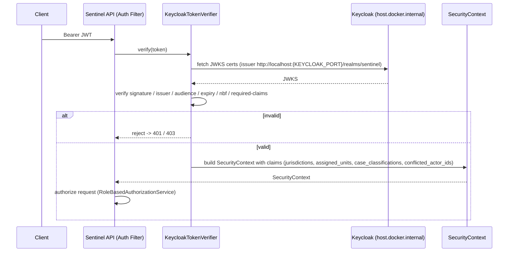

# Keycloak Authentication

Security, integration, traffic-flow.

This page documents the local identity provider (Keycloak), JWT verification at the Sentinel API edge, and the claims that drive authorization. The platform uses Keycloak `26.6` with realm `sentinel` as the local IdP and verifies issued JWTs via JWKS.

Related pages: [Security Authorization](../modules/module-security.md), [Traffic Flows](traffic-flows.md), [Branch Conditions](../business-logic/branch-conditions.md), [Configuration](../architecture/configuration.md).

## Realm and Dummy Users

Keycloak `26.6` runs the realm `sentinel`, imported from `deployment/keycloak/realm/sentinel-realm.json`. For local development and testing the realm seeds **dummy, local-only users** — all sharing the password `sentinel`. These users map to the platform's authorization roles. They are not for production use.

| Role | Seeded user(s) | Notes |
| --- | --- | --- |
| `CASE_INTAKE_OFFICER` | `intake-jkt`, `intake-bdg` | Intake actors per jurisdiction (Jakarta/Bandung). |
| `TRIAGE_OFFICER` | `triage-jkt`, `triage-bdg` | Triage actors per jurisdiction. |
| `INVESTIGATOR` | `investigator-jkt`, +public, +conflicted variants | Includes public and conflicted-actor variant users for testing conflict-of-interest checks. |
| `CASE_REVIEWER` | `reviewer-jkt` | Reviewers. |
| `DECISION_MAKER` | `decision-jkt` | Decision makers. |
| `APPEAL_OFFICER` | `appeal-jkt` | Appeal officers. |
| `SUPERVISOR` | `supervisor-jkt`, +unit-2 | Supervisors; unit-2 variant for assigned-unit scope testing. |
| `AUDITOR` | `auditor-jkt` | Auditors. |
| `SYSTEM_ADMIN` | `system-admin` | Short-circuits all authorization checks. |

## JWT Verification

The Sentinel API rejects unsigned tokens outright — there is **no unsigned JWT decode** path. Verification is performed by `KeycloakTokenVerifier` at the auth filter and enforces the full JWT contract:

- **Signature** — verified against JWKS certificates fetched from Keycloak.
- **Issuer** — exact-match against the configured issuer.
- **Audience** — must match `KEYCLOAK_AUDIENCE`.
- **Expiry** — `exp` must be in the future.
- **Not-before** — `nbf` must be satisfied.
- **Required claims** — all expected claims must be present.

JWKS endpoint: `KEYCLOAK_JWKS_URL`. Issuer: `http://localhost:{KEYCLOAK_PORT}/realms/sentinel`. Because the app runs in Docker while Keycloak runs on the host, the app container's JWKS URL points at `host.docker.internal` so the container can fetch the host's Keycloak certificates. Issuer verification is exact-match, so the README troubleshooting guidance is to use a consistent `localhost` form across `KEYCLOAK_ISSUER`, `KEYCLOAK_AUDIENCE`, and `KEYCLOAK_JWKS_URL`.

Environment variables:

- `KEYCLOAK_ISSUER` — expected issuer (`http://localhost:{KEYCLOAK_PORT}/realms/sentinel`).
- `KEYCLOAK_AUDIENCE` — expected audience.
- `KEYCLOAK_JWKS_URL` — JWKS certificate URL (points to `host.docker.internal` from the app container).

## Claims and Security Context

A local actor JWT carries the following claims, which `KeycloakTokenVerifier` maps into the `SecurityContext` used by `RoleBasedAuthorizationService`:

| Claim | Source | Authorization use |
| --- | --- | --- |
| `jurisdictions` | Actor profile | Actor's allowed jurisdictions; gates `branch-jurisdiction-match`. |
| `assigned_units` | Actor profile | Enforces assigned-unit scope on cases/evidence. |
| `case_classifications` | Actor profile | Clearance gating by case classification. |
| `conflicted_actor_ids` | Actor profile | Conflict-of-interest check — actor excluded from conflicting cases. |

Authorization policy (`RoleBasedAuthorizationService`):

1. `SYSTEM_ADMIN` **short-circuits** all checks.
2. Actor must hold the role mapped to the required `Permission`, else `403`.
3. Jurisdiction gate — actor's `jurisdictions` must include the case jurisdiction (`branch-jurisdiction-match`).
4. Classification clearance — `case_classifications` must satisfy the case classification.
5. Conflict-of-interest — actor must not be in `conflicted_actor_ids` for the case.
6. Assigned-unit scope — `assigned_units` must cover the relevant unit.
7. Direct assignment — explicit case assignment is honored.

Denied/!unauthenticated mapping: `AuthorizationDeniedExceptionMapper` and `UnauthenticatedExceptionMapper` map results to `401` (no/invalid token) or `403` (authenticated but not authorized).

## Trust Boundary to Keycloak

The trust boundary is the JWT verification edge. The Sentinel API trusts Keycloak as the token issuer and performs cryptographic verification (signature + claims) locally; it does **not** call Keycloak per request for authorization decisions. The Docker-to-host split means:

- The app container resolves `host.docker.internal` to reach the host Keycloak for JWKS.
- Only the issuer/JWKS/audience trio must be consistent; no shared session store is required.

This keeps the request path free of synchronous IdP calls while preserving a single, verifiable trust anchor.

## Token Revocation and Stale Role Note

Keycloak issues **short-lived** JWTs. There is no centralized revocation check at the Sentinel edge — verification is claim-based and stateless.

**Stale role trade-off (documented per master prompt §18):** if a user loses a role *after* token issuance, the still-valid token retains the old role claims until expiry. Authorization is therefore **claim-based at the edge** for role/permission, while jurisdiction, unit, and conflict checks are evaluated **live from context against claims**. This is a deliberate trade-off:

- *Claim-based* (role/permission): fast, stateless, but reflects token-issuance-time state.
- *Live evaluation* (jurisdiction/unit/conflict): evaluated against the current request context and the claims, mitigating the worst stale-state risks without a per-request IdP lookup.

Operators should size token lifetime to an acceptable stale-role window; the short-lived default keeps the window small.

