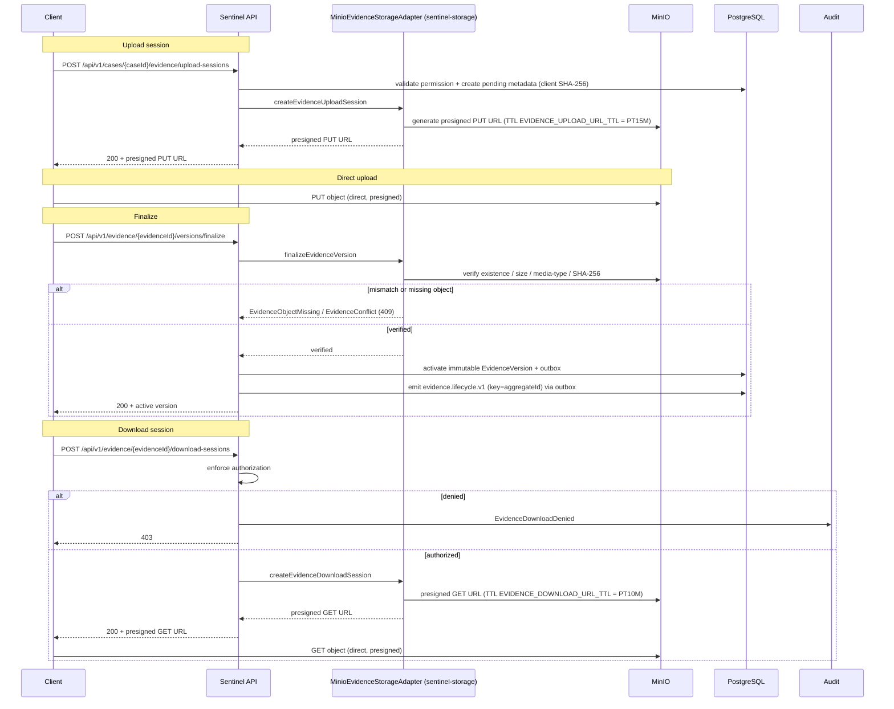

# MinIO Evidence Storage

Integration, request-flow, business-rules, data-model.

This page documents how the Sentinel Enforcement Platform persists evidentiary objects in MinIO, the presigned upload/finalize handshake, checksum enforcement, and object lifecycle. The storage integration is implemented by `MinioEvidenceStorageAdapter` in the `sentinel-storage` module and is the single authoritative sink for immutable evidence blobs.

Related pages: [Evidence Lifecycle](../modules/module-domain.md), [Evidence API](../api/api-evidence.md), [Traffic Flows](traffic-flows.md), [Observability](observability.md). Runbook: [MinIO Evidence Storage Runbook](../runbooks/minio-evidence-storage.md).

## Bucket and Object Key Layout

The evidence bucket is `MINIO_EVIDENCE_BUCKET`, defaulting to `sentinel-evidence`. It is created idempotently at deployment time by `deployment/minio/init/create-bucket.sh`, executed by the `minio-init` service (using `mc`) against the MinIO instance running image `RELEASE.2025-09-07`. The application reaches MinIO internally at `minio:9000`.

Object keys follow a fixed, server-generated template. The filename and media type are **never trusted from the client**; both are derived server-side. Path traversal is prevented by construction — segments are validated and the generated filename is not client-controlled.

| Segment | Value | Example | Notes |
| --- | --- | --- | --- |
| jurisdiction | Jurisdiction code (e.g. `jkt`) | `jkt` | Partition prefix; aligns with actor `jurisdictions` claim. |
| caseId | Business key of the case | `CASE-2025-000123` | `BusinessKey` (caseId) from `CaseRecord`. |
| evidenceId | Evidence aggregate id | `ev-9f2a1c` | Identifies the `Evidence` aggregate. |
| version | Evidence version identifier | `v1` | One object per immutable `EvidenceVersion`. |
| generatedFileName | Server-generated filename | `a1b2c3d4-upload.bin` | Not client-supplied; media type inferred, not trusted. |

Full key pattern:

```
/{jurisdiction}/{caseId}/{evidenceId}/{version}/{generatedFileName}
```

Example concrete key:

```
/jkt/CASE-2025-000123/ev-9f2a1c/v1/a1b2c3d4-upload.bin
```

Key invariants:

- The key is fully server-generated; the client never influences path segments beyond the case/evidence identifiers it is authorized for.
- Filename and media type are not trusted from the client — media type is verified at finalize against the actual uploaded object, not the session request.
- Path traversal is prevented by construction (no raw client string is concatenated into the key).

## Upload Session and Presigned URL

The upload handshake is a two-step, redirect-to-object-store pattern. The Sentinel API never buffers the evidence bytes; it brokers a presigned URL and lets the client stream directly to MinIO.

1. **Create session** — `POST /api/v1/cases/{caseId}/evidence/upload-sessions` validates the caller's permission, creates *pending* metadata (an `EvidenceUploadSession` with a client-supplied SHA-256 checksum captured at session creation), and returns a presigned **PUT** URL.
2. **Direct upload** — The client uploads the object directly to MinIO using the presigned PUT URL. The URL is valid for `EVIDENCE_UPLOAD_URL_TTL` (default `PT15M`).
3. **Pending state** — Until finalize, the evidence exists only as upload-session metadata in `pending` state; no immutable `EvidenceVersion` exists yet.

Presigned URL and bucket configuration:

| Config key | Env | Default | Purpose |
| --- | --- | --- | --- |
| `EVIDENCE_UPLOAD_URL_TTL` | `EVIDENCE_UPLOAD_URL_TTL` | `PT15M` | TTL of the presigned PUT URL returned by the upload-session endpoint. |
| `EVIDENCE_DOWNLOAD_URL_TTL` | `EVIDENCE_DOWNLOAD_URL_TTL` | `PT10M` | TTL of the presigned GET URL returned by the download-session endpoint. |
| `MINIO_EVIDENCE_BUCKET` | `MINIO_EVIDENCE_BUCKET` | `sentinel-evidence` | Target bucket; idempotently created by `minio-init`. |
| `MINIO_ENDPOINT` | `MINIO_ENDPOINT` | `minio:9000` (internal) | MinIO endpoint the adapter connects to. |
| `MINIO_ACCESS_KEY` | `MINIO_ACCESS_KEY` | — | Access key for the adapter's MinIO client. |
| `MINIO_SECRET_KEY` | `MINIO_SECRET_KEY` | — | Secret key for the adapter's MinIO client. |

## Finalize and Checksum Enforcement

Finalize is the point at which a pending upload becomes an immutable, auditable evidence version. It is the strict gate that enforces `rule-evidence-sha256-immutable` and `rule-evidence-published-decision-protected`.

`POST /api/v1/evidence/{evidenceId}/versions/finalize` performs the following checks against the object actually stored in MinIO:

- **Existence** — the object must exist at the expected key.
- **Size** — the stored object size is validated.
- **Media type** — the actual media type is verified (not the client-claimed one).
- **SHA-256 checksum** — the computed checksum of the stored object is compared to the client-supplied checksum captured at session creation.

Outcomes:

- **Match** — the immutable `EvidenceVersion` is activated, carrying its immutable SHA-256. An outbox event is written and the `evidence.lifecycle.v1` topic is emitted (key = `aggregateId`) after finalize. `GET /api/v1/evidence/{evidenceId}` returns active metadata plus the latest version.
- **Checksum mismatch or missing object** — the request is rejected with `409 Conflict`, mapped by `EvidenceObjectMissingExceptionMapper` / `EvidenceConflictExceptionMapper`. No `EvidenceVersion` is created.

Lifecycle states:

- `pending` — upload-session metadata only (pre-finalize).
- immutable `EvidenceVersion` — created after a successful finalize.

Business rules enforced at this boundary:

- `rule-evidence-sha256-immutable` — every `EvidenceVersion` has an immutable SHA-256; it cannot be altered after activation.
- `rule-evidence-published-decision-protected` — evidence referenced by a published decision cannot be deleted.

If MinIO is unreachable during finalize or download, the platform returns `503` via `EvidenceStorageUnavailableExceptionMapper`.

## Download Session and Audit

`POST /api/v1/evidence/{evidenceId}/download-sessions` enforces authorization before issuing a presigned URL:

1. **Authorization** — the caller must be authorized for the evidence's jurisdiction/unit/assignment context.
2. **Presigned GET** — on success, returns a presigned GET URL valid for `EVIDENCE_DOWNLOAD_URL_TTL` (default `PT10M`). The client downloads directly from MinIO.
3. **Denied access audit** — denied attempts are recorded as `EvidenceDownloadDenied` audit events, satisfying the sensitive-download audit requirement.

This is the read-side counterpart to the upload handshake: the API brokers access but never proxies the bytes.

## Security Controls

- **No client-controlled paths** — object keys are server-generated; filename and media type are not trusted from the client; path traversal is prevented by construction.
- **Checksum enforcement** — SHA-256 is captured at session creation and verified against the stored object at finalize; mismatch yields `409`.
- **Authorization on download** — download sessions enforce jurisdiction/unit/assignment scope and audit denials (`EvidenceDownloadDenied`).
- **Immutable versions** — activated `EvidenceVersion` objects carry immutable SHA-256 and cannot be mutated; published-decision-referenced evidence cannot be deleted.
- **Availability isolation** — storage unavailability surfaces as `503` (`EvidenceStorageUnavailableExceptionMapper`), distinct from authz/conflict errors.
- **Idempotent bucket provisioning** — `minio-init` (`mc`) creates `sentinel-evidence` idempotently on `RELEASE.2025-09-07`, so repeated init is safe.


