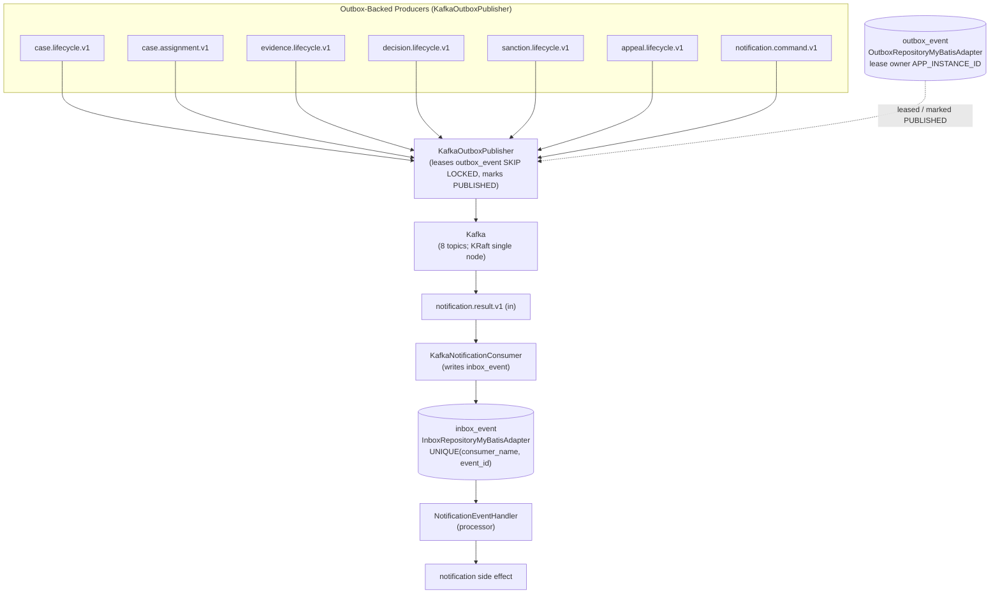

# Message Handler Catalog

Exhaustive catalog of the Kafka topics, producers, consumers, and repository
adapters in the Sentinel Enforcement Platform messaging subsystem.

**Scope:** `sentinel-messaging` (infrastructure) + `sentinel-persistence`
(outbox/inbox repository adapters). **Topics: 8. Outbox-backed producers: 7.
In-topic consumers: 1** (`notification.result.v1`).

**Audience:** engineer, architect, operator.

**FACT sources (evidence artifacts):**
- `messaging-topics` — `.docgen/evidence/messaging-topics.md` (8 topics,
  outbox/inbox reliability, retry/DLQ, resilience; source `MessagingTopics.java`)
- `data-schema` — `.docgen/evidence/data-schema.md` (Liquibase release 0005:
  `outbox_event`, `inbox_event`, `notification`; PostgreSQL 18.3-alpine)

**Coverage tags:** `message-handler-catalog`, `event-flow`, `data-flow`.

---

## Topic Inventory

8 topics enumerated in `MessagingTopics.java` (FACT, `messaging-topics`). 7 are
`out` topics fed by the transactional outbox; 1 is `in`
(`notification.result.v1`), consumed locally.

| # | Topic | Direction | Purpose | Key |
|---|---|---|---|---|
| 1 | `case.lifecycle.v1` | out | case state changes | `caseId` |
| 2 | `case.assignment.v1` | out | assignment changes | `aggregateId` |
| 3 | `evidence.lifecycle.v1` | out | evidence lifecycle | `aggregateId` |
| 4 | `decision.lifecycle.v1` | out | decision events | `aggregateId` |
| 5 | `sanction.lifecycle.v1` | out | sanction events | `aggregateId` |
| 6 | `appeal.lifecycle.v1` | out | appeal events | `aggregateId` |
| 7 | `notification.command.v1` | out | notification command | `aggregateId` |
| 8 | `notification.result.v1` | in | notification result projection | `aggregateId` |

All `out` topics are produced through the same outbox pipeline
(`KafkaOutboxPublisher`). The single `in` topic is consumed by
`KafkaNotificationConsumer` and processed by `NotificationEventHandler`.

---

## Producers (Outbox-Backed)

7 `out` topics are published by exactly one mechanism: the transactional
outbox polled by `KafkaOutboxPublisher`. Per `messaging-topics` (FACT):

- Business change + `outbox_event` insert happen in the **same DB
  transaction**; key = `aggregateId` for per-aggregate ordering.
- `KafkaOutboxPublisher` leases pending rows with `FOR UPDATE SKIP LOCKED`,
  publishes, and marks `PUBLISHED`.
- Duplicate publish is safe; `APP_INSTANCE_ID` is the lease owner.
- Poll cadence: `OUTBOX_POLL_INTERVAL = PT2S`, batch 20, lease `PT30S`
  (`catalogs.json` scheduledJob `job-outbox-publisher`,
  `flows.json` controlFlow `cf-outbox-publisher-loop`).

| Topic | Producer class | Reliability / retry |
|---|---|---|
| `case.lifecycle.v1` | `KafkaOutboxPublisher` | outbox dedup via SKIP LOCKED lease; `.retry`/`.dlq` |
| `case.assignment.v1` | `KafkaOutboxPublisher` | outbox dedup via SKIP LOCKED lease; `.retry`/`.dlq` |
| `evidence.lifecycle.v1` | `KafkaOutboxPublisher` | outbox dedup via SKIP LOCKED lease; `.retry`/`.dlq` |
| `decision.lifecycle.v1` | `KafkaOutboxPublisher` | outbox dedup via SKIP LOCKED lease; `.retry`/`.dlq` |
| `sanction.lifecycle.v1` | `KafkaOutboxPublisher` | outbox dedup via SKIP LOCKED lease; `.retry`/`.dlq` |
| `appeal.lifecycle.v1` | `KafkaOutboxPublisher` | outbox dedup via SKIP LOCKED lease; `.retry`/`.dlq` |
| `notification.command.v1` | `KafkaOutboxPublisher` | `.retry` (NOTIFICATION_MAX_RETRIES=3) / `.dlq` |

---

## Consumers and Processors

A single `in` topic, `notification.result.v1`, is handled by a two-stage
pipeline:

1. **Consumer** — `KafkaNotificationConsumer` writes an `inbox_event` row with
   `UNIQUE(consumer_name, event_id)`. A duplicate delivery collides on the
   unique constraint, so it is deduped at persistence (FACT, `messaging-topics`).
2. **Processor** — `NotificationEventHandler` produces **at most one**
   `notification` side effect per event after inbox dedup.

Failure routing for the consumer: failures go to a `.retry` topic; repeated
failure to `.dlq`. Controlled by `NOTIFICATION_MAX_RETRIES` (default 3) and
`NOTIFICATION_CONSUMER_GROUP_ID` (env).

| Stage | Class | Topic | Idempotency mechanism |
|---|---|---|---|
| consumer | `KafkaNotificationConsumer` | `notification.result.v1` | `inbox_event` UNIQUE(consumer_name, event_id) |
| processor | `NotificationEventHandler` | `notification.result.v1` | at most one notification side effect per event |

---

## Repository Adapters

Both adapters live in `sentinel-persistence` and back the outbox/inbox
reliability pattern. Tables provisioned by Liquibase release 0005 —
`outbox_event`, `inbox_event`, `notification` (FACT, `data-schema`).

| Adapter | Backed table | Direction | Responsibility (semantics) |
|---|---|---|---|
| `OutboxRepositoryMyBatisAdapter` | `outbox_event` (all out topics) | out | Persists / leases / marks `PUBLISHED` outbox rows within the business tx; SKIP LOCKED lease owned by `APP_INSTANCE_ID`. |
| `InboxRepositoryMyBatisAdapter` | `inbox_event` (`notification.result.v1`) | in | Persists dedup rows with `UNIQUE(consumer_name, event_id)`. |

---

## Handler -> Topic -> Direction -> Class -> Semantics

Exhaustive 11-row handler table (`catalogs.json` `messageHandlers`). Handler
IDs, topics, directions, handler types, class names, and semantics are taken
verbatim-ish from the model.

| Handler (id) | Topic | Direction | Class | Semantics |
|---|---|---|---|---|
| `mh-case-lifecycle` | `case.lifecycle.v1` | out | `KafkaOutboxPublisher` | Publishes case state changes (key=caseId) from outbox rows leased via SKIP LOCKED. |
| `mh-case-assignment` | `case.assignment.v1` | out | `KafkaOutboxPublisher` | Publishes assignment changes from outbox. |
| `mh-evidence-lifecycle` | `evidence.lifecycle.v1` | out | `KafkaOutboxPublisher` | Publishes evidence lifecycle events from outbox. |
| `mh-decision-lifecycle` | `decision.lifecycle.v1` | out | `KafkaOutboxPublisher` | Publishes decision events from outbox. |
| `mh-sanction-lifecycle` | `sanction.lifecycle.v1` | out | `KafkaOutboxPublisher` | Publishes sanction events from outbox. |
| `mh-appeal-lifecycle` | `appeal.lifecycle.v1` | out | `KafkaOutboxPublisher` | Publishes appeal events from outbox. |
| `mh-notification-command` | `notification.command.v1` | out | `KafkaOutboxPublisher` | Publishes notification command from outbox; routed to .retry/.dlq with NOTIFICATION_MAX_RETRIES=3. |
| `mh-notification-result` | `notification.result.v1` | in | `KafkaNotificationConsumer` | Consumes notification result; writes inbox_event (UNIQUE(consumer_name, event_id)) for idempotent dedup. |
| `mh-notification-handler` | `notification.result.v1` | in | `NotificationEventHandler` | Produces at most one notification side effect per event after inbox dedup. |
| `mh-outbox-repository` | `outbox_event` (all out topics) | out | `OutboxRepositoryMyBatisAdapter` | Persists/leases/marks PUBLISHED outbox rows within business tx; SKIP LOCKED lease owned by APP_INSTANCE_ID. |
| `mh-inbox-repository` | `inbox_event` (`notification.result.v1`) | in | `InboxRepositoryMyBatisAdapter` | Persists dedup rows with UNIQUE(consumer_name, event_id). |

---

## Reliability Properties

Grounded in `messaging-topics` (FACT) and `data-schema` (FACT):

- **Transactional outbox:** business write + `outbox_event` insert in one DB
  tx; key = `aggregateId` for per-aggregate ordering.
- **At-least-once publish, effectively-once effect:** `KafkaOutboxPublisher`
  leases with `FOR UPDATE SKIP LOCKED` and marks `PUBLISHED`; safe against
  duplicate publish; `APP_INSTANCE_ID` is the lease owner.
- **Consumer idempotency:** `KafkaNotificationConsumer` writes
  `inbox_event` with `UNIQUE(consumer_name, event_id)`; duplicate delivery
  yields at most one `notification` side effect via `NotificationEventHandler`.
- **Retry / DLQ:** `.retry` then `.dlq`; `NOTIFICATION_MAX_RETRIES` default 3,
  `NOTIFICATION_CONSUMER_GROUP_ID` configured via env.
- **Kafka outage resilience:** a Kafka outage does **not** roll back committed
  business writes; pending outbox rows remain retryable (verified by
  `MessagingReliabilityIT`).
- **Persistence:** `outbox_event` / `inbox_event` / `notification` tables from
  Liquibase release 0005 on PostgreSQL 18.3-alpine.

**Operator runbooks** (referenced in `messaging-topics`):
`docs/runbooks/outbox-stuck.md`, `docs/runbooks/dead-letter-events.md`,
`docs/runbooks/kafka-backlog.md`.

---

## Message Handler Topology

---

## Related Pages

- [Outbox Reliability](outbox-reliability.md)
- [Inbox Idempotency](inbox-idempotency.md)
- [Event Flows](event-flows.md)
- [Deployment Topology](deployment-topology.md)

---

*Coverage tags: `message-handler-catalog`, `event-flow`, `data-flow`.*
*FACT sources: `messaging-topics` (.docgen/evidence/messaging-topics.md),
`data-schema` (.docgen/evidence/data-schema.md). Model: catalogs.json,
system.json, flows.json.*
