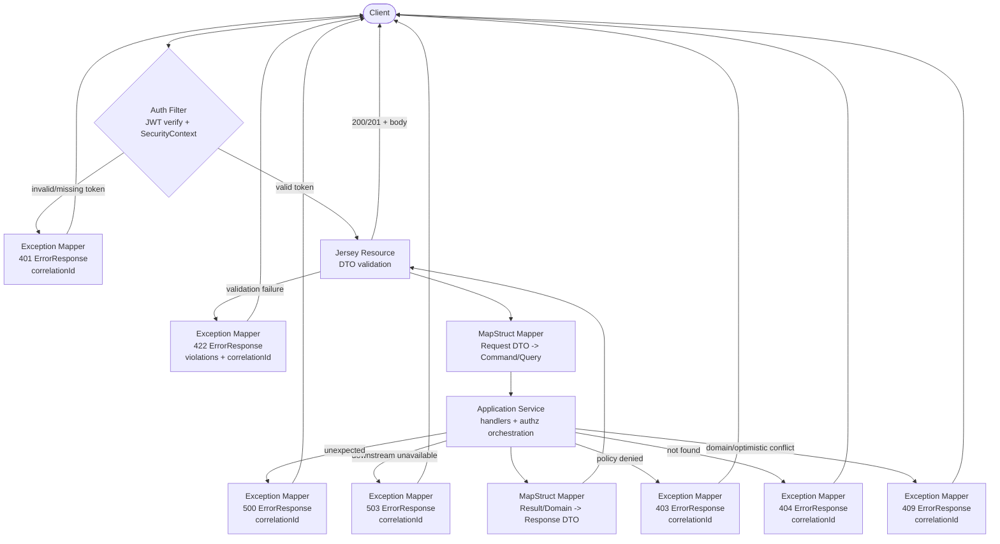

# Module: sentinel-api

Deep dive into the `sentinel-api` delivery/Jersey module: contract-first `Jersey` resources, request/response DTOs, exception mappers (RFC-7807 envelope), MapStruct mappers, and auth filter integration.

- **Module id:** `sentinel-api`
- **Layer:** `delivery`
- **Bounded context:** `enforcement-api`
- **Endpoint count:** 27 (verified `operationId`s in `docs/api/openapi.yaml`; the loose `index.json` stat of 30 is corrected to 27)
- **Contract:** OpenAPI 3.0.3, contract-first. Generated models under `sentinel-api/target/generated-sources/openapi`
- **Compile dependency:** `sentinel-api -> sentinel-application` (compile). Layering invariant: `domain <- application <- api`

> Oriented for engineers and architects. Newcomers get the boundary model; maintainers get the endpoint catalog and dispatch flow; experts get the mapping and error-envelope specifics.

---

## Responsibility and Boundaries

`sentinel-api` is the **delivery layer** of the enforcement context. It is the only module that emits HTTP and is the single inbound surface for all 27 REST operations.

**In scope (owns):**
- Jersey JAX-RS resources (`com/sentinel/enforcement/api/**`) that bind HTTP verbs/paths to application commands/queries.
- Request/response DTOs, generated from `docs/api/openapi.yaml` (contract-first) into `sentinel-api/target/generated-sources/openapi`.
- MapStruct mappers that translate between generated DTOs and application-layer command/query/result types.
- `sentinel-api/.../error/*ExceptionMapper.java` — JAX-RS `ExceptionMapper` implementations that emit the RFC-7807-style `ErrorResponse` envelope.
- Auth filters (JWT verification + security context population) applied per request before resource dispatch.

**Out of scope (delegates):**
- Business rules, aggregates, transition policies → `sentinel-application` / `sentinel-domain`.
- Authorization policy and JWT verification internals → `sentinel-security` (cross-cutting). The auth *filter* lives in `sentinel-api` but delegates verification to the security module.
- Persistence, messaging, storage, workflow orchestration → respective infrastructure modules behind application ports.

**Boundary rules (FACT from `module-catalog.md`):**
- `sentinel-api` depends on `sentinel-application` at **compile** time only; it does not depend on persistence/messaging/storage/workflow/security adapters directly.
- Domain (`sentinel-domain`) has no dependency on Jersey/MyBatis/Kafka/MinIO/Camunda/Keycloak — the API is the outermost layer and must not leak infrastructure types into DTOs.

---

## Resource Organization

Resources are organized by **resource area** aligned to the enforcement domain lifecycle: reports → cases → recommendations → decisions → appeals → evidence → workflow tasks → reconciliation. All paths are versioned under `/api/v1` except the public `/health` probe.

**Dispatch model:** every request flows through the auth filter (JWT verify + security context), then to the matching Jersey resource, which validates the request DTO, maps it to an application command/query via MapStruct, and invokes the application service. Exceptions thrown downstream are caught by the nearest `ExceptionMapper` and rendered as an `ErrorResponse`.

### Resource -> endpoints table

All 27 endpoints from the authoritative `docs/api/endpoint-catalog.md` (source of truth `docs/api/openapi.yaml`). `Auth` is `public` or `bearer`; all list endpoints follow `docs/api/list-query-pattern.md` (cursor + limit + q + searchField/searchValue + enum sortBy/sortDirection with safe dynamic SQL).

| Resource area | Method | Path | operationId | Auth |
|---|---|---|---|---|
| Health | GET | /health | getHealth | public |
| Report | POST | /api/v1/reports | createReport | bearer |
| Report | GET | /api/v1/reports/{reportId} | getReport | bearer |
| Report | POST | /api/v1/reports/{reportId}/triage | triageReport | bearer |
| Case | POST | /api/v1/cases | createCase | bearer |
| Case | GET | /api/v1/cases | listCases | bearer |
| Case | GET | /api/v1/cases/{caseId} | getCase | bearer |
| Assignment | POST | /api/v1/cases/{caseId}/assignments | assignCase | bearer |
| Transition | POST | /api/v1/cases/{caseId}/transitions | transitionCase | bearer |
| Audit | GET | /api/v1/cases/{caseId}/audit-events | getCaseAuditEvents | bearer |
| Recommendation | POST | /api/v1/cases/{caseId}/recommendations | createRecommendation | bearer |
| Recommendation | POST | /api/v1/recommendations/{recommendationId}/submit | submitRecommendation | bearer |
| Recommendation | POST | /api/v1/recommendations/{recommendationId}/reviews | reviewRecommendation | bearer |
| Decision | POST | /api/v1/cases/{caseId}/decisions | createDecision | bearer |
| Decision | POST | /api/v1/decisions/{decisionId}/approve | approveDecision | bearer |
| Decision | POST | /api/v1/decisions/{decisionId}/publish | publishDecision | bearer |
| Appeal | POST | /api/v1/decisions/{decisionId}/appeals | createAppeal | bearer |
| Appeal | POST | /api/v1/appeals/{appealId}/decide | decideAppeal | bearer |
| Evidence | POST | /api/v1/cases/{caseId}/evidence/upload-sessions | createEvidenceUploadSession | bearer |
| Evidence | GET | /api/v1/evidence/{evidenceId} | getEvidence | bearer |
| Evidence | POST | /api/v1/evidence/{evidenceId}/versions/finalize | finalizeEvidenceVersion | bearer |
| Evidence | POST | /api/v1/evidence/{evidenceId}/download-sessions | createEvidenceDownloadSession | bearer |
| Task | GET | /api/v1/tasks | listTasks | bearer |
| Task | POST | /api/v1/tasks/{taskId}/claim | claimTask | bearer |
| Task | POST | /api/v1/tasks/{taskId}/complete | completeTask | bearer |
| Reconciliation | GET | /api/v1/workflow-reconciliation | listWorkflowReconciliationIssues | bearer |
| Reconciliation | POST | /api/v1/workflow-reconciliation/{caseId}/actions | reconcileWorkflowCase | bearer |

**Operation notes (enrichment from `catalogs.json`):**
- `triageReport` → `TRIAGED`, optimistic lock (OLC).
- `createCase` → requires triaged source report; starts Camunda process (`regulatory-enforcement-case.bpmn`).
- `transitionCase` → state-transition policy + optimistic lock.
- `assignCase` → optimistic lock + audit event.
- `submitRecommendation` / `approveDecision` → maker-checker separation (`approveDecision` enforces maker != approver).
- `publishDecision` → immutable after publish.
- `createAppeal` → one active appeal per decision.
- `decideAppeal` → deadline override rule.
- `finalizeEvidenceVersion` → verifies size/type/SHA-256; produces immutable `EvidenceVersion`.
- `claimTask` → 409 on conflicting claim.
- `completeTask` → idempotent completion.
- `listWorkflowReconciliationIssues` → supervisor-scoped mismatch view; `reconcileWorkflowCase` → auto-repair / terminate.

---

## DTO and MapStruct Mapping

**DTO source of truth:** `docs/api/openapi.yaml` (OpenAPI 3.0.3, contract-first). The build generates Java request/response DTOs into `sentinel-api/target/generated-sources/openapi`. Resources bind to these generated types — no hand-written wire models.

**Mapping layer:** MapStruct mappers (`@Mapper`) translate between:
- **Inbound:** generated request DTO → application command (e.g. `CreateCaseCommand`, `TransitionCaseCommand`, `AssignCaseCommand`).
- **Outbound:** application query result / domain projection → generated response DTO (e.g. `CaseResponse`, `EvidenceResponse`, paged list envelopes).

MapStruct is invoked at the resource boundary so that the application layer never sees OpenAPI-generated types and the delivery layer never sees domain aggregates directly. This enforces the layering invariant (`domain <- application <- api`) and keeps infrastructure concerns (MyBatis, Camunda, MinIO) out of the wire contract.

**Caveats for maintainers:**
- DTO shape changes must be made in `docs/api/openapi.yaml` and regenerated — do not edit generated sources under `target/`.
- Mapper additions/changes should preserve the one-way boundary: DTO ↔ command/result only; never map a DTO directly to a domain aggregate inside the resource.

---

## Exception Mappers and Error Envelope

**Envelope:** RFC-7807-style `ErrorResponse` with fields: `type`, `title`, `status`, `code`, `detail`, `instance`, `correlationId`, `violations`.

- `type` — problem type URI (RFC-7807 semantics).
- `title` — short, human-readable summary.
- `status` — HTTP status code.
- `code` — stable application error code (machine-readable, distinct from HTTP status).
- `detail` — specific human-readable explanation.
- `instance` — URI/identifier of the occurrence.
- `correlationId` — request correlation id for tracing/log search.
- `violations` — field-level validation/constraint violations (present on 400/422).

**Status mapping (FACT):** `400`, `401`, `403`, `404`, `409`, `412`, `422`, `429`, `500`, `503`.

**Mappers:** implemented as JAX-RS `ExceptionMapper` classes under `sentinel-api/.../error/*ExceptionMapper.java`. Each maps a specific exception type (e.g. domain/optimistic-lock conflict, not-found, authorization denial, validation failure, rate-limit, downstream-unavailable) to the appropriate `status` + `code` pair and populates `correlationId` from the request context.

**Dispatch note:** any exception escaping a resource method is intercepted by the matching `ExceptionMapper`; the client never receives an unwrapped stack trace. The `correlationId` is the join key between the HTTP error response and server logs/observability.

---

## Auth Filter Integration

`sentinel-api` owns the **auth filter** that runs before Jersey resource dispatch:

1. **JWT verification** — validates the bearer token (Keycloak-issued; JWKS verification delegated to `sentinel-security`).
2. **Security context population** — resolves the principal/permissions and attaches a JAX-RS `SecurityContext` so resources and the application authorization orchestration can enforce access.
3. **Public bypass** — `GET /health` (`getHealth`) is the only `public` operation; all other 26 endpoints require a valid bearer token.

The filter is the inbound edge of the `cf-request` control flow (`sentinel-api -> sentinel-application`). Authorization *policy* (permission model, 25 permissions, maker-checker separation) lives in `sentinel-security` and is applied at the application layer; the filter establishes identity, the application enforces policy.

**Decision matrix (auth behavior):**

| Condition | Result | HTTP status |
|---|---|---|
| No token on `public` path (`/health`) | Allowed | 200 |
| Valid bearer on protected path | Allowed, security context set | 2xx |
| Missing/invalid/expired token | Rejected by filter | 401 |
| Valid token, insufficient permission | Allowed past filter, denied by application policy | 403 |

---

## Request Dispatch Flow

**Flow summary:**
- The auth filter is the single gate; `/health` is public, everything else requires a bearer token.
- Resources perform DTO (bean) validation; failures short-circuit to a 422 `ErrorResponse` with `violations`.
- MapStruct adapters sit on both sides of the application boundary (inbound command/query mapping, outbound response mapping).
- Application-layer failures (not-found, conflict, policy denial, downstream outage, unexpected) are rendered by the matching `*ExceptionMapper` into the RFC-7807 envelope, always carrying `correlationId`.

---

## Related pages

- [Module overview](../modules/module-overview.md) — module catalog, layers, and dependency direction.
- [Endpoint catalog](../api/endpoint-catalog.md) — authoritative 27-endpoint table and list-query pattern.
- [Request flows](../flows/request-flows.md) — end-to-end HTTP request lifecycle and control flows.
- [Security and authorization](../security-authorization.md) — JWT verification, permission model, and authorization policy.
