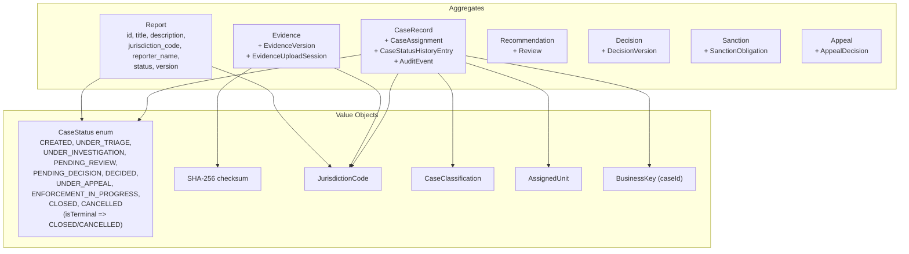

# Module Domain (`sentinel-domain`)

Architecture, business-rules.

This page is a deep dive into `sentinel-domain`, the core layer of the Sentinel Enforcement Platform. It hosts the enforcement bounded context: aggregates, entities, value objects, transition policies, and domain exceptions. It has zero infrastructure dependencies.

Related pages: [Module Overview](../modules/module-overview.md), [Case Lifecycle](../business-domain/case-lifecycle.md), [Business Rules](../business-logic/business-rules.md), [Conceptual Model](../business-domain/conceptual-model.md).

## Responsibility and Boundaries

`sentinel-domain` is the **core layer** of the reactor and implements the `enforcement-domain` bounded context. Its responsibilities:

- Model `CaseRecord` and its `CaseStatus` progression.
- Model `Evidence`, `Decision`, `Appeal`, `Recommendation` and their lifecycle.
- Encode **progression guards** — the rules that decide whether a state transition or mutation is permitted.
- Define domain exceptions for expected error conditions (never generic `RuntimeException`).

Boundary rule (layering invariant): `domain` depends only on itself. It imports **no** Jersey, MyBatis, Kafka, MinIO, Camunda, or Keycloak types. All infrastructure access is via ports declared in `application`/`domain` and implemented by the infrastructure modules. This keeps the business rules pure and unit-testable.

## Key Aggregates and Value Objects

The domain is organized around the following aggregates, each with its contained entities and value objects.

| Aggregate | Key types | Notes |
| --- | --- | --- |
| `Report` | `id`, `title`, `description`, `jurisdiction_code`, `reporter_name`, `status`, `version` | Intake report; progresses into a `CaseRecord`. |
| `CaseRecord` | `CaseAssignment`, `CaseStatusHistoryEntry`, `AuditEvent` | Central case aggregate; carries status, assignments, history, audit. |
| `Evidence` | `EvidenceVersion`, `EvidenceUploadSession` | Evidence aggregate; versions are immutable; upload sessions are pending metadata. |
| `Recommendation` | `Review` | Recommendation with attached review. |
| `Decision` | `DecisionVersion` | Decision aggregate; published decisions are immutable. |
| `Sanction` | `SanctionObligation` | Sanction with enforceable obligations. |
| `Appeal` | `AppealDecision` | Appeal aggregate; one active appeal per decision. |

Value objects:

- `CaseStatus` enum: `CREATED`, `UNDER_TRIAGE`, `UNDER_INVESTIGATION`, `PENDING_REVIEW`, `PENDING_DECISION`, `DECIDED`, `UNDER_APPEAL`, `ENFORCEMENT_IN_PROGRESS`, `CLOSED`, `CANCELLED`. `isTerminal()` ⇒ `CLOSED` / `CANCELLED`.
- `SHA-256` checksum — immutable evidence fingerprint.
- `JurisdictionCode` — jurisdiction partition.
- `CaseClassification` — clearance level.
- `AssignedUnit` — unit scope.
- `BusinessKey` (caseId) — external case identifier.

## Transition Policies and Guards

Transition control is expressed through the `CaseProgressionGuard` functional interface, with a `NO_OP` default and a deepening implementation `PhaseSevenCaseProgressionGuard` that enforces later-state prerequisites more strictly. The enforced invariants:

- **Reopen** — `CLOSED` cannot change except via an approved reopen.
- **Decision gating** — cannot reach `PENDING_DECISION` unless the investigation report is approved.
- **Close gating** — cannot `CLOSE` if there is an active sanction obligation.
- **Maker-checker** — the recommendation author must not be the approver; the sanction changer must not be the approver of the same change.
- **Evidence protection** — evidence referenced by a published decision cannot be deleted (`rule-evidence-published-decision-protected`).
- **Immutable evidence** — every `EvidenceVersion` has an immutable SHA-256 (`rule-evidence-sha256-immutable`).
- **Sensitive download audit** — sensitive downloads emit an audit event.
- **Immutable published decision** — a published `Decision` is immutable.
- **Appeal cardinality** — at most one active appeal per decision.
- **Late appeal** — a late appeal requires supervisor override.

## Domain Exceptions

Expected error conditions are modeled as typed exceptions in the `domain/exceptions` package. The domain must **not** use generic `RuntimeException` for expected errors (per master prompt). Representative categories:

- Case transition not allowed (guard rejection).
- Concurrent modification (optimistic locking / version conflict).
- Evidence conflict / missing object (checksum mismatch or absent object at finalize).
- Authorization/conflict-of-interest violations at the domain boundary.

These exceptions are mapped to HTTP responses at the `api` layer (e.g., `409` for evidence conflict/missing, `401`/`403` for authz) and are distinct from infrastructure failures such as storage unavailability (`503`).

## Dependency Rule Compliance

`sentinel-domain` complies with the layering invariant:

- **Zero infrastructure deps** — no Jersey, MyBatis, Kafka, MinIO, Camunda, or Keycloak imports anywhere in the module.
- **Self-only dependency** — the module depends only on itself; all external capability is expressed as ports consumed by `application`.
- **Compile consumer** — `sentinel-application` depends on `sentinel-domain` (compile), never the reverse.

This is confirmed by the package layout and the reactor edges documented in [Module Overview](../modules/module-overview.md).

### Gaps (INFERENCE / FACT)

- **FACT:** enforcement-monitoring detail is incomplete in the domain model — the monitoring/observability of enforcement progress is not fully represented as domain constructs.
- **INFERENCE:** later-state prerequisites are lighter than the master target; `PhaseSevenCaseProgressionGuard` deepens them but the full set of master-target preconditions is not yet encoded.

