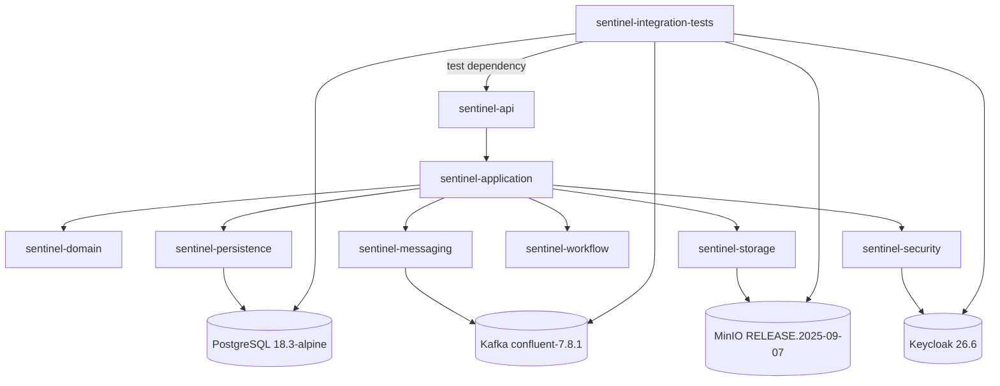

# Module: sentinel-integration-tests

**Category:** modules
**Module ID:** sentinel-integration-tests
**Layer:** test (`enforcement-testing` bounded context)
**Build type:** `test` scoped; depends on `sentinel-api` with `test` dependency type
**Owner:** implicit (no CODEOWNERS evidenced — see [Unknown: Module ownership](#verification-status))

> All claims on this page are FACT-grounded in `.docgen/evidence/module-catalog.md` and `.docgen/evidence/testing-strategy.md`, cross-referenced against `.docgen/model/system.json` and `.docgen/model/business.json`.

---

## Responsibility and Boundaries

`sentinel-integration-tests` is the **integration test layer** of the Sentinel Enforcement Platform. Its single responsibility is to exercise the assembled application against real infrastructure dependencies using Testcontainers, so that cross-module contracts (persistence, messaging, storage, workflow, security) are validated end-to-end rather than in isolation.

FACT boundaries:

- **Depends on `sentinel-api` with `test` dependency type** (model edge `sentinel-integration-tests -> sentinel-api` type `test`). It does not depend on `sentinel-domain`, `sentinel-persistence`, or any internal module directly; it drives the system through the deployed API surface.
- **Owns no production code.** It is excluded from the runtime reactor's shipped artifact set; it is built/verified only when targeted (`-pl sentinel-integration-tests -am verify`).
- **Backs the integration suites with Testcontainers** for PostgreSQL, Kafka, MinIO, and Keycloak (see [Testcontainers Setup](#testcontainers-setup)).
- **Covers the contract surface** required by the API + adapters: report, case, evidence, workflow task, workflow reconciliation, messaging reliability, and runtime schema lifecycle paths.

It is distinct from the unit-test layer, which lives inside each module's `.../test` source root (domain, application, security, workflow). Those are listed in [Test Layers](#test-layers).

---

## Testcontainers Setup

The module spins up a full dependent-infrastructure stack via Testcontainers so integration tests run against real engines, not mocks.

| Container | Image / Version | Role in tests | Evidence |
|---|---|---|---|
| PostgreSQL | `postgres:18.3-alpine` | Authoritative relational store for all domain + messaging tables (7 Liquibase releases) | `data-schema.md`, `deployment-topology` |
| Kafka | `confluent-7.8.1` (KRaft single node) | Event backbone; 8 topics; outbox publisher target + `notification.result.v1` source | `messaging-topics.md`, `deployment-topology` |
| MinIO | `RELEASE.2025-09-07` | Evidence object store; bucket `sentinel-evidence` | `evidence-storage.md`, `deployment-topology` |
| Keycloak | `26.6` | Local IdP; realm `sentinel`; issues JWTs; JWKS verification | `authorization-model.md`, `deployment-topology` |

Resilience/isolation facts:

- **Outage behavior is a tested contract, not a mock:** Kafka outage does **not** roll back committed business writes; pending `outbox_event` rows remain retryable. This is verified by `MessagingReliabilityIT` (see [Failure-Injection Coverage](#failure-injection-coverage) and `inv-outbox-not-rolled-back`).
- Keycloak supplies seeded users carrying claims (`jurisdictions`/`assigned_units`/`case_classifications`/`conflicted_actor_ids`) used to assert authorization denial paths (401/403/409). See [actor model](../../.docgen/model/business.json).

---

## Test Layers

Two distinct test strata exist in the platform. `sentinel-integration-tests` is the second stratum; unit tests are embedded per module.

| Test layer | Module / location | Scope | Key suites | Evidence |
|---|---|---|---|---|
| Unit — domain | `sentinel-domain/.../test` | Transition/lifecycle rules, state-machine invariants | `CaseProgressionGuard`, `PhaseSevenCaseProgressionGuard` logic | `testing-strategy.md` |
| Unit — application | `sentinel-application/.../test` | Application services: report, casefile, evidence | report/casefile/evidence service tests | `testing-strategy.md` |
| Unit — security | `sentinel-security/.../test` | Authorization + token verification | `RoleBasedAuthorizationServiceTest`, `KeycloakTokenVerifierTest` | `testing-strategy.md` |
| Unit — workflow | `sentinel-workflow/.../test` | BPMN model validity | `BpmnModelValidationTest` | `testing-strategy.md` |
| **Integration** | **`sentinel-integration-tests`** | **Full stack via Testcontainers** | **`ReportApiIT`, `CaseApiIT`, `EvidenceApiIT`, `WorkflowTaskApiIT`, `WorkflowReconciliationApiIT`, `MessagingReliabilityIT`, `ApplicationRuntimeSchemaLifecycleIT`** | `testing-strategy.md`, `module-catalog.md` |

Integration suites and their verified scope:

- **`ReportApiIT`** — report create/read, triage happy path.
- **`CaseApiIT`** — case create/list/read, assignment, transitions, investigator visibility, assigned-unit/classification/conflict denial, 401/403/404/409 cases.
- **`EvidenceApiIT`** — upload session, finalize (size/type/SHA-256), download session + audit denials.
- **`WorkflowTaskApiIT`** — task cursor/search/sort, claim 409 on conflict, idempotent completion.
- **`WorkflowReconciliationApiIT`** — supervisor-scoped mismatch listing + repair/terminate.
- **`MessagingReliabilityIT`** — outbox reliability under Kafka outage, inbox dedup.
- **`ApplicationRuntimeSchemaLifecycleIT`** — runtime schema lifecycle (Liquibase applied, tables present).

---

## Failure-Injection Coverage

The integration layer deliberately injects failure to prove resilience invariants rather than only happy paths.

| Failure injected | Suite | Expected / verified behavior | Related invariant |
|---|---|---|---|
| Kafka outage during business write | `MessagingReliabilityIT` | Committed business writes are **not** rolled back; `outbox_event` rows stay PENDING and retryable | `inv-outbox-not-rolled-back` |
| Duplicate `notification.result.v1` delivery | `MessagingReliabilityIT` | `inbox_event` UNIQUE(`consumer_name`, `event_id`) dedups → at most one side effect per consumer | `inv-one-side-effect-per-event` |
| Authorization denials (role alone; jurisdiction; classification; conflict; assigned-unit) | `CaseApiIT` | 401/403/409; role insufficient for access | `inv-role-insufficient` |
| Conflicting task claim | `WorkflowTaskApiIT` | Second claim → 409 | `rf-task-claim` |
| Evidence finalize checksum mismatch / missing object | `EvidenceApiIT` | Rejected (409 conflict/missing mapping) | `inv-checksum-mismatch-reject` |
| Concurrent optimistic-lock write | (transition/case services) | 0 updated rows → 409 CONCURRENT_MODIFICATION | `df-optimistic-lock` |

**Known limitation / gap:** load/performance review, failure-injection breadth, and metrics/dashboards remain outstanding (`gap-load-perf-review`). The integration layer asserts correctness and resilience but does not yet assert throughput/latency budgets.

---

## Verification Status

Commands (FACT) to build and run the layers:

| Command | Scope |
|---|---|
| `make unit-test` | Unit tests across modules |
| `make integration-test` | `mvn -pl sentinel-integration-tests -am verify` |
| `make workflow-test` | Workflow/BPMN validation suite |
| `make messaging-test` | Messaging reliability suite |
| `make e2e-test` | End-to-end suite |
| `make verify` | Full reactor verify |

Verification status (FACT):

- `spotless:apply` passed.
- `mvn test` passed (unit layer).
- `mvn -pl sentinel-integration-tests -am verify` passed for the full reactor and targeted ITs.

Phase 8 regression loop fixes (FACT):

1. Fixed a **malformed MyBatis dynamic-SQL branch** in case listing (see [persistence-patterns](../../data/persistence-patterns.md) and [liquibase-migrations](../../data/liquibase-migrations.md)).
2. Fixed **stale integration-test unit identifiers** for the assigned-unit model (aligned with `release 0007 phase8-case-authorization`).

**Unknown:** Module ownership is not explicitly assigned (no CODEOWNERS evidenced) — classification INFERENCE in `system.json` / `business.json`.

---

## Related Pages

- [Module Overview](../modules/module-overview.md) — full 10-module reactor map
- [Testing Strategy](../../.docgen/evidence/testing-strategy.md) — source evidence for this page
- [Operations Runbooks](../../docs/runbooks/) — outbox-stuck, dead-letter-events, kafka-backlog
- [Persistence Patterns](../../data/persistence-patterns.md) — MyBatis/outbox/inbox detail
- [Data Model Overview](../../data/data-model-overview.md) — table ownership & source of truth
