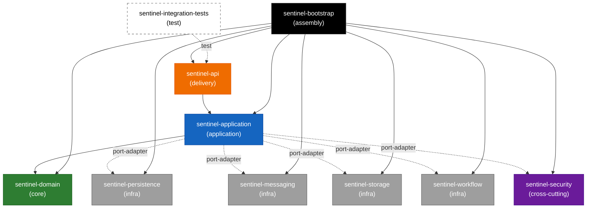

# Module Overview

External-dependency-catalog, architecture.

This page catalogs the 10 Maven modules of the Sentinel Enforcement Platform and their dependency edges. It is the entry point for understanding the build reactor and layering.

Related pages: [Architecture at a Glance](../architecture/architecture-at-a-glance.md), [Repository Map](../architecture/repository-map.md), [Domain Module](../modules/module-domain.md), [Build Reactor Reference](../architecture/build-reactor-reference.md).

## Module Catalog

The reactor is defined by a parent POM (`packaging pom`, `groupId com.sentinel.enforcement`, `artifactId sentinel-enforcement`, `version 0.1.0-SNAPSHOT`) built with Maven `3.9+` on Java 21 (`maven.compiler.release=21`). It contains 10 modules spanning core, application, delivery, infrastructure, cross-cutting, assembly, and test layers.

| Module | Layer | Responsibility | Key package |
| --- | --- | --- | --- |
| `sentinel-domain` | core | Bounded context `enforcement-domain`; aggregates, entities, value objects, transition policies, domain exceptions. No infrastructure deps. | `com.sentinel.enforcement.domain` |
| `sentinel-application` | application | Use cases / application services; orchestrates domain + ports (persistence, messaging, storage, workflow, security). | `com.sentinel.enforcement.application` |
| `sentinel-api` | delivery | JAX-RS/Jersey delivery; REST resources, DTOs, exception mappers. | `com.sentinel.enforcement.api` |
| `sentinel-persistence` | infrastructure | Port adapter for PostgreSQL/MyBatis; entities, mappings, migrations. | `com.sentinel.enforcement.persistence` |
| `sentinel-messaging` | infrastructure | Port adapter for Kafka; outbox producer / consumer. | `com.sentinel.enforcement.messaging` |
| `sentinel-storage` | infrastructure | Port adapter for MinIO evidence storage (`MinioEvidenceStorageAdapter`). | `com.sentinel.enforcement.storage` |
| `sentinel-workflow` | infrastructure | Port adapter for Camunda workflow engine. | `com.sentinel.enforcement.workflow` |
| `sentinel-security` | cross-cutting | Authentication/authorization integration (Keycloak, `RoleBasedAuthorizationService`). | `com.sentinel.enforcement.security` |
| `sentinel-bootstrap` | assembly | Assembles the runnable application (shade/fat-jar, wiring). | `com.sentinel.enforcement.bootstrap` |
| `sentinel-integration-tests` | test | End-to-end/integration tests against the assembled app. | `com.sentinel.enforcement.integrationtests` |

## Dependency Edges

The graph is a strict layering: `domain` is depended on by `application`; `application` is depended on by `api`; infrastructure and cross-cutting modules are port-adapters consumed by `application`; `bootstrap` assembles everything; `integration-tests` drives `api`.

| From | To | Type |
| --- | --- | --- |
| `sentinel-api` | `sentinel-application` | compile |
| `sentinel-application` | `sentinel-domain` | compile |
| `sentinel-application` | `sentinel-persistence` | port-adapter |
| `sentinel-application` | `sentinel-messaging` | port-adapter |
| `sentinel-application` | `sentinel-storage` | port-adapter |
| `sentinel-application` | `sentinel-workflow` | port-adapter |
| `sentinel-application` | `sentinel-security` | port-adapter |
| `sentinel-bootstrap` | `sentinel-api`, `sentinel-application`, `sentinel-domain`, `sentinel-persistence`, `sentinel-messaging`, `sentinel-storage`, `sentinel-workflow`, `sentinel-security` | assembly |
| `sentinel-integration-tests` | `sentinel-api` | test |

## Layering Invariant

The layering invariant is enforced by package layout and the reactor edges:

```
domain  <-  application  <-  api
```

- `domain` has **no** infrastructure dependencies — no Jersey, MyBatis, Kafka, MinIO, Camunda, or Keycloak imports. It depends only on itself.
- `application` depends on `domain` (compile) and declares port-adapter dependencies on infrastructure/cross-cutting modules.
- `api` depends on `application` (compile) and is the only layer that imports Jersey.
- Infrastructure and cross-cutting modules implement ports defined by `application`/`domain`; they never sit above `application`.

This guarantees that business rules in `domain` are portable and unit-testable without infrastructure.

## Build and Toolchain

- **Reactor:** Maven `3.9+`, parent `pom`, Java 21 (`maven.compiler.release=21`).
- **BOMs:** `jersey-bom`, `junit-bom`, `testcontainers-bom`.
- **Managed versions:** jersey `3.1.9`, jackson `2.18.2`, mapstruct `1.6.3`, mybatis `3.5.19`, hikari `6.3.0`, liquibase `4.31.1`, camunda `7.24.0`, slf4j `2.0.16`, logback `1.5.16`, postgres `42.7.5`, kafka-clients `3.8.1`, minio `8.5.17`, hibernate-validator `9.0.0.Final`, nimbus `10.0.2`, junit `5.11.4`, testcontainers `1.20.5`, openapi-generator `7.12.0`, spotless `2.44.3`.
- **Plugins:** `maven-compiler`, `maven-surefire` `3.5.2`, `maven-failsafe` `3.5.2`, `exec-maven-plugin`, `maven-shade-plugin`, `openapi-generator-maven-plugin`, `spotless` (Google Java Format `1.24.0` + sortPom).
- **Format:** `make format` → `mvn -q spotless:apply` (Google Java Format).
- **OpenAPI:** `make openapi-generate` produces `target/generated-sources`.

## Ownership Note (INFERENCE)

No `CODEOWNERS` file is evidenced in the repository. **INFERENCE:** module ownership is implicit and team-based rather than enforced via CODEOWNERS review routing. Teams should treat the layering invariant (§Layering Invariant) as the contract that governs who may change which module: `domain` changes require the strongest review because every other module depends on it transitively, while infrastructure port-adapters are scoped to their bounded integration.


