# Module: sentinel-persistence

Deep dive into the `sentinel-persistence` module — the infrastructure layer that
owns PostgreSQL access for the Sentinel Enforcement Platform. It implements the
application's repository ports with MyBatis mappers and adapters, carries the
Liquibase changelog (7 releases) plus type handlers, and hosts the transactional
outbox/inbox/audit/status-history tables.

- **Module id:** `sentinel-persistence`
- **Layer:** `infrastructure`
- **Bounded context:** `enforcement-persistence`
- **Source root:** `com/sentinel/enforcement/persistence/**`
- **Engine:** PostgreSQL `18.3-alpine`; migrations via Liquibase `4.31.1`

**Newcomer orientation:** This module is the "database side" of the hexagonal
core. The application layer defines repository *ports*; the adapters here — every
one a MyBatis mapper + a `*MyBatisAdapter` class — are the *implementations*.
All domain state, the messaging outbox/inbox, and the append-only audit log live
in PostgreSQL tables that this module's Liquibase changelog creates. If you are
changing a table, a mapper, or how version conflicts are detected, you are in
this module.

**Maintainer model:** `sentinel-persistence` is reached from `app` through
`port-adapter` edges (e.g., `df-optimistic-lock`, `df-outbox`). Every transactional
table carries the same audit/version columns; optimistic locking is enforced by a
single `UPDATE ... SET version=version+1 WHERE id=#{id} AND version=#{expectedVersion}`
idiom. Messaging reliability (outbox/inbox) is a *data-model* concern owned here,
while the Kafka polling/consuming logic that acts on those rows lives in
`sentinel-messaging`. Camunda's `ACT_*` schema is **not** owned here — it is
migrated separately by `sentinel-workflow` via `CamundaSchemaMigrator`.

**Related pages:** [`module-overview.md`](module-overview.md),
[`data-model-overview.md`](../data-model-overview.md),
[`persistence-patterns.md`](../persistence-patterns.md),
[`liquibase-migrations.md`](../liquibase-migrations.md).

---

## Responsibility and Boundaries

`sentinel-persistence` is the **infrastructure** layer for relational data
(FACT, `module-catalog.md`, `system.json`):

> MyBatis mappers, repository adapters, Liquibase changelog, type handlers.
> Implementation of application ports.

What it owns:

- **Repository adapters** — MyBatis-based implementations of the application's
  repository ports (`ReportRepository`, `CaseRecordRepository`,
  `WorkflowInstanceRepository`, `EvidenceRepository`, `OutboxRepository`,
  `InboxRepository`, `AuditEventRepository`, and the decision/appeal/sanction/
  recommendation/review/authorization adapters).
- **MyBatis mappers** — the `*MyBatisMapper` interfaces and their SQL, including
  the optimistic-lock `UPDATE` idiom and the `FOR UPDATE SKIP LOCKED` outbox
  lease reads.
- **Liquibase changelog** — `db.changelog-master.yaml` includes exactly 7
  releases (`0001`…`0007`) that create the domain + messaging tables.
- **Type handlers** — mapping of domain value objects (UUID, enums, JSON,
  `TIMESTAMPTZ`) to PostgreSQL column types.
- **The PostgreSQL data store** — `ds-postgres` / `ds-postgres-tables` are owned
  by this module (`catalogs.json`), including `outbox_event` (release `0005`),
  `inbox_event` (release `0005`), and `audit_event` (release `0002`).

**Boundaries — what it does NOT own:**

| Concern | Owning module | Why it is out of `persistence` |
|---|---|---|
| Aggregates, transition rules, domain exceptions | `sentinel-domain` | Domain logic lives in `core`; `persistence` depends on it only through port contracts. |
| Repository *ports* (interfaces) | `sentinel-application` | `app` defines the ports; `persistence` implements them (port-adapter edge). |
| Kafka publishing, outbox polling, inbox dedup, retry/DLQ | `sentinel-messaging` | The rows are here; the scheduled polling/consumer logic is in `messaging`. |
| MinIO object storage, presigned URLs | `sentinel-storage` | Evidence *objects* live in MinIO; only evidence *metadata* tables live here. |
| Camunda `ACT_*` schema | `sentinel-workflow` | Migrated separately via `CamundaSchemaMigrator` with `databaseSchemaUpdate=false`. |
| Wiring of ports→adapters | `sentinel-bootstrap` | `bootstrap` is the assembly root. |

**Layering invariant (FACT):** `domain <- application <- api`; `persistence` is
a `port-adapter` dependency of `application`, never above it, and `domain` has
**no** dependency on `persistence`.

**Caveats (FACT):**
- Camunda schema is migrated outside this module's changelog
  (`data-schema.md`, ADR-002).
- The outbox is **not** rolled back on Kafka outage; pending rows remain
  retryable after the business write commits (`messaging-topics.md`,
  `inv-outbox-not-rolled-back`).

---

## MyBatis Mappers and Adapters

Every repository is a MyBatis mapper interface paired with a `*MyBatisAdapter`
that implements the application port. Evidence from the compiled sources confirms
the evidence/adapter pair: `EvidenceRepositoryMyBatisAdapter` implements
`EvidenceRepository` (port in `sentinel-application`) over `EvidenceMyBatisMapper`,
backed by `EvidenceRecord`, `EvidenceVersionRecord`, and
`EvidenceUploadSessionRecord`. The same shape applies to the other repositories.

**Adapter → port → table ownership (FACT, `catalogs.json` `dataStores`,
`data-schema.md`, `system.json`):**

| Repository adapter | Tables (release) | MyBatis status |
|---|---|---|
| `ReportRepository` → `ReportRepositoryMyBatisAdapter` | `report` (0001) | MyBatis implementation of application port |
| `CaseRecordRepository` → `CaseRecordRepositoryMyBatisAdapter` | `case_record`, `case_status_history`, `case_assignment` (0002) | MyBatis implementation of application port |
| `WorkflowInstanceRepository` → `WorkflowInstanceRepositoryMyBatisAdapter` | `workflow_instance` (0003) | MyBatis implementation of application port |
| `EvidenceRepository` → `EvidenceRepositoryMyBatisAdapter` | `evidence`, `evidence_version`, `evidence_upload_session` (0004) | MyBatis implementation of application port |
| `OutboxRepository` → `OutboxRepositoryMyBatisAdapter` | `outbox_event` (0005) | MyBatis implementation of application port |
| `InboxRepository` → `InboxRepositoryMyBatisAdapter` | `inbox_event`, `notification` (0005) | MyBatis implementation of application port |
| `AuditEventRepository` → `AuditEventRepositoryMyBatisAdapter` | `audit_event` (0002) | MyBatis implementation of application port |
| Decision/Appeal/Sanction/Recommendation/Review adapters | `recommendation`, `review`, `decision`, `decision_version`, `sanction`, `sanction_obligation`, `appeal`, `appeal_decision` (0006); authorization columns (0007) | MyBatis implementations of application ports |

**Type handlers (FACT, `system.json` responsibility + `data-schema.md`
conventions):** UUID primary keys, `TIMESTAMPTZ` timestamps, domain enums, and
JSON/structured columns are bound through dedicated MyBatis type handlers so that
domain value objects map losslessly to PostgreSQL types.

**Mapper conventions applied consistently (FACT, `data-schema.md`):** every
transactional table carries `id` (UUID PK), `created_at`, `created_by`,
`updated_at`, `updated_by`, `version`; plus unique constraints, FKs, check
constraints, and partial indexes as needed. Append-only tables (`audit_event`)
are exempt from `version` churn.

---

## Liquibase Management

Migrations are managed by Liquibase `4.31.1` against PostgreSQL `18.3-alpine`.
The master changelog (`db.changelog-master.yaml`) includes exactly **7 releases**
(FACT, `data-schema.md`, `system.json` `liquibaseReleaseCount: 7`,
`targetedVerificationPerformed` "7 Liquibase releases → match").

| Release | File | Scope (FACT from changelog include list) |
|---|---|---|
| 0001 | `0001-foundation.yaml` | `report` table (id UUID PK, title, description, jurisdiction_code, reporter_name, status, created/updated by+at, version) |
| 0002 | `0002-case-management.yaml` | `case_record`, `case_assignment`, `case_status_history`, `audit_event` |
| 0003 | `0003-workflow.yaml` | `workflow_instance` correlation table |
| 0004 | `0004-evidence.yaml` | `evidence`, `evidence_version`, `evidence_upload_session` |
| 0005 | `0005-messaging.yaml` | `outbox_event`, `inbox_event`, `notification` |
| 0006 | `0006-phase7-decision-appeal.yaml` | `recommendation`, `review`, `decision`, `decision_version`, `sanction`, `sanction_obligation`, `appeal`, `appeal_decision` |
| 0007 | `0007-phase8-case-authorization.yaml` | classification / assigned-unit / conflict support columns |

**Conventions enforced across releases (FACT, foundation changelog):**
- Every transactional table carries `id` / `created_at` / `created_by` /
  `updated_at` / `updated_by` / `version`.
- Columns use `TIMESTAMPTZ`; primary keys are UUIDs.
- Unique constraints, foreign keys, check constraints, and partial indexes are
  added as needed per table.
- Append-only tables (`audit_event`) are exempt from `version` churn.

**Separate schema — NOT in this changelog (FACT):** Camunda's `ACT_*`
schema is migrated separately by `CamundaSchemaMigrator` with
`databaseSchemaUpdate=false` (ADR-002, `data-schema.md`, `catalogs.json`
`ds-camunda-act`). It is owned by `sentinel-workflow`, not this module.

**Release progression note:** release `0007` is additive — it introduces
classification / assigned-unit / conflict *support columns* onto existing case
tables rather than new standalone tables, matching the authorization model's
jurisdiction/classification/conflict checks enforced upstream in
`sentinel-application`.

---

## Optimistic Locking SQL

Mutable aggregates are protected by optimistic concurrency control (FACT,
`data-schema.md`, `system.json` `df-optimistic-lock`). The idiom is identical
across every mutable repository adapter:

```sql
UPDATE <table>
SET    <columns> = #{...},
       version = version + 1,
       updated_at = #{updatedAt},
       updated_by = #{updatedBy}
WHERE  id = #{id}
  AND  version = #{expectedVersion};
```

- **Match (1 row updated):** the write succeeds and `version` advances by 1.
- **Mismatch (0 rows):** the caller's `expectedVersion` no longer matches the
  stored `version` → a conflict is raised. At the API layer this surfaces as
  **`409 CONCURRENT_MODIFICATION`**.

**Contract implications (FACT):**
- The `version` column is present on every transactional table (see
  [Liquibase Management](#liquibase-management)); append-only `audit_event` is
  the documented exception (no version churn).
- The check is atomic at the row level within the application's transaction
  boundary (`df-optimistic-lock`: app → persistence); there is no separate
  lock table.
- Loss-of-update is prevented without pessimistic row locks on the read path,
  which keeps the read side lock-free.

**Caveat:** optimistic locking guards *concurrent mutation of the same row*. It
does not span the domain update and the Camunda signal — those are not in one
distributed transaction; mismatches are repaired by the reconciliation job
(`system.json` `camundaOrchestration.consistencyNote`).

---

## Messaging Tables (Outbox/Inbox/Audit)

The transactional outbox, the notification inbox, and the append-only audit log
are first-class tables owned by this module (release `0005` for outbox/inbox,
release `0002` for audit). The *rows* and their schema live here; the
*processing* of those rows is driven by `sentinel-messaging`
(`KafkaOutboxPublisher`, `KafkaNotificationConsumer`, `NotificationEventHandler`,
`OutboxRepositoryMyBatisAdapter`, `InboxRepositoryMyBatisAdapter`).

**Outbox — `outbox_event` (release 0005, `ds-outbox-event`):**

- Written in the **same DB transaction** as the business change
  (transactional outbox). The outbox key is `aggregateId`, giving per-aggregate
  ordering (`messaging-topics.md`).
- `KafkaOutboxPublisher` leases pending rows with `FOR UPDATE SKIP LOCKED`,
  publishes to Kafka, then marks the row `PUBLISHED`. The lease owner is
  `APP_INSTANCE_ID` (`catalogs.json` `mh-outbox-repository`,
  `job-outbox-publisher`).
- Scheduled job `job-outbox-publisher`: `OUTBOX_POLL_INTERVAL=PT2S`, batch size
  **20**, lease duration **PT30S** (`catalogs.json`).
- Duplicate publish is safe: the `PUBLISHED` mark plus the lease makes the
  publisher idempotent.

**Inbox — `inbox_event` + `notification` (release 0005, `ds-inbox-event`):**

- `KafkaNotificationConsumer` writes an `inbox_event` row guarded by
  `UNIQUE(consumer_name, event_id)`. A duplicate delivery therefore produces at
  most **one** `notification` side effect (`messaging-topics.md`,
  `catalogs.json` `mh-inbox-repository`, `inv-one-side-effect-per-event`).
- `notification.command.v1` is the out topic; `notification.result.v1` is the in
  topic that drives the inbox write (`catalogs.json` `messageHandlers`).

**Audit — `audit_event` (release 0002, `ds-audit-event`):**

- Append-only; exempt from optimistic-lock `version` churn (`data-schema.md`).
- Carries the same `created_at` / `created_by` audit lineage as transactional
  tables, but rows are never updated. Sensitive operations (e.g., denied
  evidence download) are recorded here and exposed via the audit-read port.

**Retry / DLQ (FACT, `messaging-topics.md`):**

- Failures route to a `.retry` topic; repeated failures route to a `.dlq`
  topic. `NOTIFICATION_MAX_RETRIES` defaults to **3**; `NOTIFICATION_CONSUMER_GROUP_ID`
  is configured via env.
- **Resilience:** a Kafka outage does **not** roll back committed business
  writes — pending outbox rows remain retryable (`MessagingReliabilityIT`
  verifies this; `inv-outbox-not-rolled-back`).

---

## Persistence adapter → PostgreSQL mapping

The flowchart maps the application ports to the MyBatis repository adapters and
then to the PostgreSQL tables grouped by Liquibase release. The outbox/inbox/
audit messaging tables are highlighted as the reliability backbone.

```mermaid
flowchart TB
    subgraph APP["sentinel-application (ports)"]
        RP["Repository Ports<br/>ReportRepository · CaseRecordRepository ·<br/>WorkflowInstanceRepository · EvidenceRepository ·<br/>OutboxRepository · InboxRepository ·<br/>AuditEventRepository · Decision/Appeal/Sanction/<br/>Recommendation/Review adapters"]
    end

    subgraph ADPT["sentinel-persistence — MyBatis adapters"]
        R1["ReportRepositoryMyBatisAdapter"]
        R2["CaseRecordRepositoryMyBatisAdapter"]
        R3["WorkflowInstanceRepositoryMyBatisAdapter"]
        R4["EvidenceRepositoryMyBatisAdapter"]
        R5["OutboxRepositoryMyBatisAdapter"]
        R6["InboxRepositoryMyBatisAdapter"]
        R7["AuditEventRepositoryMyBatisAdapter"]
        R8["Decision/Appeal/Sanction/Recommendation/Review<br/>MyBatis adapters"]
    end

    subgraph PG["PostgreSQL 18.3-alpine (Liquibase 7 releases)"]
        subgraph REL1["release 0001"]
            T1["report"]
        end
        subgraph REL2["release 0002"]
            T2["case_record"]
            T2b["case_status_history"]
            T2c["case_assignment"]
            TA["audit_event (append-only)"]
        end
        subgraph REL3["release 0003"]
            T3["workflow_instance"]
        end
        subgraph REL4["release 0004"]
            T4["evidence"]
            T4b["evidence_version"]
            T4c["evidence_upload_session"]
        end
        subgraph REL5["release 0005"]
            TO["outbox_event"]
            TI["inbox_event"]
            TN["notification"]
        end
        subgraph REL6["release 0006"]
            T6["recommendation · review · decision ·<br/>decision_version · sanction ·<br/>sanction_obligation · appeal · appeal_decision"]
        end
        subgraph REL7["release 0007"]
            T7["authorization support columns<br/>(classification / assigned-unit / conflict)"]
        end
    end

    RP -->|port-adapter| R1
    RP -->|port-adapter| R2
    RP -->|port-adapter| R3
    RP -->|port-adapter| R4
    RP -->|port-adapter| R5
    RP -->|port-adapter| R6
    RP -->|port-adapter| R7
    RP -->|port-adapter| R8

    R1 --> T1
    R2 --> T2
    R2 --> T2b
    R2 --> T2c
    R3 --> T3
    R4 --> T4
    R4 --> T4b
    R4 --> T4c
    R5 --> TO
    R6 --> TI
    R6 --> TN
    R7 --> TA
    R8 --> T6
    R8 --> T7

    classDef port fill:#e8f0fe,stroke:#4285f4,color:#1a3c6e;
    classDef adapter fill:#fef7e0,stroke:#f9ab00,color:#6b4e00;
    classDef rel fill:#eceff1,stroke:#90a4ae,color:#263238;
    classDef msg fill:#fce4ec,stroke:#c2185b,color:#880e4f,stroke-width:2px;
    class RP port;
    class R1,R2,R3,R4,R5,R6,R7,R8 adapter;
    class REL1,REL2,REL3,REL4,REL5,REL6,REL7 rel;
    class TO,TI,TA msg;
```



**Reading the diagram:** every adapter is a MyBatis implementation of an
application port (the `port-adapter` edges). The three highlighted pink tables —
`outbox_event`, `inbox_event`, `audit_event` — are the messaging/reliability and
audit backbone; `outbox_event`/`inbox_event` are written and polled by
`sentinel-messaging` but persisted through the adapters here.

---

## Cross-module references

- [`module-overview.md`](module-overview.md) — full 10-module catalog and
  dependency direction.
- [`data-model-overview.md`](../data-model-overview.md) — the normalized data
  model and table relationships across all releases.
- [`persistence-patterns.md`](../persistence-patterns.md) — optimistic locking,
  transactional outbox, and inbox idempotency patterns in depth.
- [`liquibase-migrations.md`](../liquibase-migrations.md) — per-release changelog
  detail and migration runbook.
- [`module-application.md`](module-application.md) — the ports this module
  implements and the transaction boundary that drives optimistic locking.
