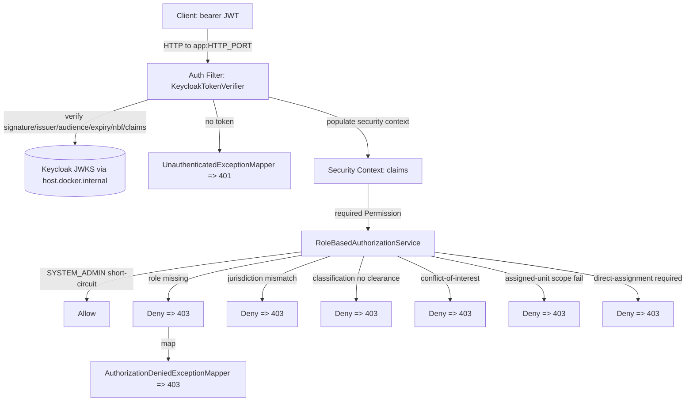

# Module: sentinel-security

`sentinel-security` is the **cross-cutting** module that implements the platform's centralized
authorization and authentication verification. It owns JWT verification (Keycloak), the security
context/claims model, the 25-permission enum, and the `RoleBasedAuthorizationService` policy used
consistently across all modules.

> **Reading depth guide**
> - **Newcomer:** *Responsibility and Boundaries* + the component-map flowchart show the auth filter → policy path.
> - **Maintainer:** the *Component → responsibility* table + *Permission Model* decision order is the working model.
> - **Expert:** *Authorization Service* + branch/failure behavior capture every denial reason and the 401/403 split.

---

## Responsibility and Boundaries

| Aspect | Value (FACT) |
|---|---|
| Module id | `sentinel-security` |
| Layer | `cross-cutting` |
| Bounded context | `enforcement-security` |
| Key source | `com/sentinel/enforcement/security/**` |
| Responsibility | JWT verification (Keycloak), security context, permission model (25 permissions), authorization policy |
| Consumed-by | `sentinel-application` (`port-adapter`) and applied at `sentinel-api` auth filter |
| Wired-by | `sentinel-bootstrap` (`assembly`) |

This module is the **single** enforcement point for authentication and authorization. The policy it
implements is reused for both item `GET` and list filtering, and for workflow task visibility
(`authorization-model.md`: "list filtering no looser than item GET"; `flows.json` `rf-task-claim`
"task visibility uses same rules"). Because it is cross-cutting, no other module re-implements
authorization logic.

---

## JWT Verification

JWT verification is performed by `KeycloakTokenVerifier` (FACT, `authorization-model.md`). The app
fetches Keycloak certs via JWKS over `host.docker.internal` so the Docker app can read host Keycloak
certs (`deployment-topology.md`, `flows.json` `tf-app-to-keycloak`).

Verification checks (all required — **no unsigned decode**):

- Signature
- Issuer (exact-match; issuer `http://localhost:{KEYCLOAK_PORT}/realms/sentinel`)
- Audience
- Expiry
- Not-before (`nbf`)
- Required claims present

JWT claims carried on the local actor token (FACT):

| Claim | Used for |
|---|---|
| `jurisdictions` | Jurisdiction scope check (`branch-jurisdiction-match`) |
| `assigned_units` | Assigned-unit scope (`branch-assigned-unit-scope`) |
| `case_classifications` | Clearance check (`branch-classification-clearance`) |
| `conflicted_actor_ids` | Conflict-of-interest check (`branch-conflict-of-interest`) |

---

## Security Context and Claims

After verification, the auth filter populates a **security context** carrying the verified claims
(`flows.json` `cf-http-to-handler`: "security context populated (claims:
jurisdictions/assigned_units/case_classifications/conflicted_actor_ids)"). The `Permission.java` enum
defines **25 permissions** covering report/case/evidence/recommendation/decision/appeal/task/
workflow-reconciliation (`authorization-model.md`). The security context is the input to the
authorization policy for every subsequent handler call.

---

## Permission Model

The `Permission` enum consists of **25 permissions** (FACT, `authorization-model.md`). Permissions are
mapped to roles; an actor must hold a role mapped to the required permission. The model implements
`system.json` `inv-role-insufficient`: **holding a role alone does not grant case access.** Additional
scoped checks always apply.

### Security module component map (flowchart)

### Component -> responsibility table

| Component | Type | Responsibility (FACT) |
|---|---|---|
| `KeycloakTokenVerifier` | Verifier | Validates JWT signature/issuer/audience/expiry/nbf/required claims via JWKS; no unsigned decode. |
| Security Context | Context | Holds verified actor claims (jurisdictions, assigned_units, case_classifications, conflicted_actor_ids). |
| `Permission` (enum) | Model | 25 permissions spanning report/case/evidence/recommendation/decision/appeal/task/workflow-reconciliation. |
| `RoleBasedAuthorizationService` | Policy | Centralized authorization: role + jurisdiction + classification + conflict + unit + direct-assignment. |
| `UnauthenticatedExceptionMapper` | Mapper | Maps missing/invalid token → 401. |
| `AuthorizationDeniedExceptionMapper` | Mapper | Maps role/jurisdiction/unit/classification/conflict/assignment denial → 403. |

---

## Authorization Service

`RoleBasedAuthorizationService` applies policy in a fixed decision order (FACT, `authorization-model.md`):

1. **SYSTEM_ADMIN** short-circuits all checks (allowed).
2. Actor must hold a role mapped to the required `Permission` → else **403**.
3. **Jurisdiction:** if `jurisdictionCode` set and actor lacks it → denied.
4. **Classification clearance:** if `caseClassification` set and actor lacks clearance → denied.
5. **Conflict-of-interest:** if `resourceOwnerId` set and actor `isConflictedWith` owner → denied.
6. **Assigned-unit scope:** `enforceAssignedUnitScope` enforced for unit-restricted resources.
7. **Direct assignment:** `requiresDirectAssignment(actor, permission)` requires
   `actor.username() == authorizationContext.assigneeUserId()`.

### Branch / failure behavior (denial reasons)

| Branch (from `business.json`) | Condition | Denial |
|---|---|---|
| `branch-jurisdiction-match` | `jurisdictionCode` set & actor lacks it | 403 |
| `branch-classification-clearance` | `caseClassification` set & actor lacks clearance | 403 |
| `branch-conflict-of-interest` | `resourceOwnerId` set & actor conflicted with owner | 403 |
| `branch-assigned-unit-scope` | `enforceAssignedUnitScope` & unit-restricted & not in `assigned_units` | 403 |
| `branch-retry-vs-dlq` (N/A here) | — | — |
| No token / unsigned | verification fails | 401 (`UnauthenticatedExceptionMapper`) |
| Role missing for permission | step 2 fails | 403 (`AuthorizationDeniedExceptionMapper`) |
| Direct-assignment required | `actor.username() != assigneeUserId()` | 403 |

> **Caveat:** The policy is evaluated at the **application transaction boundary** (`flows.json`
> `rf-mutating-case` shows authorization orchestration inside the transaction). `SYSTEM_ADMIN` bypasses
> all scoped checks, so that role must be tightly controlled (default seeded `system-admin` user).

### Cross-links

- [Module Overview](module-overview.md) — security's cross-cutting role in the reactor.
- [Security Authorization](security-authorization.md) — full permission-to-role mapping and policy.
- [Keycloak Authentication](keycloak-authentication.md) — realm, JWKS, issuer config.
- [Branch Conditions](branch-conditions.md) — all authorization branch conditions cataloged.
