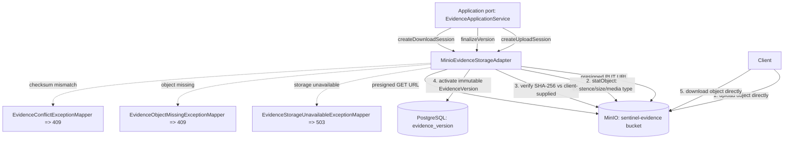

# Module: sentinel-storage

`sentinel-storage` is the **infrastructure** module that owns all object-storage concerns for the
Sentinel Enforcement Platform: the MinIO client, presigned-URL minting, evidence object metadata, and
the `MinioEvidenceStorageAdapter` that the application layer drives through a port.

> **Reading depth guide**
> - **Newcomer:** read *Responsibility and Boundaries* then the flowchart — storage is a thin adapter around MinIO.
> - **Maintainer:** the *Adapter method → MinIO operation* table and *Object Metadata and Verification* sections are your working model.
> - **Expert:** *Integration with Evidence Lifecycle* and the failure/branch behavior capture every exception path and TTL contract.

---

## Responsibility and Boundaries

| Aspect | Value (FACT) |
|---|---|
| Module id | `sentinel-storage` |
| Layer | `infrastructure` |
| Bounded context | `enforcement-storage` |
| Key source | `com/sentinel/enforcement/storage/**` |
| Responsibility | MinIO client, presigned URL, object metadata, evidence storage adapter |
| Bucket | `MINIO_EVIDENCE_BUCKET` (default `sentinel-evidence`) |
| Depended-on-by | `sentinel-application` (`port-adapter` edge, per `system.json` module dependencies) |
| Wired-by | `sentinel-bootstrap` (`assembly` edge) |

The module does **not** own domain state. It is reached only via an application-layer port; the
application service orchestrates upload-session creation, finalize, and download-session logic, while
`sentinel-storage` performs the actual MinIO operations and object verification. It has no dependency
on `sentinel-domain` output and contains no business rules beyond integrity verification (checksum, size,
media type) that is intrinsic to safe object storage.

External boundary (FACT, `deployment-topology.md`): the bucket is created **idempotently** at
infrastructure bring-up by the `minio-init` service running `deployment/minio/init/create-bucket.sh`
via `mc`. The application therefore assumes the bucket exists and does not attempt to create it at
request time.

---

## MinIO Client and Adapter

The adapter is `MinioEvidenceStorageAdapter` (`sentinel-storage`). It wraps the MinIO Java SDK
(`minio 8.5.17`, managed version per `build-reactor.md`) and exposes storage operations to the
application port. Object keys are **not** trusted from the client:

```
/{jurisdiction}/{caseId}/{evidenceId}/{version}/{generatedFileName}
```

Path-traversal is prevented and the filename/media type are not trusted from the client (FACT,
`evidence-storage.md`). The `jurisdiction` segment is the same `jurisdictionCode` value used by the
authorization model and evidence object key path (see `business.json` `concept-jurisdiction-code`),
creating a structural link between storage layout and authorization scope.

### Storage adapter interaction with MinIO (flowchart)



---

## Presigned URL Strategy

Presigned URLs shift the object transfer off the application process; the client talks to MinIO
directly. Two URL classes are minted:

| URL class | Verb | Env TTL var | Default TTL | Issued by |
|---|---|---|---|---|
| Upload session | `PUT` | `EVIDENCE_UPLOAD_URL_TTL` | `PT15M` | `POST /api/v1/cases/{caseId}/evidence/upload-sessions` |
| Download session | `GET` | `EVIDENCE_DOWNLOAD_URL_TTL` | `PT10M` | `POST /api/v1/evidence/{evidenceId}/download-sessions` |

TTL values are **ISO-8601 durations** configured via env (FACT, `deployment-topology.md`). The upload
URL is returned together with **pending metadata** (the client-supplied SHA-256 is recorded at session
creation so it can be verified later). The download URL is only returned after authorization is enforced,
and any denied access is audited as `EvidenceDownloadDenied` (FACT, `evidence-storage.md`;
`business.json` `rule-sensitive-download-audit`).

> **Caveat:** Presigned URLs are bearer-capable — anyone holding the URL can upload/download within the
> TTL window. Integrity is enforced at finalize (not at upload), so a tampered upload is rejected at
> finalize, not at PUT time.

---

## Object Metadata and Verification

Object metadata lives in PostgreSQL (`evidence`, `evidence_version`, `evidence_upload_session` tables,
release 0004 per `flows.json` `df-evidence-presign`), while the bytes live in MinIO. The adapter's
verification contract at finalize:

1. **Object existence** — `statObject` against the bucket; missing → 409 via `EvidenceObjectMissingExceptionMapper`.
2. **Size** — compared against session-recorded size.
3. **Media type** — derived server-side; client-supplied media type is **not trusted**.
4. **SHA-256 checksum** — compared against the client-supplied checksum recorded at session creation;
   mismatch → 409 via `EvidenceConflictExceptionMapper`.

On successful verification the version becomes an **immutable `EvidenceVersion`** with an immutable
SHA-256 (`business.json` `concept-evidenceversion`, `concept-sha256`, `rule-evidence-sha256-immutable`,
`inv-evidence-sha256-immutable`). After activation there is **no further mutation** of the version
(`lifecycle-evidence` terminal state = `immutable EvidenceVersion`).

### Adapter method -> MinIO operation table

| Adapter method (intent) | MinIO operation | Direction | Notes / failure mapping |
|---|---|---|---|
| `createUploadSession` → presign | `putObject` presigned `PUT` URL | App → Client (URL) | TTL `EVIDENCE_UPLOAD_URL_TTL` (PT15M); client uploads directly |
| verify at finalize | `statObject` | App → MinIO | existence + size + media type |
| verify checksum | computed against `getObject` bytes | App → MinIO | client-supplied SHA-256 compared; mismatch → 409 conflict |
| `createDownloadSession` → presign | `getObject` presigned `GET` URL | App → Client (URL) | TTL `EVIDENCE_DOWNLOAD_URL_TTL` (PT10M); audit denied |
| idempotent bucket assumption | (none at request time) | — | Bucket created by `minio-init` `create-bucket.sh` (idempotent) |
| storage health / transfer | any MinIO SDK call | App ↔ MinIO | failure → `EvidenceStorageUnavailableExceptionMapper` → 503 |

---

## Integration with Evidence Lifecycle

`sentinel-storage` is consumed by `sentinel-application` through a port (`port-adapter` dependency edge
in `system.json`). The evidence lifecycle (`business.json` `lifecycle-evidence`, `flows.json`
`bf-evidence-collection`) drives three storage touchpoints:

1. **Upload session** (`POST /api/v1/cases/{caseId}/evidence/upload-sessions`): permission-check →
   pending metadata → presigned PUT (PT15M). Data flow `df-evidence-presign` (source `sentinel-api`,
   sink `minio` + `postgres`).
2. **Finalize** (`POST /api/v1/evidence/{evidenceId}/versions/finalize`): verify → immutable version.
   Request flow `rf-evidence-finalize` — mismatch/missing → 409; storage unavailable → 503.
3. **Download session** (`POST /api/v1/evidence/{evidenceId}/download-sessions`): authorization →
   presigned GET (PT10M) → audit denied (`EvidenceDownloadDenied`).

### Branch / failure behavior

| Condition | Outcome | Mapping |
|---|---|---|
| Bucket not present at startup | App assumes it exists; relies on `minio-init`. No runtime create. | N/A (infra contract) |
| Object missing at finalize | Reject | `EvidenceObjectMissingExceptionMapper` → 409 |
| Checksum / size / media-type mismatch | Reject | `EvidenceConflictExceptionMapper` → 409 |
| MinIO unreachable | Reject storage op | `EvidenceStorageUnavailableExceptionMapper` → 503 |
| Evidence referenced by published decision | Cannot be deleted | `rule-evidence-published-decision-protected` (domain guard, not storage) |
| No token / denied auth on download | Denied + audited | `UnauthenticatedExceptionMapper` → 401 / `AuthorizationDeniedExceptionMapper` → 403 |

Runbook reference: `docs/runbooks/minio-evidence-storage.md` (cited in `evidence-storage.md`).

### Cross-links

- [Module Overview](module-overview.md) — where storage sits in the 10-module reactor.
- [MinIO Evidence Storage](minio-evidence-storage.md) — bucket init and operational detail.
- [Evidence Lifecycle](evidence-lifecycle.md) — pending → immutable version state machine.
- [Evidence API](api-evidence.md) — upload-session / finalize / download-session endpoints.
