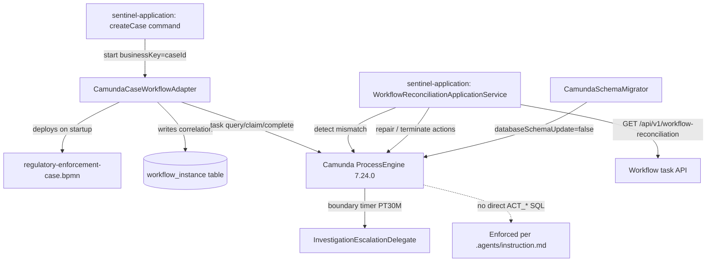

# Module: sentinel-workflow

`sentinel-workflow` is the **infrastructure** module that hosts the embedded **Camunda 7.24.0** process
engine and adapts it to the domain. It owns BPMN deployment, the case-workflow adapter, the escalation
delegate, and the domain↔workflow reconciliation hooks.

> **Reading depth guide**
> - **Newcomer:** *Responsibility and Boundaries* + the component-map flowchart explain that Camunda is orchestration only.
> - **Maintainer:** the *Component → responsibility* table and *Adapters and Delegates* section are the working model.
> - **Expert:** *Correlation and Reconciliation Hooks* + branch/failure behavior cover the consistency gap and timers.

---

## Responsibility and Boundaries

| Aspect | Value (FACT) |
|---|---|
| Module id | `sentinel-workflow` |
| Layer | `infrastructure` |
| Bounded context | `enforcement-workflow` |
| Key source | `com/sentinel/enforcement/workflow/**` |
| Responsibility | Embedded Camunda runtime, BPMN deployment, task adapter, correlation, escalation delegate |
| Engine | Camunda `7.24.0` embedded (managed version, `build-reactor.md`) |
| Depended-on-by | `sentinel-application` (`port-adapter`) |
| Wired-by | `sentinel-bootstrap` (`assembly`) |

Per ADR-002 (FACT, `workflow-camunda.md`, `system.json` `camundaOrchestration`), **the domain is the
state of truth; Camunda is the orchestration position.** There is **no direct SQL** against `ACT_*`
tables from runtime (enforced per `.agents/instruction.md`). The engine runs as a single
`ProcessEngine` per instance via `SingleProcessEngineProvider`, with `databaseSchemaUpdate=false` —
the schema is migrated separately by `CamundaSchemaMigrator` before app start.

---

## Camunda Runtime Configuration

- **Single engine per instance:** `SingleProcessEngineProvider`.
- **Schema:** `databaseSchemaUpdate=false`; schema migrated via `CamundaSchemaMigrator` (runbook
  `docs/runbooks/camunda-embedded-schema-migration.md`).
- **BPMN auto-deploy on startup** (FACT):
  - `regulatory-enforcement-case.bpmn` — main lifecycle: validate → triage task → investigation →
    evidence → review → decision → sanction → appeal → enforcement → close.
  - `decision-appeal-review.bpmn` — appeal/decision review subprocess.

The main process is started by business key `caseId` (FACT, `business.json` `concept-businesskey`).
The deployment maps to two BPMN deployments in `system.json` `camundaOrchestration.deployments`.

---

## BPMN Deployment

| Deployment file | Purpose | Auto-deploy |
|---|---|---|
| `regulatory-enforcement-case.bpmn` | Main enforcement lifecycle (10 phases) | Yes (startup) |
| `decision-appeal-review.bpmn` | Appeal / decision review subprocess | Yes (startup) |

The lifecycle phases in the main BPMN align with the domain `CaseStatus` states
(`system.json` `caseLifecycle.states`): `CREATED, UNDER_TRIAGE, UNDER_INVESTIGATION, PENDING_REVIEW,
PENDING_DECISION, DECIDED, UNDER_APPEAL, ENFORCEMENT_IN_PROGRESS, CLOSED, CANCELLED`.

### Workflow module component map (flowchart)

---

## Adapters and Delegates

### Component -> responsibility table

| Component | Type | Responsibility (FACT) |
|---|---|---|
| `CamundaCaseWorkflowAdapter` | Adapter | Start process by business key (`caseId`); task query/claim/complete via public API; correlation to `workflow_instance`. |
| `InvestigationEscalationDelegate` | Delegate (boundary timer) | Escalates investigation on timeout; duration `WORKFLOW_INVESTIGATION_ESCALATION_DURATION` (default `PT30M`). |
| `WorkflowReconciliationApplicationService` | Application service (in this module's scope) | Detects domain/workflow mismatch; exposes `GET /api/v1/workflow-reconciliation` + repair/terminate actions. |
| `SingleProcessEngineProvider` | Engine provider | Supplies the single `ProcessEngine` per instance. |
| `CamundaSchemaMigrator` | Migrator | Migrates `ACT_*` schema before app start (`databaseSchemaUpdate=false`). |

### Correlation

`CamundaCaseWorkflowAdapter.start(businessKey=caseId)` writes a `workflow_instance` correlation row
(FACT, `flows.json` `cf-case-creation-starts-camunda`, `business.json` `concept-workflowinstance`).
All subsequent task operations and signals are correlated by the `caseId` business key.

### Escalation

`InvestigationEscalationDelegate` fires on a **boundary timer** during the investigation phase
(`flows.json` `cf-escalation-boundary-timer`). The duration is configurable via
`WORKFLOW_INVESTIGATION_ESCALATION_DURATION` (default `PT30M`, `deployment-topology.md`).

---

## Correlation and Reconciliation Hooks

Task visibility and completion use the **same authorization rules** as case access (FACT,
`authorization-model.md` — list filtering no looser than item GET). The task API surfaces
(`flows.json` `rf-task-claim`):

- `GET /api/v1/tasks` — cursor-paged list (task visibility uses same authorization rules).
- `POST /api/v1/tasks/{taskId}/claim` — conflicting claim → **409**.
- `POST /api/v1/tasks/{taskId}/complete` — **idempotent** completion (duplicate completion safe).

### Consistency gap & reconciliation (branch / failure behavior)

A critical invariant (FACT, `workflow-camunda.md`, `system.json` `consistencyNote`):

> The domain update and the Camunda signal are **NOT** in one distributed transaction. Task completion
> is idempotent; a separate **reconciliation job** covers mismatches.

| Condition | Behavior |
|---|---|
| Domain updated, Camunda signal lost | `WorkflowReconciliationApplicationService` detects mismatch via `GET /api/v1/workflow-reconciliation` (supervisor-scoped) |
| Mismatch found | `POST /api/v1/workflow-reconciliation/{caseId}/actions` performs **repair** or **terminate** (`business.json` `decision-reconciliation-repair-terminate`) |
| Duplicate task completion | Safe (idempotent) — no double side effect |
| Conflicting claim | 409 returned; retry-safe |
| BPMN validation failure | `make bpmn-validate` gate; deployment fails at startup |

### Cross-links

- [Module Overview](module-overview.md) — workflow's place in the reactor.
- [Camunda Workflow](camunda-workflow.md) — engine, ADR-002, schema migration detail.
- [Workflow Tasks API](api-workflow-tasks.md) — list/claim/complete endpoints.
- [Operations Runbooks](operations-runbooks.md) — `domain-workflow-mismatch-reconciliation.md`, `camunda-embedded-schema-migration.md`.
