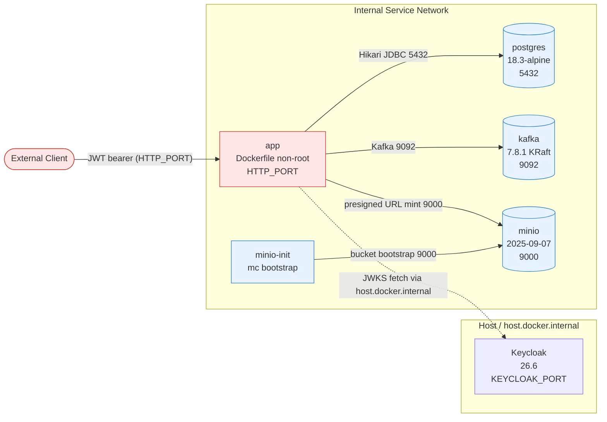

# Deployment Topology

**Category:** operations
**Coverage tags:** external-dependency-catalog, traffic-flow, operations
**Related pages:** [Traffic Flows](../traffic-flows.md) · [Local Development](../local-development.md) · [Configuration](../configuration.md) · [Troubleshooting](../troubleshooting.md) · [Known Limitations and Unknowns](../known-limitations-and-unknowns.md)

## Summary

This page documents the local Sentinel Enforcement Platform deployment as defined by Docker Compose. The confirmed deployment stack consists of six services: `app`, `postgres`, `kafka`, `minio`, `minio-init`, and `keycloak`. Each runs with explicit ports, named volumes, healthchecks, and stable hostnames on an internal service network. `Redis` and `Mailpit` are referenced in the dependency catalog by type but have **no** image, port, or env evidence in the deployment topology — their presence is **UNKNOWN** and they are treated as not-assumed-present (see [Unknown Dependencies](#unknown-dependencies-redis-mailpit)).

The internal service network is the trust boundary: `postgres`, `kafka`, and `minio` are reached only over that network. The `app` edge enforces JWT bearer auth, and `app` reaches the host Keycloak for JWKS via `host.docker.internal`.

## Service Inventory

The following table enumerates the confirmed Compose services, their pinned images, exposed ports, and runtime roles. All values are taken from the deployment-topology evidence and the `externalDependencies` catalog; no ports or images are inferred beyond evidence.

| Service | Image | Port | Role |
| --- | --- | --- | --- |
| `app` | Built from `Dockerfile` (non-root user) | `HTTP_PORT` (host-mapped) | Core application: HTTP API, JWT-verified edge, outbox poller, notification consumer, workflow engine, MinIO presigned-URL minting. |
| `postgres` | `postgres:18.3-alpine` | `5432` | Primary relational store (Hikari pool from `app`). Holds app schema + Camunda workflow schema. |
| `kafka` | `confluentinc/cp-kafka` `7.8.1` (KRaft, single node) | `9092` | Event/log broker (`app` produces/consumes via `KAFKA_BOOTSTRAP_SERVERS`). |
| `minio` | `minio/minio` `RELEASE.2025-09-07` | `9000` | S3-compatible object store; clients upload/download evidence directly via presigned URLs. |
| `minio-init` | `minio/mc` (bucket bootstrap) | — (one-shot) | Bootstraps MinIO buckets at startup using `mc`; no long-lived port. |
| `keycloak` | `quay.io/keycloak/keycloak` `26.6` | `KEYCLOAK_PORT` (host-mapped) | OIDC IdP; imports realm from `deployment/keycloak/realm/sentinel-realm.json`. Issuer: `http://localhost:{KEYCLOAK_PORT}/realms/sentinel`. |

> `minio-init` is a dependency/initializer rather than a long-running listener; it exits after bucket creation and is not part of steady-state traffic.

### App container environment (evidence-grounded)

The `app` service is configured by the following environment contract (all names from evidence; values are ISO-8601 durations or hostnames as noted):

- `HTTP_PORT` — app listen port (host-mapped).
- `DB_URL`, `DB_USER`, `DB_PASSWORD` — Postgres connection.
- `KAFKA_BOOTSTRAP_SERVERS` — Kafka `9092` endpoint.
- `APP_INSTANCE_ID` — identifies the app instance for outbox leasing.
- `OUTBOX_POLL_INTERVAL` = `PT2S` — outbox poll cadence.
- `OUTBOX_LEASE_DURATION` = `PT30S` — outbox row lease window.
- `OUTBOX_BATCH_SIZE` = `20` — rows per outbox poll.
- `NOTIFICATION_CONSUMER_GROUP_ID` — Kafka consumer group for notifications.
- `NOTIFICATION_MAX_RETRIES` = `3` — notification retry ceiling.
- `MINIO_*` — MinIO endpoint/credentials/region config.
- `EVIDENCE_UPLOAD_URL_TTL`, `EVIDENCE_DOWNLOAD_URL_TTL` — ISO-8601 presigned-URL lifetimes.
- `KEYCLOAK_ISSUER`, `KEYCLOAK_AUDIENCE`, `KEYCLOAK_JWKS_URL` — OIDC verification config; JWKS URL points to `host.docker.internal` so the Docker `app` can fetch host Keycloak certs.
- `WORKFLOW_ENGINE_NAME` — workflow engine selector (Camunda).
- `WORKFLOW_INVESTIGATION_ESCALATION_DURATION` = `PT30M` — escalation timeout.

### Default local users (dummy, local-only, password `sentinel`)

Seeded for local development only: `intake-jkt`/`intake-bdg`, `triage-jkt`/`triage-bdg`, `investigator-jkt`, `reviewer-jkt` (+`public`, +`conflicted` variants), `decision-jkt`, `appeal-jkt`, `supervisor-jkt` (+`unit-2`), `auditor-jkt`, `system-admin`. All share the dummy password `sentinel` and are **not** for any non-local environment.

## Networks and Volumes

- **Internal service network:** `postgres`, `kafka`, `minio`, and `minio-init` communicate over a dedicated Compose network. `app` joins this network to reach them by stable service hostnames (`postgres`, `kafka`, `minio`).
- **Named volumes:** Each stateful service uses explicit named volumes (Postgres data, MinIO data, Keycloak data) so state survives container restarts. Exact volume names follow the Compose file; the contract is that stateful services are volume-backed, not ephemeral.
- **Stable hostnames:** Service-to-service references use Compose service names (`postgres:5432`, `kafka:9092`, `minio:9000`). The `app` reaches Keycloak on the host via `host.docker.internal` rather than a service name, because Keycloak runs on the host in the developer loop and the app container must fetch its JWKS.
- **Host-mapped ports:** `app` (`HTTP_PORT`) and `keycloak` (`KEYCLOAK_PORT`) are the only externally reachable entry points in the local topology; `postgres`/`kafka`/`minio` ports are internal to the Compose network unless explicitly published.

## Readiness and Healthchecks

- **Healthcheck mechanism:** Services declare healthchecks; the `app` healthcheck curls `/health`.
- **Readiness dependencies:** `app` depends on `postgres`, `kafka`, `minio`, and `keycloak` readiness before it serves traffic. `minio-init` must complete bucket bootstrap before `app` mints presigned URLs against MinIO.
- **Developer bring-up loop (evidence-grounded order):**
  1. `make bootstrap` — initial setup.
  2. `make up` — start Compose services.
  3. `make migrate` — run app migrations + Camunda schema, then start `app`.
  4. `make seed` — load default users/realm fixtures.
  5. `make smoke-test` — exercise the `/health` and core flows.

This ordering reflects the readiness contract: schema/migrations and bucket init precede app traffic.

## Trust Boundaries

**Boundary rules (evidence-grounded):**

- **App edge is authenticated.** The `app` HTTP endpoint requires a JWT bearer token; there is no unsigned/decode-without-verification path. Exact-match issuer verification is enforced, so the issuer URL must stay consistent (use `localhost` everywhere; mismatch between `KEYCLOAK_ISSUER` and the app's view breaks verification).
- **Internal network trust.** `postgres`, `kafka`, and `minio` are reached only over the internal service network by stable hostnames. They are not independently authenticated at the application layer in the local topology; trust is via network isolation.
- **Host Keycloak crossing.** `app` crosses the container/host boundary to `host.docker.internal` solely to fetch Keycloak JWKS. This is the only documented host-crossing for cert retrieval; clients do not talk to Keycloak through `app`.
- **Direct object storage traffic.** MinIO presigned URLs are minted by `app` but clients upload/download evidence **directly** to/from `minio:9000`, bypassing `app` for bulk transfer.

## Traffic Flows

Mapped from the `trafficFlows` in `flows.json`:

| Source | Target | Port / Mechanism | Notes |
| --- | --- | --- | --- |
| Client | `app` | `HTTP_PORT` (JWT bearer) | Authenticated edge only. |
| `app` | Keycloak (host) | `host.docker.internal` JWKS | Cert fetch for OIDC verification. |
| `app` | `postgres` | `5432` (Hikari) | Relational persistence. |
| `app` | `kafka` | `9092` (KRaft) | Outbox/notification events. |
| `app` | `minio` | `9000` | Presigned-URL mint; clients transfer directly. |
| `minio-init` | `minio` | `9000` | One-shot bucket bootstrap. |

See [Traffic Flows](../traffic-flows.md) for the full flow catalog and failure branches.

## Unknown Dependencies (Redis, Mailpit)

> **Status: UNKNOWN — not evidenced in Compose or environment.**

`Redis` and `Mailpit` appear in the `externalDependencies` catalog by **type only**. There is:

- **No** image pin,
- **No** port mapping,
- **No** environment variable, and
- **No** Compose service definition

for either in the deployment-topology evidence or the app env contract. Their version and role are explicitly **UNKNOWN**.

**Implications for this page:**

- They are **not** included in the Service Inventory table, the topology diagram, or the trust-boundary flows, because inclusion would require inventing ports/images beyond evidence.
- Do **not** assume they are present in the local stack. Any consumer code expecting Redis or Mailpit is unsupported by the current deployment evidence.
- Treat any Redis/Mailpit usage as a known limitation/unknown rather than a confirmed dependency. Tracked under [Known Limitations and Unknowns](../known-limitations-and-unknowns.md).

## Cross-References

- **Bring-up & loop:** [Local Development](../local-development.md)
- **Env contract & issuer consistency:** [Configuration](../configuration.md)
- **Healthcheck / readiness failures:** [Troubleshooting](../troubleshooting.md)
- **Full traffic flow catalog:** [Traffic Flows](../traffic-flows.md)
- **Redis/Mailpit and other gaps:** [Known Limitations and Unknowns](../known-limitations-and-unknowns.md)
