# Operations Runbooks

**Category:** operations
**Purpose:** Provide operator guidance for failure modes and recovery.
**Coverage tags:** operations, troubleshooting, external-dependency-catalog
**Related pages:** [troubleshooting](troubleshooting.md), [deployment-topology](deployment-topology.md), [outbox-reliability](../outbox-reliability.md), [camunda-workflow](../camunda-workflow.md), [inbox-idempotency](../inbox-idempotency.md)

## Summary

Runbooks for: app fails to start, PostgreSQL unavailable, Kafka backlog, outbox stuck, dead-letter event, Camunda incident, domain-workflow mismatch, MinIO object missing, Liquibase lock, Keycloak unavailable. Each entry specifies trigger, expected behavior, consistency expectation, retry behavior, operator action, and audit/log evidence.

## Failure Scenario Catalog

### Cross-Scenario Reference Table

| Failure | Trigger | Operator action | Audit evidence |
| --- | --- | --- | --- |
| App fails to start | Non-root container exits; postgres/kafka/minio/keycloak not ready or issuer mismatch | `make logs`, `make ps`, verify deps up, check issuer consistency | Container exit logs; dependency readiness probes; CamundaSchemaMigrator run (databaseSchemaUpdate=false) |
| PostgreSQL unavailable | Hikari pool to postgres:5432 cannot connect (authoritative store) | `make up postgres`, `db-shell`, rely on bounded exponential backoff | HikariPool connection failure logs; `db-shell` connectivity |
| Kafka backlog | KRaft single node kafka:9092 lag on consumer groups | Check consumer lag, `kafka-topics`/`kafka-consume`, scale `NOTIFICATION_CONSUMER_GROUP_ID` | Kafka consumer lag metrics; outbox publisher poll PT2S batch 20 logs |
| Outbox stuck | `outbox_event` rows PENDING; lease conflicts on `APP_INSTANCE_ID` | Verify Kafka reachable; retry pending rows; check lease; runbook `docs/runbooks/outbox-stuck.md` | `outbox_event` status; `FOR UPDATE SKIP LOCKED` lease (PT30S); `APP_INSTANCE_ID` |
| Dead-letter event | Retry exhausted after NOTIFICATION_MAX_RETRIES (3) | Inspect `.dlq`, replay, runbook `docs/runbooks/dead-letter-events.md` | `.retry` then `.dlq` routing; dead-letter count |
| Camunda incident | Embedded Camunda 7.24.0 incident; boundary timer `InvestigationEscalationDelegate` PT30M | Camunda incident via API/admin; runbook `docs/runbooks/camunda-embedded-schema-migration.md` | ACT_* incident records; never direct SQL |
| Domain-workflow mismatch | Domain update and Camunda signal not in one distributed tx | `GET /api/v1/workflow-reconciliation`; `POST .../actions repair/terminate` (supervisor); runbook `docs/runbooks/domain-workflow-mismatch-reconciliation.md` | `WorkflowReconciliationApplicationService` detection; reconciliation API calls |
| MinIO object missing | Bucket `sentinel-evidence` object absent; `EvidenceObjectMissingExceptionMapper` 409 | Verify presigned TTLs; check object key; runbook `docs/runbooks/minio-evidence-storage.md` | 409 (missing) / 503 (unavailable); SHA-256/size/type finalize verify |
| Liquibase lock | `DATABASECHANGELOGLOCK` held; 7 releases blocked | `make db-status`; rollback if safe; runbook `docs/runbooks/liquibase-lock.md` | `DATABASECHANGELOGLOCK` row; Liquibake master changelog |
| Keycloak unavailable | IdP 26.6 realm sentinel down; JWKS unreachable at host.docker.internal | `make up keycloak`; verify issuer localhost consistency; check JWKS reachability | 401 on missing token; JWT signature/issuer/audience validation logs |

## App / PostgreSQL / Kafka

### App Fails to Start

- **Trigger:** Non-root Docker container exits; one of postgres/kafka/minio/keycloak not ready, or localhost issuer inconsistency. Camunda schema must be migrated via `CamundaSchemaMigrator` before app start (`databaseSchemaUpdate=false`).
- **Expected behavior:** App blocks startup until dependencies are ready and Camunda schema is present; consistent localhost issuer resolved.
- **Consistency expectation:** Camunda schema must be fully migrated before the app serves traffic; no runtime schema auto-update.
- **Retry behavior:** Operator-triggered restart after dependency readiness; no internal self-heal for dependency absence.
- **Operator action:** `make logs`, verify deps up (`make ps`), check issuer consistency (README troubleshooting: consistent localhost issuer).
- **Audit/log evidence:** Container exit logs; dependency readiness probe failures; `CamundaSchemaMigrator` execution record with `databaseSchemaUpdate=false`.

### PostgreSQL Unavailable

- **Trigger:** Hikari connection pool to `postgres:5432` cannot establish connections. PostgreSQL is the authoritative store.
- **Expected behavior:** App logs Hikari pool failures and applies bounded exponential backoff retries.
- **Consistency expectation:** PostgreSQL is the system of record; no writes occur while it is unavailable.
- **Retry behavior:** Bounded exponential backoff implemented by the app.
- **Operator action:** `make up postgres`, then `db-shell` to confirm connectivity; allow app backoff to retry.
- **Audit/log evidence:** `HikariPool` connection-acquisition failure stack traces; `db-shell` successful connection.

### Kafka Backlog

- **Trigger:** KRaft single node `kafka:9092` consumer-group lag accumulates across the 8 topics; `KafkaOutboxPublisher` polls every PT2S in batches of 20.
- **Expected behavior:** Outbox publisher continues polling; consumers drain with observable lag.
- **Consistency expectation:** At-least-once delivery via outbox; backlog does not lose events.
- **Retry behavior:** Outbox republishes PENDING events; consumer lag reduces as group scales.
- **Operator action:** Check consumer lag, use `kafka-topics`/`kafka-consume` to inspect, scale consumer group `NOTIFICATION_CONSUMER_GROUP_ID`.
- **Audit/log evidence:** Kafka consumer lag metrics; `KafkaOutboxPublisher` poll PT2S batch 20 logs; topic partition offsets.

## Outbox Stuck / Dead-Letter

### Outbox Stuck

- **Trigger:** `outbox_event` rows remain `PENDING`; `KafkaOutboxPublisher` leases via `FOR UPDATE SKIP LOCKED` (lease owner `APP_INSTANCE_ID`, duration PT30S) and cannot publish.
- **Expected behavior:** Pending rows are retryable; lease prevents double-publish across instances.
- **Consistency expectation:** Outbox guarantees eventual publish; no duplicate delivery under correct lease ownership.
- **Retry behavior:** Pending rows retried on next poll once Kafka reachable and lease free.
- **Operator action:** Verify Kafka reachable; confirm pending rows are retryable; check `APP_INSTANCE_ID` lease conflicts; consult `docs/runbooks/outbox-stuck.md`.
- **Audit/log evidence:** `outbox_event` status column; `FOR UPDATE SKIP LOCKED` lease rows (owner `APP_INSTANCE_ID`, PT30S); publisher poll logs.

### Dead-Letter Event

- **Trigger:** Notification failures route to `.retry` while count < `NOTIFICATION_MAX_RETRIES` (3), then to `.dlq`.
- **Expected behavior:** Transient failures retry up to 3 times, then land in dead-letter topic.
- **Consistency expectation:** No silent drop; exhausted failures are observable in `.dlq`.
- **Retry behavior:** Automatic retry on `.retry` up to 3; manual replay from `.dlq`.
- **Operator action:** Inspect `.dlq`, replay events, consult `docs/runbooks/dead-letter-events.md`.
- **Audit/log evidence:** `.retry` → `.dlq` routing records; dead-letter retry counter; replay actions logged.

## Camunda Incident / Domain-Workflow Mismatch

### Camunda Incident

- **Trigger:** Embedded Camunda 7.24.0 raises an incident; `InvestigationEscalationDelegate` boundary timer fires at PT30M.
- **Expected behavior:** Incident recorded in Camunda; escalation delegate triggers after PT30M boundary.
- **Consistency expectation:** Workflow state authoritative in Camunda; never run direct SQL against `ACT_*`.
- **Retry behavior:** Camunda incident retry via engine; boundary timer escalation path.
- **Operator action:** Handle incident via Camunda API/admin; consult `docs/runbooks/camunda-embedded-schema-migration.md`.
- **Audit/log evidence:** `ACT_*` incident records; `InvestigationEscalationDelegate` PT30M timer; no direct SQL in audit.

### Domain-Workflow Mismatch

- **Trigger:** Domain update and Camunda signal are not emitted within one distributed transaction, producing divergence detected by `WorkflowReconciliationApplicationService`.
- **Expected behavior:** Reconciliation service flags mismatch; supervisor can repair or terminate.
- **Consistency expectation:** Domain and workflow must converge; mismatch is reconcilable, not auto-healed.
- **Retry behavior:** Manual repair/terminate actions; no automatic merge.
- **Operator action:** `GET /api/v1/workflow-reconciliation` to inspect; `POST .../actions repair` or `.../actions terminate` (supervisor-scoped); consult `docs/runbooks/domain-workflow-mismatch-reconciliation.md`.
- **Audit/log evidence:** `WorkflowReconciliationApplicationService` detection events; reconciliation API request/response logs (supervisor scope).

## MinIO Missing / Liquibase Lock / Keycloak Unavailable

### MinIO Object Missing

- **Trigger:** Bucket `sentinel-evidence` lacks the expected object; finalize verify (size/type/SHA-256) fails. Returns `EvidenceObjectMissingExceptionMapper` (409); storage unavailable returns 503.
- **Expected behavior:** Presigned PUT TTL PT15M / GET TTL PT10M; object key `/{jurisdiction}/{caseId}/{evidenceId}/{version}/{generatedFileName}`; path traversal prevented.
- **Consistency expectation:** Evidence object durable in `sentinel-evidence`; missing object is a hard 409, not a silent gap.
- **Retry behavior:** Re-issue presigned URL within TTL; re-upload before expiry.
- **Operator action:** Verify object key and presigned TTLs; check bucket; consult `docs/runbooks/minio-evidence-storage.md`.
- **Audit/log evidence:** `EvidenceObjectMissingExceptionMapper` 409 (missing) / 503 (unavailable); finalize size/type/SHA-256 mismatches; object-key access logs.

### Liquibase Lock

- **Trigger:** `DATABASECHANGELOGLOCK` row held; migrations across 7 releases blocked. Liquibake master includes foundation/case-management/workflow/evidence/messaging/phase7/phase8.
- **Expected behavior:** Lock prevents concurrent migration; `make db-status` reports held state.
- **Consistency expectation:** Schema migrations are serialized; locked state blocks further changelogs.
- **Retry behavior:** Only safe after explicit operator release/rollback.
- **Operator action:** `make db-status`; rollback if safe; consult `docs/runbooks/liquibase-lock.md`.
- **Audit/log evidence:** `DATABASECHANGELOGLOCK` row (locked_by/locked_since); Liquibake master changelog execution order.

### Keycloak Unavailable

- **Trigger:** IdP 26.6 realm `sentinel` down; JWKS at `host.docker.internal` unreachable. Missing token yields 401.
- **Expected behavior:** App verifies JWT signature/issuer/audience via JWKS; rejects unauthenticated requests with 401.
- **Consistency expectation:** Auth decisions rely on live JWKS; issuer must match localhost configuration.
- **Retry behavior:** Client retries after Keycloak recovery; no token => 401 persisted.
- **Operator action:** `make up keycloak`; verify issuer localhost consistency; check JWKS reachability.
- **Audit/log evidence:** 401 responses on missing token; JWT signature/issuer/audience validation failures; JWKS fetch errors.

## Failure Mode to Recovery Action Map

```mermaid
flowchart TD
    A[App fails to start] -->|deps not ready / issuer mismatch| OA[make logs, make ps, check issuer]
    B[PostgreSQL unavailable] -->|Hikari pool fail| OB[make up postgres, db-shell, app backoff]
    C[Kafka backlog] -->|consumer lag| OC[check lag, kafka-topics, scale NOTIFICATION_CONSUMER_GROUP_ID]
    D[Outbox stuck] -->|PENDING rows / lease conflict| OD[verify Kafka, check APP_INSTANCE_ID, docs/runbooks/outbox-stuck.md]
    E[Dead-letter event] -->|retries exhausted| OE[inspect .dlq, replay, docs/runbooks/dead-letter-events.md]
    F[Camunda incident] -->|ACT_* incident / PT30M timer| OF[Camunda API/admin, docs/runbooks/camunda-embedded-schema-migration.md]
    G[Domain-workflow mismatch] -->|not one tx| OG[GET /api/v1/workflow-reconciliation, POST repair/terminate, docs/runbooks/domain-workflow-mismatch-reconciliation.md]
    H[MinIO object missing] -->|409/503| OH[verify key/TTL, docs/runbooks/minio-evidence-storage.md]
    I[Liquibase lock] -->|DATABASECHANGELOGLOCK held| OI[make db-status, rollback, docs/runbooks/liquibase-lock.md]
    J[Keycloak unavailable] -->|JWKS unreachable / 401| OJ[make up keycloak, verify issuer, check JWKS]
```

