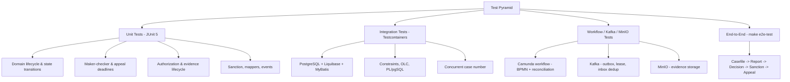

# Testing Strategy

**Category:** operations
**Coverage tags:** operations, branch-conditions
**Related pages:** [Module Integration Tests](../module-integration-tests.md), [Local Development](../local-development.md), [Operations Runbooks](operations-runbooks.md), [Known Limitations and Unknowns](../known-limitations-and-unknowns.md)

## Summary

The Sentinel Enforcement Platform is verified through a layered test strategy built on **JUnit 5**. Unit tests cover domain state transitions, maker-checker enforcement, appeal deadlines, authorization, the evidence lifecycle, sanctions, mappers, and events. Persistence integration tests use **Testcontainers PostgreSQL** with **Liquibase**, **MyBatis**, constraint checks, optimistic locking concurrency (OLC), **PL/pgSQL**, and concurrent case-number generation. Workflow, Kafka, and MinIO behavior are exercised with containerized Camunda, Kafka, and MinIO. A full end-to-end lifecycle is covered by the `make e2e-test` target. Current verification status is derived from `docs/PROJECT_STATUS.md` for this run.

## Test Layers

The platform separates fast, isolated unit tests from container-backed integration and end-to-end tests. The table below maps each layer to its tooling and scope.

| Test layer | Tool | Scope |
| --- | --- | --- |
| Unit | JUnit 5 (MapStruct, business.json rule checks) | Domain transitions, maker-checker, appeal deadlines, authorization, evidence lifecycle, sanctions, mappers, events |
| Integration | Testcontainers + JUnit 5 (Maven failsafe) | PostgreSQL + Liquibase + MyBatis, constraints, OLC, PL/pgSQL, concurrent case number |
| Workflow | JUnit 5 + embedded Camunda 7.24.0 | BPMN validation, task completion idempotency, reconciliation job, escalation boundary timer |
| Kafka | Testcontainers Kafka + JUnit 5 | Transactional outbox, SKIP LOCKED lease, inbox dedup, outage resilience |
| MinIO | Testcontainers MinIO + JUnit 5 | Evidence object storage lifecycle |
| End-to-End | Makefile `e2e-test` | Full casefile → report → decision → sanction → appeal lifecycle |

## Unit Test Coverage

Unit tests live in module-level `src/test` trees and use JUnit 5.

**Domain transition / lifecycle** — `sentinel-domain/.../test` validates the state machine and invariants from the domain lifecycle:

- `CLOSED` immutability (only an approved reopen transitions out).
- `PENDING_DECISION` requires an approved investigation report.
- No `CLOSE` while an active sanction obligation exists.
- Evidence referenced by a published decision cannot be deleted.
- Immutable `SHA-256` per `EvidenceVersion`.
- Published `Decision` is immutable.
- One active appeal per decision; a late appeal requires supervisor override.
- One `eventId` ⇒ one side effect per consumer.

**Application services** — `sentinel-application/.../test` covers report, casefile, and evidence services.

**Security** — `sentinel-security/.../test`:
- `RoleBasedAuthorizationServiceTest` — role/permission checks, including denial of assigned-unit, classification, and conflict access.
- `KeycloakTokenVerifierTest` — token verification paths.

**Workflow** — `BpmnModelValidationTest` validates the embedded BPMN models at build time.

**Mapper / event coverage** — MapStruct mappers and event-side-effect rules (one eventId ⇒ one side effect) are exercised at the unit layer, grounded in `business.json` rules.

## Integration Test Coverage

Integration tests reside in `sentinel-integration-tests` and run under Maven failsafe with Testcontainers PostgreSQL, Kafka, Keycloak, and MinIO.

Classes and their scope (evidence-grounded):

| Test class | Scope |
| --- | --- |
| `ReportApiIT` | Report API happy path and validation |
| `CaseApiIT` | Casefile API, investigator visibility, assigned-unit / classification / conflict denial, 401/403/404/409 cases |
| `EvidenceApiIT` | Evidence lifecycle, deletion-blocked-by-published-decision |
| `WorkflowTaskApiIT` | Task cursor / search / sort, duplicate-completion handling |
| `WorkflowReconciliationApiIT` | Reconciliation job behavior |
| `MessagingReliabilityIT` | Outbox reliability under Kafka outage, inbox dedup |
| `ApplicationRuntimeSchemaLifecycleIT` | Liquibase schema lifecycle on Testcontainers PostgreSQL |

Persistence specifics covered: **Liquibase** migrations, **MyBatis** mapping (including dynamic-SQL branches), database **constraints**, **optimistic locking concurrency (OLC)**, **PL/pgSQL** routines, and **concurrent case-number** generation under contention.

## Workflow/Kafka/MinIO Tests

**Workflow** — Embedded Camunda 7.24.0 runs `regulatory-enforcement-case.bpmn` and `decision-appeal-review.bpmn`. `BpmnModelValidationTest` validates models. `WorkflowTaskApiIT` confirms task completion is idempotent. A reconciliation job is verified by `WorkflowReconciliationApiIT`. `InvestigationEscalationDelegate` fires on a PT30M boundary timer.

**Kafka** — `MessagingReliabilityIT` verifies the transactional outbox pattern: a `FOR UPDATE SKIP LOCKED` lease drains the outbox, and the inbox enforces `UNIQUE(consumer_name, event_id)` for dedup. Critically, a **Kafka outage does NOT roll back committed business writes** — the outbox retains and replays.

**MinIO** — Testcontainers MinIO backs the evidence object store; evidence version blobs are written and referenced through the evidence lifecycle tested by `EvidenceApiIT`.

## End-to-End Coverage

`make e2e-test` drives the full lifecycle: casefile creation → investigation report → pending decision → sanction → appeal review. It composes the integration, workflow, Kafka, and MinIO layers against the running reactor, validating cross-cutting behavior that unit and isolated integration tests cannot.

## Verification Status

Status for this run, from `docs/PROJECT_STATUS.md`:

| Check | Result |
| --- | --- |
| `spotless:apply` | Passed |
| `mvn test` (unit) | Passed |
| `mvn -pl sentinel-integration-tests -am verify` (full reactor + targeted ITs) | Passed |

**Phase 8 regression loop fixes:**
- Corrected a malformed MyBatis dynamic-SQL branch in case listing.
- Removed stale integration-test unit identifiers for the assigned-unit model.

## Known Limitations

Truthfully stated from evidence — these remain open:

- Workflow-start still uses **compensation** rather than an outbox-backed start intent.
- Later-state prerequisites are **lighter** than the master target.
- `enforcement-monitoring` detail is **incomplete**.
- **Load/performance review**, **failure-injection** testing, and **metrics/dashboards** remain unaddressed.

## Commands

| Command | Purpose |
| --- | --- |
| `make unit-test` | Run JUnit 5 unit tests |
| `make integration-test` | `mvn -pl sentinel-integration-tests -am verify` |
| `make workflow-test` | Run workflow/Camunda tests |
| `make messaging-test` | Run Kafka/messaging-reliability tests |
| `make e2e-test` | Run end-to-end lifecycle |
| `make verify` | Full reactor verification |
