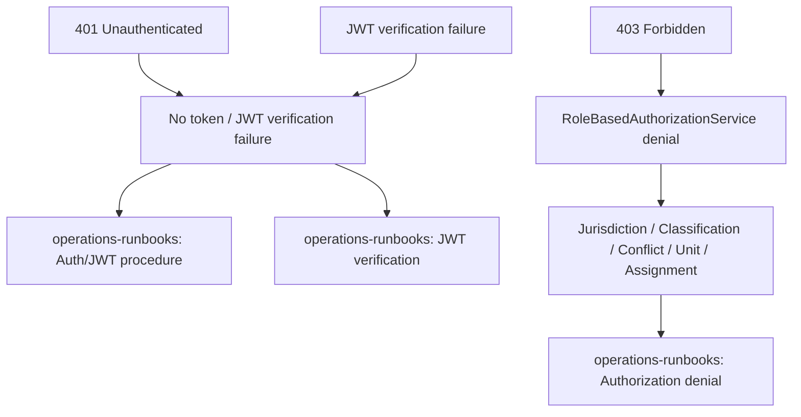
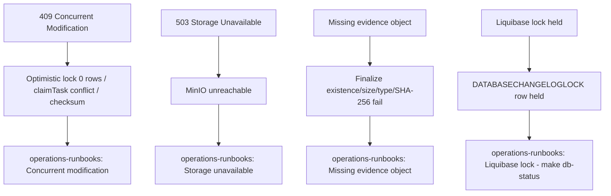
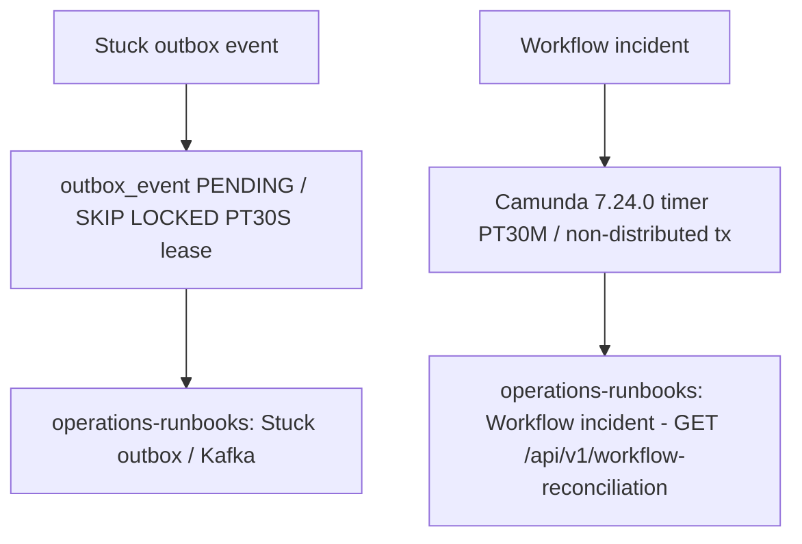

# Troubleshooting

> Symptom-oriented quick diagnosis guide for the Sentinel Enforcement Platform. Each symptom maps to its likely cause, the owning runbook in [operations-runbooks](operations-runbooks.md), and the logs/correlation pointers that confirm the diagnosis.

## Symptom Index

| Symptom | Likely cause | Runbook |
| --- | --- | --- |
| `401 Unauthenticated` | No/invalid bearer token; JWT verification failure | [Auth and Authorization Symptoms](#auth-and-authorization-symptoms) |
| `403 Forbidden` | Role/jurisdiction/unit/classification/conflict/assignment policy denial | [Auth and Authorization Symptoms](#auth-and-authorization-symptoms) |
| `409 Concurrent Modification` | Optimistic lock version mismatch; conflicting task claim; evidence checksum/object conflict | [Concurrency and Storage Symptoms](#concurrency-and-storage-symptoms) |
| `503 Storage Unavailable` | MinIO unreachable during presigned PUT/GET | [Concurrency and Storage Symptoms](#concurrency-and-storage-symptoms) |
| Stuck outbox event | Kafka publish lease not released; Kafka outage | [Messaging and Workflow Symptoms](#messaging-and-workflow-symptoms) |
| Missing evidence object | Finalize verifies object existence/size/type/SHA-256; object absent | [Concurrency and Storage Symptoms](#concurrency-and-storage-symptoms) |
| Liquibase lock held | `DATABASECHANGELOGLOCK` not released across releases | [Concurrency and Storage Symptoms](#concurrency-and-storage-symptoms) |
| JWT verification failure | Signature/issuer/audience/expiry/not-before/claim mismatch | [Auth and Authorization Symptoms](#auth-and-authorization-symptoms) |
| Workflow incident | Camunda timer/escalation; domain/Camunda update not in one distributed tx | [Messaging and Workflow Symptoms](#messaging-and-workflow-symptoms) |

## Auth and Authorization Symptoms

### 401 Unauthenticated
- **Mapper:** `UnauthenticatedExceptionMapper` returns `401` when no bearer token is present or the token cannot be parsed.
- **Likely cause:** Missing `Authorization: Bearer` header, expired token, or JWT verification failure in `KeycloakTokenVerifier`.
- **Verification facts:** `KeycloakTokenVerifier` checks signature, issuer, audience, expiry, not-before, and required claims. It performs **no unsigned decode**. Issuer is `http://localhost:{KEYCLOAK_PORT}/realms/sentinel` with exact-match — the app JWKS is fetched via `host.docker.internal`. Inconsistent localhost/port between Keycloak and app breaks the exact-match issuer check.
- **Runbook:** See [operations-runbooks](operations-runbooks.md) → "Authentication / JWT" procedure.
- **Log pointers:** Capture `correlationId` from the RFC-7807 envelope; inspect structured JSON logs for the verification failure reason (signature, issuer, audience, expiry, not-before, claims).

### 403 Forbidden
- **Mapper:** `AuthorizationDeniedExceptionMapper` returns `403`.
- **Policy engine:** `RoleBasedAuthorizationService` — `SYSTEM_ADMIN` short-circuits all checks; role is mapped to `Permission`; then jurisdiction, classification, conflict-of-interest, assigned-unit scope, and direct assignment are evaluated. **Rule: role alone does not grant access.**
- **Denial dimensions:**
  - **Jurisdiction:** actor lacks `jurisdictionCode` for the resource.
  - **Classification:** actor clearance below resource classification.
  - **Conflict-of-interest:** `isConflictedWith(resourceOwnerId)` true.
  - **Assigned-unit scope:** `enforceAssignedUnitScope` denies out-of-unit access.
  - **Direct assignment:** only `actor.username == assigneeUserId` permitted.
- **Runbook:** See [operations-runbooks](operations-runbooks.md) → "Authorization denial" procedure; policy detail in [../security-authorization](../security-authorization.md).
- **Log pointers:** `correlationId` in the envelope; `audit_event` append-only entries record the denial dimension. A sensitive download denial is recorded as `EvidenceDownloadDenied`.

### JWT verification failure (related to 401)
- **Likely cause:** Token fails one of: signature, issuer (exact match `http://localhost:{KEYCLOAK_PORT}/realms/sentinel`), audience, expiry, not-before, or missing required claims.
- **Runbook:** See [operations-runbooks](operations-runbooks.md) → "JWT verification" procedure; topology in [deployment-topology](deployment-topology.md) for `KEYCLOAK_PORT` and `host.docker.internal` JWKS fetch.
- **Log pointers:** Correlation id from envelope; structured JSON log line naming the failed check.

## Concurrency and Storage Symptoms

### 409 Concurrent Modification
- **Mapper:** `EvidenceConflictExceptionMapper` / `EvidenceObjectMissingExceptionMapper` (409) and the optimistic-lock path.
- **Likely causes:**
  - Optimistic locking: `UPDATE ... SET version=version+1 WHERE id AND version=expectedVersion`; **0 rows affected ⇒ 409**.
  - Conflicting task claim: `claimTask` returns `409` when another actor already holds the claim.
  - Evidence checksum mismatch or missing object during finalize.
- **Runbook:** See [operations-runbooks](operations-runbooks.md) → "Concurrent modification / retry" procedure.
- **Log pointers:** `correlationId` from envelope; `audit_event` for the conflicting write/claim; expect the expected-vs-actual `version` in structured logs.

### 503 Storage Unavailable
- **Mapper:** `EvidenceStorageUnavailableExceptionMapper` when MinIO is unavailable.
- **Likely cause:** MinIO endpoint unreachable for presigned operations. Presigned PUT TTL `PT15M`; presigned GET TTL `PT10M`.
- **Runbook:** See [operations-runbooks](operations-runbooks.md) → "Storage unavailable" procedure; MinIO placement in [deployment-topology](deployment-topology.md).
- **Log pointers:** `correlationId` from envelope; structured JSON log of the MinIO connection failure.

### Missing evidence object
- **Mapper:** `EvidenceObjectMissingExceptionMapper` (409).
- **Likely cause:** Finalize verifies object **existence / size / type / SHA-256**; object absent ⇒ 409. Object key format: `/{jurisdiction}/{caseId}/{evidenceId}/{version}/{generatedFileName}`; path traversal is prevented.
- **Runbook:** See [operations-runbooks](operations-runbooks.md) → "Missing evidence object" procedure; storage model in [../observability](../observability.md) for object-key tracing.
- **Log pointers:** `correlationId` from envelope; `audit_event` for the finalize verification failure; confirm object key against the key template.

### Liquibase lock held
- **Likely cause:** `DATABASECHANGELOGLOCK` row held across a failed/crashed migration. The platform ships **7 releases**.
- **Runbook:** See [operations-runbooks](operations-runbooks.md) → "Liquibase lock" procedure; verify with `make db-status`.
- **Log pointers:** `correlationId` (if during startup request) and startup structured logs showing the lock owner/`DATABASECHANGELOGLOCK` state.

## Messaging and Workflow Symptoms

### Stuck outbox event
- **Likely cause:** `outbox_event` row remains `PENDING`. `KafkaOutboxPublisher` leases rows with `FOR UPDATE SKIP LOCKED` keyed by `APP_INSTANCE_ID` for `PT30S`. A held-but-unreleased lease or a Kafka outage stalls delivery.
- **Important:** A Kafka outage does **NOT** roll back committed business writes (see `MessagingReliabilityIT`). `notification.command.v1` is routed to `.retry` (`NOTIFICATION_MAX_RETRIES=3`) then `.dlq`.
- **Runbook:** See [operations-runbooks](operations-runbooks.md) → "Stuck outbox / Kafka" procedure; topic routing in [deployment-topology](deployment-topology.md) and [../observability](../observability.md).
- **Log pointers:** `correlationId` from envelope/MDC; structured JSON logs show the `SKIP LOCKED` lease owner (`APP_INSTANCE_ID`) and retry/DQ transitions on `notification.command.v1`.

### Workflow incident
- **Likely cause:** Embedded **Camunda 7.24.0**; `InvestigationEscalationDelegate` boundary timer `PT30M`. Domain update and the Camunda signal are **not** in one distributed transaction, so divergence can occur.
- **Reconciliation:** `GET /api/v1/workflow-reconciliation` surfaces domain/Camunda drift.
- **Runbook:** See [operations-runbooks](operations-runbooks.md) → "Workflow incident / reconciliation" procedure.
- **Log pointers:** `correlationId` from envelope; `audit_event` captures the escalation signal; consult reconciliation output from `GET /api/v1/workflow-reconciliation`.

## Log and Correlation Pointers

- **correlationId:** Returned in every RFC-7807 error envelope; propagated via MDC for structured JSON logging. Use it as the primary join key across service logs when diagnosing any symptom above.
- **audit_event:** Append-only audit store. Relevant denial/verification events include `EvidenceDownloadDenied` (sensitive download denied) and authorization/conflict records tied to the symptoms in this guide.
- **Structured JSON logging:** All mappers and services emit structured logs; search by `correlationId`, exception mapper name (e.g., `EvidenceStorageUnavailableExceptionMapper`), or the specific check that failed (JWT issuer/audience/expiry, finalize SHA-256, optimistic-lock version).
- **Reconciliation endpoint:** `GET /api/v1/workflow-reconciliation` for workflow-incident diagnosis.
- **Topology reference:** [deployment-topology](deployment-topology.md) for MinIO, Kafka, Keycloak (`KEYCLOAK_PORT`, `host.docker.internal` JWKS), and `APP_INSTANCE_ID` placement.

### Related pages
- [operations-runbooks](operations-runbooks.md)
- [../security-authorization](../security-authorization.md)
- [../observability](../observability.md)
- [deployment-topology](deployment-topology.md)
