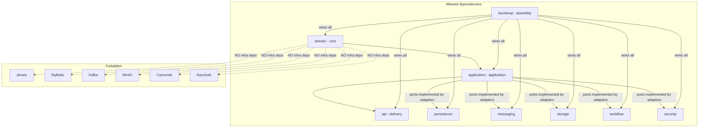
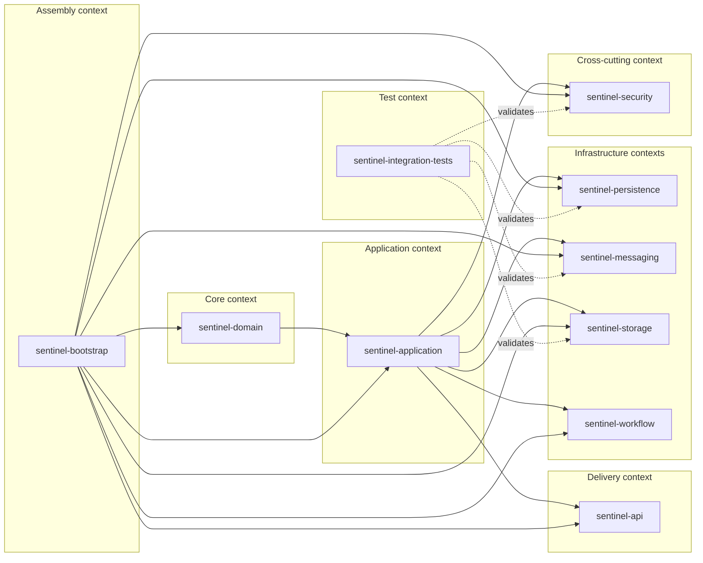

# Architecture at a Glance

**Audience:** engineer, architect
**Purpose:** Explain architectural boundaries, layering invariant, key cross-cutting decisions.

The system (`sentinel-enforcement`, `0.1.0-SNAPSHOT`) is a **modular monolith** with explicit bounded contexts (ADR-001), built as a 10-module Maven reactor on Java 21. The architecture style is `modular-monolith` — *not microservices yet*.

---

## Architectural Decision Summary

| ADR | Title | Core decision |
| --- | --- | --- |
| 001 | modular-monolith | Modular monolith with explicit bounded contexts; not microservices yet |
| 002 | domain-state-vs-workflow-state | Domain DB = business state of truth; Camunda = orchestration position only |
| 003 | mybatis-over-orm | MyBatis over JPA/ORM for explicit, testable SQL |
| 004 | transactional-outbox | Outbox + SKIP LOCKED publisher for Kafka reliability |
| 005 | inbox-idempotency | Inbox dedup via `UNIQUE(consumer_name, event_id)` |
| 006 | keycloak-local-authentication | Keycloak local IdP, JWT verification, claim-based authz |
| 007 | minio-evidence-storage | MinIO for evidence object storage, presigned URLs |
| 008 | optimistic-locking | OLC on mutable aggregates, 409 on version mismatch |
| 009 | api-contract-first | OpenAPI-first; generated models are source of DTOs |
| 010 | audit-log-model | Append-only `audit_event` separate from app logs |

Each ADR follows Context/Decision/Alternatives/Consequences/Status (see [adr-landscape.md](../adr-landscape.md)).

---

## Layered Structure and Dependency Rule

**Dependency rule (FACT):** `domain <- application <- api`. The domain module has **no infrastructure dependencies** — it must not import Jersey, MyBatis, Kafka, MinIO, Camunda, or Keycloak. `sentinel-application` depends only on *ports*; the infrastructure adapters (persistence, messaging, storage, workflow, security) implement those ports. `sentinel-bootstrap` is the composition root that wires everything.

> **State-of-truth split (ADR-002):** The domain database is the business state of truth. Embedded Camunda 7.24.0 holds *only* orchestration position, not business state.

---

## Bounded Contexts

The 10 modules are organized as bounded contexts around the domain core.

---

## Cross-Cutting Concerns

### Authorization (sentinel-security)
Enforced by `RoleBasedAuthorizationService` over a **25-permission** enum and Keycloak JWT verification (ADR-006). Policy steps:

1. `SYSTEM_ADMIN` short-circuits all checks.
2. Actor must hold a role mapped to the required `Permission` else **403**.
3. **Jurisdiction** — if context `jurisdictionCode` set and actor lacks it ⇒ denied.
4. **Classification clearance** — if `caseClassification` set and actor lacks clearance ⇒ denied.
5. **Conflict-of-interest** — if `resourceOwnerId` set and actor `isConflictedWith` owner ⇒ denied.
6. **Assigned-unit scope** — `enforceAssignedUnitScope` for unit-restricted resources.
7. **Direct assignment** — `requiresDirectAssignment(actor, permission)` requires `actor.username() == authorizationContext.assigneeUserId()`.

JWT claims: `jurisdictions`, `assigned_units`, `case_classifications`, `conflicted_actor_ids`. Verification checks signature, issuer, audience, expiry, not-before, required claims. `GET /api/v1/cases` and workflow task visibility use the same rules. Denied access returns **401** (no token) / **403** (role/jurisdiction/unit/classification/conflict/assignment).

### Audit (ADR-010)
Append-only `audit_event` model, kept separate from application logs.

### Messaging reliability (ADR-004, ADR-005)
- **Outbox + SKIP LOCKED publisher** (ADR-004) — the outbox survives Kafka outages; polling uses `OUTBOX_POLL_INTERVAL` (PT2S), `OUTBOX_LEASE_DURATION` (PT30S), `OUTBOX_BATCH_SIZE` (20).
- **Inbox idempotency** (ADR-005) — dedup via `UNIQUE(consumer_name, event_id)`, enforcing per-consumer event idempotency (business invariant).

### Optimistic locking (ADR-008)
OLC on mutable aggregates; a version mismatch returns **409**.

### Contract-first API (ADR-009)
OpenAPI-first; generated models are the source of DTOs. `make openapi-generate` runs `openapi-generator-maven-plugin` on `sentinel-api`, producing `target/generated-sources/openapi/.../generated/model` and `Api*MapperImpl` under `target/generated-sources/annotations`.

---

## Why Modular Monolith (Not Microservices Yet)

ADR-001 deliberately chooses a modular monolith with explicit bounded contexts. The 10 modules share one process and one domain database (business state of truth, ADR-002) while keeping infrastructure behind application ports. This preserves clear context boundaries and the strict `domain <- application <- api` dependency rule without the operational overhead of distributed services. The architecture is positioned as *not microservices yet* — the boundaries are drawn so a future split remains possible, but there is no cross-process RPC today (Kafka is used for outbox/event reliability, ADR-004, not for inter-service calls).

---

## Related Decisions

- Domain vs workflow state: ADR-002
- MyBatis over ORM: ADR-003
- Transactional outbox: ADR-004
- Inbox idempotency: ADR-005
- Keycloak auth: ADR-006
- MinIO evidence: ADR-007
- Optimistic locking: ADR-008
- Contract-first API: ADR-009
- Audit log: ADR-010

---

## Related pages

- [overview.md](overview.md)
- [module-overview.md](module-overview.md)
- [adr-landscape.md](../adr-landscape.md)
- [business-overview.md](business-overview.md)
