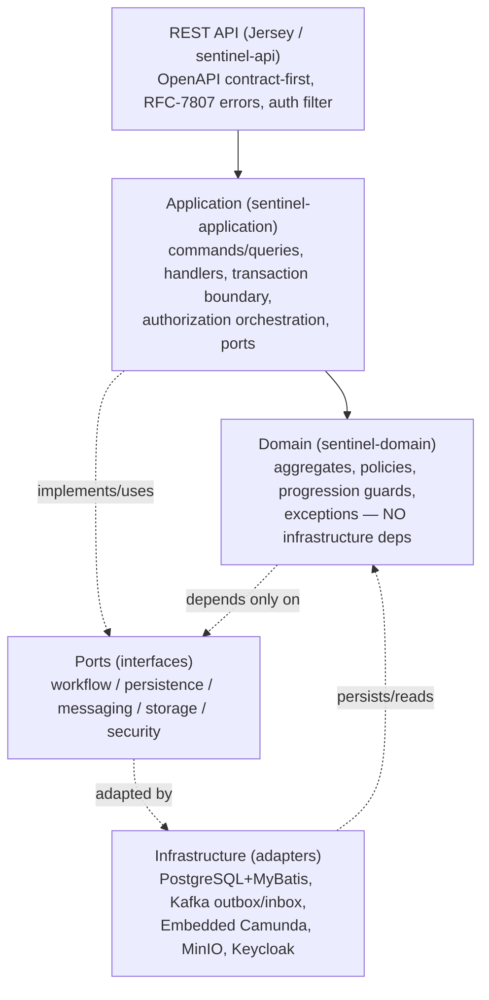
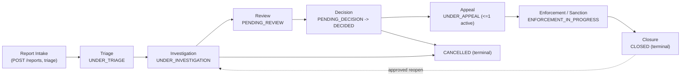

# Sentinel Enforcement Platform Overview

**Audience:** engineer, architect, product, business-analyst, operator
**Category:** orientation
**Purpose:** Answer-first introduction to what Sentinel is, its problem domain, the mandatory technology stack, and where to go next.

> **Read this first.** Sentinel is a **modular-monolith regulatory enforcement and complex case-management platform**. It ingests reports, triages them, runs investigations, produces recommendations and decisions, applies sanctions, handles appeals, and closes cases — with a shared domain model, explicit bounded contexts, and one deployable unit. This page frames the system and points to deeper pages.

---

## What Sentinel Enforces

Sentinel supports the end-to-end lifecycle of **regulatory enforcement cases** derived from incoming reports. The problem domain is *complex case management under legal/regulatory constraint*: a case must be investigated and decided following strict, auditable progression rules, and every state change must respect jurisdiction, assignment, classification, and conflict-of-interest boundaries.

**Human and system actors** (detailed in [Business Overview](../business-domain/business-overview.md)) span intake officer → triage officer → investigator → reviewer/decision-maker → sanction/ap­peal officers → system admin, plus system actors: Keycloak (identity), Kafka (messaging), MinIO (evidence object storage).

**Core enforcement invariants** (evidence-backed; see [Business Rules and Invariants](../business-logic/business-rules.md)):

| Invariant | Rule | Source |
|---|---|---|
| Closed immutability | `CLOSED` cases change only via an *approved reopen* | business-rules |
| Pending-decision gate | No `PENDING_DECISION` before an **approved** investigation | business-rules |
| No-close-with-active-sanction | No `CLOSED` case with an active sanction obligation | business-rules |
| Maker-checker separation | Maker (creator) must not be the approver (decisions, recommendations, sanction changes) | business-rules / ADR-009 |
| Immutable published decisions | Decisions immutable after publish; change only via correction/appeal | business-rules |
| One active appeal | At most one active appeal per decision | business-rules |
| Resource-level authorization | Access considers jurisdiction, assignment, classification, conflict-of-interest | security-authorization |

> **Source-grounding note:** The lifecycle states and invariant set above are taken from the documentation manifest (`docs/SUMMARY.md` "Case Lifecycle and State Machine") and the master onboarding contract. Some later-state prerequisites (e.g. recommendation/review/decision/sanction/appeal gates) are **lighter than the master target** as of Phase 8 — see [Known Limitations](../reference/known-limitations-and-unknowns.md).

---

## Architecture Style at a Glance

Sentinel is a **modular monolith** (ADR-001, *Accepted*): a Maven multi-module build with explicit bounded-context boundaries, deployed as one unit — not a microservice split. The domain is the **source of truth for business state**; the embedded Camunda workflow engine holds **orchestration state** (ADR-002, *Accepted*). The two are kept in sync explicitly via a workflow-reconciliation path.

Key architectural decisions (full landscape in [ADR Landscape](../reference/adr-landscape.md)):

| ADR | Decision | Status |
|---|---|---|
| ADR-001 | Modular monolith over single-module / early microservices | Accepted |
| ADR-002 | Domain DB = source of truth; workflow engine = orchestration state | Accepted |
| ADR-003 | MyBatis over ORM / plain JDBC for explicit, schema-driven SQL | Accepted |
| ADR-004 | Transactional outbox for Kafka publish coupled to domain change | Accepted |
| ADR-006 | Keycloak for local authentication | Accepted |
| ADR-007 | MinIO for local evidence object storage | Accepted |
| ADR-008 | Optimistic locking via `version` column | Accepted |
| ADR-009 | API contract-first (OpenAPI → DTOs) | Accepted |
| ADR-010 | Append-only audit log model | Accepted |

**Layering invariant:** `api → application → domain`, with `domain` depending on infrastructure only through **ports/adapters**. The domain module has **no infrastructure dependencies** (no SQL, no Kafka, no HTTP). See [Architecture at a Glance](../orientation/architecture-at-a-glance.md) for the full ADR-001..010 anchor map.

### Layered context (REST API → Application → Domain → Ports → Infrastructure)

> **Source-grounding note:** The layered diagram reflects ADR-001/ADR-002 and the `camunda-embedded-integration.md` "Current architecture" block (`Jersey resources → application services → workflow port → embedded Camunda → PostgreSQL`). ADR-002 confirms domain = business truth, workflow = orchestration state.

---

## Mandatory Technology Stack

The stack below is the **authoritative baseline** from the onboarding master contract. Where repository evidence is partial, the baseline is used and flagged.

### Application stack

| Layer | Technology | Notes / Evidence |
|---|---|---|
| Language | Java 17+ | Baseline |
| REST | Jakarta RESTful Web Services + Jersey 3 | `jakarta.*` stack, HK2 binder DI (`camunda-embedded-integration.md`) |
| Persistence mapper | MyBatis | ADR-003 (Accepted) |
| Connection pool | HikariCP | Baseline |
| Migrations | Liquibase | 7 releases; `db.changelog-master.yaml` (see [Liquibase Migrations](../data/liquibase-migrations.md)) |
| DTO mapping | MapStruct | Baseline |
| JSON | Jackson | Baseline |
| Validation | Hibernate Validator | Baseline |
| API design | OpenAPI Generator (contract-first) | ADR-009 (Accepted) |
| Build | Maven (multi-module) | ADR-001 |
| Logging | SLF4J / Logback | Structured JSON + MDC (see [Observability](../cross-cutting/observability.md)) |

### Infrastructure stack

| Component | Version / Detail | Evidence |
|---|---|---|
| PostgreSQL | 18.3-alpine | PROJECT_STATUS compose; baseline |
| Workflow engine | Camunda 7 (embedded, 7.24.0) | `camunda-embedded-integration.md`; BPMN `regulatory-enforcement-case.bpmn`, `decision-appeal-review.bpmn` |
| Messaging | Apache Kafka 7.8.1 | Outbox/inbox (ADR-004); [Outbox Reliability](../messaging/outbox-reliability.md) |
| Cache / transient | Redis 7.2.7-alpine | Baseline; **usage UNKNOWN** in repo (see [Known Limitations](../reference/known-limitations-and-unknowns.md)) |
| Evidence object storage | MinIO | ADR-007; bucket `sentinel-evidence` ([MinIO Storage](../integrations/minio-evidence-storage.md)) |
| Identity | Keycloak 26.6 | ADR-006; realm `sentinel`; JWT via JWKS |
| Orchestration | Docker Compose + Makefile + Testcontainers | PROJECT_STATUS; [Local Development](../operations/local-development.md) |

### Maven modules

| Module | Layer / Role |
|---|---|
| `sentinel-domain` | Aggregates, entities, value objects, policies, progression guards (no infra deps) |
| `sentinel-application` | Commands/queries, handlers, transaction boundary, authorization orchestration, ports |
| `sentinel-api` | Jersey resources, DTOs, exception mappers, MapStruct mappers, auth filter |
| `sentinel-persistence` | MyBatis mappers, repository adapters, Liquibase, outbox/inbox/audit/status-history |
| `sentinel-workflow` | Embedded Camunda runtime, BPMN deployment, task adapter, escalation delegate |
| `sentinel-messaging` | Kafka outbox publisher, notification consumer, inbox idempotency |
| `sentinel-storage` | MinIO evidence storage adapter, presigned URL minting |
| `sentinel-security` | JWT verification, security context, `RoleBasedAuthorizationService` (25 permissions) |
| `sentinel-observability` | Structured logging, MDC, correlation id, health endpoint |
| `sentinel-bootstrap` | Entry point, HK2 binder, config, Liquibase/Camunda migration mains, server bootstrap |
| `sentinel-integration-tests` | Testcontainers PostgreSQL+Kafka+MinIO+Keycloak suites |

> **Source-grounding note:** Module list per ADR-001 + SUMMARY "Module Overview" entry. Per-module pages (e.g. [Module: sentinel-domain](../modules/module-domain.md)) are referenced in SUMMARY but **not yet present on disk** at this writing.

---

## Primary Lifecycle

A case moves from intake to closure through a fixed state machine. Transitions are enforced by `CaseProgressionGuard` / `PhaseSevenCaseProgressionGuard` with optimistic locking and append-only status history.

**States:** `CREATED` → `UNDER_TRIAGE` → `UNDER_INVESTIGATION` → `PENDING_REVIEW` → `PENDING_DECISION` → `DECIDED` → `UNDER_APPEAL` → `ENFORCEMENT_IN_PROGRESS` → `CLOSED` (terminal), with `CANCELLED` (terminal).

### High-level capability map: intake → closure

**Branch / gate conditions** that materially affect the path (see [Branch Conditions](../business-logic/branch-conditions.md)):

- No `PENDING_DECISION` before an **approved** investigation (pending-decision gate).
- `DECIDED` → `UNDER_APPEAL` only if an appeal is opened; at most **one active appeal** per decision.
- Late appeal beyond deadline requires **explicit supervisor override** before it can be decided.
- `ENFORCEMENT_IN_PROGRESS` → `CLOSED` is blocked while any **sanction obligation is active** (no-close-with-active-sanction).
- `CLOSED`/`CANCELLED` are terminal; re-entry to investigation requires an **approved reopen**.

**Failure behavior:** concurrent transitions are rejected with `409 CONCURRENT_MODIFICATION` (optimistic locking, ADR-008). Evidence finalize returns `409` on SHA-256/size/type mismatch and `503` on storage unavailable ([Evidence API](../api/api-evidence.md)). Kafka outage does **not** roll back committed business writes; pending `outbox_event` rows remain retryable (ADR-004, [Outbox Reliability](../messaging/outbox-reliability.md)).

> **Source-grounding note:** State machine and guards sourced from SUMMARY "Case Lifecycle and State Machine" and the master contract. Full lifecycle page: [Case Lifecycle](../business-domain/case-lifecycle.md) (referenced in SUMMARY; not yet on disk).

---

## Documentation Map

Sentinel's docs are organized by the taxonomy below. Use this to navigate from orientation → business → architecture → modules → data → operations → reference.

| Section | What it covers | Example pages |
|---|---|---|
| **orientation** | Framing, quickstart, repo map, architecture-at-a-glance | this page, [Quickstart](../orientation/quickstart.md), [Repository Map](../orientation/repository-map.md), [Architecture at a Glance](../orientation/architecture-at-a-glance.md) |
| **business-domain** | Problem space, actors, concepts, lifecycle state machines | [Business Overview](../business-domain/business-overview.md), [Case Lifecycle](../business-domain/case-lifecycle.md), [Decision Lifecycle](../business-domain/decision-lifecycle.md) |
| **business-logic** | Rules, invariants, branch conditions, authorization contexts | [Business Rules](../business-logic/business-rules.md), [Branch Conditions](../business-logic/branch-conditions.md) |
| **flows** | Business, control, request, traffic, data, event flows | [Business Flows](../flows/business-flows.md), [Control Flows](../flows/control-flows.md), [Event Flows](../flows/event-flows.md) |
| **api** | Endpoint catalog and per-domain API contracts | [Endpoint Catalog](../api/endpoint-catalog.md), [Case Management API](../api/api-case-management.md) |
| **messaging** | Outbox/inbox reliability and handler catalog | [Outbox Reliability](../messaging/outbox-reliability.md), [Inbox Idempotency](../messaging/inbox-idempotency.md) |
| **integrations** | Camunda, MinIO, Keycloak | [Camunda Workflow](../integrations/camunda-workflow.md), [MinIO Storage](../integrations/minio-evidence-storage.md), [Keycloak Auth](../integrations/keycloak-authentication.md) |
| **modules** | Module catalog and per-module responsibility | [Module Overview](../modules/module-overview.md), [Module: sentinel-domain](../modules/module-domain.md) |
| **data** | Data model, Liquibase, persistence patterns | [Data Model Overview](../data/data-model-overview.md), [Persistence Patterns](../data/persistence-patterns.md) |
| **cross-cutting** | Security/authorization, configuration, observability | [Security & Authorization](../cross-cutting/security-authorization.md), [Observability](../cross-cutting/observability.md) |
| **operations** | Local dev, deployment topology, testing, runbooks | [Deployment Topology](../operations/deployment-topology.md), [Operations Runbooks](../operations/operations-runbooks.md) |
| **reference** | ADR landscape, glossary, known limitations | [ADR Landscape](../reference/adr-landscape.md), [Known Limitations](../reference/known-limitations-and-unknowns.md) |

> **Evidence availability note (important for maintainers):** The manifest for this page declares these inputs: `adr-landscape`, `module-catalog`, `deployment-topology`, `system.json`, `business.json`. **None of these exist by those exact names in the repository.** The actual available evidence used to ground this page is: the ADR series under `docs/adr/` (ADR-001..010), `docs/architecture/camunda-embedded-integration.md`, the runbooks under `docs/runbooks/`, `docs/PROJECT_STATUS.md`, `docs/IMPLEMENTATION_PLAN.md`, and the documentation manifest `docs/SUMMARY.md`. Mapping used: `adr-landscape` → `docs/reference/adr-landscape.md` (referenced, not yet written); `module-catalog` → `docs/modules/module-overview.md` (referenced, not yet written); `deployment-topology` → `docs/operations/deployment-topology.md` (referenced, not yet written); `system.json`/`business.json` → conceptual/business pages under `docs/business-domain/` (referenced, not yet written). Stack/infra facts also draw on the authoritative onboarding baseline where repo evidence is partial.

---

## Next Steps

Pick your path based on role:

- **Architect / engineer** → [Architecture at a Glance](../orientation/architecture-at-a-glance.md) for the full layering + ADR anchor map, then [Module Overview](../modules/module-overview.md) and [Camunda Integration](../integrations/camunda-workflow.md).
- **Product / business-analyst** → [Business Overview](../business-domain/business-overview.md) for actors and the 13 capabilities, then [Case Lifecycle](../business-domain/case-lifecycle.md) and [Business Rules and Invariants](../business-logic/business-rules.md).
- **Operator** → [Repository Map](../orientation/repository-map.md) and [Local Development](../operations/local-development.md), then [Deployment Topology](../operations/deployment-topology.md) and [Operations Runbooks](../operations/operations-runbooks.md).
- **API consumer** → [Endpoint Catalog](../api/endpoint-catalog.md) and the per-domain API pages.

**Related pages:** [Architecture at a Glance](../orientation/architecture-at-a-glance.md) · [Business Overview](../business-domain/business-overview.md) · [Repository Map](../orientation/repository-map.md) · [Case Lifecycle](../business-domain/case-lifecycle.md)
