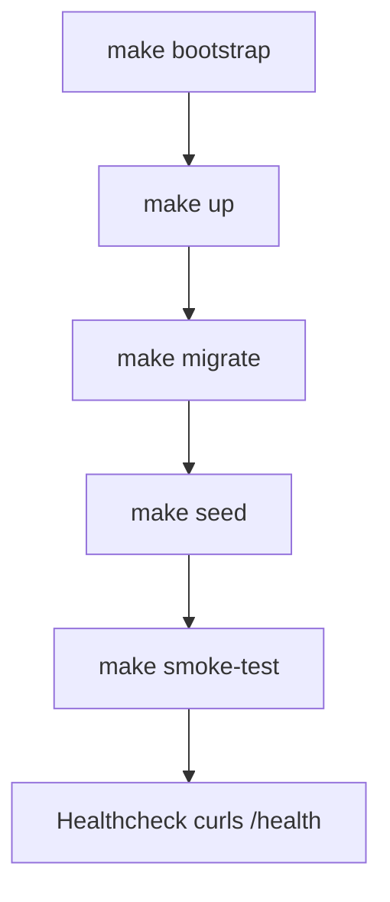

# Quickstart

**Audience:** engineer, operator
**Purpose:** Get a local instance running and exercise the vertical slice.

This page follows the documented developer loop from the deployment topology evidence: `make bootstrap` → `make up` → `make migrate` → `make seed` → `make smoke-test`, with a `/health` healthcheck. All commands are real Makefile targets — no invented targets are used.

---

## Prerequisites

The local stack is brought up with Docker Compose and built with Maven. Required before running the loop:

- **Docker + Docker Compose** — runs `postgres` (18.3-alpine), `kafka` (confluent 7.8.1, KRaft single node), `minio` (RELEASE.2025-09-07), `minio-init` (mc bucket bootstrap), `keycloak` (26.6, realm import from `deployment/keycloak/realm/sentinel-realm.json`), and `app` (non-root container built from `Dockerfile`).
- **Maven 3.9+** — multi-module reactor build (`groupId com.sentinel.enforcement`, `artifactId sentinel-enforcement`, `version 0.1.0-SNAPSHOT`), Java 21 (`maven.compiler.release=21`).
- **Keycloak issuer consistency** — the app container's JWKS points to `host.docker.internal`. Use a consistent `localhost` for the issuer (`http://localhost:{KEYCLOAK_PORT}/realms/sentinel`); exact-match issuer verification means a mismatched host fails token checks (see Troubleshooting Pointer).

---

## Bootstrap and Start

1. **`make bootstrap`** — prepares local artifacts/tooling for the loop.
2. **`make up`** — starts the Compose services (postgres, kafka, minio, minio-init, keycloak, app). The `app` container runs a healthcheck that curls `/health`.

---

## Migration and Seed

3. **`make migrate`** — runs the app + Camunda schema migrations (Liquibase), then starts the app.
4. **`make seed`** — loads seed data into the running instance.

> The migration step applies both the application Liquibase changelog (persistence module) and the embedded Camunda 7.24.0 schema before the app starts.

---

## Smoke Test the Vertical Slice

5. **`make smoke-test`** — exercises the vertical slice end-to-end against the running stack.

The app healthcheck (container-level) curls `/health` to confirm readiness. After `make smoke-test` passes, the local instance is operational.

---

## Common First Commands

These mirror the documented developer loop and the Makefile operations from the build-reactor evidence.

| Makefile target | Intent |
| --- | --- |
| `make bootstrap` | Prepare local tooling/artifacts for the dev loop |
| `make up` | Start Compose services (postgres, kafka, minio, minio-init, keycloak, app) |
| `make migrate` | Apply app + Camunda schema migrations, then start app |
| `make seed` | Load seed data into the running instance |
| `make smoke-test` | Exercise the end-to-end vertical slice |
| `make down` | Stop and remove Compose services |
| `make logs` | Tail service logs |
| `make compile` | Compile all reactor modules |
| `make unit-test` | Run unit tests (surefire) |
| `make integration-test` | Run integration tests (failsafe, Testcontainers) |
| `make verify` | Full verify lifecycle |
| `make package` | Produce the shaded/assembly artifact |
| `make migrate` / `make rollback ROLLBACK_COUNT=n` / `make db-status` / `make db-shell` | Liquibase operations |
| `make minio-init` / `make keycloak-import` / `make bpmn-validate` | Infrastructure asset operations |

---

## Default Users

All default users share the password **`sentinel`** (dummy, local-only). Notable accounts:

- `intake-jkt` / `intake-bdg`
- `triage-jkt` / `triage-bdg`
- `investigator-jkt`, `reviewer-jkt` (+public, +conflicted variants)
- `decision-jkt`, `appeal-jkt`, `supervisor-jkt` (+unit-2)
- `auditor-jkt`, `system-admin`

These accounts map to roles consumed by the authorization model (jurisdiction, unit, classification, conflict claims).

---

## Troubleshooting Pointer

- **JWT issuer mismatch:** The Keycloak issuer is `http://localhost:{KEYCLOAK_PORT}/realms/sentinel`, and the app container's JWKS points to `host.docker.internal`. Because issuer verification is exact-match, use a consistent `localhost` host or token validation returns 401/403. See [deployment-topology.md](deployment-topology.md) for the full service/env topology and [local-development.md](local-development.md) for the developer loop details.

---

## Related pages

- [local-development.md](local-development.md)
- [deployment-topology.md](deployment-topology.md)
- [architecture-at-a-glance.md](architecture-at-a-glance.md)
