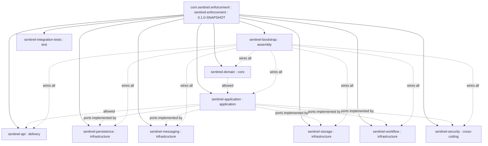

# Repository Map

**Audience:** engineer, architect
**Purpose:** Orient a newcomer to the directory layout and module locations.

This page maps the on-disk layout to the 10-module Maven reactor and the infrastructure/deployment assets. All module facts come from the module catalog and build-reactor evidence.

---

## Top-Level Layout

The repository is a Maven 3.9+ multi-module reactor (`pom.xml`, `packaging pom`, `groupId com.sentinel.enforcement`, `artifactId sentinel-enforcement`, `version 0.1.0-SNAPSHOT`). The top level contains the reactor POM, a `Makefile` driving build/run/migrate operations, the `deployment/` assets for Compose/Keycloak, and `docs/` (including the `.docgen/evidence` and `.docgen/model` inputs used to generate this documentation).

---

## Maven Module Tree

**Layer invariant (FACT):** `domain <- application <- api`. The domain module has **no infrastructure dependencies** (no Jersey/MyBatis/Kafka/MinIO/Camunda/Keycloak). The application module depends on ports implemented by the persistence/messaging/storage/workflow/security adapters; `sentinel-bootstrap` wires everything together.

---

## Infrastructure and Deployment Assets

| Asset | Responsibility |
| --- | --- |
| `deployment/` (Compose services) | postgres (18.3-alpine), kafka (confluent 7.8.1, KRaft single node), minio (RELEASE.2025-09-07), minio-init (mc bucket bootstrap), keycloak (26.6), app (non-root Dockerfile build) |
| `deployment/keycloak/realm/sentinel-realm.json` | Keycloak realm import defining local IdP users/roles |
| `Dockerfile` | Builds the non-root `app` container |
| `Makefile` | Developer loop + build/run/migrate/infra targets |
| Liquibase changelog (persistence module) | Schema migrations (7 releases) |
| BPMN (workflow module) | Embedded Camunda 7.24.0 process definitions |
| OpenAPI spec (api module) | Contract-first source for generated DTOs (ADR-009) |

---

## Documentation and Evidence Layout

| Directory | Responsibility |
| --- | --- |
| `docs/orientation/` | Orientation pages (this page, quickstart, architecture-at-a-glance) |
| `.docgen/evidence/` | Raw evidence files (deployment-topology, build-reactor, module-catalog, adr-landscape, authorization-model) |
| `.docgen/model/` | Structured models (`system.json`, `business.json`) |
| `docs/` (other) | Catalog, flow, business, and ADR pages cross-linked from orientation |

---

## Where to Start Reading

| If you are… | Start here |
| --- | --- |
| A newcomer running the system | [quickstart.md](quickstart.md) then [deployment-topology.md](deployment-topology.md) |
| An engineer learning the code | `sentinel-domain` (aggregates/policies) → `sentinel-application` (commands/ports) → `sentinel-api` (resources) |
| An architect reviewing boundaries | [architecture-at-a-glance.md](architecture-at-a-glance.md) and [adr-landscape.md](../adr-landscape.md) |
| A maintainer building/changing | [build-reactor-reference.md](build-reactor-reference.md) and [module-overview.md](module-overview.md) |

---

## Module Quick Reference

| Module | Layer | Responsibility | Key source |
| --- | --- | --- | --- |
| sentinel-domain | core | Aggregates, entities, value objects, policies, transition rules, domain exceptions. No infrastructure deps. | `com/sentinel/enforcement/domain/**` |
| sentinel-application | application | Commands/queries, handlers, transaction boundary, authorization orchestration, ports. | `com/sentinel/enforcement/application/**` |
| sentinel-api | delivery | Jersey resources, request/response DTOs, exception mappers, MapStruct mappers, auth filters. | `com/sentinel/enforcement/api/**` |
| sentinel-persistence | infrastructure | MyBatis mappers, repository adapters, Liquibase changelog, type handlers. | `com/sentinel/enforcement/persistence/**` |
| sentinel-messaging | infrastructure | Kafka publisher/consumer, outbox polling, inbox dedup, retry/DLQ, notification handler. | `com/sentinel/enforcement/messaging/**` |
| sentinel-storage | infrastructure | MinIO client, presigned URL, object metadata, evidence storage adapter. | `com/sentinel/enforcement/storage/**` |
| sentinel-workflow | infrastructure | Embedded Camunda runtime, BPMN deployment, task adapter, correlation, escalation delegate. | `com/sentinel/enforcement/workflow/**` |
| sentinel-security | cross-cutting | JWT verification (Keycloak), security context, permission model, authorization policy. | `com/sentinel/enforcement/security/**` |
| sentinel-bootstrap | assembly | Entry point, HK2 binder, config loading, Liquibase/Camunda migration mains, health. | `com/sentinel/enforcement/bootstrap/**` |
| sentinel-integration-tests | test | Testcontainers PostgreSQL+Kafka+MinIO+Keycloak integration suites. | `com/sentinel/enforcement/integration/**` |

---

## Related pages

- [module-overview.md](module-overview.md)
- [overview.md](overview.md)
- [build-reactor-reference.md](build-reactor-reference.md)
