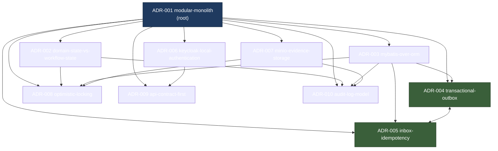

# Architecture Decision Record Landscape

> Reference catalog of the 10 Architecture Decision Records (ADRs) that govern the
> Sentinel Enforcement Platform, their individual decisions, trade-offs, and how they
> depend on and influence one another.
>
> **Audience paths:** Newcomer → start with [ADR Index](#adr-index) and the
> [dependency graph](#adr-dependency-influence-graph). Maintainer → use the
> [interdependency map](#decision-interdependencies) and per-ADR trade-offs.
> Expert → the full [Context/Decision/Alternatives/Consequences/Status](#key-decisions-and-trade-offs)
> blocks are the authoritative summary of each record.

The platform is a **modular monolith** with explicit bounded contexts
(`architectureStyle` in `system.json`, anchored by **ADR-001**). All 10 ADRs are
currently **Accepted / Active** — they are enacted in the running system, not
proposals. ADR-002 (domain vs workflow state), ADR-007 (MinIO evidence), and
ADR-010 (audit log) map directly to the evidence artifacts `workflow-camunda`,
`evidence-storage`, and `domain-lifecycle/audit` respectively.

---

## ADR Index

| ADR | Title | Status | Related ADRs |
|---|---|---|---|
| [ADR-001](#adr-001-modular-monolith) | modular-monolith | Accepted | 002, 003, 004, 005, 006, 007, 008, 009, 010 (root) |
| [ADR-002](#adr-002-domain-state-vs-workflow-state) | domain-state-vs-workflow-state | Accepted | 001, 008, 010 |
| [ADR-003](#adr-003-mybatis-over-orm) | mybatis-over-orm | Accepted | 004, 005, 008, 010 |
| [ADR-004](#adr-004-transactional-outbox) | transactional-outbox | Accepted | 001, 003, 005 |
| [ADR-005](#adr-005-inbox-idempotency) | inbox-idempotency | Accepted | 001, 003, 004 |
| [ADR-006](#adr-006-keycloak-local-authentication) | keycloak-local-authentication | Accepted | 001, 009 |
| [ADR-007](#adr-007-minio-evidence-storage) | minio-evidence-storage | Accepted | 001, 008, 010 |
| [ADR-008](#adr-008-optimistic-locking) | optimistic-locking | Accepted | 001, 002, 003, 007 |
| [ADR-009](#adr-009-api-contract-first) | api-contract-first | Accepted | 001, 006 |
| [ADR-010](#adr-010-audit-log-model) | audit-log-model | Accepted | 001, 002, 003, 007 |

**Status legend:** `Accepted` = decision made and currently enacted in the
platform. All 10 carry this status.

---

## Key Decisions and Trade-offs

Each block follows the canonical ADR shape:
**Context / Decision / Alternatives / Consequences / Status**.

### ADR-001 — modular-monolith
- **Context:** The platform must scale development across enforcement-domain,
  application, delivery, and infrastructure concerns without the operational
  overhead of a distributed system at this stage.
- **Decision:** Ship as a **modular monolith** with explicit bounded contexts and
  well-defined ports between them; defer microservices.
- **Alternatives:** Microservices from the start — buys independent deployability
  but adds distributed-tx, network, and operational complexity the team is not yet
  ready to pay for.
- **Consequences:** Bounded contexts still require explicit ports/adapters (no
  leaky shared modules); the system is *not* a distributed system yet, so in-process
  calls replace RPC. Every other ADR hangs off this structure.
- **Status:** Accepted.

### ADR-002 — domain-state-vs-workflow-state
- **Context:** Camunda 7.24.0 is embedded for orchestration; there is a risk of
  treating `ACT_*` tables as the business record.
- **Decision:** The **domain database is the business state of truth**; Camunda
  holds only orchestration position.
- **Alternatives:** Store business state inside Camunda / `ACT_*` — simpler
  single-source wiring, but couples domain semantics to the engine schema.
- **Consequences:** Domain remains authoritative; a **reconciliation job** covers
  domain/Camunda drift (control flow `cf-workflow-reconcile`). Supported by ADR-008
  (OLC on domain) and ADR-010 (audit). Maps to evidence artifact `workflow-camunda`.
- **Status:** Accepted.

### ADR-003 — mybatis-over-orm
- **Context:** Persistence needs predictable, reviewable SQL across PostgreSQL
  18.3-alpine with Liquibase-managed schema.
- **Decision:** Use **MyBatis** over JPA/ORM for explicit, testable SQL.
- **Alternatives:** JPA/Hibernate — less boilerplate, but hidden lazy loading and
  generated SQL that is hard to assert in tests.
- **Consequences:** More mapper code, but SQL is explicit and unit-testable with no
  surprise lazy fetches. Underpins the tables for ADR-004 (`outbox_event`),
  ADR-005 (`inbox_event`), ADR-008 (`version` column), and ADR-010 (`audit_event`).
- **Status:** Accepted.

### ADR-004 — transactional-outbox
- **Context:** Domain commits and Kafka publishes must not silently diverge
  (dual-write problem).
- **Decision:** **Transactional outbox** with a polling publisher using
  `SKIP LOCKED` to relay events to Kafka reliably.
- **Alternatives:** Publish-then-commit or Kafka transactions — simpler flow, but
  does not solve the dual-write problem safely.
- **Consequences:** The dual-write problem is solved within a single DB
  transaction; requires a polling publisher + `SKIP LOCKED` relay. Data flow
  `df-outbox` (application → messaging). Paired with ADR-005 for full messaging
  reliability.
- **Status:** Accepted.

### ADR-005 — inbox-idempotency
- **Context:** Inbound Kafka events (e.g. `notification.result.v1`) can be
  redelivered; consumers must not double-apply.
- **Decision:** **Inbox dedup** via a DB-backed `UNIQUE(consumer_name, event_id)`.
- **Alternatives:** Idempotency keys held in application memory — cheaper, but lost
  on crash/restart.
- **Consequences:** Deduplication survives crashes and restarts. Data flow
  `df-inbox` (messaging → application). Forms the receive half of the ADR-004/005
  reliability pair.
- **Status:** Accepted.

### ADR-006 — keycloak-local-authentication
- **Context:** The platform needs standardized authentication and claim-based
  authorization without owning user credential storage.
- **Decision:** Use **Keycloak 26.6** as a local IdP; verify JWTs (JWKS) and derive
  authorization from claims.
- **Alternatives:** App-local user tables — full control, but reimplements
  OIDC/JWT, password hashing, and rotation poorly.
- **Consequences:** Standard JWT/OIDC with JWKS verification and claim-based authz;
  feeds the ADR-009 API security filter and the authorization model
  (25 permissions).
- **Status:** Accepted.

### ADR-007 — minio-evidence-storage
- **Context:** Evidence objects are large and immutable; the relational DB should
  not store blobs as metadata-authoritative.
- **Decision:** Store evidence in **MinIO** (bucket `sentinel-evidence`) with
  presigned URLs; verify checksums on finalize.
- **Alternatives:** PostgreSQL `BLOB` columns — transactional with domain data, but
  bloats the DB and couples object lifecycle to schema migrations.
- **Consequences:** Object store with presigned PUT (TTL PT15M) / GET (TTL PT10M)
  and SHA-256 verification; **not** authoritative for metadata (domain DB is).
  Supported by ADR-010 (evidence download audit) and ADR-008 (immutable evidence
  version). Maps to evidence artifact `evidence-storage`.
- **Status:** Accepted.

### ADR-008 — optimistic-locking
- **Context:** Concurrent mutations on mutable aggregates (e.g. case lifecycle)
  must not silently overwrite each other.
- **Decision:** Apply **optimistic locking (OLC)** on mutable aggregates via a
  `version` column; return **409** on mismatch.
- **Alternatives:** Pessimistic locking — prevents conflicts but holds row locks
  and risks contention/deadlocks.
- **Consequences:** No silent overwrites; clients must retry on 409. Backed by the
  ADR-003 `version` column. Supports ADR-002 (domain truth) and ADR-007 (immutable
  evidence version). Data flow `df-optimistic-lock` (application → persistence).
- **Status:** Accepted.

### ADR-009 — api-contract-first
- **Context:** API consumers (including integration tests) need a stable, generated
  DTO surface.
- **Decision:** **OpenAPI-first**; generated models are the source of truth for
  DTOs.
- **Alternatives:** Code-first DTOs — faster to start, but DTOs drift from docs and
  clients.
- **Consequences:** Generated models are authoritative; generated code is **not**
  hand-edited. Drives `sentinel-api` DTOs. Security filter is fed by ADR-006.
- **Status:** Accepted.

### ADR-010 — audit-log-model
- **Context:** Regulatory enforcement requires a tamper-evident, queryable history
  separate from operational logs.
- **Decision:** Maintain an **append-only `audit_event`** table, distinct from
  application logs.
- **Alternatives:** Use application logs as the audit trail — easy, but unstructured,
  rotatable, and not queryable as a record of truth.
- **Consequences:** Append-only audit; no optimistic-lock churn (no version column
  on audit rows). Supports ADR-002 (audit of domain changes) and ADR-007 (evidence
  download audit, denied access logged). Maps to evidence artifact
  `domain-lifecycle/audit`. Backed by ADR-003 persistence.
- **Status:** Accepted.

---

## Decision Interdependencies

The influence graph below is the normative view of how ADRs relate. Plain
language summary of the edges:

- **ADR-001 is the root.** All other ADRs hang off the modular-monolith's explicit
  bounded contexts.
- **ADR-002** depends on **ADR-001** and is supported by **ADR-010** (audit) and
  **ADR-008** (OLC on domain state).
- **ADR-003** underpins persistence for **ADR-004** (`outbox_event`),
  **ADR-005** (`inbox_event`), **ADR-008** (`version` column), and **ADR-010**
  (`audit_event`).
- **ADR-004 + ADR-005** are a **paired reliability pair** for messaging
  (outbox publish / inbox consume).
- **ADR-007** is supported by **ADR-010** (evidence download audit) and
  **ADR-008** (immutable evidence version).
- **ADR-006** feeds **ADR-009** (API security filter) and the authorization model.
- **ADR-009** drives `sentinel-api` DTOs.

### ADR dependency / influence graph (flowchart)

**Edge semantics:** `A --> B` means "A depends on / is underpinned by B" or
"A supports B" as described in the summary above. `ADR-004 <--> ADR-005` marks the
symmetric reliability pair (outbox publish and inbox consume).

---

## Status Summary

All 10 ADRs are **Accepted / Active** — enacted in the current platform
(`0.1.0-SNAPSHOT`). There are no superseded, deprecated, or proposed records in
this landscape.

| ADR | Status | Enacted in |
|---|---|---|
| ADR-001 modular-monolith | Accepted | Whole reactor; `system.json.architectureStyle` |
| ADR-002 domain-state-vs-workflow-state | Accepted | Embedded Camunda 7.24.0, `cf-workflow-reconcile` |
| ADR-003 mybatis-over-orm | Accepted | `sentinel-persistence` (MyBatis + Liquibase 7) |
| ADR-004 transactional-outbox | Accepted | `df-outbox`, polling publisher + `SKIP LOCKED` |
| ADR-005 inbox-idempotency | Accepted | `df-inbox`, `UNIQUE(consumer_name, event_id)` |
| ADR-006 keycloak-local-authentication | Accepted | Keycloak 26.6, JWKS verification |
| ADR-007 minio-evidence-storage | Accepted | MinIO `sentinel-evidence`, presigned URLs |
| ADR-008 optimistic-locking | Accepted | `version` column, 409 on mismatch |
| ADR-009 api-contract-first | Accepted | `sentinel-api`, OpenAPI 3.0.3 generated DTOs |
| ADR-010 audit-log-model | Accepted | Append-only `audit_event` table |

---

## Related pages

- [Architecture at a Glance](../architecture-at-a-glance.md) — system-wide view of
  the modular monolith and its bounded contexts (ADR-001).
- [Outbox Reliability](../outbox-reliability.md) — deep dive on ADR-004 and the
  `SKIP LOCKED` publisher (`df-outbox`).
- [Inbox Idempotency](../inbox-idempotency.md) — deep dive on ADR-005 and
  `UNIQUE(consumer_name, event_id)` (`df-inbox`).
- [MinIO Evidence Storage](../minio-evidence-storage.md) — deep dive on ADR-007,
  presigned URLs, and checksum verification (evidence artifact `evidence-storage`).
- [Persistence Patterns](../persistence-patterns.md) — MyBatis (ADR-003),
  optimistic locking (ADR-008), and Liquibase schema backing ADR-004/005/010.
